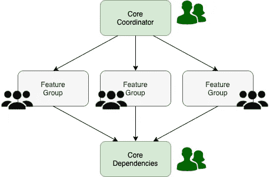
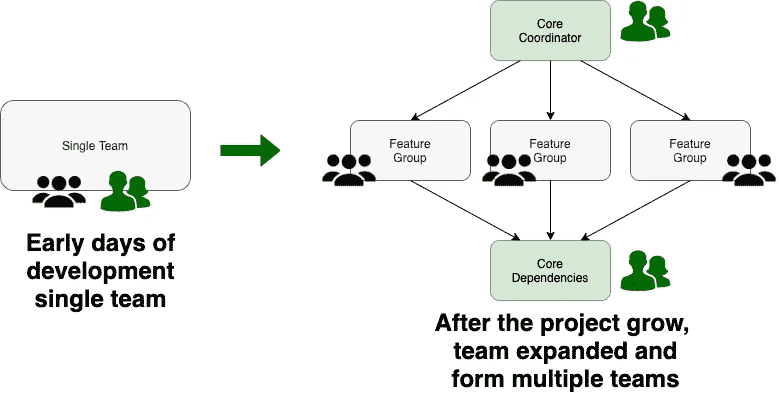
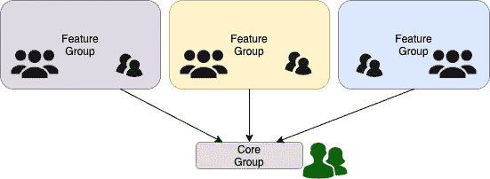
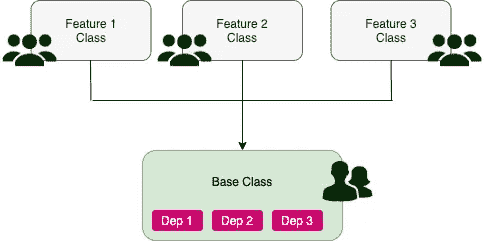
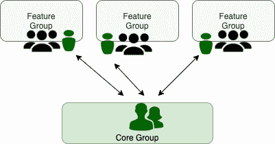
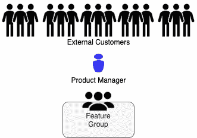
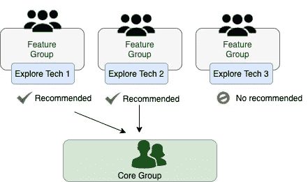

# 技术债务管理团队的 7 大难题

> 原文：<https://betterprogramming.pub/the-7-struggles-of-a-tech-debt-management-team-ec8ef8316369>

## 这是构建可伸缩软件的最重要的团队

埃德加·恰帕罗在 [Unsplash](https://unsplash.com/photos/sHfo3WOgGTU) 上拍摄的照片

在现实世界中，没有专门负责修复和解决科技债务的*科技债务管理团队*。没有人愿意在这样的团队里。这是一个为其他开发者收拾烂摊子的团队。谁喜欢在里面？

然而，我们确实有一些团队的名称更专业，例如，*基础架构团队*、*架构团队*、*核心团队*等。—一目了然，光鲜亮丽的名字。该团队负责处理所用应用程序的核心主体，如下图中的核心协调者/依赖者组示例所示。

**注意:**你可以在这篇[文章](https://medium.com/mobile-app-development-publication/scaling-mobile-development-365cab84781e)中找到为什么软件(移动)开发的可伸缩性需要这样一个团队的更深入的探究。

如果我们回想开发的第一天，就不需要任何核心团队，因为只有一个团队做所有的事情。然而，随着时间的推移，团队在成长。我们现在需要更好地划分工作，一些团队负责特性交付，一些团队负责公共代码，如下所示。

出于可维护性和可伸缩性的考虑，拥有公共代码的团队然后负责在要重构、改进和更好地调整的特性团队中探索代码。这项工作本质上就像管理技术债务。因此，称这个小组为科技债务管理小组并不为过。

无论如何，这篇文章的重点不是给这个群体下定义——你可以把它命名为*核心*、*基础设施*或*架构*——而是展示这样一个群体的奋斗历程，并探索帮助它的方法。

在本文中，我将交替使用*核心组*、*基础设施组*、*、和*架构组*、*组*来描述这样一个组的斗争。*

# 奋斗 1。团队的边界

组建这个核心团队，团队的边界或者范围是什么？

对于一些组织来说，没有边界。架构团队拥有一切。他们规定了特性团队的所有活动:他们编码的方式，他们实现的类，等等。这使得它非常一致和一致。

但是这使得特性团队非常不灵活。他们只能做出与架构团队所提供的完全一致的东西。如果他们想做一些超出架构团队定义的事情，他们需要咨询架构团队。架构团队成为瓶颈。

鉴于上述情况并不理想，也许核心小组应该只负责所有现存的公共代码。但是*常用代号*的定义非常模糊。也许只是一些普通的数据层和实用函数。如果我们将*公共代码*定义为所有功能组使用的代码，那么它可能只是代码中很小的一部分。

这样的结构很棒，因为它给了每个特性团队自由去开发他们自己的特性，而不会被核心团队所阻碍。不利的一面是(如上图中不同的颜色所示)，每个特性团队的工作方式会有很大的差异。共同使用的潜在模式、功能和数据可能已经以不同的方式在功能团队中被复制，而没有探索如何将其抽象为共同使用，因此工作的可伸缩性受到危害。

找到核心集团应该拥有什么的正确界限是考虑的一个棘手部分。这也很大程度上取决于核心团队的团队能力以及他们能承受多少。

## 可能的解决方案

组建核心团队的最初阶段是艰难的。我建议从小处着手，定义一个核心团队可以拥有的焦点领域，为特性组带来价值。也许可以是一些效用函数等。

随着时间的推移，随着它变得更有能力，它可以咀嚼更多。它可以对跨功能团队的通用组件进行抽象，并从那里进行扩展。

# 奋斗 2。灵活性与一致性

有时，组织的任务是让架构团队定义标准或规则，让所有其他团队遵守。这种想法可以追溯到工业化时代，当时工厂生产车间的一致性可以提高可扩展性并减少浪费。

即使是早期的面向对象编程，也提倡通过定义基类来实现一致性。基类归核心团队所有，而功能团队只需要实现基类。

这种方法有很多好处，特性团队可以获得所有公共代码的好处，而不需要自己实现。根据上面显示的非常简化的图表，依赖项 1、2 和 3 都被注入到基类中，因此要素类将免费获得所有这些。

为了完全一致，任何特性团队都不应该创建自己的基类。每个新的类都必须通过架构团队。原因是这将避免跨功能团队的意外重复。如果另一个特性团队想要一些新的东西，他们将不得不与架构团队一起检查是否已经有一些可用的东西。如果没有，架构团队将为他们创建基类。

从上面可以看出，这是一种专制的开发方法，我们可以看到它没有规模。瓶颈将在架构团队中。此外，无论架构团队提供什么，都不可能满足每个团队的需求。架构团队将忙于构建每个团队所需的变体，或者将提供一个未被功能团队充分利用的通用类。无论哪种，都不理想。

相反，我们可以走向另一个极端:核心团队不强制任何事情。它们只提供普通的工具，由特性团队决定是否使用它们。

就像最近流行的编程方法一样，“组合优先于继承”，如下所示。

功能团队没有义务遵从基础团队提供的任何东西。他们可以只使用需要的东西，甚至不使用基础团队的任何东西。特性团队在实现他们喜欢的东西时有充分的灵活性。

这种极端也有其不利的一面。没有对什么是常见实践的一定程度的授权，并且没有联合，团队可能会变得非常不同。潜在的浪费和工作的重新设计可能发生在不同的团队中。

## 可能的解决方案

我们将不得不在什么是需要符合的，什么是最好的“有用的支持工具”，以及这两者之间有什么东西之间取得平衡。

对于完全一致性，一个很好的例子是分析需求，我们需要所有的特性来符合它需要如何被激发。

至于“有用的工具”，这些可以是团队无需创建新的 UI 组件就可以轻松采用的通用 UI 组件。(有争议的是，一些设计师可能会声明这需要完全符合，以确保整个团队的设计一致。)

对于介于两者之间的东西，这可以是一个颜色集，其中一些颜色需要一致，而对于其他颜色，功能团队可以灵活地从一系列预定义的颜色中进行选择。

不是每个人都会同意我上面的例子，但是你明白了。核心团队需要与所有团队合作来定义什么是必要的，什么是灵活的。这不是一个简单的过程。

# 奋斗 3。核心团队的组成

好的，我们想组建一个核心/架构/基础设施团队。我们应该考虑让谁过去？也许我们选择一个专家开发者和一个初级开发者的通常组成(假设我们没有很多人可以挑选的奢侈)。

特色团队呢？也许他们和核心团队的构成是一样的。然后每个团队都有一个一致的团队成员组成，公平分配。

虽然这听起来很合理，但这样的组合可能会有一些挑战。我们必须认识到以下几点。

1.  核心团队成员正在实现通用组件，这些组件被所有人使用，或者形成与所有团队交互的公共抽象。这不是所有初级开发人员都准备好的。同时，我们不能仅仅依靠一个专业开发人员来定义一切。
2.  核心组的主要“客户”是特性组，这是一组开发人员，其中有一些专家。同样，初级开发人员与更有经验的“客户”保持联系的能力有限，无法形成可靠且有意义的东西。依赖核心组中的一个专家开发人员来处理所有组也是不可伸缩的。

考虑到这样的场景，也许我们需要让所有的专业开发人员都加入核心小组。这要好得多，因为我们在与特性组的合作中处理了可伸缩性的挑战。然而，让所有的专家都加入一个团队将会面临为团队定义方向的挑战。也许我们可以领先于专家来确定方向。

另一个挑战是核心团队支持多少功能团队。如果他们太多，我们如何扩展核心小组来提供最好的交互和支持？

## 可能的解决方案

在我看来，如果我们想要建立一个坚实的核心团队，它肯定需要有一个由更资深的有经验的开发人员组成的团队。这个团队定义和开发了核心的大部分，或者可能是所有人使用的架构，因此它的工作需要在技术上是可靠的。

最重要的是，如果允许的话，在每个相应的功能团队中有一个来自核心团队(下图中功能组中的绿色部分)的大使是很有价值的。从组织上来说，他们可以是特性团队的一部分，但是他们积极地参与决策，同时也是核心团队产品开发的一部分。

他们在特性团队中的存在也让他们作为监督者来确保特性开发中必要的一致性，并继续识别核心团队可以扩展的领域。同样，这位大使也需要有适当的技术经验才能担任这样的角色。

因此，核心组的领导需要能够管理一组专家开发人员，不仅是在核心组内部，而且是在特性组中的大使。

# 奋斗 4。产品和利益相关者管理

对于一个产品，通常我们有一个产品经理来监督功能上需要什么增强。他们与利益相关者联络，并不断与客户群互动，以了解下一步最好做什么。

该特性的开发人员从产品经理那里获得关于下一步工作的方向和优先级的单一输入源。开发人员不需要和涉众打交道。重点在工作上。

核心组不再直接处理外部使用的特性。他们不面对外部客户。没有真正的“产品”，团队也不需要“产品”经理。

但是核心团队确实有利益相关者。他们是特色团队。核心团队需要联系一组开发人员，他们进行开发并交付对所有特性都有意义的工作。

与特性组中的其他开发人员联络的过程，讨论需要什么，并就需求的优先级达成妥协，等等。，需要特定的产品和利益相关者管理技能。

通常，开发人员不具备这样的技能。没有适当的产品和利益相关者管理，团队将无法确定其方向和关注点，因为每个功能组的需求可能截然不同。

## 可能的解决方案

在理想的情况下，这样一个团队会有一个技术产品经理，他在技术上以及产品和利益相关者管理方面都很熟练。担任这一职务的人也可以是小组的技术领导人，为小组提供指导。一个人必须有充足的时间工作并与功能团队联络，一个人必须牺牲自己的时间专注于技术工作。这是一个艰难的角色，因为一个人仍然需要跟上技术能力的发展。

或者另一个选择是有一个首席开发人员或架构师来监督核心团队，并对特性团队有影响力。处于这种位置的人可以设定焦点和方向，以确保整个产品的高层次工作的优先级。核心团队成员(具有一定水平的专业知识)可以与功能团队一起工作，制定出更详细的工作级别。

无论如何，利益相关者管理是确保核心团队成功所需的一套不同的技能，而不仅仅是一个人所拥有的技术知识。

# 奋斗 5。工作结果的可见性

我记得当我开发一个软件特性时，看到这个特性被发布是一件多么愉快的事情。我开发的软件被大众所使用。所以当我看到我的朋友使用这个软件时，我可以告诉他们我开发了这个软件——这是一种多么大的满足感。

或者当有人问我是做什么工作的时候，我真的很容易告诉他们，并通过向他们展示产品让他们明白我是做什么的。当一个软件特性的新版本发布时，我可以告诉他们检查一下。每次这样的发布，我们通常用蛋糕来庆祝。

但是，当一个人在基础设施团队中工作时，外部用户很难看到任何有形的特性。所做的工作可能只是一个额外的 API 或一个现有服务的新属性——对于一个大的公告来说太微不足道了，因为这会惹恼公告的接收者。没有公告，所做的工作就没有人注意。

有时，核心开发人员会改进核心库，使代码更易于维护，或者做一些轻微的性能改进(例如，减少内存)。没有接口改变。用核心库的人都感觉不到。没有人注意到或欣赏它。

有时候，当一个新版本的核心库发布时，当它被宣布时，它就像另一个正常的宣布。如果改进没有给他们带来太多的价值，特性团队可能不会很欣赏它。相反，特性团队可能讨厌这样的声明和改变，因为他们必须做工作来获得新的库或者做出改变来适应新的接口。

相反，如果一个核心团队成员编写了导致核心库质量退化或影响特性团队的东西，它可能会很快被使用它的人注意到。不高兴的“客户”可能会“升级”问题。

在这样的环境中，对完成的好工作的赞赏很少，对犯的错误的惩罚很高，很快核心团队中的开发人员就会士气低落，没有人会喜欢在这样的团队中工作。这个团队现在实际上是技术债务管理团队:高风险，低收益。没有人愿意在这样的群体中。

## 可能的解决方案

也许核心团队也应该像特性团队一样对待他们的工作。每个迭代都有要达到的里程碑。计划中的内容(例如，它们可以为功能团队或整个产品带来的价值)应该提前公布，因此对新版本的预期是存在的。

无论谁领导核心团队，都需要有一个与功能团队协商制定的高级计划。一个还记录团队过去的所有成就。所有重要的里程碑都需要庆祝。团队的优秀工作需要被广泛传播和分享。

至关重要的是，核心团队成员感到他们的工作得到了重视和欣赏。毕竟我们工作不仅仅是为了钱，更是为了成就感。

# 奋斗 6。成功的衡量

学术上，已经有很多衡量产品成功的研究。分析用于探索软件功能的使用情况，以及它如何转化为组织的底线。

开发人员对于特性的成功部分在于及时向公众交付特性及其质量(例如，崩溃率、资源利用率、性能)。

然而，对于核心集团，如何衡量其成功？没有有形的面向客户的输出产品。当然，我们可以说我们交付了这个库和 API 服务等等。，但这样做有什么含义呢？核心团队如何为组织的潜在成功做出与底线相关的贡献？

## 可能的解决方案

看待核心团队的一种方式是，它就像为公司提供所有需要的计算机和基础设施的 it 部门。它就像一个对支出贡献很大的部门。

在通常情况下，管理人员会尽量优化这样一个团队的成本，除非该团队能够证明其贡献与所有人提高生产率的联系。

因此，如果我们有一种方法来度量特性组所获得的生产力或者开发的可伸缩性，那将是非常有价值的。也许一个简单的方法是特性团队使用了多少 API。这是一个过于简单的例子。没有直接的公式，说起来容易做起来难。

也许第一个衡量标准是功能团队对核心团队如何支持他们的看法。如果所有的功能团队都感受到了核心团队的价值，至少这是一个很好的开始。

沿着这些思路，有几个行业示例显示了这种核心或基础结构团队的巨大成功。一个是 AWS，它的服务器最初只是在亚马逊内部服务，现在已经成为亚马逊最大的业务群。

其他例子是像 Airbnb 和 Square 这样的公司，他们开发了核心库供其他开发人员使用，这极大地提高了该组织在开发人员社区中的声誉。虽然没有直接的收益，但是这使得雇佣他们变得更加容易。

# 奋斗 7。日新月异的软件技术

软件开发是变化最快的行业之一，如果不是最快的话。每年都会有新的东西推出。有些变化是渐进的，有些是革命性的。

通常，核心基础设施团队或架构团队是定义功能团队应该采用什么技术框架来确保一致性的团队。

这也意味着，随着软件技术的不断变化，核心团队感到有义务站在曲线的顶端，能够正确地识别要采用的最佳下一个技术，然后朝着它努力。

这也是我建议核心团队应该由非常了解并密切跟踪技术趋势的专家组成的早期原因之一。

虽然理想的情况是核心团队可以推动这一发展，但这不是一个可扩展的解决方案，因为核心团队只由产品开发人员的一部分组成。

## 可能的解决方案

应对最新的技术引进和探索，不应该是核心团队的唯一责任。每个小组的开发人员都应该对新东西充满热情。此外，如果我们不允许其他团队的开发者成为探索一些新技术的先行者，我们就是在对他们不利。

虽然核心团队有责任最终向所有人部署最新的技术，但是每个团队(包括特性团队)都应该有尝试新事物和提出建议的自由。

这种自由是伟大的，因为它允许跨团队的可扩展的探索。不是所有学到的新技术都应该被采用。从功能团队学到的经验可以帮助过滤掉不合适的技术。那些优秀的可以推荐给核心团队，让他们考虑让其他团队也能采用。

当然，当存在相互矛盾的技术时，核心团队作为仲裁者并决定哪种技术优先是很重要的。

# TL；速度三角形定位法(dead reckoning)

对于一个想要扩大产品开发规模的组织来说，技术债务管理团队是一个必不可少的团队。我们可能会将其命名为核心团队、基础架构团队、架构团队，甚至像 SWAT 团队这样有趣的名称。

为了确保可伸缩性，核心团队需要平衡它对特性团队的支持，包括强制一致性和允许的灵活性。这种复杂的平衡只能通过与功能团队的紧密协作来实现，这需要团队中具有良好技术专长的圆滑的涉众管理。

虽然核心团队可能没有任何直接的、有形的外部面向客户的输出，但其贡献对整个产品开发的成功是非常重要的，应该是可见的。如果我们能够量化它的工作，这将进一步保证团队的贡献，并提高团队的士气。

确保产品技术健康的负担不应该只由核心团队承担。所有团队在产品的技术进步中都扮演着重要的角色。核心团队在那里仲裁和促进流程，确保所有团队的重点方向。

组建这样一个核心的科技债管理团队并不容易，维护和拓展就更难了。但是，如果我们真的想扩大我们的发展，这是必不可少的。