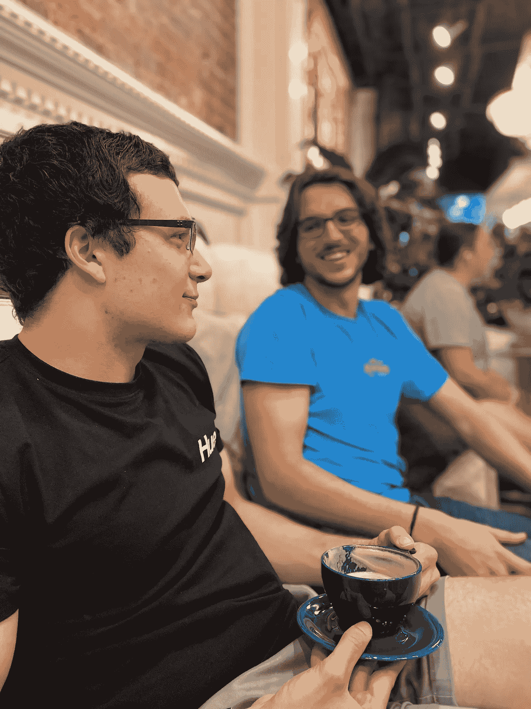

# 一对一会议的艺术——获得更好反馈的 6 个技巧

> 原文：<https://betterprogramming.pub/the-art-of-1-1-meetings-6-tips-for-better-feedback-8b80eb59b210>

## 如何从个人会议中获得最大收益



作者照片

在工作场所经常举行的所有不同类型的会议中，1:1 似乎是最令人困惑的。我想花点时间来分析一下作为导师和学员，我是如何进行一对一教学的。

关键是心中要有某种目标。你可能不知道你实际上想从 1:1 中获得什么，这很正常。需要时间去了解你想从中获得什么。大多数时候，可操作的反馈是你能从某人那里得到的最有帮助的信息，尤其是如果他们是高层的话。我可以写一个完整的故事来谈论我为什么喜欢来自同事的反馈，但现在，我想专注于如何充分利用 1:1。我将分享一些我用来确保我的一对一有意义和有效的策略。

# 你想怎么利用时间都行。

从 1:1 开始，反馈不一定是你的目标。虽然我会说你应该不断地从同事那里寻求反馈，但如果你在寻找其他的东西也没关系。关键是你明白这是你真正想要的。

在传统的小组会议中，通常会有一个清晰的流程，一个明确的目标，作为中心话题。有时候你什么都不用说，有时候还指望你带动会议。

1:1 是独一无二的，因为只有你和另外一个人。没有要审阅的文档，也没有要介绍的演示文稿。由与会者决定对话的方向。在会议开始前，双方都应该思考他们想从讨论中得到什么。根据我的经验，跳过这一步通常会导致负面的体验。

根据我会见的对象，我为 1:1 会谈设定了不同的目标。当我会见我的越级经理时，我选择收集他对团队未来几个月和几个季度的高级计划的详细信息。我也会简单地更新我当前项目的状态，这样他就知道我在做什么，我在哪里，以及我可能需要他帮助解决哪些障碍。从长远来看，让你的上级经理了解你的核心工作和贡献是有益的。有时我会要求反馈，但通常情况下，越级对你的工作没有太多的洞察力。

与我的经理会面时，我会保持策略，并就我积极关注的事情讨论较低层次的细节。我以此为契机，找出他在团队中的当务之急，这样我就可以相应地调整我的时间管理。我也寻求可以融入日常生活的直接反馈。主动向经理寻求反馈可以确保你尽一切可能达到甚至超过对你的期望。

如果我要会见学员或实习生，我会让他们决定如何利用时间。如果我对他们或他们的工作有具体的问题或担忧，我可能会主导会议，但大多数时候我选择坐下来，给他们足够的时间问我问题或思考他们想如何利用时间。出于对他们和他们需求的尊重，我避免给他们施加压力让他们提前结束会议。如果谈话以 30 分钟的沉默结束，我没意见。我带着先入为主的想法去参加会议，认为这段时间纯粹是为这个人准备的，不管他们想如何利用这段时间。最后，我会对他们的工作提出反馈意见。

# 保持随意。

以一对一的方式向同事寻求反馈可能会令人生畏，但事实上，没什么可担心的。如果同事有反馈，他们通常很乐意与您分享。只要放松下来，像正常对话一样对待他们，一切都会很顺利。为了帮助减轻我的焦虑，我喜欢用一些随意的聊天来开始我的一对一谈话。

当我和我的越级经理每两周开一次会时，我们通常会花 5-10 分钟闲聊体育、旅游或音乐等话题。有些人可能会说无聊的玩笑是浪费时间，但我相信与同事建立良好关系的价值。我把我的 1 对 1 当成和另一个人的正常对话。在一天结束的时候，这就是一切。直接进入正题或者强调优化谈话的每一分钟通常会让事情变得奇怪。当我与我的经理、队友甚至是主管会面时，我会用这种放松的方式。

# 喝咖啡或吃午餐时见面。

当第一次和某人见面时，我喜欢建议边喝咖啡或茶边聊。我发现在公共场所开会比会议室冰冷的寂静要少得多。热饮料通常也很放松。休息时喝点饮料也有助于缓解尴尬的沉默。这和第一次约会没什么不同。咖啡店舒适的氛围有助于我放松和平静下来。这使得询问关于建设性反馈的更令人不舒服的问题变得更容易。给出积极的反馈很容易，但是提供可操作的反馈有点困难。提出改进的方法而又不显得冷酷无情是很有挑战性的。

如果我想了解某人或进行更有意义的谈话，我喜欢建议午餐聚会(通常在上述咖啡聚会之后)。当然，这些会议比典型的 30 分钟同步时间更长，但不必担心时间有助于鼓励更有启发性的谈话。这是一个讨论通常不会在标准 1:1 中出现的话题的机会，如长期战略、过去的经验，甚至个人细节。

# 早点结束也可以。

有时，没有任何反馈可以给出，或者没有什么新的东西可以谈论。如果双方都同意提前结束会议，争取回一些时间，那也可以。如果这种情况经常发生，考虑降低你 1:1 的频率。这种类型的会议应该根据需要随时安排。根据我的经验，从每周一次变成每两周一次是一种常见的调整。相反，如果会议持续很长时间，考虑增加时间或频率。每周 30 分钟的同步对我来说是最美妙的时刻。一般来说，我建议避免每周一次以上的一对一。如果你需要一致的反馈，考虑在一周内安排多次 5-10 分钟的简短同步，而不是每周一次较长的会议。这将确保你被温和地引导到正确的方向，而不是每周只被严厉地纠正一次。

# 亲自见面

这个技巧是我 1:1 工具包的最新补充，现在视频通话已经正常化了。虽然视频会议通常更灵活，但我总是试图亲自参加一对一的会议。我住的地方离工作地点很远，所以我的同事们通常会很感激我为了见他们而额外努力通勤。这通常会带来持续整个会议期间的更好的对话。

当通过视频通话交谈时，更容易被周围的环境分散注意力，或者同时处理多项任务。你要清楚地表明，无论说什么，你都在全神贯注。反馈是非常私人的信息，尤其是当它是建设性的。没有表现出兴趣可能会显得粗鲁和不尊重你的同事。面对面的会面也更容易保持眼神交流，捕捉肢体语言和其他微妙的社交暗示。像这样的小事让与同事建立有意义的关系变得更加容易和有效。

# 不断认识新的人。

如果你已经在一个团队工作了至少几个月，你的 1:1 时间表很可能是相当一致的。你可能每周或每两周都会遇到同样的人。虽然这很好，但我支持经常与其他团队的人会面，这些人与我的工作关系不太直接。当寻求反馈时，这些人通常会提供新的视角，帮助你打破你可能陷入的模式。

这也是一个很好的策略，可以更深入地了解他们团队的优先事项。在许多情况下，在不同的团队之间建立联系有助于你扩大视野和耳朵，了解更大范围的组织中正在发生的事情。如果你想最大化你的影响并采取积极措施，这是一项关键技能，尤其是在高层。

即使下政治棋不是你的目标，结识新朋友对你的心灵总是有好处的。我喜欢和新的人联系，从专业和个人方面了解他们。尽管我有上述建议，但我很少别有用心。我只是喜欢喝更多咖啡的任何借口。

# 结论

我希望这些建议能帮助你从 1:1 中获得更多。我越来越喜欢用它们来更多地了解我的同事，收集有用的反馈和信息。尝试这些建议，希望你会像我一样重视 1:1。感谢阅读。

```
**Want to connect?**If you aren’t already, follow me on [Twitter](https://twitter.com/allegretti813)
```