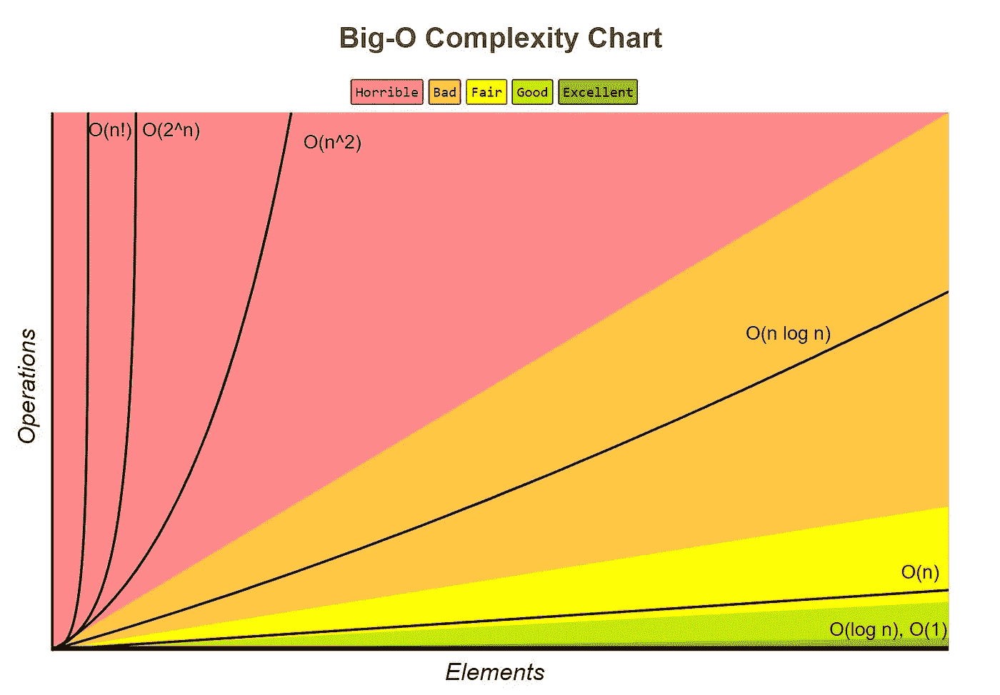

# 大 O 符号的基础

> 原文：<https://betterprogramming.pub/the-basics-of-big-o-notation-e67228e549d2>

## 编写快速高效代码的关键


照片由 [Unsplash](https://unsplash.com/s/photos/drama?utm_source=unsplash&utm_medium=referral&utm_content=creditCopyText) 上的 [Panos Deligiannidis](https://unsplash.com/@panosskier?utm_source=unsplash&utm_medium=referral&utm_content=creditCopyText) 拍摄

作为一名开发人员，您可能听说过“大 O 符号”这个短语。到底是什么？你为什么要在乎？

事实证明，学习大 O 符号不仅是技术面试的必要条件，也是编写快速高效代码的一个重要概念。

我从来都不是一个数学迷——老实说，这是我在学校最讨厌的科目——所以光是听到算法和大 O 就够吓人的了。然而，这是一个很容易掌握的概念，所以让我们深入研究一下吧！

# 为什么用大 O 符号？

大 O 解决了是什么让一个功能比另一个更好。解决一个问题有多种方法，但最好的解决方案是*而不是*总是有效的。这就是大 O 的用武之地。大 O 基本上是一种系统分类算法运行时的方式——越快越好。虽然不同的机器硬件也会影响运行时间，但大 O 没有考虑这个问题——它不在乎精度，只在乎持续时间的总趋势。因此，当我们谈论一个函数的处理速度时，它被称为*时间复杂度*。当我们谈论*空间复杂度*时，我们指的是算法本身以及它占用了多少内存。在这篇文章中，我们将只关注大 o 的时间复杂度。

# 大 O 到底是什么*？*



你可能以前见过这个坏蛋；来源:[https://www.bigocheatsheet.com/](https://www.bigocheatsheet.com/)

如果我们看上面的图表，x 轴标记为“元素”, y 轴标记为“操作”。 *"* 元素说明一个函数可能需要处理多少输入，操作说明处理这些输入需要多少操作。该图方便地用绿色到红色的光谱来着色，绿色表示“优秀”，红色表示“糟糕”

我想谈谈我们看到的七个操作系统中的三个——O(1)、O(n)和 O(n)——因为这是三个最基本的概念。让我们从 O(1)的绿色区域开始。

# 大 O(1)——“1 的 O”——常数

O(1)本质上是最快的运行时。它被认为是一个恒定的时间复杂度，因为随着元素或输入数量的增加，运行时不会有变化。一个简单的类比就是告诉队伍中的第十个人到前台来。只有一个人占据第 10 个位置，只有一个前台可以去。

在下面的例子中，我们通过索引`m`访问数组中的一个元素。即使`myArr`有无限多的元素，`findElementInArr()`仍然只返回该索引的一个元素。这个函数不会遍历或迭代每一个元素——它只会像快捷方式一样直接遍历那个元素。

```
**O(1) Example:** let myArr = ["a", "b", "c", "d"]const findElementInArr = (m, arr) => {
  return arr[m];
};
findElementInArr(3, myArr); //=> d
```

根据经验，注意到基本的数学运算、变量赋值、访问数组和对象中的元素都是常量是很有帮助的。让我们来看看 O(n)与 O(1)相比如何。

# 大 O(n)——“n 的 O”——线性

在图表上，我们从 O(n)的极好的绿色区域**移动到更不确定但是公平的黄色区域。**

O(n)被认为是一个*线性时间复杂度*，因为一个函数处理所花费的时间是以 n*n*的倍数为界的。换句话说，操作完成处理所需的时间与输入 *n* 的大小直接相关。如果 *n* 的大小很大，那么运行算法所需的时间也会很长。我们可以想到任何循环，或者“查找”函数，比如像`map`、`filter`或者`forEach`这样的内置 JavaScript 方法都是 O(n)。

回到我简单的类比，我们可以认为那条线上的每个人都在一个接一个地显示他们的数字位置。在下面的例子中，我们看到这个函数有一个基本的 for 循环，它必须查找数组中的每一个元素来查看匹配的内容，然后控制台一个接一个地记录每个元素。

```
**O(n) Example:** 
let myArr = ["a", "b", "c", "d"]const printEachLetter = (arr) => {
   for(i =0; i < arr.length; i++){
      console.log(arr[i])
   }
}
printEachLetter(myArr);
//=> a
//=> b
//=> c
//=> d
```

O(n)的运行时间不是很好，但也不差。这可能是一个安全的选择。让我们进入最后一个概念，O(n)。

# **O(n)——“n 的平方的 O”——二次型**

最后但并非最不重要的(嗯，可能是最不重要的，因为它*被*认为是最差的运行时)，我们有 O(n)。

每当你看到有嵌套循环的算法，你总是可以假设时间复杂度是 O(n)。O(n)里面的 O(n)，aka O(n *n) aka O(n)的意思是随着 *n* 的增长，运行时也在二次增长。二次时间复杂度相当慢，因为算法必须运行嵌套迭代。

用我最后一次简单的类比，O(n)代表一个接一个地穿过那一排人，注意他们衣服的颜色，然后把所有穿同样颜色的人聚集在一起。在下面的例子中，我们使用嵌套循环遍历`myArr`,根据数组中元素的长度将所有颜色与每种可能的颜色组合配对。

```
**O(n²)Example:** 
let myArr = ["green", "blue", "purple", "green", "red"]const allPossibleColorCombinations = (arr) => {
    for (var i = 0; i < arr.length; i++){
         for(var j = 0; j < arr.length; j++) {
             console.log(arr[i],arr[j])
         };
    };
};
printAllPairs(myArr)
//=>green green
green blue
green purple
green yellow
green red
blue green
blue blue
blue purple
blue yellow
blue red
purple green
purple blue
purple purple
purple yellow
purple red
yellow green
yellow blue
yellow purple
yellow yellow
yellow red
red green
red blue
red purple
red yellow
red red
```

正如您所想象的，考虑到输出的庞大规模，该算法的运行时间比 O(1)和 O(n)要长得多。根据您可能编写的代码库，O(n)算法可能会大大降低运行时间。对于像脸书或 Twitter 这样的大型应用程序，O(n)算法并不好用！

# 后续步骤

现在你有了，三个基本的大 O 符号，你可以开始在你的代码中实现了！

现在我们有了这些知识，下一步是什么？好吧，作为一个开发者，我们写代码的时候一定要考虑解决问题。理解你试图解决的问题将会把合适的解决问题的模式反馈给你。诸如冒泡排序、递归和暴力等概念都是不同的问题解决模式。幸运的是，这些解决问题的模式是可靠的，所以我们可以比较我们的代码进行优化。了解这些概念将是一个很好的下一步。

# 资源

以下是一些大 O 评分的常用算法:

[](https://www.bigocheatsheet.com/) [## 了解你的复杂性！

### 你好。这个网页涵盖了计算机科学中常用算法的空间和时间复杂性。当…

www.bigocheatsheet.com](https://www.bigocheatsheet.com/) 

我强烈推荐参加柯尔特·斯蒂尔在 Udemy 上的 JavaScript 算法和数据结构大师课:

[](https://www.udemy.com/share/101X5sAEAfdV1bTHQ=/) [## JavaScript (JS)算法和数据结构大师班

### 这门课程将几个月的计算机科学和面试准备材料压缩成 20 小时的视频。内容基于…

www.udemy.com](https://www.udemy.com/share/101X5sAEAfdV1bTHQ=/)