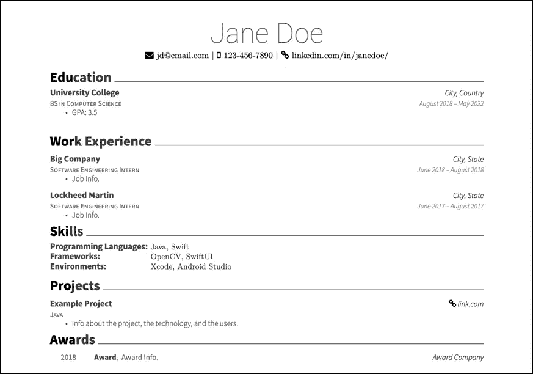

# 本科生的最佳简历格式

> 原文：<https://betterprogramming.pub/the-best-resume-format-for-undergraduates-caf0b468f13b>

## 优化你的简历，通过简历筛选，给招聘人员留下深刻印象

[Cytonn 摄影](https://unsplash.com/@cytonn_photography?utm_source=medium&utm_medium=referral)在 [Unsplash](https://unsplash.com?utm_source=medium&utm_medium=referral) 上拍照

**你的简历就是你的故事。**在求职的 COVID 时代更是如此。随着简历筛选成为求职过程中不可或缺的一部分，你的简历上写了什么和怎么写可能是获得面试机会和被代写的区别。

我在学校参加过很多公司的研讨会，来自脸书、谷歌、美国国家航空航天局和德州仪器等公司的招聘人员总是会问一些关于格式的问题。*最好的格式是什么？我应该如何组织 X？这些问题是不可避免的，而且总是最受欢迎的，而且是有充分理由的。通过参加这些各种各样的研讨会和自己申请工作，我觉得公司希望从申请实习或新毕业生工作的人中看到一些具体的模式——在这里，我将介绍不同的部分。*

以下是我认为适用于大多数情况的排序。但是，由于简历是个人的东西，要看你的情况，你可能要改变顺序。

改变顺序时要遵循的一般经验法则是，尽量把教育放在最前面(除非你有非常令人信服的理由改变它)，因为公司希望看到这一点，这向他们发出了你还在上大学的信号。除了教育，最能展示你的技能或者最令人印象深刻的应该放在最上面。如果你有三份实习工作，那就把它作为毕业后简历上的第二件事。如果你有一个拥有 5000 名 GitHub 明星的个人项目，把它作为你简历上的第二件事。试着想想简历上的哪一部分让你看起来最好看，并相应地提升它。

# 教育

学历绝对是你希望放在简历顶部的东西。与其说是炫耀你的平均绩点，还不如说是“你学校的品牌名”(我去了一所没人听说过的学校，进了谷歌，学历在我简历的最前面)。相反，这只是申请实习或应届毕业生工作的人的常态。这可以让他们很容易地看到你目前在学校，并注意到你的毕业日期。

在这一部分，我会包括你的大学，开始日期，结束日期，平均绩点，可能还有任何与学校相关的奖项或俱乐部。

我唯一会考虑把教育下移的时候，只是把它移到一个有如此令人信服的信息的部分之下，它必须在顶部。一个例子是，如果你还在上学，并且已经实习了五次——五次实习是非常令人印象深刻的，需要放在你简历的顶部。除此之外，我建议把教育放在首位。

# 经验

看完你的教育信息后，招聘人员总是寻找的下一条信息是过去的经验。他们想知道你以前做过什么，在哪里做过，这就是为什么我建议把经验放在简历的第二位。

在这一部分，你应该首先列出你所有的相关经历，除此之外，应该按时间顺序排列。举个例子，如果你 2018 年夏天在谷歌工作，2017 年夏天在脸书工作，2019 年在饭堂工作，那么最好要么省略饭堂经历，要么移到下面。也就是说，如果你还没有软件经验，那么你应该直接写下你做过的任何工作，因为这表明你有工作经验。

我唯一会考虑把这部分下移的时候，可能是在项目下面，是如果你的经历没有一个是相关的实习经历。例如，如果你有一个下载量为 1000 次的 iOS 应用程序，并且你也在学校的计算机实验室工作，我会说，最好在简历中把这个 iOS 应用程序放在比你的经历更重要的位置。

# 技能

我个人认为技能部分可以移到倒数三名之间的任何地方，这取决于你的项目和奖项有多令人印象深刻。

在本节中，包括您熟悉的任何编程语言(如 Java)和框架/库(React、Tensorflow)。任何其他类别的信息(如外语)都应该根据阅读你简历的人了解这些信息的有用程度来填写。

我知道有些人没有任何项目或经验，但这可能不是一个好的长期战略，你真的应该尝试获得一些项目或经验。

# 项目

如果你的项目真的很酷或者有一些用户基础，项目部分可以很容易地提升你的简历。就我个人而言，我把它放在这个地方，我知道很多人也把它放在这里。我把它定得这么低，是因为经验比项目更值得炫耀，而且有时让读者看到你有什么技能可能更有用。

对于这一部分，最好使用你在课外开发的个人项目。这些项目显示出更多的主动性，并且可能会使用更多的相关工具。此外，您可以链接个人项目的源代码，但不应该链接学校项目的源代码，因为这很可能违反学校的政策。

同样，根据你的项目质量，这可以一直发展到学历以下，如果你没有项目，甚至可以忽略。

# 奖金；奖品

我认为奖项通常最好放在简历的底部。很多时候，人们在简历上添加的奖项只是一种填充，或者它们远不如软件工程实习或你自己开发的 web 应用程序那样令人印象深刻。

如果你从你的学校获得了奖学金或奖项，这是你可以包括的东西，但正如我所说的，大多数时候个人项目会更令人印象深刻或相关，所以最好还是把奖项放在底部。如果一个奖项有大量获奖者(想想 LinkedIn 上的每个人都是“福布斯 30 岁以下”)，这一点尤其正确——那些只是填充奖或人们试图传递的比实际更令人印象深刻的奖项。

然而，与其他部分类似，如果你获得了一个非常棒的奖项——比如获得了 WWDC 奖学金、富布莱特奖学金、美国计算机学会颁发的研究奖，或者其他任何人们会知道并考虑的相关奖项——就有理由将这一部分放到你的简历上。不过，我还是建议把它放在底部。

这里有一个关于 *Jane Doe* 的例子，它将所有这些组件放在一起:

来自[resume . io](http://resumake.io)的模板

尽管我说最佳顺序是**教育、经验、技能、项目、奖励**你会注意到，当我描述每一部分时，我会指出你可能想改变顺序的原因——这是因为一份好的简历是为你独特的经历量身定制的。如果你不符合这个精确的模型，那也没关系！最好有一个能最好地展示你作为一个人的订单。