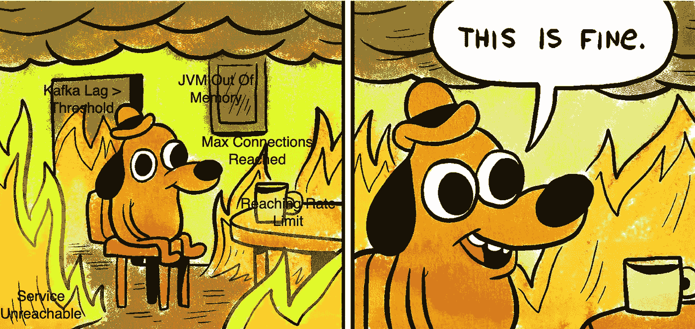
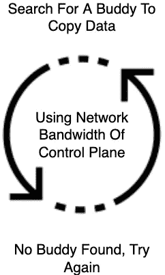

# 分布式系统中的黑天鹅事件

> 原文：<https://betterprogramming.pub/the-black-swan-events-in-distributed-systems-d6a5d51adddf>

## 看看现实生活中的亚稳态故障


照片由 Alina Grubnyak 拍摄

分布式系统顾名思义，就是在空间上分离并使用多台计算机构建的系统。

构建分布式系统有多种原因。其中一些是…

*我是个不怕死的人！*



原图由 [KC 绿](http://kcgreendotcom.com/index.html)

不，不…不…只是开玩笑，嗯，也许不是…好吧，当然是开玩笑。

# 高可用性是一个很好的理由

嗯，计算机是物理事物，像所有做一些工作的物理事物一样，计算机也会磨损。他们迟早会垮掉。如果你只用一台电脑构建了一个系统，有一天那台电脑出了故障，你会感觉不太好。

另一方面，如果你用不止一台计算机来构建你的系统，当其中一台出现故障时，整个系统可能仍然正常运行。你会没事的。

当然，在您的分布式系统中，计算机故障并不是唯一会导致事故的原因。
代码中可能有错误，或者系统负载可能增加。


当一个系统被要求做比它可能做的更多的工作时，某些东西最终会失败。也许 CPU 使用率非常高，已经成为瓶颈，用户请求开始超时，提示用户系统停机。或者可能磁盘空间已经成为瓶颈，系统无法存储更多的数据。

在正常的系统过载情况下，如果负载源或触发器被移除，问题消失，一切恢复正常状态或稳定状态。

例如，可能系统受到了 [DDoS 攻击](https://www.cloudflare.com/en-in/learning/ddos/what-is-a-ddos-attack/)吞噬了所有带宽，导致实际用户流量被丢弃。系统现在处于易受攻击状态，这是一种导致系统不可用的不良状态。

一旦我们设置了阻止列表来阻止来自违规 IP 地址的流量，触发就会消失，网络负载恢复正常，用户流量开始通过，系统回到稳定状态。

很难防止这种超载事件，但通常很容易恢复。

还有另一类更难解决的过载事件，在这种情况下，仅通过移除初始触发因素，系统无法恢复到稳定状态。这些事件可能会导致系统长时间停机，在某些情况下可能会持续数小时甚至数天。这类事件即使在初始触发器被移除后仍继续发生，称为亚稳态故障。

我们将很快讨论这实际上意味着什么，但首先，让我们看看现实生活中的亚稳态故障。

# 臭名昭著的 EC2 和 RDS 服务中断

这个故事发生在 2011 年，当时我还在上高中。因为这种类型的事件很少发生，当它们发生时，它们会造成巨大的破坏，它们是如此重要，以至于我们应该了解它们，从这些事件中吸取教训。

它们在分布式系统的历史中根深蒂固。

因此，该问题影响了美国东部地区单个可用性区域内的 [EC2](https://aws.amazon.com/ec2/features/) 客户，其中涉及无法为读写操作提供服务的 [EBS](https://aws.amazon.com/ebs/features/) 卷的子集。该问题导致该子集的服务停机，客户受到影响达数小时，在某些情况下甚至数天。

这起事件的触发因素是网络配置更改，该更改无意中将一个集群中 EBS 服务器子集的所有网络流量路由至
低带宽辅助网络，而不是高带宽主网络。

辅助网络从未被设计为处理大量负载，因此它开始将所有流量汇集到备用网络。

备用网络本身很快就超载了。这使得服务器很难相互通信，并导致受影响服务器中托管的虚拟
磁盘上的读写失败。到目前为止，这似乎是一个正常的过载故障。

网络更改很快被回滚，流量开始再次通过高带宽主网络。因此，消除了过载的触发。

# 现在，不是一切都回到正常或稳定的状态，而是一切都大规模爆炸了！

因此，EBS 服务器使用伙伴系统，其中每个数据块都存储在两个不同的服务器上，以确保可靠性。当服务器失去与其伙伴的连接时，它认为其伙伴已经崩溃，现在它拥有客户数据的唯一副本。现在，这个服务器很快试图找到一个新的伙伴，希望复制客户数据。这个过程称为重新镜像。

在这个场景中，由于出现了大规模的网络中断，当网络中断得到解决时，有一大群 EBS 服务器都在寻找伙伴来镜像客户数据。

也许在这一点上你已经能猜到接下来发生了什么，因为他们称之为重新镜像风暴。

很酷的名字，我必须说。

很快，受影响的群集中的所有磁盘空间都扩大了，因为每台服务器都在尝试制作其数据的副本。我们可以想象那一定是大量的数据，需要大量的磁盘空间和大量的网络带宽。

这使得许多服务器陷入了一个恶性循环:



这种对伙伴的搜索给控制平面服务器带来了区域范围的额外负载，控制平面服务器负责协调对 EBS 服务器的请求，从而使它们过载并使它们离线几个小时。

> *控制平面有一个区域可用线程池，可用于服务请求。当这些线程被大量排队的请求完全填满时，EBS 控制平面没有能力为 API 请求提供服务，并开始使该区域中其他可用性区域的 API 请求失败。*
> 
> *—来自 AWS 文档*

现在，这不仅会影响降级集群的请求，还会影响其他集群。

当一切似乎都不起作用时，我们该怎么办？将其关闭，然后重新打开。

最终，他们切断了与降级 EBS 群集的网络连接，并基本上使其离线，以便控制面板服务器恢复并开始为来自健康群集的请求提供服务。

为了让一切恢复正常，必须从该地区的其他数据中心引入额外的容量，以添加到受影响的集群中，从而增加磁盘空间，以便这场重新镜像风暴能够平息。

这些类型的自持故障会自我反馈，甚至在最初的负载源或触发器被移除后仍会持续存在，这种故障称为亚稳态故障。

> *亚稳态故障表现为黑天鹅事件；它们是离群值，因为过去没有任何东西指出它们的可能性，具有严重的影响，并且事后解释比预测容易得多。*
> 
> *—摘自论文《分布式系统中的亚稳态故障》*

该论文的作者提出了一个描述系统从稳定性到亚稳定性的状态转换的模型。


我们都希望我们的系统处于稳定状态。好吧，也许不是我们所有人，还记得帖子开头的那个家伙，他毕竟是(或曾经是)一个冒失鬼。

总之，由于从`stable → vulnerable`状态转换的负荷增加，系统的稳定性可能会暂时受到影响。

我们希望一旦负载被移除，系统将回到其稳定状态。

正如我们在 EC2-EBS 事件中看到的那样，那里并没有发生这种情况，在移除初始负载后，系统并没有从`**vulnerable** → **stable**`状态进入`metastable`状态，而是持续了一段时间。

# 如何处理亚稳态故障？

由于这些类型的故障很难预测，我们只能从过去的事件中形成一般的观察，并在设计我们的系统时考虑这些因素。

## 对重试请求设置上限

如果您正在调用一个下游服务，并且该调用在大多数情况下超时，重试是正常的，这可能只是网络中的一个小问题，如果您重试它将会很好。如果对下游服务的调用因过载而超时，您重试时，会给已经过载的系统增加负载。

这里，客户端有一个断路器，它跟踪请求失败，并注意到，好吧，我已经调用了一个服务 10 次，它超时了，也许我会让它休息一下，抑制我的请求，以便给它一些时间从负载中恢复过来。

## 抑制反馈回路

反馈回路是保持系统处于`metastable`状态的自持效应。

如果系统处于导致故障的过载状态，系统可以通过改变其行为来响应这些故障。这种变化无论有多小，都可能给系统带来足够的负载，将其推至极限，此时系统进入自我
持续反馈回路，给系统带来更多负载，并进入亚稳态。

如果我们能提前或足够快地识别反馈循环，我们就能试图限制它们对系统的影响。一个系统进入
亚稳态有无限多的原因，因此也有无限多的方法来处理它们。

> *断路器是固体溶液，在分布式系统中变得非常普遍，以防止系统进入亚稳态。*

# 更多想法

## 激增期间的医院

因此，医院在建造时考虑了效率，如果一家医院有负载，流量可以被重定向到附近的医院，但它们不是为处理电涌而设计的，covid 期间就发生了这种情况。医院除了正常的负荷之外，没有太多的额外能力，但是医院之间的负荷是可以控制的。

只要负载不是到处都在增加，全球系统可以吸收它，但当负载到处增加时，我们就进入了一个亚稳态，整个基础设施似乎都崩溃了。

## JVM 垃圾收集器

正常情况下，垃圾收集器会正常工作，一旦你给它太多垃圾，你的 JVM 就会突然进行垃圾收集，它会丢弃所有编译过的代码，然后重新编译代码，这需要更多的内存，需要更多的垃圾收集，如此循环，直到你杀死它。

> *在这方面，多线程系统是近似分布式系统。*

# 问你一个问题

如果没有恢复策略，会出现亚稳态故障吗？

好吧，我希望你喜欢读这篇文章，就像我喜欢研究和写关于这个主题的文章一样。

下次见。感谢阅读。

# 参考

*   研究论文— [分布式系统中的亚稳态故障](https://sigops.org/s/conferences/hotos/2021/papers/hotos21-s11-bronson.pdf)
*   AWS RCA — [美国东部地区亚马逊 EC2 和亚马逊 RDS 服务中断摘要](https://aws.amazon.com/message/65648/)

```
**Want to Connect?**If you like my content, consider subscribing to my [newsletter](https://ashutoshnarang.substack.com/) :)
```