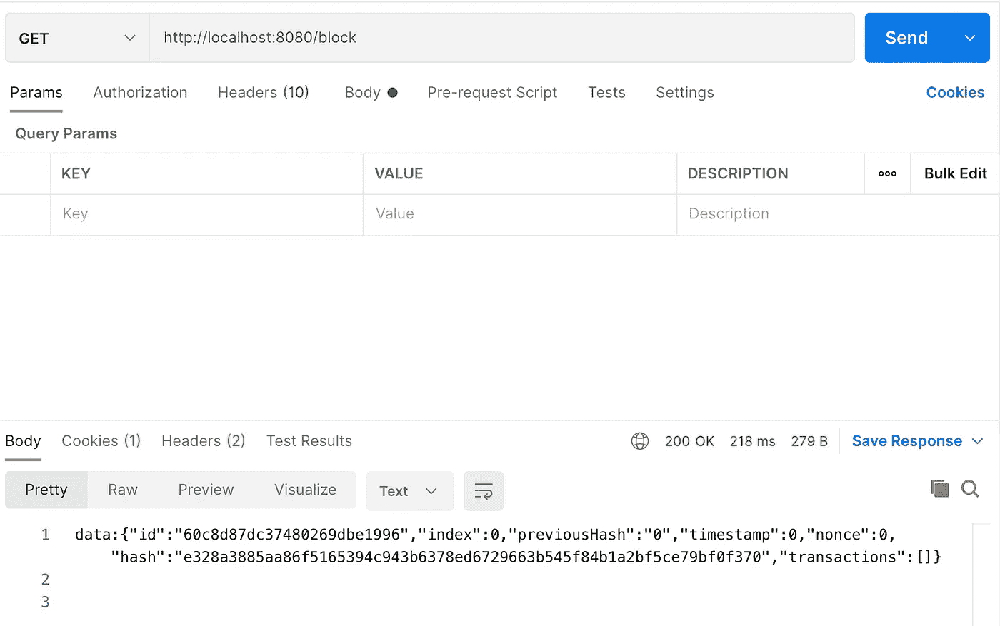
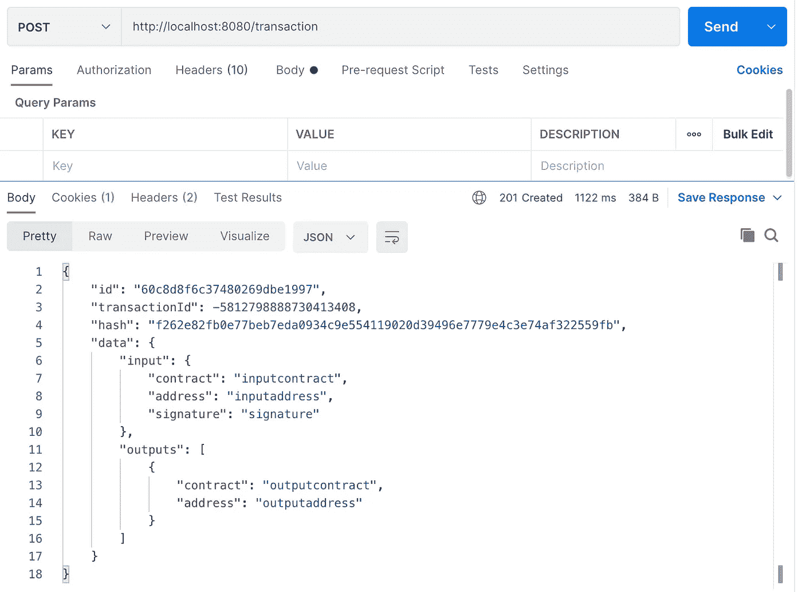
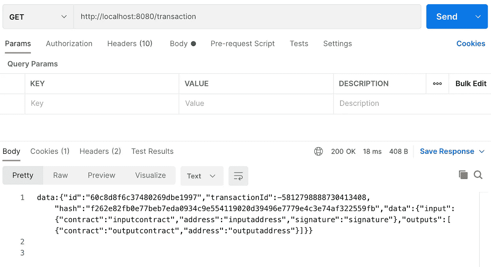
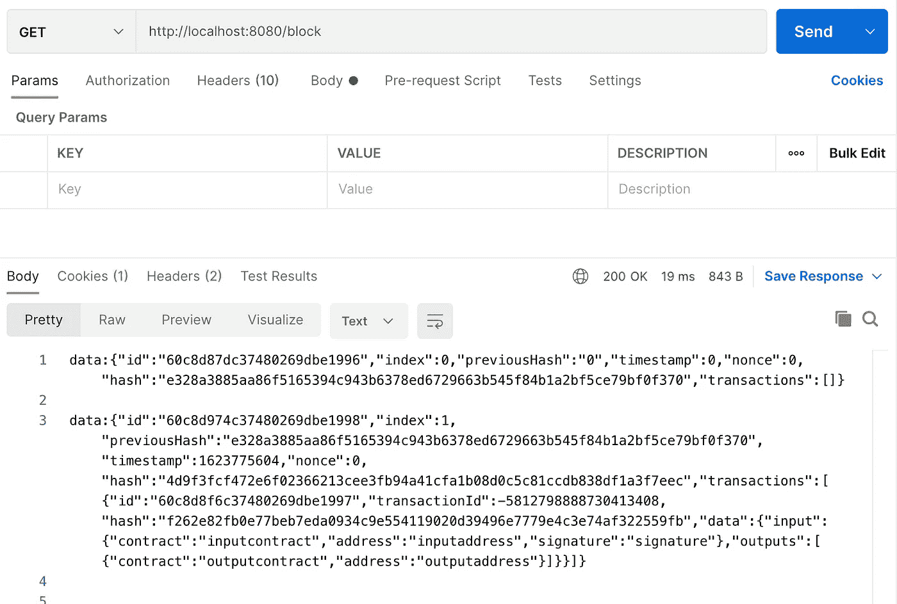

# 如果你想了解区块链，请看这个 Java 实现

> 原文：<https://betterprogramming.pub/the-blockchain-explained-with-a-java-implementation-27b74d478223>

## 解放区块链

图片由[类比](https://pixabay.com/users/analogicus-8164369/?utm_source=link-attribution&utm_medium=referral&utm_campaign=image&utm_content=4049725)来自 [Pixabay](https://pixabay.com/?utm_source=link-attribution&utm_medium=referral&utm_campaign=image&utm_content=4049725)

我收到了很多关于加密货币及其底层机制区块链的问题。很多时候我很难简洁地解释它，所以我将写一个区块链的例子来更好地理解它。本文是将讨论组成部分的三篇文章之一:区块链、对等网络和挖掘。我不会用它来制造加密货币，只是一些抽象价值单位的区块链。

不试图制造真正的加密货币简化了许多事情。没有费用或奖励(采矿纯粹是为了享受)。交易不需要累加，用户也不需要传统的钱包。去掉这些东西还剩下什么？一个不可变的“事务”列表，它是可验证的和分布式的。

我应该承认，我将使用的大部分术语来自于 [Naivechain](https://github.com/lhartikk/naivechain) 和 [Naivecoin](https://github.com/conradoqg/naivecoin) 的实现。虽然这些项目对于理解区块链也很有用，但我想更好地梳理一下各个部分，没有完整的加密货币实现，但仍然考虑价值转移和工作证明的想法。

我将使用 Spring Boot 和 WebFlux 作为 HTTP 服务器，使用 MongoDB 作为数据库，使用 Kafka 作为消息队列来帮助实现对等网络。我不会使用 MongoDB 的所有特性，为了简洁起见，甚至连索引都被省略了。我不会讨论 HTTP 安全性，任何人都可以访问所有的端点。如果你打算将这些部件用于你自己的加密货币，你最好做好调整和防弹的准备。

我将广泛使用 reactive Java，所以如果你需要复习一下，你可以看看我的文章[了解 Reactive Java](https://levelup.gitconnected.com/understanding-reactive-java-e8aaee9a204b) 。

首先要检查的是区块链的街区。一个块有几个数据项；链中前一个块的链接、时间戳、用作工作证明的一部分的 nonce、索引和事务。下面是我对该块的实现:

MonogDB 使用一个`id`字段来跟踪所有实体。用`index`、`previousHash`、`timestamp`、`transactions`和`nonce`来计算`hash`。我在散列中包含了一个“wither ”,因为它必须在块的其余部分初始化之后进行计算。当试图克服困难时，nonce 通常随着每次迭代而增加。但是在我们的例子中，没有困难，所以随机数总是零。我把这些部分放在适当的位置，以演示如果我们想要包含不简单的工作证明，可能会如何使用它们。当我们处理采矿时，我们将更多地研究工作证明。

还有一个“起源块”，它总是链中的第一个块。它的所有值都为零。当我们的服务器启动时，如果数据库是空的，它将插入这条记录。从技术上讲，这种情况不应该发生，但在第一次启动时，每个节点会发生一次。但是它需要作为区块链正确性的一部分存在。目前，我们只有一个节点，我们将在讨论对等网络时再次讨论节点。

就其本身而言，该块并不十分有用。为了让它有目的，我们需要给它添加一些数据。那么该块的用途是验证数据。在我们的例子中，数据是一个事务列表，事务是一对非常简单的条目，一个输入契约和一个输出契约。如果我们正在制造一种加密货币，这些“合同”将是从一个账户转移到另一个账户的分类账条目。我们用“地址”这个术语来表示账户。

然而，对我们来说，合同只是一个字符串。想象一下两个人之间的一个契约，双方都想保证永远不变。因此，我们将其添加到交易中，并放入区块链。下面是我对一个事务的实现:

没什么特别的。哈希值是根据事务 ID 和数据计算出来的。数据分为输入和输出列表，理论上，输入应该等于输出。但是因为我们的合同只是一个字符串，所以没有办法强制执行。这可能是加密货币的另一个开端。输入值由发起者的私钥签名。可以把它想象成启动器向输出列表中的地址发送有价值的东西。

这两个东西是怎么放在一起的？用户可以输入一个事务，但是如何将它们收集到一个块中呢？我们稍后将讨论更多关于矿工的内容，但可以说，矿工清除了所有“松散”的事务并创建了一个新的块。让我们来看看一些我们将用来操纵区块链的方法。这是我的区块链课堂:

这并不过分，大部分是处理区块链的卫生问题。必须检查该块的四个条件；它必须具有比链中的最后一个块高一的索引，它必须具有最后一个块的散列作为其先前的散列值，它自己的散列必须可以从数据中再现，并且它必须满足难度级别。既然我们没有难度级别，那么最后一个永远是真的。看起来很奇怪的是，我们正在检查我们刚刚设置的哈希是否与新计算的哈希相同，但是我们必须记住，在分布式系统中，一个新的块可能会被一个对等体添加，所以我们需要防止来自他们的坏数据。

我们还必须检查块中的每个事务。这意味着散列可以从数据中再现，并且事务不存在于链中的其他地方。我们还必须从 transactions 数据库中删除所有转移到这个块中的事务，但这是在其他地方完成的。

接下来，我们有我们的服务控制器。有两个服务控制器:一个用于块，一个用于事务。两者都包括一些将被转移到其他地方的端点，但我在这里展示它们是为了在我们继续之前测试系统。额外的端点允许您像矿工一样创建块，像用户一样创建事务，这两者将分别被移动到矿工和用户控制器。这是现在的块控制器:

这个控制器有四个端点，`block`用于获取所有块，`block/last`用于获取最后一个块，`block/{hash}`用于获取具有特定散列的块，`block/mine/{address}`用于伪装成一个挖掘器。如上所述，虽然最后一个端点属于其他地方，但我在此将其包括在内，因为如果我们所能看到的只是创世块，那么这将是一个非常无聊的系统。

然后是交易的控制者。通常，这将用于查看“松散”事务，即不属于块的事务。同样，我添加了一个端点来添加一个事务，尽管这只能由用户来完成。这是事务控制器:

这里我们只有三个端点，`transaction`将获得所有松散的事务，`transaction/{transactionId}`将获得一个特定 ID 的事务，`transaction`(作为 POST)将代表一个虚拟用户创建一个新的事务。

为了运行这些端点，我们需要启动 MongoDB 和 Zookeeper/Kafka。下面是我为此使用的 docker-compose.yaml:

启动这些服务，并运行区块链服务，现在我们可以看到区块链。首先，获得所有块揭示了创世纪块:

现在，让我们做个交易:

获取松散交易的列表:

开采区块:

再次获取所有块:

您还可以检查以确保不再有松散的事务。

这可能看起来不太令人兴奋，它只是一个关联交易的数据库。在我的下一篇文章中，我将介绍令人兴奋的部分:一个分布式系统，它一起工作以形成一致的区块链，同时不会留下任何事务。如果一切顺利，您应该能够在任何节点中添加事务或挖掘块。最终，所有节点都会同意最终的区块链。

本文中的所有代码都可以在我的 GitHub 页面上找到:

 [## rkamradt/区块链

### yabc。在 GitHub 上创建一个帐户，为 rkamradt/区块链的发展做出贡献。

github.com](https://github.com/rkamradt/blockchain/tree/v0.1)