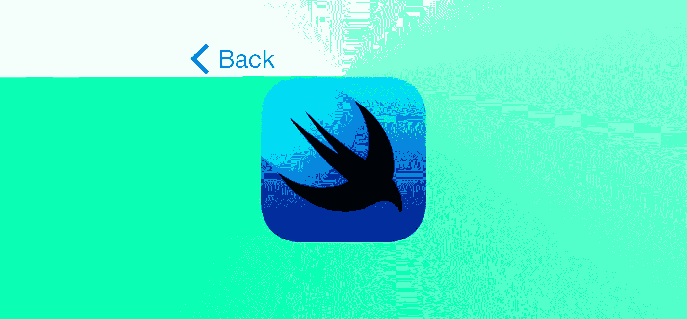

# 在 SwiftUI 中使用自定义后退按钮的案例

> 原文：<https://betterprogramming.pub/the-case-for-using-custom-back-buttons-in-swiftui-99b3124f3572>

## 夺回你认为 SwiftUI 为了简单而牺牲的控制权



作者照片。

SwiftUI 简化了应用程序中的许多常见功能、能力和控制。很明显，开发过程中的一个焦点是考虑开发人员如何简单地合并通用 UI 元素，并且自动处理大量开销。该框架甚至考虑了可用性和设计的角度。

这非常受 iOS 社区的欢迎，他们有使用界面构建器、故事板和视图控制器的经验。任何处理过即使是最简单的功能所要求的复杂性的人都可以理解 SwiftUI 的好处。

# 有什么问题吗？

随着开发人员开始用 SwiftUI 构建越来越复杂的应用，有时感觉功能(如导航)几乎*过于*简单。当我浏览堆栈溢出 Q & A 时，我看到越来越多的标记问题要求更多的开发控制。类似地，我看到了许多解决方案，包括包装旧的 UIKit 解决方案来填补空白。

我希望随着 SwiftUI 的不断成熟和发展，我们将会看到越来越少的 UIKit 和越来越多的 SwiftUI(这在今年的 WWDC20 上肯定会出现)。

但是我也希望我们只是在万不得已的情况下才使用另一个框架。也许我们可以找到纯粹的 SwiftUI 解决方案，就像苹果建议的那样，尽管它们可能看起来粗糙和/或不太漂亮。不过，我认为，我们引入 UIKit 也是一样的做法。

郑重声明:我并不真的反对 uik it——只是希望减少依赖性，看到一个新的框架独立存在。

# SwiftUI Unwind？

开发人员似乎错过的一个能力是放松。我们有一个带导航的“免费”后退按钮，但是没有添加任何代码或补全的选项。回到过去的 UIKit 时代，有一些选择。如果我们使用了`segue`，我们可以将代码放入展开中。另一个选择是使用`viewWillDisapear`或其他生命周期事件。

对于 SwiftUI，在开发人员希望在导航回父节点之前运行一些代码的情况下(而不是在绑定改变时立即运行)，我们自然可以“免费”做的最好的事情是触发`.onDisappear`(被列为 SwiftUI 生命周期事件之一的[)。然而，这在技术上是运行的，因为父元素已经进入视图，这可能会产生尴尬的 UI 结果。由于 NavigationView 中的父视图已经出现，`onAppear`不是一个安全的选择。](https://medium.com/flawless-app-stories/the-simple-life-cycle-of-a-swiftui-view-95e2e14848a2)

另一种方法是自己动手，创建一个自定义的后退按钮。这是很自然的，因为尽管我们没有使用免费创建的按钮，但是我们可以在视图中添加栏项目。如果我们的应用程序需要的不仅仅是简单的向后导航，我们绝对应该利用这种方法。

# 创建我们的后退按钮

创建一个新的后退按钮实际上很简单，尽管在这个过程中可能会向您介绍一些新的修饰符等等。这里假设您有一个详细视图，您正在使用 NavigationView 沿着链*向下导航到*，并且想要使用后退按钮从沿着链*向上导航。*

首先，在通常声明视图属性的地方，需要引入一个名为`presentationMode`的系统环境属性:

```
@Environment(\.presentationMode) var presentationMode
```

不幸的是，苹果文档似乎缺乏关于`presentationMode`的深度(对于[实例属性](https://developer.apple.com/documentation/swiftui/environmentvalues/3363874-presentationmode)，对于[结构](https://developer.apple.com/documentation/swiftui/presentationmode)就更少了)。我们所知道的是，它是绑定到应用环境的所有视图的默认属性。这一点很重要。

如果视图是导航层次结构的一部分，那么它们带有与导航交互的修饰符。在我们的例子中，我们想要添加一些修改器到我们的细节视图的最上层(例如包含堆栈)。

第一个修改器将隐藏默认的后退按钮:

```
.navigationBarBackButtonHidden(true)
```

我们需要的第二个修饰符将允许我们向导航栏添加项目(导航后代视图顶部的保留空间):

```
.navigationBarItems(leading: <View(s)>)
```

出于我们的目的，我们将创建一个这样的按钮:

就是这样！我们现在有了 back 按钮，可以在实际关闭视图之前运行代码。

*注意:您可能会注意到，我们在按钮文本中添加了“Back”。如果我们想要父视图的名称，我们需要将它传递给后代(作为一个属性也可以，不需要状态)。*

# 备份场景

为什么有人想要一个自定义的后退按钮？有一种观点认为，大多数场景都可以用现有的方法来解决——尤其是使用绑定和组合。这里有几个我认为有用的场景。

## 场景一:你确定吗？

需要自定义后退按钮的一种可能情况是，希望在导航之前在当前视图上执行一个操作。其中一个例子是询问用户是否确定要返回(据我所知，这是一个开创性的例子)。

在这种情况下，我们可以向视图添加一个警告，提示用户是否确定要返回。我们还将把`dismiss`呼叫从我们的后退按钮移出，变成肯定提醒:

最后，我们希望通过后退按钮触发警报:

```
// Add a new State to your View
@State var showAlert: Bool = false// Add the following trigger inside the Back button
// Note: we set to true, not toggle
self.showAlert = true
```

## 场景 2:当我准备好的时候同步

如果数据是在屏幕上创建或编辑的，可能会有这样一种情况，我们不一定希望这些更改是可绑定的。也许我们更希望用户继续他们的体验，只有在他们通过点击后退按钮表示完成后，我们才开始存储/同步数据。甚至在此之前篡改数据。

数据可能已经在当前视图中可用。只需在我们的`dismiss`之前的 back 按钮中添加必要的代码。

## 场景 3:传递回调以获得更动态的导航

如果我们有一个视图，我们计划导航回多个不同的后代，会发生什么？在返回到该视图时，我们想要运行某种进程(如前所述，`onAppear`在返回到父视图时不计算在内)。

如果我们想做的事情主要发生在父视图中，让每个潜在的后代强制兼容它不应该知道的事情可能会很乏味和难以控制。那么，解决方案就是传递一个回调闭包，让它在我们的 back 按钮中运行！

这使后代看不到需要做的事情的复杂性，而只是让它成为信使和触发器。

接受和运行闭包的方法如下:

```
// Make a closure an optional parameter in the descendant View
var onBack: (() -> Void)? = nil// In our Back button, we'll run the closure, provided it's not nil
onBack?()
```

# 夺回控制权

我喜欢 swift ui——在今年的 WWDC20 之后更是如此。虽然还有一些成熟的东西要走，但这并不意味着我们不能编写完全健壮和强大的应用程序。相反，我期待看到一些用 SwiftUI 编写的很棒的应用。

请记住，虽然 SwiftUI 确实弥补了很多不足，并使事情变得简单，但这并不意味着我们不能获得创建出色应用程序所需的访问和控制。

四处挖掘，夺回你认为已经失去的控制权！