# 包含视频、图像、GIF 和更多内容的丰富推送通知的完整指南

> 原文：<https://betterprogramming.pub/the-complete-guide-for-configuring-ios-push-notifications-3161d0cddd46>

## 本地通知、推送通知。定位触发器。多媒体信息丰富的图像，视频，Gif 或完全自定义的用户界面。iOS15 变更

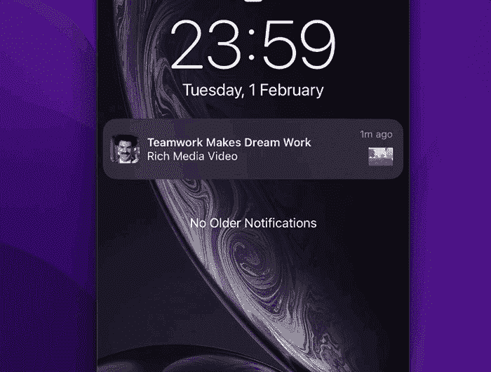

带视频的富媒体-mp4

# 介绍

几乎每个应用程序都需要某种方式与用户交流。营销团队的主要目标之一是向更多用户提供相关信息，与他们互动，并帮助他们理解应用程序的价值。他们最喜欢的选择之一是**推送通知**。

当我在几个教程后开始使用通知时，我认为我什么都知道。对于每个功能请求，我都有新的发现。根据我的经验，这篇文章将涵盖非常广泛的知识。

在我们进入细节之前，这里有一个我很久以前开发的基于文本的游戏，它大量使用通知。它在 iPhone 上受支持，但在 **Apple Watch** 上可以获得更多乐趣。[生命线:空白](https://apps.apple.com/us/app/lifeline-whiteout/id1094429166)

本文将涵盖几个主题，如:

*   本地通知
*   推送通知
*   无声推送消息
*   如何添加动作按钮
*   如何在 Xcode 中配置
*   如何注册
*   消息类型和状态
*   iOS 15 的变化
*   APNs
*   如何设置证书
*   富媒体(包含图像、GIF 或视频的多媒体消息)，
    通知服务扩展
*   富媒体(具有自定义创建内容的消息)，
    通知内容扩展
*   如何演示的示例`MapKit`
*   如何处理徽章计数
*   如何在模拟器和设备上测试
*   有用的工具
*   良好的第三方推送通知服务


通知类型——由 Apple 提供

# 订阅通知

无论选择本地还是推送通知类型，第一步都是要求用户允许他们接收通知。注册，以便能够接收通知。很多时候它是从`application(_:didFinishLaunchingWithOptions:)`调用的，但是一个更好的选择是从您的**自定义屏幕**调用它，向用户解释为什么我们将使用本地或/和推送通知及其好处。


操作系统会提示用户

当我们调用`requestAuthorization(options:)`时，操作系统将显示在之前的图像中可以看到的警报视图。用红色标记的是应用程序名称。绿色底层是请求选项。

下图显示了自定义屏幕如何解释权限的一个示例。必须提到的是，当操作系统提出警告时，应用程序将进入`background`，在用户回答操作系统权限问题后，它将返回应用程序。这意味着它将触发`AppDelegate` / `SceneDelegate`生命周期方法。

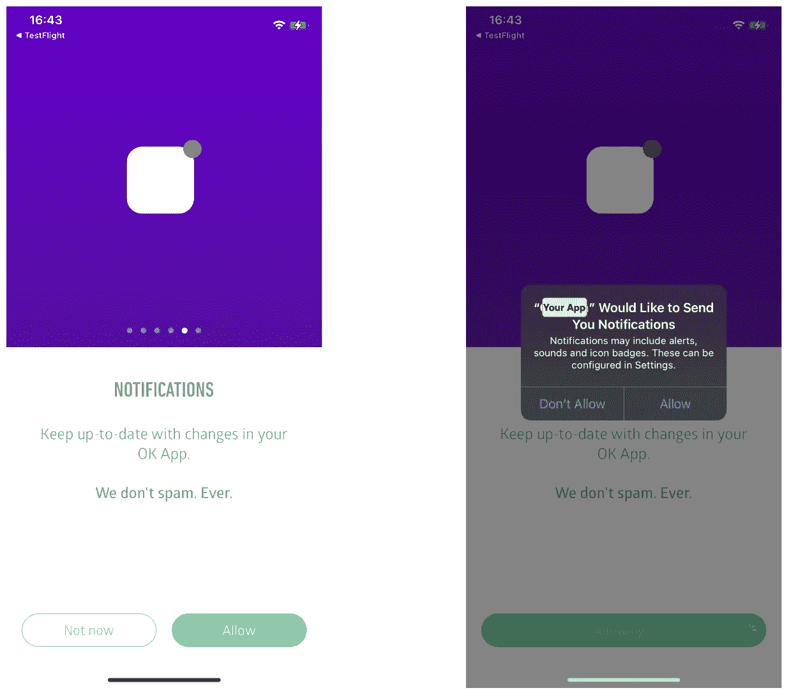

显示请求许可的操作系统警报的自定义视图示例

第一步是`import UserNotifications`。
下一步是创建我们想要使用的配置，例如`let options: UNAuthorizationOptions = [.alert, .sound, .badge]`。

请求通知权限

此`alert`、`sound`和`badge`将涵盖大多数应用需求，但还有更多参数，如`carPlay`、`criticalAlert`或`provisional`等。

*   `alert` —能够弹出通知，提醒
*   `sound` —启用声音，默认为`UNNotificationSound.default`
*   `badge` —允许在应用程序图标上使用带有数字的“红点”
*   `carPlay` —能够在 [CarPlay](https://medium.com/levi-niners-crafts/how-to-make-advanced-carplay-audio-apps-b0ce10dad472) 中显示通知(链接到一个朋友提供的非常好的使用 CarPlay 的教程)
*   `criticalAlert` —严重警告超过“请勿打扰”必须得到苹果公司的特别授权
*   `provisional-` 使用此选项，您不需要征求用户的许可。您可以立即发送通知。而是直接去了通知中心

如果您想检查应用程序中允许用户使用哪些选项，您可以使用以下代码来完成:

如何从应用程序检查权限

# 临时消息

如上所述，这些都是无声的消息，不会引起注意，用户可以从应用程序安装中接收到它们。不需要征求许可。你仍然需要调用方法`requestAuthorization(options:)`。但是它不会提示用户任何问题。

```
let options: UNAuthorizationOptions = [.provisional]
```


临时推送消息

在上图中，您可以看到用户是如何看待消息的。用户仍然可以根据需要从设置中对其进行配置。

# 本地通知

顾名思义，这种通知是在本地离线创建的。作为提醒，可以按时间间隔安排本地通知，这将按事件发生的确切时间或按地理位置、地理围栏触发通知。

示例:

*   如果你想通知用户停止玩魔兽世界，并检查已经煮了 20 分钟的肉，否则会烧焦(时间间隔)。
*   今天 2 月 1 日是你最好的朋友的生日(日历)。
*   你路过最喜欢的商店，需要去买牛奶(位置)
*   文件下载已在后台完成(时间间隔/瞬间)

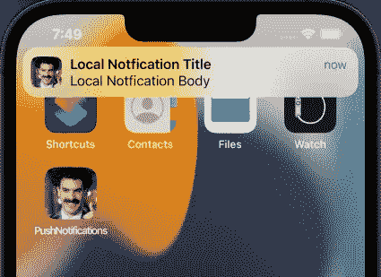

简单本地通知

要创建本地通知，您需要像前面解释的那样请求用户的许可。

当您创建本地通知时，操作系统将接管这一职责。当你的应用程序被关闭或在后台运行时，操作系统会确保在用户需要时呈现给用户。

本地通知是吸引用户注意力和增加应用参与度的方式。

考虑到技术部分，每个本地通知都有三个部分:

## **内容**

这些是通知的可视和配置属性。

*   `title` —简单字符串，消息标题
*   `subtitle` —简单字符串，消息的副标题。这通常是营销团队可以选择使用的
*   `body` —简单的字符串，消息的副标题。消息的内容
*   `sound` — `UNNotificationSound.default`为默认。你可以用一个定制的
*   `badge` —“红点”上的数字你可以用这个来设置确切的数字。但是你可以有自己的系统，根据你的需要增加或减少计数。你可以将它与你的收件箱消息，一些应用程序特定的线程消息系统结合起来。无论你支持什么。
*   `user info` —您可以将一些数据作为键:值对传递。
*   `attachments` —您可以使用手机上的[多媒体文件](https://developer.apple.com/documentation/usernotifications/unnotificationattachment)。基本上，您可以在应用程序的捆绑包中包含一些视频、图像或 gif，并将其用作资源。我没有使用这个，因为下载资源时，富媒体是一个更好的选择。稍后将对此进行解释。
*   `categoryIdentifier` —这是一个有趣的选项。您可以使用它将**操作按钮**添加到通知中，或者区分富媒体(通知服务扩展或您的通知内容扩展操作)。
*   `interruptionLevel` — iOS 15 带来了这个。这告诉系统消息有多重要以及何时发送。
    `active` —系统立即呈现通知，点亮屏幕，并可播放声音。
    `critical` —系统立即呈现通知，点亮屏幕，绕过静音开关播放声音。
    `passive` —系统将通知添加到通知列表中，不点亮屏幕或播放声音。
    `timeSensitive` —系统立即呈现通知，点亮屏幕，并能播放声音，但不会突破系统通知控件。
*   `threadIdentifier` —您可以为每个本地或推送通知分配一个标识符，以便在通知中心对其进行可视化分组。例如，所有信息消息将被**分组**。


`interruptionLevel on iOS 15`

## **触发**

这是将唤醒操作系统并发送通知的触发类型。

*   `time` — `timeInterval`，通知触发前的持续时间
*   `calendar` —需要触发通知的确切日期时间
*   `location` —当您进入或退出特定区域时，会触发通知。

## **请求**

Request 只用于对上面的所有数据进行分组。它有`content`、`trigger`和`identifier`。

值得一提的是，万一你想取消通知，一个`identifier`是很重要的。我们已经说过，您可以在应用程序中创建通知。但是操作系统接管并添加到列表中。如果你没有`identifier`，那么你不能要求操作系统取消它。

```
UNUserNotificationCenter.current().removePendingNotificationRequests(withIdentifiers: "my_notification_id**"**)
```

通知类型的代码示例如下:

时间间隔本地通知

日历本地通知，确切日期将是触发器

对于本地通知的位置类型，我将展示一个示例，但不会详细介绍。这本身就是一个故事，我将为此专门写一篇文章。在高层次上，您需要使用`CoreLocation`模块才能使用地理围栏。

代码如下:

带地理围栏的位置本地通知

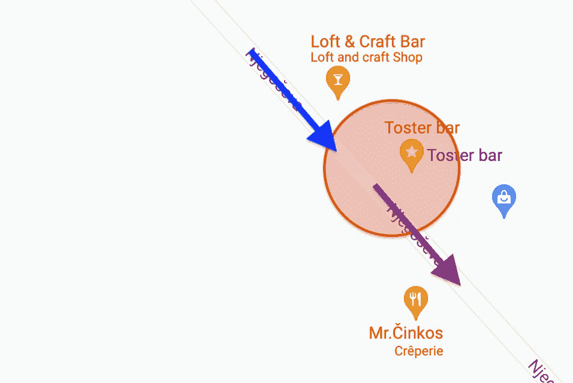

进入或退出上例中的 Geofence

在内容部分，您可以看到`threadIdentifier`。你可以用这个来**分组通知**。例如，通过独特用户或交易促销。在 iOS 15 之前，有一个属性`summaryArgument`是在分组旁边添加的，但现在它被弃用了。


推送通知分组的外观

# 听事件

此时我们已经将`imported UserNotifications`注册到了`requestAuthorization(options:)`，但是我们仍然不能监听事件。

下一步是遵守协议`UNUserNotificationCenterDelegate.` 你可以用多种方式来做。为了简单起见，我在`AppDelegate`中这样做了，但是您可以创建一个单独的服务/管理器，或者在`ViewController`中这样做，所有这些都是视情况而定的，没有最终的方法。

如果你想在**前台**接收通知，那么在`userNotificationCenter(_:willPresent:withCompletionHandler:)`方法中你可以配置它，看`completionHandler([.alert, . badge, . sound])`。

现在，您可以使用`userNotificationCenter (_:didReceive:withCompletionHandler:)`和 userInfo 数据监听本地/推送通知。如果它有自定义的动作按钮，我将在下一节解释这些。

如果您想要创建多个本地通知，注意不要使用相同的`identifier`，因为新消息会用相同的`identifier`覆盖旧消息。代码如下:

将通知配置为能够监听某些事件

# 行动

我们可以定义通知的动作/按钮。为此，我们需要用`UNNotificationAction`定义动作。然后用`UNNotificationCategory`将它们添加到类别中。代码如下所示:

如何创建通知操作

如果您在我们创建通知后返回并添加下一行:

```
content.categoryIdentifier = "myActionCategoryIdentifier1"
```

那么它将触发`category1`类型的通知。你可以看到你可以用不同数量的按钮和功能创建许多类别类型。

当您收到下一个通知并下拉或长按它时，您会看到操作按钮。iOS 版本之间的按钮外观可能会有所不同。


操作按钮和徽章

为了能够检测用户点击了什么按钮，用下面几行代码修改`userNotificationCenter(_:didReceive:withCompletionHandler:)`方法:

收听通知按钮点击

例如，你可以暂停一个重复的闹钟，它会在五分钟后再次响铃/发送本地通知。但是，您也可以删除通知，这将使用标识符取消此通知。

# 苹果推送通知服务

至此，我们几乎为推送通知做好了准备。但是在我们开始之前，我们需要了解如何注册推送通知。APNs 是苹果的一项服务，让我们可以请求推送令牌。

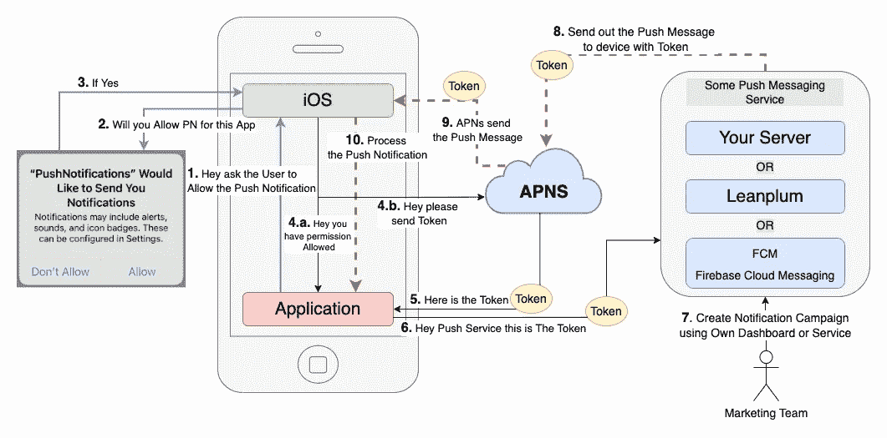

如何使用推送通知的高级概述

# 通知权限状态

推送通知许可有几种状态。您可以使用它来决定是否应该向他们显示通知权限警报，或者通知您的后端用户拒绝或禁用了通知。

*   `notDetermined` —不询问用户权限
*   `denied` —向用户显示警报，但被拒绝
*   `authorized` —向用户显示警报并允许用户
*   `provisional` —不直接询问用户，但在代码中为该权限类型设置
*   `ephemeral` —该应用程序被授权在有限的时间内安排或接收通知。比如 **AppClip** 可以通过`Info.plist`中的一些配置来做到这一点。详情在下一个[环节](https://developer.apple.com/documentation/app_clips/enabling_notifications_in_app_clips)。


`ephemeral AppClip notification is enabled`

系统可以要求的代码示例。

# 推送通知

到目前为止，我们看到的所有带有本地通知的 UI 也可以应用于推送通知。唯一的区别是推送通知是远程触发的**并且必须经过 APN。**

**考虑到配置，首先我们需要在 Xcode 中为项目启用推送通知。**

****

**在项目中设置推送通知**

**注册部分与本地通知几乎相同。其实我们会用和上面`requestAuthorization(options:)`一样的方法。不同的是，现在我们也要调用**

```
UIApplication.shared.registerForRemoteNotifications()
```

**我们可以看到这只是几行代码的不同**

**这将触发`application(_:didRegisterForRemoteNotificationsWithDeviceToken:)`，令牌将被接收。或者在失败的情况下`application(_:didFailToRegisterForRemoteNotificationsWithError:)`。**

**令牌看起来是这样的:
`9340516ea8a5ae6b149fa90c07efc1f738b2b0d38463cd326858921fc0d93a91`**

**由于 APN 是我们获取**远程通知令牌**的中心点，有时防火墙不想通过。尤其是在无线的情况下。至少这是我的经验和假设。重置 wifi、路由器或切换到蜂窝连接会有所帮助。
另外，请记住这是一个异步过程。接收令牌可能需要一段时间，有时甚至需要几分钟。**

**令牌以数据形式被接收，并且可以被转换成人类可读的代码**

**我们应该将这个令牌发送到我们的服务器或第三方服务，我们或营销团队将使用它来创建推送消息。**

**有很多这样的第三方服务，如 [LeanPlum](https://www.leanplum.com/) 、 [CleverTap](https://clevertap.com/) 、 [OneSignal](https://onesignal.com/) 、 [Firebase Cloud Messaging](https://firebase.google.com/docs/cloud-messaging) 、[urban ium](https://www.airship.com/resources/explainer/push-notifications-explained/)等。它可以使集成变得更加容易。**

# **测试推送通知**

**如果你用的是模拟器，不用担心。有一种方法可以做到。**

**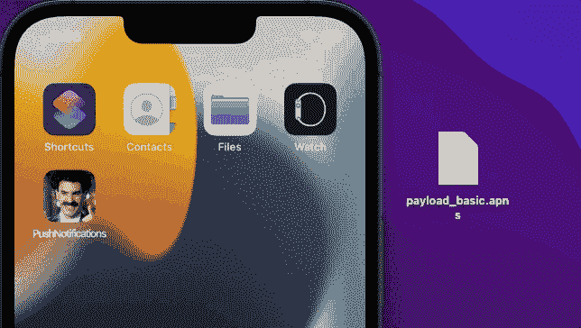**

**拖放。apns 文件到模拟器**

**首先，您需要一个扩展名为. apns 的文件，类似于`payload.apns`。它有一个类似 JSON 的结构。**

**Payload.apns 文件**

**您需要将 apns 文件中的`Simulator Target Bundle`值更改为您的应用包标识符。下图显示了如何找到它。**

****

**如何找到包标识符**

**apns 文件最常用的属性是:**

*   **`alert` - `title`，`subtitle`，`body`哪个不言自明**
*   **`badge` -红点的数量。**
*   **`sound` -播放默认声音的“`default`”字符串或捆绑包中的“my_sound.mp3”**
*   **`category` -这是决定本地通知部分动作按钮`categoryIdentifier`的字符串**
*   **`thread-id` -这是用于对消息进行分组的 id**
*   **`content-available` -这是后台通知标志。要执行静默后台更新，请指定值`1`，并且不要在有效负载中包含`alert`、`badge`或`sound`键—苹果公司**
*   **`mutable-content` -如果是`1`，则表示使用了服务 app 扩展。稍后，我将详细讲述这一点。**
*   **`interruption-level`——这是随着 iOS 15 的推出而来的。字符串值“`passive`”、“`active`”、“`time-sensitive`”或“`critical`”。**

**详细列表可在此[链接](https://developer.apple.com/documentation/usernotifications/setting_up_a_remote_notification_server/generating_a_remote_notification)找到。**

**一些属性例子**

**另一种方法是从终端测试推送通知。**

```
$ xcrun simctl push device_identifier com.example.yourApp payload.apns
```

**你需要更换`device_identifier` *。从下一张图中你可以看到如何找到这个值。***

**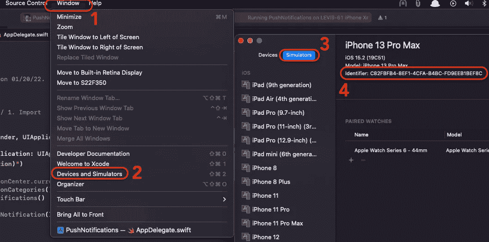**

***设备标识符***

**如果在有效载荷中有“模拟器目标包”，那么就不需要输入命令。如果您以正确的方式配置了该命令，那么类似于`“Notification sent to ‘com.example.myApp”`的内容将会在终端上弹出。**

# **无声推送通知**

**静默推送通知是没有提醒、UI 和声音的消息，可以在后台接收。为了能够使用静默推送通知，仅用`"content-available": 1`配置有效载荷是不够的。我们还需要配置应用程序。我们需要为**远程通知**启用**后台模式**。**

**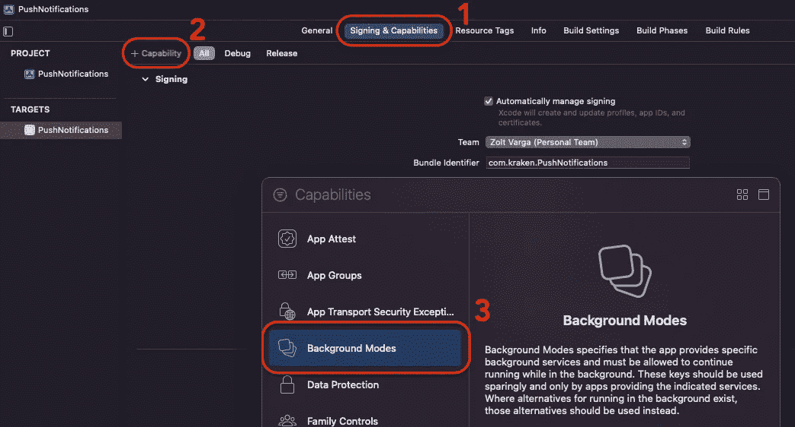**

**添加背景模式**

****

**后台模式:远程通知**

**静默推送通知不能包含任何`alert`、`title`、`body,`或`sound` 等。**

**静默推送通知有效负载**

**从实用的角度来看，静默推送通知用于发起一些后台获取 API 调用、启动一些更新、能够在后台执行任务等。它从后台唤醒应用程序。**

# **徽章计数**

**您可以在应用程序图标上设置带有数字的徽章，让用户知道需要他们的关注。这个应用有新的东西。**

**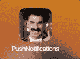**

**徽章计数**

**如果您没有自定义机制，那么最简单的方法就是重置它。为了在`AppDelegate`事件`applicationDidBecomeActive(_:)`(或者在 SceneDelegate 的情况下为`sceneDidBecomeActive(_:)`)中实现这一点，调用下一行代码:**

```
UIApplication.shared.applicationIconBadgeNumber = 0
```

# **富媒体(多媒体通知)**

**这是最好玩的部分。我们可以使用图像、视频、gif，或者创建一个`Custom UIView`。**

**推送通知的最大有效负载大小为 4KB。通过扩展，我们有机会拦截任何传入的推送通知并修改标题，解密任何加密数据，甚至下载媒体附件。**

**如果你不熟悉**扩展**，它们就像迷你应用程序，以某种方式与你的主应用程序连接，捆绑在里面。他们是你的应用程序的“看门人”。在推送通知的情况下，他们有机会在你的应用呈现推送通知之前做一些动作。**

**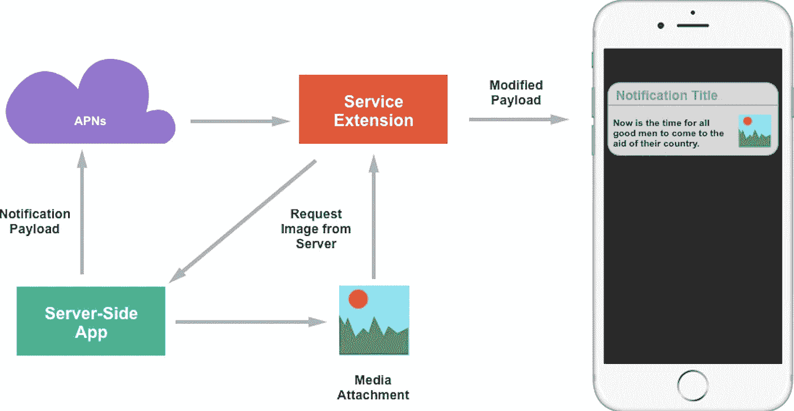**

**服务/内容扩展如何拦截微软的消息**

**有效负载内容的示例**

**如你所见`“mutable-content”: 1`表明这是一个富媒体类型的推送通知。**

# **通知服务扩展**

**在本文的开头，您可以看到一个带有视频(mp4)扩展的富媒体推送通知。下面你可以看到一张照片:**

**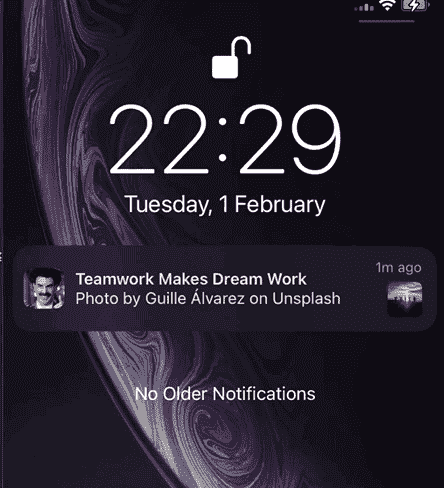**

**带照片的富媒体推送通知**

**在我们的例子中，**服务扩展**有机会下载一些图片、视频或 gif，这取决于有效载荷中的 URL。例如，操作系统给服务扩展一些时间来修改标题、正文，或者下载图像。如果您无法修改内容，它将回退到常规推送通知，使用有效负载中的原始内容。**

**要将 Notification Service 扩展添加到项目中，请转到“菜单”->“文件”->“新建”->“目标”。选择通知服务扩展，然后单击下一步按钮。**

**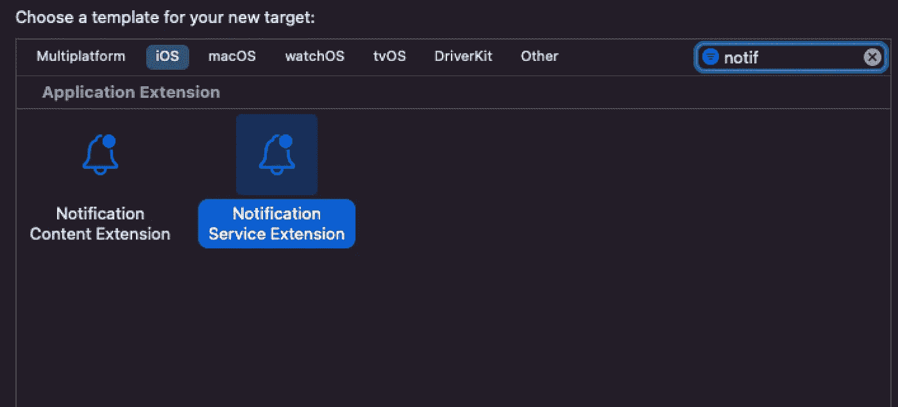**

**应用程序扩展**

****

**创建服务扩展:**组织标识符 vs 包标识符****

**查看组织标识符和捆绑包标识符。扩展标识符基于您的主应用程序目标包标识符，区别在于后缀。这样 iOS 就知道扩展是嵌入在哪个应用程序中的。**

**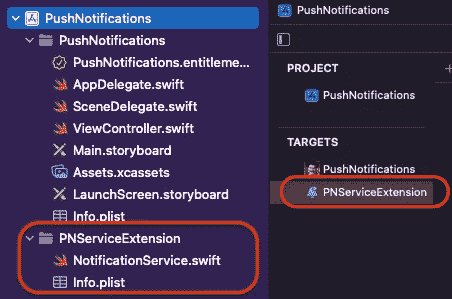**

**您已经创建了文件夹和目标**

**使用`didReceive(_ request:)`方法，我们可以捕捉和修改内容。
`serviceExtensionTimeWillExpire()`是一个后备选项，以防我们无法修改内容。例如，如果图像下载失败或花费太多时间。**

**基本通知服务代码**

**完整的代码可以在下一个[链接](https://github.com/skyspirit86/CompleteGuideOfMessages)中找到。**

**如何将多媒体资源添加到有效负载的示例**

**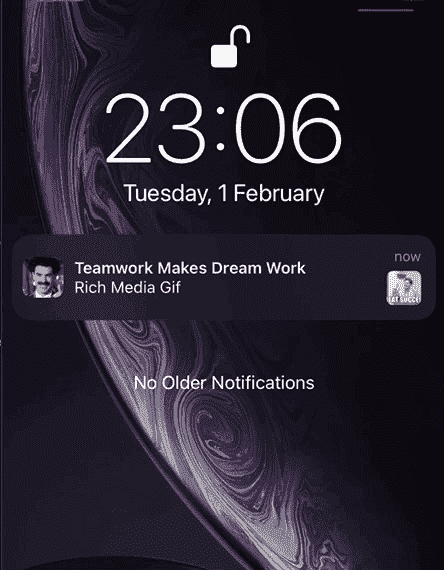**

**带有 gif 和动作按钮的富媒体推送通知**

**您可以看到富媒体也可以有操作按钮。您需要在服务扩展中注册它们。但是点击处理需要在应用程序中完成。在我们这里，在`AppDelegate`。**

**富媒体操作按钮**

# **通知内容扩展**

**内容扩展就是创建一个自定义视图。通知内容扩展使用了一个`NotificationViewController`，它是`UIViewController.`的子类，也创建在文件夹`storyboard`和`Info.plist`中。
设置类似于服务扩展。按照前面的步骤就可以了。**

**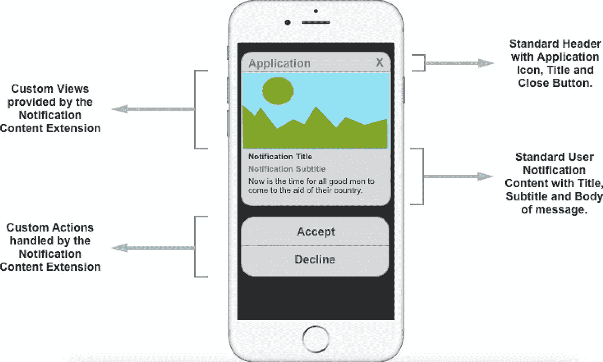**

**微软的内容扩展**

**下面你可以看到一个非常漂亮的自定义视图——一个包含多个图像、标题、副标题和按钮的旋转木马。每个图像可以有不同的文本。每张图片都可能有不同的深层链接。**

**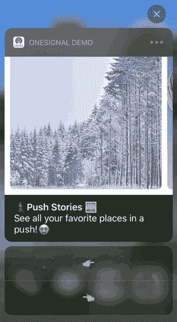**

**通过 OneSignal 使用轮播扩展内容**

**为了能够使用`Info.plist`中的内容扩展，在“category”键下找到需要添加到推送通知有效载荷中的`UNNotificationExtensionCategory`及其值。**

**这种通知甚至可以集成地图或任何框架。
当然要保持轻量化。**

****

**地图工具包的内容扩展**

**现在可能性几乎是无限的。**

# **证书**

**我将尝试简单地解释这一点，并将重点放在推送证书上。
转到[https://developer.apple.com/account/](https://developer.apple.com/account/)证书，标识符&配置文件。**

**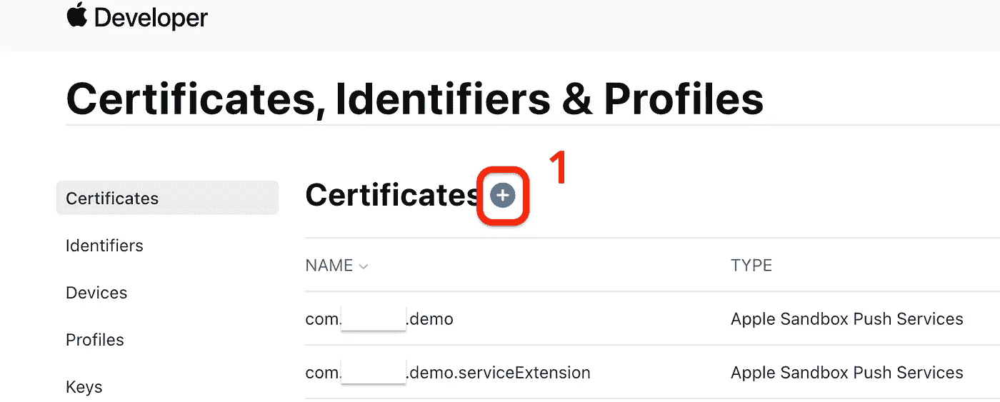**

*   **点击“+”号，苹果推送通知服务 SSL。**
*   **选择应用 ID(假设您已经创建了它)**
*   **下载`aps_xyz.cer`**
*   **双击它，转到`Keychain Access.app` (cmd + space 打开聚光灯，键入 Keyc…)**
*   **你应该看到苹果沙盒推送服务:com.example.demo(你的捆绑包 id)**
*   **右键单击**
*   **出口“苹果沙…”**
*   **保存. p12 文件。**

**后端通常会要求这个`.p12`文件，以便能够通过 APN 发送推送通知。但是更好的选择是创建一个`key /.p8`文件。**

****

**密钥文件**

# **小费**

**推送证书**一年后**到期，你必须每年在苹果开发者中心**更新**它们并**重新上传**新证书到你的推送提供商/后端。如果你有更多的应用程序，这个过程需要每年为每个应用程序做一次。p8 / key 文件适用于开发和生产环境中的所有应用，并且不会过期。**

# **工具**

**以下是能够在设备上轻松测试的工具:**

**[https://github.com/onmyway133/PushNotifications](https://github.com/onmyway133/PushNotifications)👈我的建议**

**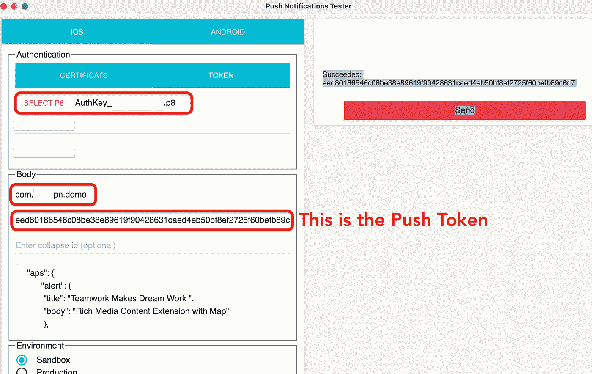**

**推送通知工具**

**https://github.com/noodlewerk/NWPusher**

# **结论**

**现在你知道了很多苹果命名的用户通知的事情。正如我所说的，我需要年复一年的时间来收集和学习所有的信息。有什么我可能感兴趣而不知道的，请随便说。**

**如果你到了这一步，感谢你的阅读。你应该得到一杯咖啡☕️.🙂如果你喜欢的内容，请👏，分享，还有[跟着](https://varga-zolt.medium.com/)，对我来说就意味着一个。如果您有一些建议或问题，请随时发表评论。**

****想要连接？**
你可以在 [LinkedIn](https://www.linkedin.com/in/varga-zolt/) 、 [Twitter](https://twitter.com/skyspirit86) 或[https://skyspiritlabs.com/](https://skyspiritlabs.com/)与我联系。还有更多文章和教程。**