# 单体设计模式完全指南

> 原文：<https://betterprogramming.pub/the-complete-guide-to-the-singleton-design-pattern-dd0e7a5a4dc>

## 将类的实例化限制为单个实例

照片由 [Arisa Chattasa](https://unsplash.com/@golfarisa?utm_source=unsplash&utm_medium=referral&utm_content=creditCopyText) 在 [Unsplash](https://unsplash.com/s/photos/one?utm_source=unsplash&utm_medium=referral&utm_content=creditCopyText) 上拍摄

原著《设计模式:可重用面向对象软件的元素》中描述了 23 种经典的设计模式。这些模式为软件开发中经常出现的特定问题提供了解决方案。

在这篇文章中，我将描述单例模式，以及如何和何时应用它。

# 单例模式:基本思想

> 在软件工程中，单例模式是一种软件设计模式，它将一个类的实例化限制为一个“单个”实例。当只需要一个对象来协调整个系统的动作时，这很有用。这个术语来源于独生子女的数学概念。—维基百科
> 
> "确保一个类只有一个实例，并提供一个全局的访问点."—设计模式:可重用面向对象软件的元素

这种模式的主要特点是每个类中只有一个对象被实例化。此外，还为类创建了一个入口点，通常使用一个访问器方法，比如`getInstance`。

总而言之，对象适配器(又名 singleton)包含它所包装的类的一个实例。这个模式的 UML 图如下所示:

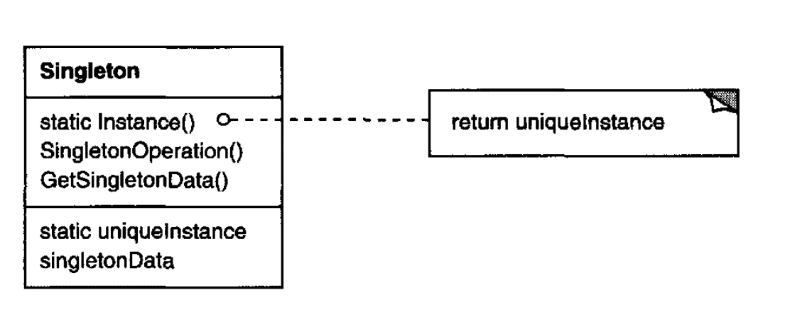

`Singleton`类是一个单独的类，它有一个名为`uniqueInstance`的属性，用来存储`Singleton`类的一个实例。类构造函数是私有的，你只能通过一个访问器方法访问实例，这个方法可能是`getInstance`。

访问器方法负责在存在单个实例的情况下返回该实例，或者在尚未实例化该实例的情况下实例化该实例。

在下列情况下，应该使用单例模式:

*   一个类必须有一个实例，并且这个类必须可以被客户端从它们知道的访问点访问。
*   singleton 类可以通过继承来扩展，客户端必须能够使用扩展的类，而无需对其进行任何更改。

单例模式有几个优点，总结如下:

*   您可以严格控制客户端访问单例实例的方式和时间。您可以控制访问，因为 singleton 类封装了它的实例。
*   当我们需要限制从一个类创建的实例的数量以节省系统资源时，这是很有用的。
*   单例模式是对全局变量的改进，因为它避免了用只存储单例实例的全局变量污染名称空间。
*   代码更容易使用、理解和测试，因为单例简化了代码。

我现在将向您展示如何使用 JavaScript/TypeScript 实现这种模式。在我们的例子中，我虚构了一个问题，其中有一个名为`DatabaseConnection`的类定义了两个属性:`configuration`和`getUniqueIdentificator`。这个类是到我们数据库的连接。`DatabaseConnection`由多个客户端使用(`client1`和`client2`)。下面的 UML 图显示了我刚刚描述的场景。

`client`代码如下:

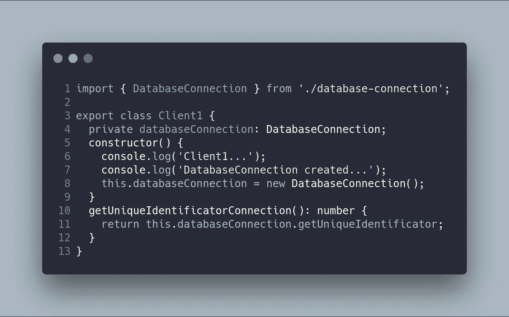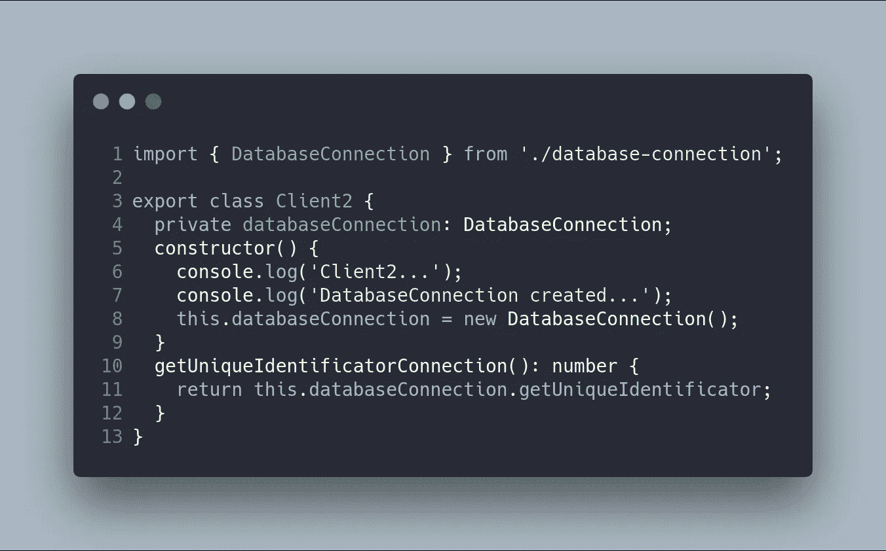

每个客户端创建一个到数据库的新连接，并请求每个连接的唯一标识符。这种体系结构的一个主要后果是使用了过多的资源。

`DatabaseConnection`类如下:

在前面的类中，可以看到数据库配置中只有一个私有属性可用，唯一标识符是使用公共属性访问的。

最后，该交互的示例代码如下:

获得的结果如下图所示:

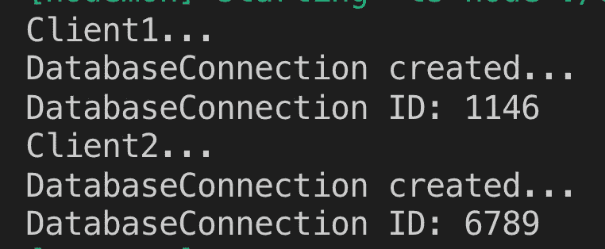

如您所见，当数据库的每个实例执行的任务完全相同时，它们都有唯一的标识符(因为它们是不同的实例)。事实上，最聪明的方法是用一个实例来建立连接。

解决方案是使用单例模式，它只创建该类的一个实例。使用适配器模式的新 UML 图如下所示:

与`DatabaseConnection`相关的代码如下:

对实例的唯一访问点是使用`getDatabaseConnection`静态方法，它将在实例不存在的情况下创建一个新实例，或者它将获得它。通过这种方式，客户端稍加修改即可使用该实例，而不是创建自己的实例:

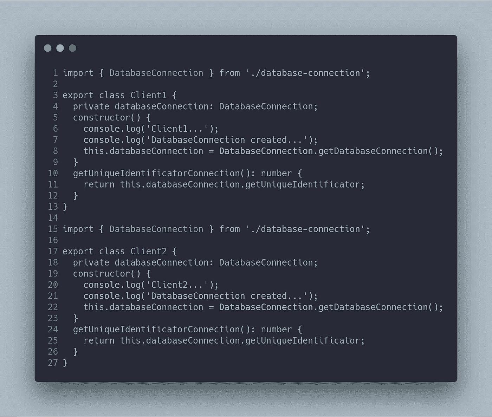

在程序执行过程中进行这些修改后的结果如下图所示:

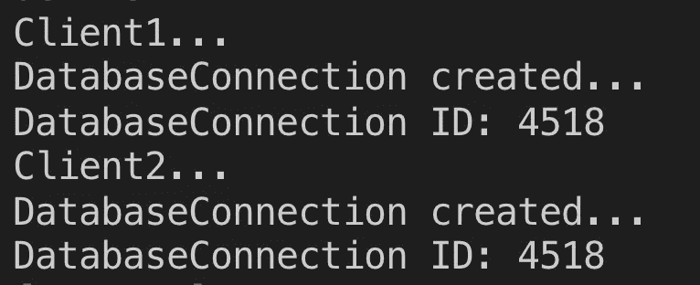

我已经创建了两个 npm 脚本，在应用了 singleton 模式后，它们运行这里显示的两个例子。

`npm run example1-problem`
`npm run example1-singleton-solution1`

使用单例模式解决的另一个有趣的例子是当有几个类必须是单例的时候。比如蜘蛛侠、蝙蝠侠等一组英雄都是单身。在下面的 UML 图中，您可以看到这种情况:

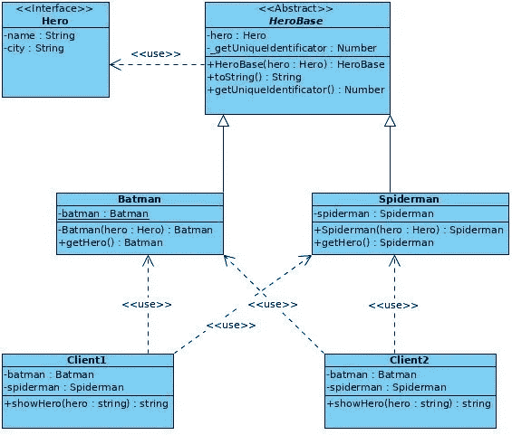

与客户端相关的代码如下:

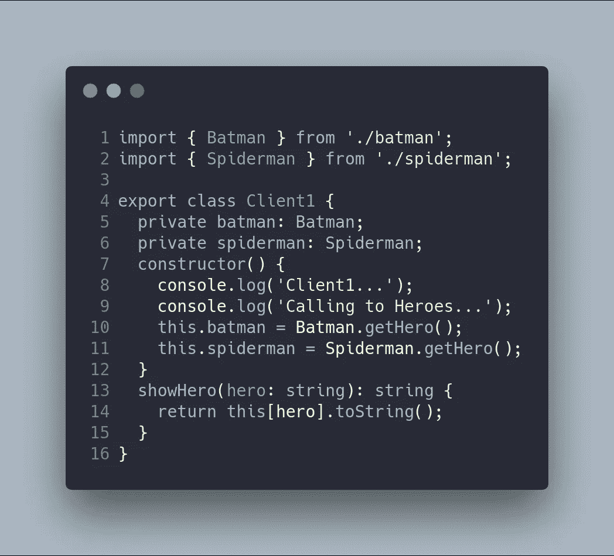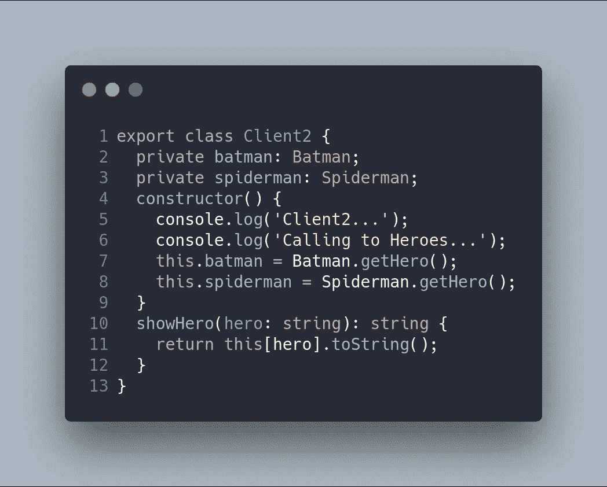

接下来，我们将创造我们的英雄，这将是独一无二的。首先，我们将为它们各自包含的信息定义一个公共接口:

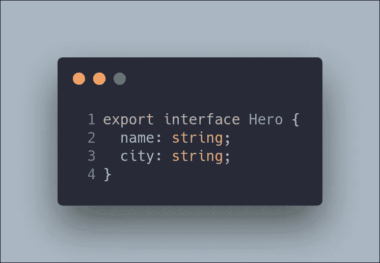

我们的英雄是独一无二的，但是有着共同的属性和方法。为此，我们定义了一个名为`HeroBase`的父类，它包含了`Spiderman`和`Batman`的共同特征。这个类如下:

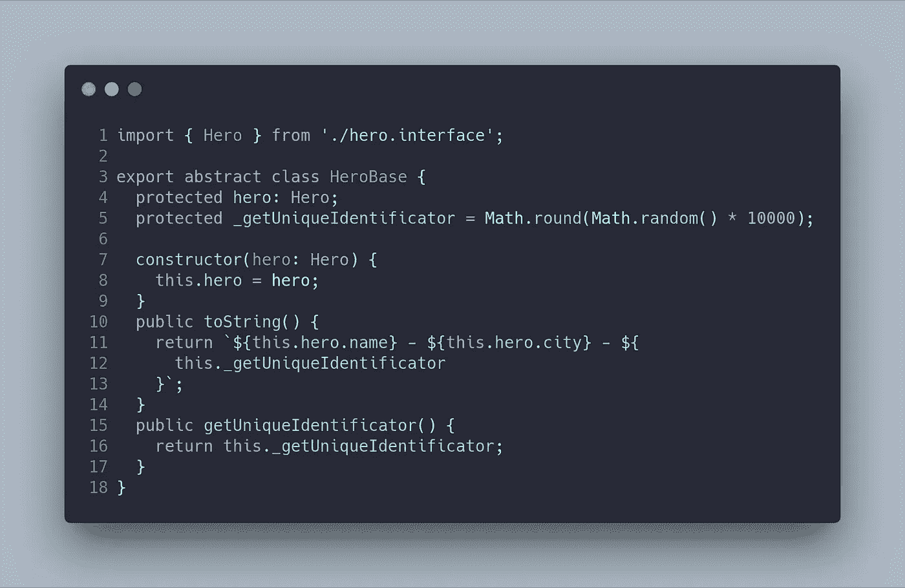

蝙蝠侠和蜘蛛侠都在他们的构造中实现了单例模式，并存储了对每个类的唯一对象的引用(我们的英雄！).这些类别如下:

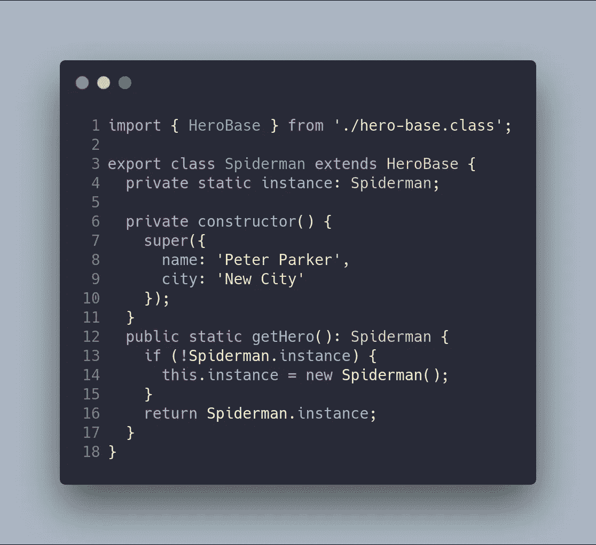

最后，该交互的示例代码如下:

获得的结果如下图所示:

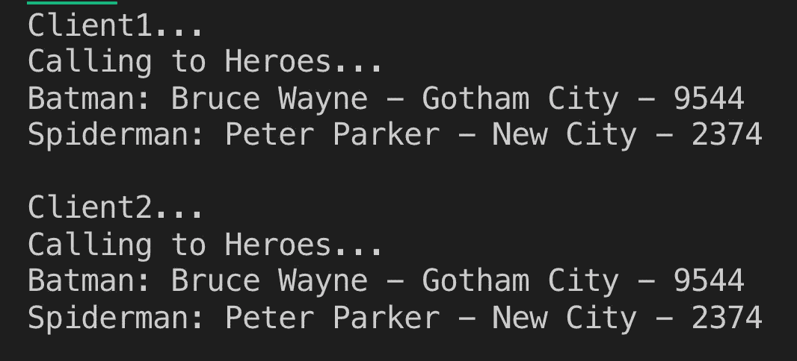

我已经创建了一个 npm 脚本，它在应用了 singleton 模式后运行这里显示的示例。

`npm run example2-singleton-solution1`

# 结论

单例模式可以避免项目的复杂性，因为您可以在客户熟知的单点上严格控制类的实例化。此外，这是一种节省系统资源的模式，因为不用实例化一组执行相同任务的类，而是使用该类的单个实例。然而，这种模式名声很差，甚至被认为是反模式，因为它创建了可以从代码的任何地方访问和更改的全局变量。

最重要的事情不是实现我向你展示的模式，而是认识到这个特定模式可以解决的问题，并且知道你什么时候可以或者不可以实现它。这一点至关重要，因为实现会因您使用的编程语言而异。

# 参考

*   [《设计模式:可重用面向对象软件的元素》，伽马、赫尔姆、约翰逊、&弗利塞德斯、艾迪森·韦斯利，1995](https://www.amazon.com/Design-Patterns-Object-Oriented-professional-computing/dp/0201633612)
*   [单例模式——维基百科](https://en.wikipedia.org/wiki/Singleton_pattern)
*   [https://www . do factory . com/JavaScript/singleton-design-pattern](https://www.dofactory.com/javascript/singleton-design-pattern)
*   [https://github . com/sohamkamani/JavaScript-design-patterns-for-humans #-singleton](https://github.com/sohamkamani/javascript-design-patterns-for-humans#-singleton)

*   这个帖子的 GitHub 分支是[https://GitHub . com/Caballerog/blog/tree/master/singleton-pattern](https://github.com/Caballerog/blog/tree/master/singleton-pattern)