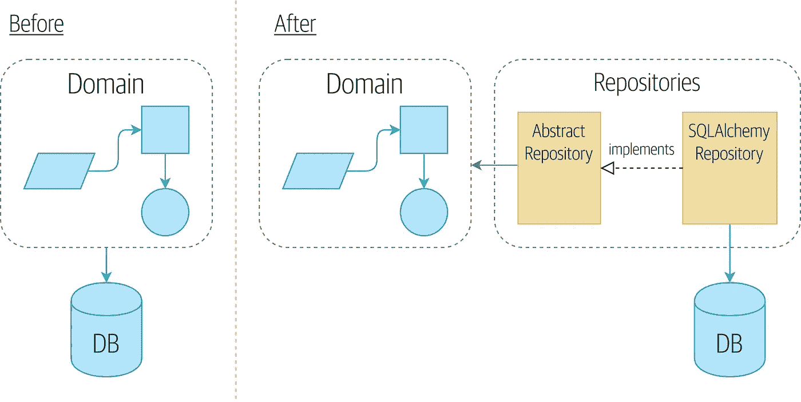

# 数据库不是最重要的部分

> 原文：<https://betterprogramming.pub/the-database-is-not-the-most-important-part-b87d8af01959>

## 这一事实改变了游戏规则


山姆·巴伯在 [Unsplash](https://unsplash.com/collections/10619558/inversion?utm_source=unsplash&utm_medium=referral&utm_content=creditCopyText) 上拍摄的照片|图像高度被更改

# Python Web 开发中的依赖倒置原则

在你职业生涯的最初几年，你可能会犯和我一样的错误。您认为数据库是系统中最重要的部分。在我了解了软件架构之后，发现数据库并不重要。这对我来说也有点令人震惊，我花了一段时间才被说服。让我解释一下为什么，然后你自己决定。

在软件架构中，一些被称为可靠设计原则的原则是由 Robert C. Martin 提出的。它们是面向对象软件开发中一些最著名的设计原则。SOLID 是以下五个原则的首字母缩写词:

*   单一责任原则
*   开/关原则
*   利斯科夫替代原理
*   界面分离原理
*   从属倒置原则

最后一个是本文我们感兴趣的。在设计一个软件系统的时候，最重要的是领域。领域是你试图解决的问题的一个奇特的词。领域规则是真实世界的规则。它们与任何 web 服务器、web 框架或数据库都没有关系。如果你不熟悉这些概念，看看罗伯特·c·马丁的文章[。](http://blog.cleancoder.com/uncle-bob/2016/01/04/ALittleArchitecture.html)

让我们思考一下我们通常是如何设计一个 web 项目的。我们觉得必须做的第一件事是决定 web 框架、web 服务器和数据库。然后，我们将域转移到已经做出这些决定的代码中。现在，每当我们必须考虑业务需求时，我们的决策都会受到限制。如果你经常在 Django 中搜索如何做到这一点，在 Postgres 中如何实现这一点，等等。这意味着你可能做决定太早了。

> 依我看，首先选择 web 框架或数据库就像设计一辆汽车，如果它是织物或皮革，而不是首先处理像引擎或设计这样最重要的部分，那么处理内部是一样的。一个好的软件架构最大限度地增加了未决策的数量。

好吧，让我们推迟对数据库的决定，但是怎么做呢？当你安装包含电池风格的 web 框架时，它需要一个数据库来运行 web 服务器。有时它也会用 SQLite 之类的东西为您配置一个。在这里，您应该知道一些概念，如高级模块、低级模块和抽象。

高级模块通常是你自己写的解决问题的代码。它们包含应用程序的重要策略决策和业务模型——应用程序的身份。

另一方面，低级模块像数据库一样与外部依赖项通信。它们包含实现业务模型所需的各个机制的详细实现。

抽象用于隐藏背景细节或任何不必要的数据实现，以便用户只看到所需的信息。

您的域不应该依赖于您的数据是存储在 SQL 还是 NoSQL 数据库中。它也不应该依赖于数据存储在数据库而不是`FileSystem`中的事实。该域只关心这些数据是否保存在永久存储器中，并且在需要时可以从外部访问。

> 较高级别的模块不应该依赖于较低级别的模块。两者都应该依赖于抽象。
> 
> 数据库仅仅是一个 IO 设备。它恰好提供了一些用于排序、查询和报告的有用工具，但这些都是系统架构的辅助工具。[罗伯特·马丁](http://blog.cleancoder.com/uncle-bob/2016/01/04/ALittleArchitecture.html)

为了实现这一切，聪明的软件工程师创造了像存储库模式和依赖注入这样的模式和技术。让我们来看看这两个人的表现。

# 依赖注入

依赖注入是给一个对象它的实例变量。我们将这些变量交给实例，并通过抽象(接口)使实例与其依赖项进行通信，而不是自己构造它们。

让我们看看一些没有依赖注入的代码:

检查上面的简单代码，它向远程服务器发出 HTTP 请求，通过提供保存所有数据的`file_url`来创建新的作业。如果我们在这里应用依赖倒置原则，我们的函数不应该知道文件被上传到 S3。毕竟，对于我们的函数来说，唯一有趣的部分是，在我们发出请求之前，文件已经被上传到了某个地方，并且我们已经取回了`file_url`。

让我们在这里应用依赖倒置原则。

```
def create_new_job(data, blob_storage_client: BlobStorageClient):
    file_url = blob_storage_client.save_data(data)
    return requests.post(
        url='some_url',
        json={'file_url': file_url}
    )
```

我们没有直接导入 S3Client 并在函数内部初始化它，而是把它作为一个参数。注意`blob_storage_client`的输入创建了一个接口:

```
class BlobStorageClient(ABC): @abstractmethod
        def save_data(self, data) -> str:
            raise NotImplementedError()
```

简单地说，这是 Python 中的一个抽象类，带有一个名为`save_data`的抽象方法。现在我们的 S3Client 将实现这个接口。

我们已经为 S3 服务实现了`BlobStorageClient`。需要记住的是，在一个接口的实现中，让代码依赖于像 boto3 这样的第三方是没有问题的。

现在，当您运行`create_new_job`函数时，您创建了一个 s3client，并将其作为参数提供给函数。

```
s3client = S3Client()
create_new_job(data='some-data', blob_storage_client=s3client)
```

# 测试

明显的好处是可测试性、单一责任、模块化等。让我向您展示这是如何帮助简化可测试性的。通常情况下，当你测试`create_new_job`时，你不会想攻击 S3 服务。您可以做的第一件事是模拟 boto3 方法。这很容易做到，但是我认为嘲笑每一个独立的依赖会在你的测试中产生代码味道。

通过实现我们的模式和原则，我们可以在测试时利用不同的技术来处理第三方。我们可以注入假的实现。

我们可以实现另一个`BlobStorageClient`如下:

```
class TestBlobStorageClient(BlobStorageClient):
    is_called = False def save_data(self, data):
        self.is_called = True
```

当我们测试时，我们可以注入这个测试客户端，而不是注入 s3 客户端:

```
def test_create_new_job():
    test_client = TestBlobStorageClient()
    create_new_job('some-data', test_client)

    assert test_client.is_called
```

在这里，我想向你展示如果应用正确，这个原则最重要的好处。如果你想更深入的测试，有一篇文章我详细的讲过[这里](https://medium.com/@klementomeri/path-to-tight-sleep-with-test-automation-81916b567745)。

现在，让我们对数据库做同样的事情。不是领域模型依赖于数据库，而是数据库必须依赖于我们的领域模型。我们将颠倒依赖关系，为了实现这一点，我们将引入存储库模式。

# 知识库模式

存储库是封装了访问数据源所需的逻辑的类或组件。简而言之，存储库负责与数据库或您拥有的任何持久性存储解决方案进行通信。您不是直接与数据库通信，而是通过模式存储库对其进行抽象。

假设您经常需要通过用户名来获取一些用户。现在，您要做的第一件事可能是安装和配置一个 ORM 并查询用户。SQLAlchemy 的一个例子:

```
def get_user_by_username(username: str) -> User | None:
    stmt = select(User).where(User.username == username)
    user = session.execute(stmt).scalars().first()

    return user
```

该代码的问题是，可能在某些业务逻辑中，您将调用该函数，这将创建从域到数据库的直接依赖关系。我们不希望这种情况发生。我们希望我们的软件系统独立于基础设施。软件系统是我们的业务，我们不希望我们的业务受到外部依赖的影响。



[前后储存库模式](https://www.cosmicpython.com/book/chapter_02_repository.html)

在一个经典的或者框架驱动的方法中，你经常会遇到类似于之前图像的情况。在那种情况下，你直接从你的域访问数据库(对于域驱动的设计，请阅读[这一](https://www.cosmicpython.com/book/chapter_01_domain_model.html)部分)。

在这种情况下，您的领域层必须知道数据库的存在、数据库的类型以及与之通信的方式。领域层将导入数据库表、ORM 和/或数据库客户机来执行原始查询。这就产生了大量的依赖性和问题。

为了避免这种情况，软件工程中有一个简单的规则。软件工程中的大多数问题都可以通过增加一个抽象层来解决。

存储库模式只不过是对数据库的抽象。这种模式使得您拥有的数据库对于您的领域层来说无足轻重。毕竟，域层不应该担心数据库。如果你现在还不明白，可以这样想:

领域就是你要解决的问题。这纯粹是商业逻辑。如果你正在创建一个加密交易应用，你的领域就是交易、跟踪价格、下单等。这不是在 Postgres 或 MongoDB 中保存交易。你应该把你的领域想象成一个软件工程的局外人。

就像领域专家会做的那样。领域专家不关心您的数据库首选项是关系数据库。他们只关心每一笔交易都保存在安全的地方，以后还可以找回。你的领域层应该是同样的方式。它应该只知道在某个地方有持久存储，可以用来检索保存的数据或保存新数据。

好吧，如何实现这种间接性？应用存储库模式。

最初，我们应该创建一个类，其中包含我们需要对特定域实体的数据库执行的所有操作。每个实体都有一个存储库总是更好。这样，你就可以让它们变得小而简单。让我们用 SQLAlchemy 为 Python 中的`User`实体做一个。(该概念适用于所有语言和框架。)

```
class UserRepo: def __init__(self, session):
        self.session = session
```

我们创建了一个在构造函数中接受 SQLAlchemy 会话的类。现在，我们将使用该会话来访问数据库。

```
class UserRepo: def __init__(self, session):
        self.session = session def get_by_username(self, username: str) -> User | None:
        return self.session.query(User).filter_by(
            username=username).first()
```

我们添加了`get_by_username`方法。非常简单。现在，每当我需要通过用户名获取用户时，我都需要导入该存储库，通过提供会话创建一个实例，并使用该方法。

```
repo = UserRepo(session)
user = repo.get_by_username('klement')
```

现在最终解决这个难题的是领域模型。您可以注意到，`get_by_username`方法返回了一个`User`实例或`None`。现在这个领域模型仅仅是我们特定问题中实体的代表。让我们看一些不同框架如何定义领域模型的例子。

在 SQLAlchemy 中，如果您遵循通常的教程，域模型可以编写如下:

```
class User(Base):
    id = Column(UUID(as_uuid=True), primary_key=True)
    username = Column(String(50), unique=True, nullable=False)
    first_name = Column(String(150))
    last_name = Column(String(150))
    email = Column(String(255))
    is_active = Column(Boolean, nullable=False)
    date_joined = Column(DateTime, nullable=False)
    last_login = Column(DateTime)
```

这个域模型充满了 ORM 依赖；你甚至不需要了解 SQLAlchemy 就能理解这一点。

如果我们检查 Django 的一个例子，看起来是这样的:

那个更糟糕。在 Django 中，也使用模板中的模型，在模板的`Fields`中有一些配置，如空白选项或`help_text`等。决定一个输入下的帮助文本的领域模型太多了。这应该是表示层的责任，而不是领域。

# 应用依赖倒置原则

如果我们在 SQLAlchemy 的帮助下应用 DIP，结果将是:

这样，ORM 依赖于我们的域模型，这是一个纯 Python 类，没有任何外部依赖性。当我们调用`start_mappers`时，SQLAlchemy 会像`__table__`一样将一些私有属性附加到`User`类，因此当您在 SQLAlchemy 会话的查询中使用它时，它知道这个类表示数据库中的用户表。

所有与`User`实体相关的业务逻辑都将进入`User`类。将使用多个实体的业务逻辑将放入`Services`或用例中，这取决于您决定使用什么。重要的是，现在我们已经颠倒了依赖性。数据库现在依赖于我们的领域模型，而不是相反。

随着时间的推移，当项目变得越来越大、越来越复杂时，依赖倒置原则的缺失会导致严重的架构问题。对于中小型项目，像 Django 这样的框架或任何其他框架都可以很好地完成这项工作。你甚至不需要担心这些话题。

如果您发现自己处于这样一个位置，您的业务团队告诉您对您的模型进行一些重大的更改，并且您发现自己受到数据库的约束，那么您可能在您的架构上犯了一个错误。领域应该用纯 Python，Java，C#，或者任何你喜欢的语言来编写，它应该是一切所依赖的，而不是相反。您应该尽可能将现实世界的问题反映到代码中，而不用担心外部依赖性。

> "一个好的软件架构可以最大化未决策的数量." *—罗伯特·马丁*

虽然你可以严谨地遵循很多架构，但是没有完美的架构这种东西。你不可能知道什么是完美的。你可以尝试，迭代，在每次迭代中让你的软件变得更好。重要的是遵循我们谈过的原则，不要违反规则，除非你有充分的理由这样做。

# 参考

更多关于坚实的原则:[罗伯特·c·马丁的清洁编码博客](https://blog.cleancoder.com/)

Python 中应用的模式和技术:[宇宙 Python](https://www.cosmicpython.com/)

[微软关于存储库模式的优秀文章](https://docs.microsoft.com/en-us/dotnet/architecture/microservices/microservice-ddd-cqrs-patterns/infrastructure-persistence-layer-design)