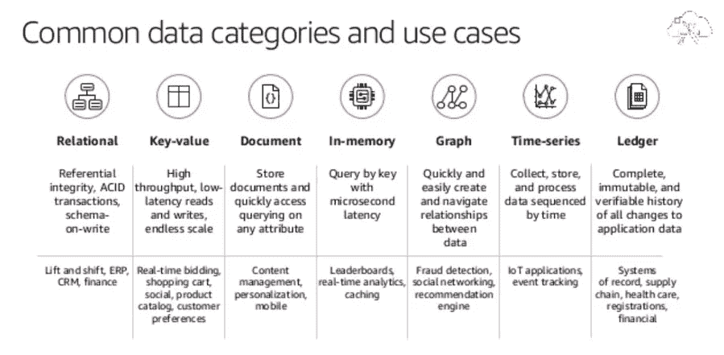
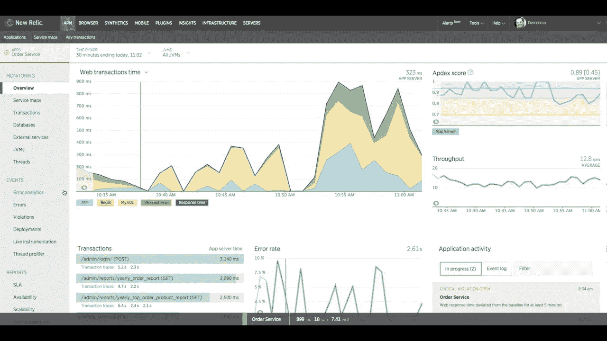

# 构建新服务的权威指南

> 原文：<https://betterprogramming.pub/the-definitive-guide-to-building-a-new-service-452867aac523>

## 再也不用担心忘记新服务的关键要素了


照片由[戴恩·托普金](https://unsplash.com/@dtopkin1?utm_source=medium&utm_medium=referral)在 [Unsplash](https://unsplash.com?utm_source=medium&utm_medium=referral) 上拍摄

我还没见过哪个工程师不为构建新服务的前景感到兴奋的。从事绿地项目是令人兴奋的，有无限的可能性——而且通常有很多自由。

然而，当你开始一项新的服务时，你从哪里开始呢？您如何确保已经涵盖了所有内容？

我已经整理了一份清单，列出了您需要考虑的关键事项、需要做出的决定，以及一些对您下次构建新服务有帮助的建议。它大致按时间顺序排列，带我们经历整个旅程——从规划到看到您的新服务在生产中运行。

# 入门指南

在我们深入细节之前，我们首先需要摆正心态，提前做好*一些*规划。这一阶段对服务的成功至关重要，尤其是对新服务的长期健康发展至关重要，因为在这一阶段做出的一些决定在以后撤销或更改的代价可能会很高。

## 同意范围

在任何形式的设计工作之前，我们必须首先确保我们了解我们被要求建造什么。这听起来很傻，但是我曾经看到过这样的情况，当一个特性丢失时，询问结果是非常不清楚的，导致将来的问题，或者在一个特别糟糕的情况下，交付的服务甚至不符合目的！

这可以采取多种形式，取决于你的公司利用什么过程，但是沿着[业务需求文档](https://www.wrike.com/blog/how-write-business-requirements-document/#What-is-a-business-requirements-document-BRD)的路线是完美的。只要它详细描述了项目的目标、成功的标准和利益相关者，以什么样的形式举行并不重要。如果你的公司没有这方面的正式流程，我建议与你的产品经理(或类似人员)和利益相关者合作，在某个地方定义这些流程。

## 领域建模

一旦我们知道我们的需求是什么，考虑领域建模是很重要的。这是将项目中的每个人互相介绍，并合作构建领域模型的好时机。这样做将允许每个人说相同的无处不在的语言，以及潜在地发现任何未回答的问题或被忽略的事情。

这并不适用于每一项新的服务，尤其是如果你在一个已经定义好的空间里运营的话。然而，如果你正在进入一个新的领域，我强烈建议至少做一些光域建模(越多越好！).

互联网上有大量关于领域驱动设计的信息，[这篇文章](https://martinfowler.com/bliki/DomainDrivenDesign.html)是一个很好的介绍。沃恩·弗农的 [*实现领域驱动设计*](https://www.amazon.co.uk/Implementing-Domain-Driven-Design-Vaughn-Vernon/dp/0321834577/ref=asc_df_0321834577/) *的书*也是关于这个主题的极好资源。

## 尖峰未知数

你或任何人都不可能知道每个问题的解决方案，或了解每项技术是如何工作的。这就是扣球非常有用的原因。尖峰是一种限时的技术调查，其结果是了解任何未知情况。

例如，您不确定要在哪里存储应用程序的一些数据。随机选择一个，或者猜测，不是一个可行的选择——所以，相反，放弃它。然后，您可以编写将被丢弃的临时代码，以快速原型化不同的存储解决方案，从而让您在高峰结束时做出明智的决定。

## 心态

最后，对于这一部分，在我们开始架构之前，我发现采用某种心态是有帮助的，这是我多年来发展的一些关键考虑。

首先，试着确保你做的任何决定都不会让你陷入困境——在项目的任何阶段。有些是不可避免的，比如选择编程语言。不过，在很大程度上，你可以通过良好的工程实践来避免陷入困境。

一个经常浮现在脑海中的想法是从你的服务核心中抽象出细节。例如，确保核心业务逻辑不会耦合到数据库，如果您将来需要，允许您(相对)容易且廉价地更改该数据库。

其次，根据你现在所知道的来做决定。没有必要去预测遥远的未来，你最终只会建造你可能不需要的东西。同样，仔细考虑这项新服务将如何使用，包括它可能接收多少流量。

每个人都希望自己的公司成为下一个脸书，但你可能不是脸书，所以你不需要他们使用的复杂架构和技术。回顾前面的观点，假设你没有把自己逼入绝境，可伸缩性问题通常是一个好问题。然而，如果您目前没有理由相信这些规模问题会成为现实，那么投资时间来扩展您的服务远远超出其需求纯粹是浪费。

# 体系结构

现在我们知道我们正在解决什么问题，并且(希望)有一个领域模型，我们可以开始架构了！

## 定义责任

首先，我们必须定义我们的新服务负责什么。虽然单一责任原则因其用于类而闻名，但同样的原则也可以应用于服务！责任会大得多(例如，您的服务可能负责订单或推荐)，但它确实帮助我工作过的团队确定了服务的范围。

这将在开发期间和将来有所帮助，并且会引发诸如“这属于这个服务吗？”。在这一点上，如果明确定义了责任，这应该是一个相对简单的问题来回答。

## 沟通风格

您的新服务将如何与企业中的其他服务进行通信？

简而言之，这是同步和异步通信(或者两者的混合)之间的决定。尽早决定这一点很重要，因为这将影响以后的许多决策，特别是因为您需要与其他团队合作来集成他们的服务。虽然以后改变服务之间的通信是可行的，但这将更加困难，因为你不仅需要使用团队的时间来进行这种改变，还需要让其他团队也同意使用他们的时间——这并不总是一项容易的任务。

如何在这两种风格之间做出选择本身就是一个话题，幸运的是微软在这里有一个很好的概述。

## 利用 C4 模式

[C4 模型](https://c4model.com/)是一种对系统架构建模的技术。我个人认为最好的方法是设计一个新系统的文档，并提供一个方便的方法与他人分享和讨论架构。

我已经在下面的文章中详细介绍了 C4 模型，但是在较高的层次上，它允许您在不同的层次上获得架构的视图。

[](/a-beginners-guide-to-drawing-technical-diagrams-fb0c97fdbc5e) [## 绘制技术图表的初学者指南

### 介绍了几乎涵盖所有场景的四个常见图表

better 编程. pub](/a-beginners-guide-to-drawing-technical-diagrams-fb0c97fdbc5e) 

它从*上下文*开始，它只是展示了新系统，用户如何与它交互，以及它如何与企业中的任何其他系统交互。下一层是*容器*层，详细描述了每个可部署的单元，因此您可以看到诸如数据库和消息队列之类的东西。最后是*组件*层，它详细描述了每个*容器*中的主要组件，比如控制器和密钥名称空间。还有最后一个层次， *Code* ，它深入到各个类中，但是这通常是多余的，并且是尝试和维护的一个噩梦，所以通常会忽略它。

您不需要一次完成整个 C4 模型，事实上，我建议您先完成上下文层次，然后在下一节做出决定后再回来完成其他两个层次。

## 选择语言和框架

可以说，选择语言和框架是您将做出的最重要的决定之一。为什么？因为这是最昂贵的改变之一，因为你实质上是在重写你的整个服务。

您的企业中可能已经至少有一个服务，在这种情况下，最好的想法是选择您(和您的工程师)已经知道的。当然，也有例外，您现有的堆栈可能不再满足您的需求，要么是因为它的性能不够好，您在使用该堆栈时遇到了问题，要么是因为它是一个不再受广泛支持或难以聘请工程师的旧堆栈。

如果你在为一家初创公司工作，我个人会选择一个受欢迎的、得到良好支持的、有活跃的开源社区的、市场上有大量工程师的堆栈。在撰写本文时，我个人倾向于在。NET 核心框架，因为它符合上面所有的条件。

## 数据存储

我对数据存储的建议与语言和框架略有不同。虽然应该对您正在利用的现有数据存储解决方案给予一定的重视，但如果您使用的现有技术不能满足您的使用案例，那么选择新技术实际上更为重要。我所看到的存储在 MongoDB 等解决方案中的关系数据量非常惊人，因为 MongoDB 已经在公司内部使用。

以下是我在选择数据存储解决方案时的主要考虑因素:

*   你在存储什么样的数据？它是关系的还是非关系的(例如文档)？
*   您存储了多少数据？
*   您的数据访问模式是什么样的？(例如，您的服务是读负载还是写负载？)
*   您存储的数据的敏感程度如何？(即存储信用卡详细信息需要比用户偏好更严格的安全性)

这本身就是一个完整的主题，所以我推荐阅读 AWS 的这篇[文章&视频，它很好地概述了基于大量用例和因素选择什么数据存储。如果您不使用 AWS 也没关系，该建议适用于任何云提供商(甚至使用直接来自供应商的产品)。](https://aws.amazon.com/startups/start-building/how-to-choose-a-database/)



图片来源:AWS

上述的一个关键考虑因素是您存储了多少数据？我曾经犯了一个错误，忽略了这个元素，导致服务推出后不久就表现不佳。这是另一篇文章的内容，但简而言之，我们选择了 MongoDB，但文档大小的增长比预期的要快得多，以至于我们看到了数据反序列化的问题，导致我们的流程对大型文档的每个请求花费了 30 秒以上。

这个问题意味着我们必须迅速重新设计我们存储和查询数据的方式，这最终影响了我们下一个项目的交付时间表。

我的建议是，根据估计的数量创建一个简单的电子表格，并根据该数量进行性能测试，以确保在不久的将来不会遇到任何问题。

## 其他外部服务

大多数服务通常都有某种形式的数据存储，此外，越来越多的服务也需要其他外部服务。

我从事的大多数服务都以某种方式与消息总线交互，典型的是 Kafka。如果您选择的通信方式主要是异步的，我强烈推荐 Kafka，因为它易于使用，并且有出色的社区支持。

我可以写 100 个段落，涵盖您可能需要的外部服务的各种用例，但这并不太有用。相反，我只是想确保您考虑您可能需要的其他东西，无论是用于缓存的 Redis 还是用于廉价存储文档的 S3，或者其他用例。

## 应用架构

需要做出的另一个关键决策是如何在服务中构建代码。我已经在下面链接的另一篇文章中深入讨论了 API 的架构。

[](/a-simple-blueprint-for-building-sustainable-apis-f683724df003) [## 构建可持续 API 的简单蓝图

### 易于理解、松散耦合和高度可测试只是这种以 API 为中心的架构的几个好处

better 编程. pub](/a-simple-blueprint-for-building-sustainable-apis-f683724df003) 

Bob 叔叔在本文中讨论了各种架构，以及他将它们组合成他所谓的*干净架构*。最后，如果您正在构建一个更加单一的服务，我会推荐我的关于域分区的文章，它在大型服务中表现出色。

[](/domain-partitions-how-to-find-a-healthy-balance-between-microservices-and-monoliths-2cd74206559) [## 域分区:如何在微服务和单片之间找到健康的平衡

### 深入了解适合大多数中小型公司的架构模式

better 编程. pub](/domain-partitions-how-to-find-a-healthy-balance-between-microservices-and-monoliths-2cd74206559) 

重要的不是你选择哪一个——这将主要取决于你的个人偏好和使用情况，而是你实际上选择了一个并确保它被使用。可能发生的最糟糕的事情是没有定义服务架构，很可能导致您的服务变得一塌糊涂，没有任何结构。

我还建议遵循 [12 因素应用](https://12factor.net/)的原则，这为存储配置、日志记录和尽可能保持开发&生产环境等元素提供了良好的实践。

## 码头工人

用 Docker 构建你的服务现在很常见，但是我也知道很多公司还没有意识到 Docker 的好处。

那么 Docker 有什么了不起的呢？

*   提供一致的运行时环境，这意味着在本地运行它应该代表在生产中运行它。
*   一次构建，随处运行。一旦构建了容器，您将能够在您希望的任何地方运行它，从您的本地机器到您的 CI 工具，最重要的是，在生产中。
*   快速部署，感谢云技术，如 [AWS ECS](https://aws.amazon.com/ecs/) 。
*   可伸缩，因为启动更多的容器来处理增加的负载很简单。
*   使用 [Docker Compose](https://docs.docker.com/compose/) 定义并运行任何依赖项(如数据库、消息队列、其他服务)，支持工程师/测试人员等。在本地轻松可靠地启动和运行。

想试试 Docker 吗？查看他们的[入门指南](https://docs.docker.com/get-started/)。

# 安全性

服务设计中一个经常被忽视的元素是应用程序安全性。我不会自称是这个领域的专家，如果你不是也没关系。幸运的是，或者说有希望的是，你的公司里有这方面的专家，你可以向他们寻求帮助。

对于我的团队提供的每一项服务，我们现在都与 AppSec 工程师一起工作，以识别我们服务的潜在安全威胁。这样做的一个奇妙技术是[线程建模](https://en.wikipedia.org/wiki/Threat_model)，特别是 [STRIDE 方法](https://en.wikipedia.org/wiki/STRIDE_(security))，它为您和您的团队提供了一个在威胁发生之前识别威胁的框架，并提出了防止这些威胁成为现实的方法。

# 证明文件

您现在正在构建您的服务，所以是时候考虑文档了。

上面，我们已经开始记录架构，所以确保我们上面讨论的 C4 模型包含在自述文件中。

第二个重要的文档是操作手册。操作手册为您的服务定义了必要的流程和程序，例如设置服务、启动和停止服务、加载配置(例如，加密的秘密)以及运行支持系统的任何任务。从本质上讲，runbook 是任何新闻用户开始使用你的服务的一站式商店。随着时间的推移，您会收到支持查询，也可以考虑建立一个 FAQ 部分。

一份[架构决策记录](https://adr.github.io/) (ADR)是寻求对你的设计的反馈的一个很好的方式——最好是在早期，同时很容易改变。此外，它提供了一种可靠的方法来记录您在此过程中所做的任何决定，让您、您的团队以及未来加入公司的工程师都能够理解为什么会做出特定的决定。

现在很多服务都有 API 元素。到目前为止，记录 API 最常用的方法是 [OpenAPI](https://oai.github.io/Documentation/start-here.html) 。OpenAPI 不仅允许您记录您的端点及其参数，您还可以定义任何所需的[认证](https://swagger.io/docs/specification/authentication/)，以及[以各种语言生成客户端库](https://github.com/OpenAPITools/openapi-generator)，使客户端集成变得轻而易举。我在下面的另一篇文章中详细介绍了 OpenAPI，以及使用 PACT 创建可靠的集成。

[](/how-to-ensure-reliable-inter-service-communication-with-contracts-a30436fac1d8) [## 如何用契约确保可靠的服务间通信

### 利用几个开源工具来防止服务之间的破坏性变化

better 编程. pub](/how-to-ensure-reliable-inter-service-communication-with-contracts-a30436fac1d8) 

如果您的服务包含事件驱动的元素， [AsyncAPI](https://www.asyncapi.com/) 正在迅速获得关注。它的格式来自于 OpenAPI，所以任何定义过 OpenAPI 规范的人都会很熟悉。它提供了与 OpenAPI 相似的好处:定义你消费和生产的事件，以及通过哪些渠道(例如 Kafka 中的主题)，以及一个不断增长的工具列表[。](https://www.asyncapi.com/docs/community/tooling)

# 测试

我确信我不需要向你宣扬在考虑如何测试你的服务时的价值，但是仍然有一些部分需要触及。

首先，在将每个 PR *合并到主分支之前，确保您的整个测试套件在每个 PR*上运行。有太多的 CI 工具，从直接在 GitHub 操作中运行它们，到专门的 CI 提供者，如[巴迪](https://buddy.works/)或 [CircleCI](https://circleci.com/) 。

其次，你想要一个单元测试、集成测试和端到端测试的混合体。请记住，这些测试运行的速度是不同的，单元通常是最快的，而端到端是最慢的。

所有这些因素都有影响，我的总体建议是:

*   有选择地使用端到端测试对您的服务进行冒烟测试。对于 API 来说，这些实际上更便宜(因为调用 API 端点通常在最坏的情况下只需要几百毫秒)，但是如果您正在测试 UI，这些可能需要几秒钟才能运行，所以请谨慎使用，否则您的测试运行将变得缓慢，并影响您的交付速度。
*   使用集成测试作为测试大部分服务的首选。它们应该运行得很快，因为它们不会触及任何 API 端点或 UI，并为您的服务提供良好的覆盖。
*   最后，使用单元测试来覆盖您的服务和领域的核心逻辑。对大多数类进行单元测试没有坏处，但是这会导致变更的成本更高，所以我更喜欢将它们瞄准关键的类，比如模型(例如，域实体，保存业务规则的类——对您的服务来说是独特的)。本质上，它们是记录业务规则的一种极好的方式，同时利用了[行为驱动的开发](https://en.wikipedia.org/wiki/Behavior-driven_development)。

如果您的团队中有测试工程师，那么尽早让他们参与进来，帮助编写测试，以确保涵盖所有的验收标准和测试用例。如果一个工作特别复杂，为了额外的安心，让某人手动测试也没有坏处。

# 部署

虽然部署在文章的末尾，但是您应该致力于部署您合并的每一个 PR，甚至在您的服务正式上线之前。这将允许您解决部署过程中的任何问题，并避免最终的“大爆炸”部署(这很可能会变得非常糟糕)。

与语言和框架部分类似，如果您的公司已经有了一个定义好的、众所周知的部署策略，那么几乎可以肯定地选择它，因为在维护它的同事的支持下，它可能很容易实现。

如果您还没有自动化部署，那么现在绝对是考虑是否可以采用这种做法的时候了。这样做有很多好处:

*   允许任何人部署(例如，非工程师可以在必要时进行更改)
*   更快、更可靠的部署(因为没有人参与，并且部署过程被记录在案)
*   可扩展(易于向部署添加更多步骤)
*   生产中的代码总是推送到主分支的最新代码(意味着调试错误要容易得多)

深信不疑？太棒了，我推荐你看看 AWS 的这篇文章,关于如何利用 AWS App Runner GitHub 操作来自动化你的部署过程。类似地，大多数 CI 工具(比如前面提到的那些)将提供部署您的服务的功能。

## 高可用性

简单地部署您的应用程序是不够的，它必须以一种允许故障发生的方式部署，而不会导致用户无法访问您的服务。

这就是高可用性的用武之地，高可用性是用来确保您的服务尽可能经常可用，并限制任何停机时间的手段。

高可用性有许多细微差别，因为在某些情况下，您只在依赖项允许的情况下才具有高可用性，所以检查您拥有的任何依赖项是否也具有高可用性非常重要。

但是，在基本层面上，当您部署服务时，请确保您部署了大量可以处理流量的服务实例。这些实例，例如容器，应该位于负载平衡器之后。然后，负载平衡器会智能地将流量路由到可用的实例，如果某个实例变得不可用，它会停止将流量路由到该实例。这在短时间内应该没问题，因为它仍然可以路由到其他正在运行的实例。首先，我建议至少运行 3 个实例。

我建议阅读[这篇文章](https://www.digitalocean.com/community/tutorials/what-is-high-availability)，更深入地了解如何确保您的服务高度可用。

# 监视

最后，您的服务已经部署，所有用户都很高兴！但是，我们如何确保他们保持快乐，或者如果他们遇到问题，我们会得到通知？

监控是了解服务当前状态的关键，也是在生产中出现任何问题时得到通知的关键。我将讨论两种主要的监控类型。

## 异常报告

每次生产中发生异常——这是必然会发生的——你很可能想第一时间*知道这件事。您可能不需要急着修复它，但是调查问题是很重要的，以防停机或灾难性的错误影响用户。*

大多数语言都允许您向自己选择的外部工具报告异常，其中 [Sentry](https://sentry.io/welcome/) 是适用于多种语言的产品之一。如果出现异常，您可以通过多种渠道得到通知，如电子邮件& Slack，然后决定是需要立即修复异常，还是作为常规工作流程的一部分进行处理。

## 性能监控

并非生产中的所有问题都会导致例外。事实上，很多问题都是基于性能的，只有随着时间的推移，当您处理的数据量增加时，才会被发现。



图片来源:新遗迹

像 [New Relic](https://newrelic.com/) 和 [Datadog](https://www.datadoghq.com/) 这样的工具为您提供了对服务健康和性能的丰富见解。在上面 New Relic 的概述中，您可以看到:

*   最终用户的交易时间
*   Apdex 分数是根据服务的性能来衡量用户的满意或失望程度
*   以每分钟请求数表示的服务吞吐量
*   单个交易详细信息(例如每页/每个端点)
*   错误率
*   任何已经触发的警报

一旦你将他们的代理整合到你的服务中，这一切都是免费的。此外，您可以使用这些数据来设置警报级别，例如，如果您的响应时间在 15 分钟内低于 100 毫秒，则可以触发警报(例如，通过电子邮件或 Slack)。

如果您注意到服务中的瓶颈，还可以使用更深入的指标，例如对数据库查询、内存使用和 CPU 使用的深入分析。

最后，我发现为你的服务定义好的外观是一种有益的实践。这样做的常用方法是利用关键的可靠性指标:服务水平目标(SLO)、服务水平协议(SLA)和服务水平指标(SLI)。谷歌在这里深入探讨了这个话题[。](https://cloud.google.com/blog/products/devops-sre/sre-fundamentals-slis-slas-and-slos)

虽然我将监控放在了最后，但我发现在过程的早期定义可靠性指标是有价值的，这样可以确保满足服务用户的需求。例如，如果您的服务是一个 API，您的客户期望什么样的响应时间？

# 最后的想法

正如您所看到的，在构建一个新的服务时有太多的事情需要考虑，所以希望这个列表可以帮助您确定您需要做的所有事情！虽然本质上不是技术性的，但我想分享几个关键点:

*   确保流程中尽可能多的协作。如果你是团队的技术领导，把它作为提升应用程序设计和架构方面经验不足的工程师的机会。此外，其他工程师会有不同的经验，会对技术和方法有宝贵的见解，而你可能没有，这只会有利于过程。此外，确保您与可能受到影响的其他团队讨论您的计划，以避免他们在流程的后期提出与您的方法有关的问题。
*   这就引出了我的下一个观点:**不要害怕改变方向。**这可能在任何时候发生，出于多种原因，一定要分析任何决定的利弊，如果需要做出艰难的决定，这可能会影响交付，为了服务的长期健康，不要害怕做出决定。
*   对上述内容的补充:**要务实。**有人发现了需要解决的问题吗？务实地解决这个问题，合理的做法是平衡技术方面和按时交付，这样你可以选择在上线后解决它，如果这样做是安全的话——只要确保你不会忘记它。
*   最后，当你不得不做出决定时，尽可能推迟做出决定。上面，我们讨论了如此多的元素，如果你试图在开始构建之前解决它们，你将花费数周或数月的时间来研究。相反，您可以在以后做出某些决定——例如，假设遵循[良好的软件开发实践](/why-adopting-separation-of-concerns-leads-to-better-application-design-1e9b79504baa)，应用程序可以独立于数据存储而构建，并且数据存储可以在很久以后插入。

我错过什么了吗？请在评论中告诉我！

```
**Want to Connect With the Author?**Looking to expand your technical knowledge but not sure what to read? I run a free newsletter providing fortnightly technical book recommendations, including my key takeaways from the books. Interested? [Sign up here!](https://subscribe.technicalbookclub.com/?utm_source=medium&utm_medium=article&utm_campaign=newservicechecklist)
```