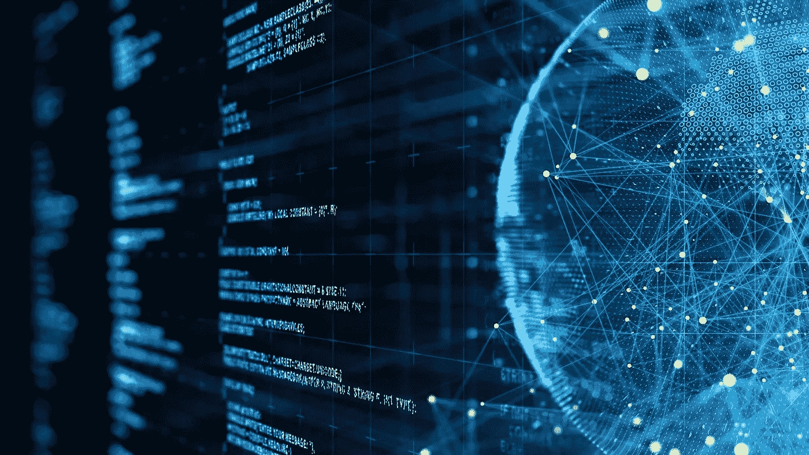
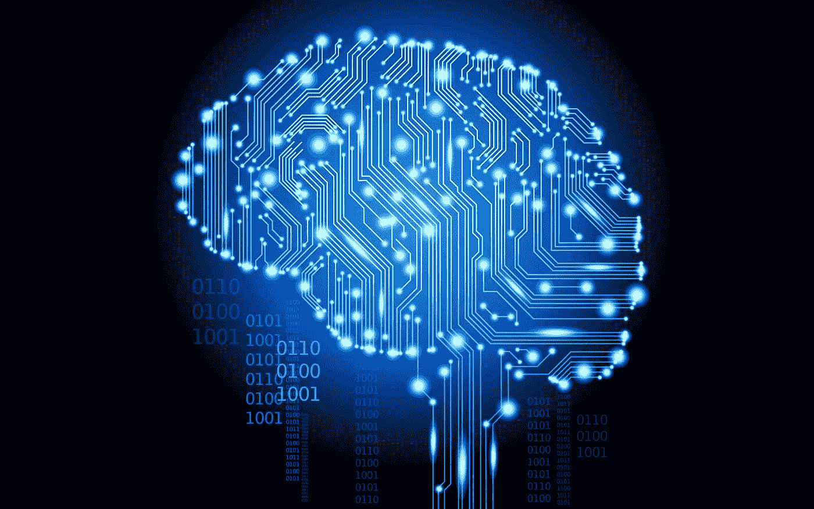
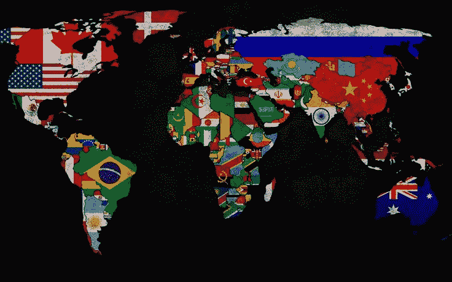

# 你知道一个 iOS 开发者的六个不同角色吗？

> 原文：<https://betterprogramming.pub/the-different-roles-for-an-ios-developer-3d146bf0c197>

## 深入了解这些迷人领域的指南

图片来自[https://br.pinterest.com/pin/809662839247050865/](https://br.pinterest.com/pin/809662839247050865/)

在过去的五年里，我一直在开发 iOS，并为不同的公司工作过——从事不同的项目、架构、团队、文化和方法。由于我在这些巨大的环境中积累了一些经验，我决定为你写这篇文章，你对合作世界完全陌生，不知道团队是如何工作的，也不知道你在公司可能承担的重大责任。

# iOS 开发者口味

图片来自[https://www . tasting table . com/901159/ranking-冰激凌口味从差到好/](https://www.tastingtable.com/901159/ranking-ice-cream-flavors-from-worst-to-best/)

我应该提到的第一件事是，令人难以置信的是，并不是你公司的所有 iOS 开发人员(至少在我迄今为止合作过的所有开发人员中)都有相同的职责、任务以及与其他团队成员的关系。事实上，这很好，因为我们的环境获得了丰富多样的文化和经验，可以向其他人展示和教授。

此外，伟大的新的创业和组织的想法可能会由此产生。当你在一家大公司(或者可能只是一家小公司)工作时，你会遇到各种各样的团队，每个团队都有自己的业务关注点和不同的项目、产品、时间表等等。

前一段时间，我录了一个采访，问我职业生涯中最喜欢做什么。有很多选择，比如生产 UI 内容、创建新的 SDK、消费 API 端点、处理分析等等。这并不是说你不能在工作中完成所有这些任务。你可以。

在我的公司，我白天会在这些方面做一点工作，但是公司越大，你在其中一个方面就越专业。这意味着一些团队专门负责设计系统、分析和仪器 SDK 以及所谓的垂直领域。

这个名称在我国被采用，但也可能被称为消费者。我将在下面的代码行中解释每一行以及这些涉众之间的关系。出于演示的目的，我将用一个银行初创企业的例子来说明本文。

# 1.设计系统开发人员

图片来自 https://wallpaperaccess.com/design

所有的公司都有一个提供设计系统的应用程序。如果你不熟悉这些术语，可以看看另一篇文章。简而言之，它是一个单独的模块(或者一组模块),为你的应用程序提供一些 UI 组件和资源的视觉标识。

与其他职位不同，设计系统确保开发人员不会经常参加产品会议，因为他们不直接与业务规则打交道。供您参考，他们生产的工件只是没有任何逻辑的纯接口。要求是“构建一个新的视图，在左边有两个对齐的标签和一个缩放的圆形图像。”DS 开发人员与 Figma 一起工作，并参与来自其他团队的请求。

构建这种由多个团队使用的组件

DS 开发人员必须在用户界面构建方面非常熟练，对 UIKit(和 SwiftUI，取决于公司)感到非常安全，知道如何用故事板、xib、ViewCode 构建一个新的界面，同样重要的是:修复 UI 错误。

通常，设计系统依赖于一个单一的模块，这个模块包含了为整个项目构建 UI 所需的所有可能的资源。尽管如此，你也可以将 UI 组件、图像、颜色、排版和其他资产分离到不同的模块中。这取决于建筑。

## 例子

如果我们在一家银行工作，DS 开发人员负责构建组件来表示不同的视觉上下文，比如垂直排列的信用卡数据的单元格、支付方法的转盘，以及任何适合某个屏幕的东西。但是他们甚至不知道这些组件在语义上代表什么。

## 核心职责

*   创建 iOS 可重用组件(UIKit/SwiftUI)
*   分析用户界面/UX 需求(例如，Figma，Zeplin)
*   提供可重用的资产

## 他们和谁交流最多？

*   设计师
*   来自其他垂直行业的 iOS 开发者
*   Android 和网络开发人员
*   产品领导者

# 2.分析团队

图片来自[https://BDA solutions . com . br/2020/02/4-motivos-para-voce-se-especializar-em-data-science/](https://bdasolutions.com.br/2020/02/4-motivos-para-voce-se-especializar-em-data-science/)

顾名思义，这是一个团队，负责事件检测。应用程序中的所有流程都应该被标记到一些工具中，如 Adobe、Firebase 和 Google，以跟踪最终用户如何与您刚刚构建的系统进行交互。所有这些数据都被发送给数据科学家，由他们进行转换和分析。

了解用户退出特定屏幕、完成一个流程或使用一个简化他们旅程的重要按钮需要多少时间是非常重要的，但出于某种原因，他们很少点击它。数据变成了信息，信息变成了知识，这可能会给我们带来流程中可能的修改或检测生产缺陷。

分析团队通常有一个完整的 SDK 生态系统，负责用相应的补充数据标记事件。例如，当我单击按钮时，它们可以判断文本字段中有什么，或者查看 API 响应是否成功。通常，多个服务的外观取决于客户团队和各自的工具。

## 核心职责

*   创建可重用的机制，用于跨不同上下文跟踪事件。
*   消费分析 API(例如，Google、Firebase、Adobe)

## 他们和谁交流最多？

*   数据科学家
*   来自消费者团队的 iOS 开发人员
*   Android 和网络开发人员

# 3.支持团队

图片来自[https://safetyculture.com/topics/maintenance/](https://safetyculture.com/topics/maintenance/)

不是每个公司都有移动支持团队，但这是一个非常重要的角色，尽管不是所有的软件工程师都喜欢成为其中的一员。所有其他团队负责创建新内容，但这一个团队负责修复错误，并提供一致的方法来防止您的应用程序显示不希望的行为。

这个团队依赖于文档，因为复杂的流程并不容易理解。他们需要知道如何重现每个场景，并明确为此需要哪种类型的用户以及应该启用哪些标志。他们直接与消费者团队沟通，并且应该始终跟踪哪些 bug 在待办事项列表中，哪些 bug 具有最大的优先级，并探索风险分析。

此外，在解决 bug 时，直接与 QA 沟通非常重要，因为他们应该知道每个流程、体验和输出是如何工作的。

## 例子

例如，假设有一些遗留的错误影响了所有其他团队来实现 cards hub。在这种情况下，支持团队应该为其他团队提供一种方法来达到这一流程，并详细说明避免在其他部分发生相同情况的方法(也许是新的设计模式？)

## 核心职责

*   解决 bug
*   识别当前架构中可能存在的风险(可能影响项目的因素)
*   风险分析

## 他们和谁交流最多？

*   来自消费者团队的 iOS 开发人员
*   质量保证
*   产品领导者

# 4.平台团队

图片来自 https://wallpaperaccess.com/human-brain

我认为这是公司内部最关键的团队之一。平台团队处理应用程序内部的所有核心功能，所有其他团队都将使用这些功能。这个团队负责所有的架构、设计模式、核心类、核心数据类型和主要流程。他们应该知道涉及多个类的所有逻辑，应该如何实现模块化，并管理遗留结构以不影响任何其他团队。

此外，应该为平台团队提供关于项目一般业务逻辑的大量文档。如果他们要实现、修复和添加反映所有其他团队的新特性，就需要非常清晰和完整。

平台团队还应该有长远的眼光，并始终保持与时俱进。例如，当苹果首次发布 SwiftUI 时，平台团队成员首先应该考虑的是他们如何在未来适应项目，处理所有遗留代码，并随着时间的推移应对巨大的变化。他们应该考虑所有可能的主要项目变更，以获得最合理的编译时间、一致的可读性和降低的耦合性。

这些人的另一个重要职责是关注 iOS 项目的 Git 流。作为一名技术负责人，您应该思考和计划 CI/CD 应该如何工作，您希望阻止什么进入生产，以及对于每个发布目的，消费者应该了解哪些重要分支。这些分支可能是热修复、开发、主、epics 等。我将写另一篇文章更深入地解释 git 流。

简单几句话，大家还记得 iOS 项目几乎全部依赖的`Common`模块吗？这个团队通常会处理这个问题。

## 例子

对于我们的银行公司，平台团队应该提供网络 SDK 之间的所有门面，创建进行货币转换的类和方法，并详细说明处理消费者可以使用的货币的主要业务规则。

## 核心职责

*   架构决策
*   创建并支持应用程序中的主要类和其他类型
*   防止活虫
*   让项目与苹果的 API 变化保持同步
*   风险分析
*   创建并构建 Git 流
*   模块化

## 他们和谁交流最多？

*   所有其他 iOS 团队(主要是消费者)
*   产品领导者
*   Android 平台团队
*   后端团队
*   设计者(如果一些特性与 UI 组件有关)

# 5.本地化

图片来自[https://br.pinterest.com/pin/738871882600230962/](https://br.pinterest.com/pin/738871882600230962/)

当我们与拥有来自多个国家和语言的客户的国际公司打交道时，这个团队就存在了。该团队负责操作可本地化文件，从产品团队接收所有英文字符串内容，将它们翻译成多种语言，并根据特定语言创建这些新的本地化文件。

通常，他们的需求来自消费者团队，他们在英语本地化文件(或应用程序的原始语言)内创建跨项目的新字符串。他们负责翻译，有时为每个国家提供特定的接口。

## 例子

在我们的银行应用程序中，我们创建了一个新的卡详细信息屏幕，其中包含一些标准内容，如字符串:“这是您的卡详细信息”、“发票”和“申请新卡”。本地化团队应该翻译所有这些文本。

## 核心职责

*   翻译所有不来自所有设定 API 的应用程序内容
*   为特定区域提供特定接口

## 他们和谁交流最多？

*   产品团队
*   质量保证标准
*   消费者团队

# 6.顾客

图片来自[https://www . shutterstock . com/image-photo/business woman-hand-use-smart-phone-table t-1898650408](https://www.shutterstock.com/image-photo/businesswoman-hand-using-smart-phone-tablet-1898650408)

最后但同样重要的是，消费者团队是实现与应用程序用例相关的特性的所有团队。换句话说，尽管平台团队、分析团队和其他团队有时相互依赖，但消费者团队的唯一职责是创建遵循`Design System`的 UI 流。

他们还负责消费`Common`功能，标记分析事件，带来本地化的新内容，并由支持团队解决其主要的生产缺陷。他们的屏幕和类被限制在他们自己的模块中，正因为如此，他们不打算将他们的类型和方法标记为`public`。

他们负责让其他团队意识到他们的必要性，比如可以跨其他特性重用的新 UI 组件和一些执行计算的遗留方法。

## 例子

消费者团队关注我们的项目应该参与的特定用例。下面是一些可能的消费团队:卡发票、P2P 交易、钱包、企业交易、促销、奖励等。

## 核心职责

*   非常了解他们处理的用例
*   构建新的屏幕和逻辑类，关注它们自己的上下文
*   执行单元测试
*   遵循 iOS 技能一章中建议的架构

## 他们与谁交流最多

*   分析团队
*   平台团队
*   来自自己团队的 Android/web/后端开发人员
*   流程与他们的流程交叉的其他消费者团队
*   产品团队
*   质量保证
*   设计师

# 结论

在本文中，我们提供了许多不同的角色，作为一名 iOS 开发人员，您可以在您的公司中扮演这些角色。然而，你应该知道，在你的职业生涯中，大多数时候，你不会选择你要走哪一条路。尽管如此，了解每一个是如何工作的以及你将和谁一起工作是很重要的。

我希望你喜欢它；).