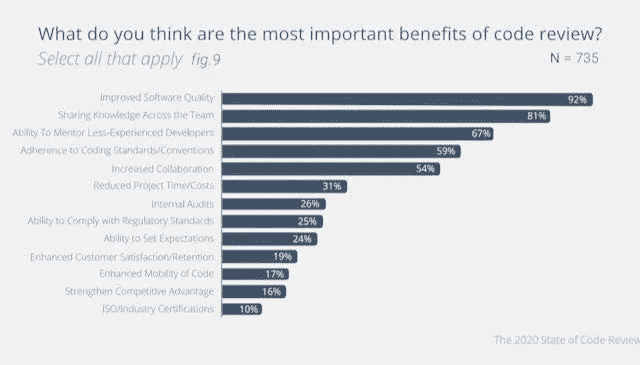
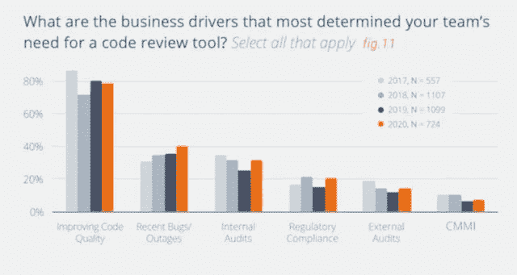

# 软件工程师代码质量完全指南

> 原文：<https://betterprogramming.pub/the-engineers-complete-guide-to-code-quality-dfa8d490c05e>

## 了解代码标准、评审、文档等的重要性

图片来源:作者

您可能没有意识到这一点，但是当您看到质量差的代码时，您可能会知道。它可能写得毫无意义，或者错误百出，过于冗长，或者在术语和命名约定的使用上高度不一致。幸运的是，有很多方法可以提高代码质量，使其更容易审查和测试，并减少以后必须修复所有错误的痛苦。让我们来看看。

# 什么是代码质量？

*代码质量*是指你的代码的属性和特征。这些可能会根据您组织的特定业务重点和您团队的特定需求而有所不同。虽然没有明确的清单，但大体上，有几样东西可以区分高质量代码和低质量代码。

## 好代码的标记

*   干净的
*   一致的
*   功能性或有用性——代码应该做它说要做的事情
*   用户容易理解，而不仅仅是作者
*   高效——好的代码简洁
*   可测试性——好的代码应该被测试为没有错误或缺陷
*   易于维护
*   将来易于构建、重用或复制
*   记录良好——写得很好，并符合公认的标准或风格指南

【https://xkcd.com/1513/】图片来源:T2

值得注意的是，所有这些标记对不同的人或团队可能意味着不同的事情。一个人可能会发现代码写得很清楚，容易理解，而另一个人会发现它不清楚，因此很难维护。但是有一些参数是有帮助的。

# 文档、代码标准和风格指南

正如达米安·康威所描述的，“文档是你写给未来自己的情书。”代码中的注释或注解是一种向未来的你提供信息的方式，告诉你为什么你会以某种方式编写代码。或者为什么团队成员在特定的时间做出特定的决定。这也为其他团队成员提供了对您决策的洞察力。

代码标准也有助于在整个团队中提供统一的代码。它们使使用和维护变得更加容易。[威廉·摩尔](https://www.invensis.net/blog/code-quality-coding-standard-importance/)将它们描述为“特定编码语言的一系列过程，需要编码格式、方法和不同的过程。”

风格指南在一个地方提供了公司的标准约定(如命名约定)和其他最佳实践。它旨在确保代码在所有团队成员中是一致的，使得工作和审查更加容易。如果您想让团队实际拥有并采用它，它应该得到团队的同意，这可能需要一些培训。

许多公司，如[谷歌](https://developers.google.com/style/)、[微软](https://docs.microsoft.com/en-us/style-guide/developer-content/code-examples)和 [WebKit](https://webkit.org/code-style-guidelines/) ，都在网上发布了他们的风格指南，可以帮助你开始创建自己的风格指南。还有大量特定于编程语言的指南——Alexander Van Tol 为 RealPython 撰写的文章为 Python 程序员提供了一些很好的资源，包括特定于 Python 的风格指南和 linters。

# 代码审查的重要性

代码审查对于确保良好的代码和提供一种定位问题的方法以便尽早修复问题是至关重要的。他们还可以确保您正在构建的软件的一致性和可靠性。对于采用 DevOps 生活方式的公司来说，代码评审是正常的，并且已经尽早嵌入到过程中。越早发现错误，解决错误就越快、越容易、越便宜。

SmartBear Software 在 2020 年 6 月和 7 月期间进行了一项为期十周的全球在线[调查](https://smartbear.com/resources/ebooks/the-state-of-code-review-2020-report/)，来自 20 个不同行业的 740 多名软件开发人员、测试人员、IT/运营专业人员和商业领袖做出了回应。回答者认为代码评审是提高代码质量的最好方法。

调查还显示，提高代码质量是影响代码评审工具需求的主题业务驱动因素。

此外，超过 80%接受调查的开发人员表示，对代码审查过程的满意度与对软件发布的整体质量的信心直接相关。

除了代码审查之外，回答者认为代码的单元测试、连续测试和功能测试是提高质量的最佳步骤。持续集成和集成也被认为是软件开发的最佳实践。

就节奏而言，大约 63%的受访者参与某种形式的代码审查，至少每周一次。当谈到频率和使用哪种方法时，27%的受访者提到每天进行基于工具的代码审查，19%的受访者提到每周进行一次。

总的来说，代码审查确保代码满足前面提到的作为好代码标志的属性。代码审查确保代码是高效的、无错误的，并且符合标准。总的来说，它的目标是在问题增多之前及早发现问题。

代码评审可以通过多种方式进行，包括手工评审、结对编程、指导以及使用共享文档来简化评审。然而，所有这些方法都是时间密集型的，代码评审工具提供了一种自动化过程的方法。

# 审查代码质量的工具

大多数开发人员已经使用 GitHub 来维护他们的 Git 库，并且习惯于使用 pull 请求和 forks 来审查代码。还有许多其他工具可以帮助团队自动化代码评审过程:

*   [Codacy](https://www.codacy.com/)
*   [代号气候](https://codeclimate.com/quality/)
*   [CodeGrip](https://www.codegrip.tech/)
*   [代码场景](https://codescene.io/)
*   [评审委员会](https://www.reviewboard.org/)
*   [智能熊](https://smartbear.com/)
*   [声纳座](https://www.sonarqube.org/)
*   [Veracode](https://www.veracode.com/)

对于额外的代码审查工具，看看在 [Geekflare](https://geekflare.com/code-review-tools/) 上编译的列表。同样值得注意的是，安全性是代码质量的关键部分。

代码质量和安全性是相似的，因为两种类型的问题都可以通过静态分析来识别。开发人员通常使用静态分析方法来设计和测试组件。在这种情况下，代码没有运行或执行，但是工具本身使用源代码作为其输入数据来执行。静态分析使开发人员能够使用工具尽早发现安全问题，通常是在他们编写代码时实时发现。这些工具在开发人员编写时进行扫描，然后在工程师的集成开发环境(IDE)或编辑器中标记任何安全问题。通过查看应用程序中的数据流路径，静态分析工具可以识别应用程序在何处错误处理数据或代码，从而产生意想不到的结果。

静态代码审查软件还帮助开发人员理解结构和编码标准，并实现他们自己的编码标准。当开发人员将代码直接投入生产时，静态代码分析还会验证代码质量，减少以后的错误，并减少 bug。这些工具可以识别应用程序中的数据错误处理，以及代码何时会导致意想不到的后果。

# 代码重构

另一种提高代码质量的方法是通过重构。源代码重构将混乱、不正确或重复的代码转化为复杂度较低的干净代码。它解决了当多个开发人员贡献他们自己的代码时可能出现的标准化问题。重构后的代码更容易阅读和维护。它也更容易扩展和添加新功能。删除不必要的部分，如重复的部分，也可以使代码使用更少的内存，执行更快。

# 减少技术债务

粗制滥造的代码最初可能看起来很有效率，但一旦需要修复，就会导致痛苦不堪。从第一个实例开始生产高质量代码的好处之一是它减少了[技术债务](https://www.stepsize.com/blog/complete-guide-to-technical-debt?utm_source=medium&utm_medium=referral&utm_campaign=1)。好的代码最初可能需要更长的时间来产生，但可以导致更少的错误修复和重构，并可以消除技术债务的长期痛苦。高质量的代码使得长期开发和可维护性更容易。

提高代码质量的方法之一是持续跟踪技术债务并对其进行优先级排序，这样你就可以制定业务案例来重构代码库中最重要的部分。

# 结论

编写高质量的代码不仅会带来更高质量的软件，还会带来更大的团队满意度。当使用工具、框架和风格指南来消除决策过程中的大量猜测时，这一点尤其重要，这样可以让开发人员专注于更有趣的任务。然而，保持高质量的代码和写代码给[防止技术债务](https://www.stepsize.com/?utm_source=medium&utm_medium=referral&utm_campaign=1)一样重要。

*原刊为“* [*管理技术债务*](https://www.stepsize.com/blog/the-engineers-complete-guide-to-code-quality) *”*