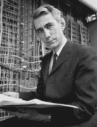
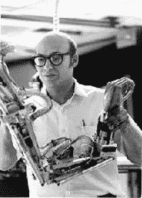
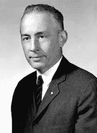

# 人工智能背后的基本理论

> 原文：<https://betterprogramming.pub/the-fundamental-theories-behind-artificial-intelligence-b1fa9d75c552>

## 了解今天推动人工智能的历史、人和技术

列宁·艾斯特拉达在 [Unsplash](https://unsplash.com/s/photos/robot?utm_source=unsplash&utm_medium=referral&utm_content=creditCopyText) 上的照片

人工智能已经成为热门话题有一段时间了。在过去十年的某个时候，我不确定确切的转折点是什么时候，技术世界开始真正模糊科幻小说和现实之间的界限。汽车学会了自动驾驶，机器人开始送外卖，手表开始像一个詹姆斯·邦德玩具，虚拟家庭助理随时准备回答我们能想到的任何问题。

退一步说，人工智能的影响既迅速又巨大，但它是如何发展到现在这个地步的呢？人工智能的最初目标是什么，哪些技术促进了它的发展？是什么把 AI 从科幻小说中带进了我们的客厅？

# 早期

"[关于人工智能的达特茅斯夏季研究项目的提案](http://A Proposal For The Dartmouth Summer Research Project On Artificial Intelligence)"

人工智能领域的历史比你想象的要久远得多——一直追溯到 20 世纪 50 年代。1955 年 8 月，约翰·麦卡锡(达特茅斯)、马文·李·闵斯基(哈佛)、纳撒尼尔·罗彻斯特(IBM)和克劳德·艾尔伍德·香农(贝尔电话实验室)完成了“[达特茅斯人工智能夏季研究项目提案，](http://jmc.stanford.edu/articles/dartmouth/dartmouth.pdf)”正式创造了这个术语，点燃了我们今天所知的人工智能的第一束火花。

提案概述了这四个人认为阻碍进步的问题，他们迄今为止的相关经验，以及对研究项目的期望。这四位创始人相信，总的来说，他们可以在两个月内取得“重大进展”，房间里有十个人，还有高达 13500 美元的资金。夏季的愿景是这样描述的:

> “这项研究是在这样一种推测的基础上进行的，即学习的每一个方面或智力的任何其他特征在原则上都可以如此精确地描述，以至于可以制造一台机器来模拟它。人们将试图发现如何让机器使用语言，形成抽象概念，解决现在留给人类的各种问题，并改进它们自己。我们认为，如果经过精心挑选的一组科学家一起工作一个夏天，就可以在一个或多个问题上取得重大进展。”

# 路障

为了理解研究项目的设计，我们必须首先理解它旨在解决什么问题，以及它旨在实现什么成就(请原谅我——我们需要一些背景来进一步理解任何事情，但我会尽可能让它不那么痛苦)。最初概述的与“人工智能问题”有关的要点如下:

1.  自动计算机
2.  计算机如何被编程来使用一种语言
3.  神经元网络
4.  计算规模的理论
5.  自我完善
6.  抽象
7.  随机性和创造性

我强烈建议阅读他们对每一个问题的简要总结(可以在原始提案的第二页找到)，但是即使没有阅读，其中一些内容对你来说可能很熟悉。在这里，在人工智能的第一次讨论中，我们看到了神经元网络(现在与神经网络/深度学习相关)、自我完善(当今机器学习领域的重要目标)和自动计算机(计算极限的问题和我们作为工程师充分优化自己能力的能力)。

# 大脑

每个创始成员都带来了独特的专业知识，所有这些都可以针对上述某个特定问题。

Claude Shannon 拥有设计“学习机器”的背景，以及在图灵机理论方面的丰富经验(如果你不熟悉这个理论，我建议你简要查看一下[斯坦福哲学百科全书](https://plato.stanford.edu/entries/turing-machine/)中的条目)。香农是解决该领域自我完善问题的最佳人选。

克劳德·香农——阿尔弗雷德·艾森斯塔特摄影/生活图片集/盖蒂

**马文·李·闵斯基**已经写了他的普林斯顿博士论文，题目是“神经网络和大脑模型问题”已经使用神经网络建立了一个学习机器，他可以专注于神经元网络问题。

马文·李·闵斯基——麻省理工学院博物馆传记档案中的照片

纳撒尼尔·罗彻斯特和另一名 IBM 工程师被认为创造了当时最流行的大型自动计算机之一，即 IBM 701 型。这方面的知识，加上他在制造能让计算机完成人类任务的技术方面的经验，将使罗切斯特能够很好地解决自动计算机和编程计算机使用语言这两个问题。

Nathaniel Rochester——图片来源:IBM 历史档案馆

约翰·麦卡锡，他的工作主要围绕着数学问题以及它与人类思维过程的关系。两者都让他对前方的障碍有了一个很好的整体视角，并且对随机性和创造性的人工智能问题有很大的价值。

约翰·麦卡锡——查克·佩因特摄影

现在，我不是说他们每个人都只致力于所列的那些问题——实际上，你可以从他们的提案的第五页开始，阅读每个团队成员关于其关注点和意图的个人写作。相反，我发现他们的专业知识清楚地说明了为什么这个团队准备好接受这样一个复杂的问题。

# 今日 AI

正如我们之前看到的，最初提案中讨论的许多内容都让人想起当前围绕人工智能的对话。事实上，正是这些原创思想的进步让谷歌、亚马逊和苹果等公司得以构建自己的人工智能技术。

## 神经网络

在最基本的层面上，神经网络是一套算法——但这有点像说人脑是原子的集合。然而，算法是构建模块，这些算法组是专门在人脑上(松散地)建模的。

神经网络可以包括数千甚至数百万个独立的、复杂互连的处理节点。这些节点被设计用来识别模式，就像人脑一样。神经网络的进步使得深度学习领域的进步成为可能，深度学习是机器学习的一个分支，也是现代人工智能不可或缺的一部分。

## 机器学习和深度学习

如果我必须指着一个领域说，“就是它。这就是让现代人工智能成为可能的原因，“那就是机器学习。机器学习是指计算机可以从经验中学习。这些算法使用统计和大量数据来识别和利用模式。

你可能听说过当今困扰互联网用户的许许多多隐私问题。我们都知道为什么公司想要获取我们的数据——钱。但是我的数据如何转换成美元和美分呢？一些公司出售数据以获取利润。然而，其他人则提供所有这些数据——每次鼠标点击、观看的每段视频、观看视频的时长、视频结束后我去了哪里等等。等等。—到这些算法中。这些高度复杂、完美调整的算法消化所有这些模式，以创建对用户行为的惊人准确的预测。摄取和分析这些数据是我们如何获得接下来看什么的建议，并最终看了一小时又一小时。

如果这还不够复杂的话，深度学习是一个更加复杂、更加进化的机器学习版本。它涉及最复杂的神经网络，能够捕捉最微妙的行为模式。

## 超级计算机

图片来源:[维基百科](https://de.m.wikipedia.org/wiki/Datei:Powebook5300cs.jpg)

如果你曾经听到你的 MacBook Air 在一次长时间的网飞狂欢后开始发出奇怪的声音并变热，你可能会问自己这种类型的计算怎么可能实现。在很长一段时间里，事实并非如此。

上图是一台 1995 年的 MacBook。现在想想你现在正在用什么设备阅读这篇文章，想想我们已经走了多远，即使只是在我的有生之年。这一壮举完全令人敬畏。现在想想自从麦卡锡、明斯基、罗切斯特和香农在达特茅斯度过了他们的夏天以来，我们已经走了多远。狂野。

计算能力的这些进步对人工智能的成功至关重要。要能够运行人工智能所需的机器学习算法，需要惊人的计算能力。有些人没有意识到这一点，但是计算能力是技术局限性的一个重要来源。例如，现代密码指南和加密之所以安全，只是因为我们还没有能够暴力破解它们的计算机。当然，这需要几十亿年才能完成，但这是基于今天的计算能力。随着计算机变得越来越强大，这个时间线缩短了。

## 大数据

以上的一切其实都归结为一点:数据。难以想象的海量用户数据是人工智能这艘火箭的燃料。是的，如果没有神经网络、机器学习和能够运行这两者的计算机，数据将相对无用。

但是数据才是机器真正要学习的。机器得到的越多，它就变得越聪明——它的知识越精炼，它的预测就越准确。当我们想到人工智能时，我们想到的一切，无论是与我们的谷歌主页对话，还是在看到你今天早上想到的那个东西的广告时感到毛骨悚然，都是从分析如此庞大的数据集中产生的，它们可以猜测如何成功地与你互动。也许下次 Siri 不知道怎么回应的时候你会对她好一点。

# 未来

我不会假装知道人工智能的未来会是什么样子。我要说的是，我们才刚刚开始看到它对我们世界的影响，虽然如果谷歌弄错了我的 Spotify 请求，风险是微不足道的，但当我们开始谈论医疗建议、财务处理、教学等问题时，情况就完全不同了。此外，争取更多数据隐私的斗争正在全速前进，持续的数据流入对于进一步的发展至关重要。随着算法和计算机的进步，它们将能够事半功倍。但是，他们仍然需要燃料。