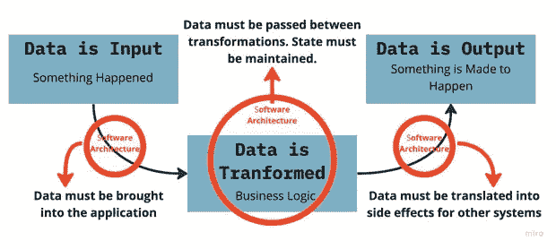
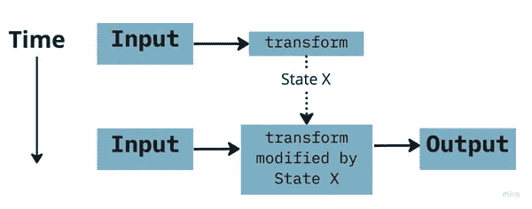

# 软件架构的核心出奇的空

> 原文：<https://betterprogramming.pub/the-heart-of-software-architecture-is-weirdly-empty-eceff9abfc45>

## 关于这个主题的书籍和文章很少探究我们为什么要构建软件，然而这种理解对于好的设计是至关重要的

弗雷迪·马丁内兹在 [Unsplash](https://unsplash.com?utm_source=medium&utm_medium=referral) 上的照片

在我之前的[文章](https://medium.com/better-programming/the-code-complexity-hockey-stick-bd4985d9fc33)中，我写了面向对象设计如何导致严重的复杂性。我并不是说 OOD 天生就是不好的——有时候，它绝对是应该遵循的正确模式。

但是通常，特别是对于处理复杂状态的应用程序，OOD 是一团乱麻，而你是主角(或者更糟，你只是一个小角色)。那么，一个人如何避免出演这样一部令人不快的作品呢？

但是在我深入讨论这种设计与那种设计的具体细节之前，我们需要探索一下基本原理。如果你不知道如何骑自行车，你就赢不了环法自行车赛。

那么，我们为什么要首先构建软件呢？这一切都归结于商业逻辑。

商业逻辑这个术语本身是不幸的。这让我想起了在马提尼之间的高尔夫球场上握手的人(或者不管怎样，这是生意——谁知道呢，真的吗？).这个概念需要重塑。

业务逻辑可以理解为一个应用程序的*终端*的表现形式。Telos 是亚里士多德的一个术语。它是一件事情的[终因](https://en.wikipedia.org/wiki/Four_causes)；它的目标或核心解释。

这里有一个 *telos* 的例子。公寓大楼和保龄球馆非常不同；即使在许多方面，他们是相似的。它们都是建筑。它们都需要设计师来制定计划并决定使用哪些材料。建筑工人很可能使用几乎相同的技术来浇注地基或建造墙壁。

但是，如果你付钱给一个建筑师设计一栋公寓楼，他们给你建了一个保龄球馆，无论球滚得多好，那个建筑师都失败了。他们没有为你建造一个空间，这个空间被分割成方便进出的居住单元，并配有所有现代设施。他们没有实现你的意图，建筑的目的——它的“公寓化”

根据项目的复杂程度，可以对一个 *telos* 进行细分。通常，在一个更大的*目标中会有一些相互冲突的狭隘目标。公寓楼必须平衡公共区域、生活区和基础设施(如管道和电梯)之间的空间。建筑师的工作是确保所有的部分以一种支持建筑整体*的方式组合在一起。它必须是一个多个人分开住在同一栋楼里的好地方。**

但是缩小也是有启发的。任何建筑最普遍的目的都是“围起一个空间”

# 软件的终极原因

软件架构与物理架构非常不同，但是对 telos 的考虑同样重要。视频播放器的 *telos* 与运行汽车的嵌入式软件非常不同，任何复杂的 *telos* 都可以细分。架构师的工作是处理相互冲突的元素，并朝着更高的目标努力。

但是你也可以缩小来看软件最通用的 *telos* 。这是一张图表:

看哪！编写每一个软件应用程序的原因。输入转化为输出。应用程序的其他一切都是为了支持这个中心任务。

“其他一切”就是我们通常认为的软件架构。

我读过的几乎所有软件架构书籍都关注于“其他一切”，而不是 *telos* (不管 *telos* 的思想是如何表达的)。这就像打开一本关于世界上伟大建筑的咖啡桌书，却发现除了管道和门框的光滑图片之外什么也没有。

我想这是可以理解的。人们很容易察觉到一座实体建筑的“终端”( telos )( T21 ),但是很难想象出一个软件应用程序的原因，或者看到精心制作的商业逻辑之美。

软件架构，至少像通常在书中学到的那样，符合我们的基本目标，就像这样:

软件架构支持数据传输

我要求你们中的许多人转换一下视角。软件架构不是应用程序的目的，而是它的形式。架构是组织应用程序的方式，用于将数据移入和移出满足其存在理由的转换。

# 业务逻辑=数据转换

想一个最简单的应用程序:“Hello World”它的 *telos* 是测试你是否能在给定的上下文中创建一个工作程序。输入表示程序启动。转换是空值变成“hello world”。输出是字符串被写出到某个外部视图。

并不是说这里没什么事情。背景可能极其复杂。实例化程序的操作系统和记录文本的控制台是非常复杂的系统，具有层次和重叠的 *telos。*但是，从《Hello World》的应用来看，这都是在[【素材】](https://www.youtube.com/watch?v=BnDsKkbRhLw)层面造成的。

当然，软件应用程序通常比“Hello World”复杂得多。应用程序可以缩放输入、转换或输出。

例如，FFMpeg 可以接受一个输入，即一个媒体文件，并通过许多步骤转换它以创建多个输出，即一组转换后的媒体文件。这个过于简化的图表看起来像这样:

转换可以连接起来解决复杂的业务逻辑。

我想 FFMpeg 的架构相当复杂，允许灵活地为所有媒体添加和配置不同类型的转换。但是，就其 *telos* 而言，它仍然是一个相对简单的程序，因为其输入的形式和种类不需要缩放。你向它扔一个媒体，它就完成了它的工作(令人钦佩)。

# 跨时间转换=状态

大多数现实世界的应用程序(或系统或平台或任何我们想称之为它们的东西)将比像 FFMpeg 这样的程序复杂得多，因为它们必须缩放它们的输入。他们的终端要求一组不同的数据相互作用以形成不同的输出。

当你有多个输入时，它们必须在不同的时间发生。这些输入可能以微秒或年为间隔。例如，如果有人按下播放器上的暂停按钮，该逻辑必须与播放器中已经通过其他输入启动的其他进程进行交互。用户在看广告吗？做一件事。…直播流？再做一个。…互动动画？又一个。

这是端粒*影响另一个端粒*的一部分，改变了两者的表达方式。转换之间的这种交流称为状态。国家让事情变得更加复杂。可能连接的组合爆炸趋向于无穷大，但这是最简单的想法:

状态是一个转换随着时间向另一个转换发送信息。

我认为状态不仅仅是存储在运行过程中的数据。它是允许业务逻辑的一部分影响另一部分的任何形式的数据。

会员信息？如果你把你的系统作为一个整体来看，它肯定是状态，即使它是几年前输入的。关于收视习惯的统计？当它被用来瞄准一个视频的结束卡片时，它是状态。当前正在加载的视频片段？是的，这很简单。

状态是一个数据转换为另一个数据转换创造的潜在能量。状态是打开更多宝藏的钥匙。没有状态，你的应用程序就只是一个工具。

对于软件架构师来说，状态管理绝对是最重要的事情。问题不仅仅是在运行时处理状态，这已经够难的了，而且我们还要处理应用程序本身的扩展。应用程序的终端很少静止不动。

# 数据之舞

我现在要重复另一个类比(越多越好，对吗？).把一个应用程序想象成一支舞蹈。每个转换都旋转其输入和放手状态，以便其他转换与之共舞。

数据需要优雅地移动，并掌握好时机。通常情况下，对错误的容忍度很低。如果一个转换不能正常工作，它可能无法为其他转换正确设置状态，从而引发一连串的错误。但步履蹒跚的转型相对容易解决；你总能教会任何舞者正确的舞步。

舞蹈本身的流动更难处理。如果我们应用程序的 *telos* 是一场大型舞会，那么我们最大的错误就是在舞池中建造一个迷宫。如果这个迷宫能够完美地将舞者引导到正确的位置，它看起来可能会很好。但是当我们开始增加更多的舞者时会发生什么呢？当我们需要改变舞蹈时会发生什么？当应用程序的形式，即“架构”，开始阻碍舞蹈的自由流动时，真正的问题就出现了。

希望你能明白我的意思。正如我在我的[上一篇文章](https://medium.com/better-programming/the-code-complexity-hockey-stick-bd4985d9fc33)中所描述的，面向对象设计通过锁定执行流在舞池中创建了一个迷宫。每当我们增加一个新的舞者，我们就越来越没有余地将他们编织到舞蹈中。脚趾会被踩。鼻子会流血。即使每一个业务逻辑都是严格正确的，它也可能无法在正确的时间交付正确的状态。

# 迷宫预防

那么，我们如何创建一个长期保持健壮的应用程序呢？让我们从一个核心原则开始:

1.  状态必须保持可预测性。应用程序的每一部分应该总是能够知道状态何时以及如何被转换，以便它们能够在正确的时间定位状态。扩大规模会在两个方面带来麻烦。首先，更多的转换操纵设置相同的状态，改变窗口，在该窗口中状态对于任何接收的转换可能是正确的。这是一个舞者站在另一个的前面。第二，接收转换可能会四处移动，从而错过正确状态的窗口。这是一个舞者和其他舞伴一起多转了几圈，所以他们错过了一次交接。通常这里的误差容限是微秒。为了解决这些问题:
2.  执行流程必须相当灵活。如果时间发生变化，我们应该能够将一些转换提前，将另一些转换移出。一个舞者应该能够更早地介入，以防止另一个人打断他们，或者我们应该能够让一个舞者等一会儿，直到另一个人完成旋转。或者，我们可能需要完全执行流程，重新编排舞蹈以更好地适应新的舞者。为此:
3.  业务逻辑必须具有合理的可移植性。我们需要挑选一个转换，并将它完整地、无变化地从执行流程中的一个点移动到另一个点。如果单个业务逻辑分布在多个类中，就像在面向对象设计中经常发生的那样，那么作为一个单元移动就变得非常困难。就好像舞者的胳膊和腿散了一地，和其他分开的胳膊和腿一起跳舞。你必须去收集它们，并把它们放回身体上，即使它们已经独立变化，所以现在腿和胳膊可能不再是正确的长度。……好吧，也许这个类比有点站不住脚，但还是有道理的，对吧？

所以，如果你读到这里(谢谢你！).我猜你在等待大揭露。这就是(某种程度上):

我已经厌倦了在我处理过的应用程序中一次又一次地犯同样的错误(它们属于某种类型:复杂的有状态应用程序)。面向对象设计并不是唯一的游戏。还有其他方法来编写这些应用程序。你可以把其他工具放在你的工具包里。还有其他的牛仔竞技表演来挑战你的野马。

但是，为了探索现状的替代方案，我们需要从对核心原则的共同理解开始——即商业逻辑的首要性。当前许多关于软件架构的文献都没有直接解决这个问题，而是绕开了这个问题，这使得人们很难理解如何构建能够随时间变化的有效应用程序。

但是有好消息！大多数社区已经脱离了 OOD，甚至可能没有意识到这一点。我将在我的下一篇文章中探索这种转变。