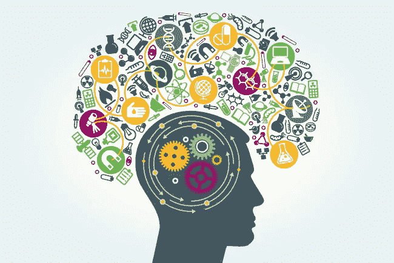

# 忘却的重要性

> 原文：<https://betterprogramming.pub/the-importance-of-unlearning-8a96874501e5>

## 接受一个问题可能有不止一个解决方案

这篇文章最初发表在我的[个人网站](https://gryphon.dev/2019/06/27/the-importance-of-unlearning/)

软件世界正以非常快的速度不断变化。
昨天的公理可能是明天的反模式。

新生技术越来越受欢迎，但过时的速度比预期的要快，硬件的进步让几年前被认为是科幻小说的事情成为可能。

唯一可以确定的是，我们不知道未来会带给我们什么。

# 新兴技术

以下是近年来新兴技术的部分列表:

1.  **区块链**
2.  **机器学习的复兴**
    硬件能力的增加给许多利用机器学习的行业带来了新一波工具和颠覆
3.  **容器**
    现在，将独立的组件部署到云中变得更加容易。以前只有谷歌这样的巨头拥有的容器编排基础设施现在对每个人都公开可用(Kubernetes 目前是这里的国王，但未来肯定会带来新的工具)
4.  动机是拥有一个通用的字节码，不仅可以在浏览器中使用，还可以在任何东西中使用(桌面/智能手机/天知道)。
    这项技术将改变软件在平台之间的可移植性
5.  **Rust**
    有史以来最具创新性的编程语言之一，
    Rust 让系统编程成为真正的乐趣。过去 4 年堆栈溢出调查中最受欢迎的编程语言
6.  使 Erlang 虚拟机(称为 BEAM)成为主流的解决方案，这主要归功于其类似 Ruby 的语法和出色的工具
7.  **无服务器**
    当我们只想要不需要 24x7 全天候运行的单一功能时，为什么要将容器部署到云中？
8.  REST API 并不是所有问题的理想解决方案，许多数据模型实际上以图表的形式来看更好，这个协议也能很好地处理它们
9.  **Redis**
    创新的键值数据库，拥有如此多的数据结构。
    过去 3 年堆栈溢出调查中最受欢迎的数据库
10.  **Kafka**
    分布式提交日志，作为系统数据的单点真值。这使得为我们的系统架构添加/删除独立的生产者/消费者变得非常容易。
    多亏了卡夫卡，选择一个关卡和*【重新播放】*历史数据变得很容易。

一方面，对于软件开发人员来说，这是一个激动人心的时刻。另一方面，这意味着为了跟上，我们不能停止学习，否则我们会变得无关紧要。

我一直热爱(现在仍然如此)学习。我喜欢阅读技术书籍(我有很多)。
我喜欢阅读漂亮的源代码。
我一直在寻找提高效率的方法，走出我的舒适区。

**但是，我认为有一件重要的事情是人们经常忽略的，那就是忘记事情的重要性。**

# 忘却

忘却意味着我们需要接受一个给定的问题可能有不止一个解决方案，而这个解决方案对我们来说可能是违反直觉的。

它还需要谦逊和重新开始的意愿，以便获得新的视角并扩展我们的工具箱。

让我们回顾一下上面的技术列表:

1.  **区块链**
    为了理解区块链技术是如何工作的，我们必须忘记集中式中间人模型。
2.  **机器学习**
    例如，我们需要在这里接受计算机神经网络可以输出我们无法确切理解其来源的结果
3.  **容器**
    容器颠覆了 DevOps 世界，是微服务架构爆炸的关键原因。如果没有它们，我们将会停留在更加单一的系统上。
4.  **WebAssembly**
    将开启许多机会，显而易见的是使用新的编程语言进行前端编程。另一个可能的世界将是消费 WebAssembly 库并在我们的应用程序中使用它们。例如，Rust 程序将启动 WebAssembly 运行时，托管最初用 Golang/Swift/other 编码的其他 wasm 程序)
5.  **Rust**
    学习 Rust 编程语言[需要我们从借用/拥有的角度用不同的方式看待资源](https://www.influxdata.com/blog/rust-can-be-difficult-to-learn-and-frustrating-but-its-also-the-most-exciting-thing-in-software-development-in-a-long-time/)。
6.  **灵丹妙药**
    *[*让它崩溃吧*](https://ferd.ca/the-zen-of-erlang.html) 二郎的哲学要求我们接受未知，事物将会破碎，并从一开始就为它们做好准备*
7.  ***无服务器**
    要求我们不要只考虑服务，还要考虑单一功能。这为节省资金提供了新的机会，因为我们只为某项功能的使用付费(这可能不是全天候可用的)*
8.  *GraphQL
    要求我们接受 REST 并不总是对每个场景都是最好的，有时确实有一个图表。(我个人认为，从 REST API 开始，逐渐转向 GraphQL，对于绿地项目来说风险更小)*
9.  *Redis要求我们用更多的形式来表示数据:键值/散列/集合/排序集合/列表等等。*
10.  ***Kafka**
    一旦我们开始以日志 的形式查看我们的 [*系统数据，我们就可以更多地考虑系统上可替换的组件。例如，我们可以很容易地添加一个新的消费者，让它处理数据，并将其放入一个新的数据库，并且知道它不会干扰系统的其余部分。*](https://engineering.linkedin.com/distributed-systems/log-what-every-software-engineer-should-know-about-real-time-datas-unifying)*

*忘却是一种持续的内心斗争。如果处理得当，可以成为一个巨大的推动者，否则，我们就有失去增长机会的风险。*

> ***视角的改变值 80 智商点***
> 
> ***——艾伦·凯***