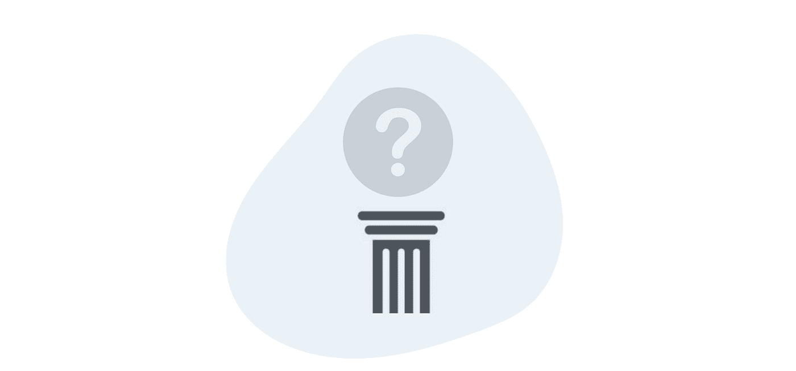
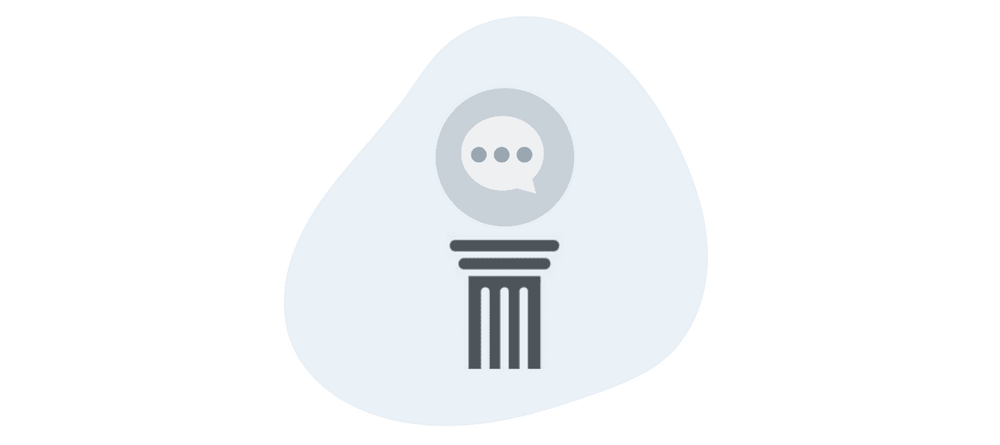

# 初级开发人员生存指南

> 原文：<https://betterprogramming.pub/the-junior-developer-survival-guide-three-pillars-for-success-8b836e064b3d>

## 成功职业的三大支柱

乔恩·泰森在 [Unsplash](https://unsplash.com/s/photos/three-pillars?utm_source=unsplash&utm_medium=referral&utm_content=creditCopyText) 上的照片

你是一名刚从计算机科学专业毕业的初级开发人员吗？或者是一个正在寻找新工作的自学成才的开发人员？你是每个软件开发者曾经开始的地方！

作为一名初级开发人员开始工作伴随着独特的乐趣和挑战。今天，我们将介绍作为初级开发人员生存所需的所有知识。我们的目标是涵盖技术教程中不常涉及的主题。让我们直接跳进来吧！

这是我们今天要讲的内容

*   第 1 部分:初级开发人员成功的三大支柱。
*   第二部分:工作中需要注意的五个危险信号。
*   第三部分:十个小贴士，放在你的后口袋里。
*   第 4 部分:初级开发人员的完整资源指南。

# 第一部分:成功的三大支柱

一头扎进科技行业可能会让人不知所措。为了让您有一个好的开始，让我们来看看初级开发人员职业成功的三个支柱。我们希望让你在工作中获得满足感和成长！

# 支柱一:专业精神

在现实世界的商业中，技术技能只能让你走到这一步。即使你是班上的尖子，你可能也没有准备好面对职业世界的严酷。专业是初级开发人员生存的关键，不管你的长期目标是什么。职业精神可以粗略地定义为一系列行为、态度和习惯，这些行为、态度和习惯是职业人士的特征，并使他们与公司的价值观保持一致。让我们把初级开发人员的职业精神分解成五个要点。

## 1.当我不明白某些事情时，我会问问题

当你不知道一些事情的时候，不容易承认。当你需要的时候，知道如何问正确的问题尤其具有挑战性。但是，假装知道所有答案的业余爱好者或初学者又回到了老习惯，落后了，甚至看起来很傻。专业意味着对你的工作、你的知识和你渴望提高的渴望诚实。*提问是事业成功的关键。*

无论你现在是否看到它们，当你开始时，你的知识中不可避免地会有缺口。提问能让你继续学习，变得更加专业，了解公司的需求。

如果你被难住或弄糊涂了，你可能会担心你的同事会认为你愚蠢或缺乏教育。但实际上，人们想帮助别人。最重要的是，问问题表明你能在团队中很好地工作。

虽然没有愚蠢的问题，但是提问的方式有好有坏。学会如何提出好的问题会节省你的时间，并防止沮丧。

首先问:

*   我已经尽我所能理解代码了吗？
*   我有没有问过像 StackOverflow 这样可靠的消息来源？
*   我是否使用了调试器程序来帮助我解决这个问题？

如果你已经尽最大努力自己解决了问题，那就该寻求帮助了。提问的最佳方式是将你的问题放在上下文中，并向你要问的人解释你的过程。指出你到底哪里出了问题，你认为哪里出了问题，以及你做了什么来解决它。关于如何就你的代码提出好问题的更详细的分类，请看一下[这篇文章](https://medium.com/@gordon_zhu/how-to-be-great-at-asking-questions-e37be04d0603)。

## 2.我寻求有经验的开发人员的指导

拥有一个支持系统不仅会让你成为一个更好的员工，也会让你成为一个更有成就感的人。有人在你身边寻求帮助、建议，甚至只是倾听，都可以改变你的工作环境。专业导师关系为你创造了一个与你所在领域的专业知识交流的空间。

你可能不会像在大学时那样被指派一个导师，所以从为你的成功投资的人那里寻求指导是很重要的。这不一定是正式的关系——即使只是与更有经验的开发人员定期聊天也是一个很好的开始。既然你在同一个公司工作，你从他们那里学到的一切都将根植于公司的代码库和文化。

如果你不确定如何发展导师关系，可以从对别人的工作感兴趣开始，建立联系。另一个寻找导师的简单方法是分享你的里程碑。让其他人参与你的进步，他们会希望看到你成功。

专业提示:我们建议找一个比你多 5-10 年经验的导师——这样他们就能有有价值的洞察力，而不会与你的工作直接竞争。

## 3.我要求对我做的每件事都有反馈

专业意味着对专业成长有正确的态度。作为一名初级开发人员，你的目标不是变得完美——你的目标是学习你的技能。这意味着你会一路犯错。就像问问题很重要一样，直接寻求反馈也很重要，尤其是如果你的公司没有技术评审系统的话。寻找反馈的机会是一种以行动为导向的展示专业精神的方式。

你不应该只问工作中技术方面的反馈，还应该问日常习惯和实践方面的反馈。获得关于你在工作场所的角色的反馈包括你如何与同事相处、如何沟通以及如何安排时间。

要求建设性批评的关键是做好诚实的准备。不要把反馈误认为是获得表扬的机会。相反，可以考虑这样的问题:

*   我可以做哪些不同的事情来增加我们团队的价值？
*   你想让我停止做什么？
*   你想让我开始做什么？

## 4.我对我的工作和时间保持有条理

组织是每个领域专业精神的关键，尤其是软件开发！那些不能掌控自己工作或时间的人对雇主和经理来说是一个危险信号。让我们讨论两个简单的方法，让你作为一个初级开发人员保持有条理。

*   做笔记:在工作中，你每天都要学习，纠正错误，听到你可能不知道的术语。记笔记是确保这些新知识不会丢失的好方法。从记录你可能有的问题，到总结与导师的谈话，到记下你不知道的单词——从长远来看，记笔记将会给你和你的职业生涯带来力量。记笔记没有正确的方法，也绝对不需要一个正式的系统。即使只是一个小本子来记下你的想法或问题也足够了。
*   **积极实践时间管理:**众所周知，时间管理对所有级别的开发人员来说都具有挑战性，所以现在就开始学习这一技能吧。时间管理的关键是有效的沟通。尽早陈述你的需求，不要做出无法兑现的承诺。由于你仍处于职业生涯的早期，考虑战略性地跟踪你的工作，以获得有组织的和面向行动的数据。点击这里查看我们的[文章，了解更多这方面的技巧。](https://www.educative.io/blog/10-tips-for-managing-time-estimations-on-coding-projects)

## 5.我保持健康的工作界限

专业意味着为你的时间、职业道德和承诺设定清晰的界限。设定健康的工作界限意味着对自己的行为和态度负责，对他人的行为或失算不负任何责任。能够解决分歧是一项需要时间和练习的技能。

作为初级开发人员，你可能还不知道你的工作边界在哪里——没关系。关键是在事情出现的时候，要沟通，要注意自己的情绪。这里有一些关于设定健康工作界限的建议。

*   更多地了解自己:每个人都有不同的价值观、动机和需求。在职业生涯的早期学习你的技能会给你带来难以置信的力量，并且让交流变得更加容易。考虑做一些性格测试，如力量发现、九型图、圆盘或真实颜色。
*   尽早清晰地交流:不要等到你的感情沸腾时才表达你的感受。作为一名初级开发人员，学习如何有效地自信是你职业生涯的关键。
*   保持工作的条理性:有一个议程可以让你走向成功，防止别人利用你的时间或者迷失在混乱中。
*   **做好出乱子的准备:**职业环境不会完美，没关系。当事情出错或边界被打破时，这是一个重组、沟通和实践更好的边界设置的机会。

# 支柱二:软技能

作为一名开发人员，您的技术技能对于您的潜力和抱负至关重要，但是如果您只将技术技能带到桌面上，您将会落后。雇员和专业人士的区别在于他们的软技能。

为什么软技能如此重要？我们来讨论三个原因。

*   **软技能帮助你在非开发人员中脱颖而出。你需要学会说非开发人员的语言。仅仅拥有热门技术技能不会让你走得很远，因为非开发人员不一定能与你产生共鸣或理解它带来的价值。像沟通和团队建设这样的软技能是通用的，可以让其他部门的人注意到你，关心你的工作，并投入到你的角色中。**
*   科技技能会改变，而且是可以替代的。如果你打算长期参与，你需要拿出点别的东西来。你全力以赴的热门新事物可能在几年后就完全无关紧要了。但是对你的团队培养乐观、支持的态度——这是一项永远不会过时的技能。如果你想玩长线游戏并寻求晋升，不要被最花哨的新技术的闪亮物体分心。求助于老式的软技能来挖掘你的根源。
*   你会成为一名问题解决者。归根结底，开发人员实际上只是一个问题解决者。如果你只擅长艰苦的技术技能，你可能不了解你的工作的更广泛的应用，你可能会错过一些东西。专注于软技能会让你的思维偏向人类需求。因此，您将为您的客户或公司创造更直观、更有帮助的产品。

那么，成为一名优秀的初级开发者需要具备哪些软技能呢？我们来讨论其中的五个。

# 协力

作为一名开发人员并不意味着你一个人坐在地下室里，拿着一台电脑。你几乎总是在一个团队中工作，与其他人交叉检查你的工作，并合作解决问题——即使你远程工作。团队合作意味着认可他人的长处，尊重界限。

# 适应性

你从事的每个项目都会有一点不同:不同的框架，不同的设置，不同的目标，不同的团队成员。适应性强会让你变得更快乐，更有效率，不用赶时间。

# 好奇心

你需要好奇为什么事情没有解决。好奇心会带来最佳实践、创造性的解决方案和新的激情。最好的开发人员是那些喜欢修补和解决问题的人。

# 倾听

作为一名开发人员，倾听他人的意见是成功的关键，尤其是当您与非开发人员一起工作时，他们可能不懂相同的行话，但对您的工作有重要的要求或想法。

# 批判性思维

批判性思维就是解决问题。批判性思维在直接找到答案之前，先思考问题的*为什么*。为什么会这样？如何改善这种情况？这项技能允许你在匆忙进入一个无效或不完整的解决方案之前分析你的工作、代码库等。

# 支柱三:技术能力

技术技能是你职业生涯的基础。记住:作为一名开发人员意味着你必须随着行业的变化而不断更新和重新掌握技能。让我们来讨论一些你可以快速启动技术之旅的方法。

# 1.选择您的语言

有很多关于初级开发人员学习哪种语言最好的讨论。许多初级开发人员因为缺乏编程语言知识而对自己的雇佣能力感到压力。今天，让我们消除一些担忧

*事实很简单:你懂什么语言确实很重要，但不是因为你可能认为的原因。*

*   **使用易读的语言。作为初级开发人员，你会有很多技术评论，所以选择一种语法更简单的语言通常会节省你的时间，让你的生活更轻松**
*   使用你的许多同事/同事都使用的语言。流行语言流行是有原因的。一般来说，使用你的同龄人熟悉的编程语言是一个好主意，因为它鼓励协作。你也可以根据自己的职业抱负选择一门语言。看看这些领域最常见的语言:

网络开发:PHP，HTML，JavaScript，Java

桌面程序:。NET，C++。，Java

游戏开发:C#，C++，Python

机器学习:Python，C++，R

*   使用有很多很酷的附加功能的语言。一些编程语言比其他语言拥有更多的特性。作为初级开发人员，求助于这些可以节省时间和精力。带有内置开发工具的语言意味着你可以更容易地做出很酷的东西。
*   使用你觉得舒服的语言。作为初级开发人员，你已经有很多东西需要学习和理解，所以使用一种你觉得是第二天性的语言会让你的工作更容易、更愉快。

# 2.比你的语言技能更重要的事情

是的，你的语言技能很重要。但是作为一名初级开发人员，还有其他的技术技能让你与众不同。这些技能将在你的职业生涯中帮助你前进。让我们讨论一下，在你职业生涯的这个阶段，你还应该投资哪些技术方面的东西。

*   软件/计算机架构:这些技能是未来成功职业生涯的必要条件。这些知识有助于你对自己在团队中的角色有更全面的了解。你的计算机是如何工作的，这是所有想超越的开发者的必修知识。在这个阶段，您应该了解 UML 图表、MVC 模式、RAM 和 CPU。
*   **系统设计:**系统设计知识让你成为一名更有竞争力的开发人员，因为它展示了更多的通才技能。
*   **数据库:**数据库可以为初级开发人员增加很多灵活性和价值。如果您想超越(有时是武断的)初级头衔，您需要一些 SQL 知识。它将帮助你理解你的代码是如何伸缩和执行的——这很有趣！

# 3.编写和导航代码

*   **写更短的方法。初级开发人员倾向于编写冗长的函数和方法，这会阻塞代码，可能无法在高水平上工作。冗长的方法对于外部读者来说很难理解，并且会降低生产速度。从长远来看，学习如何编写短方法将会拯救你。实践这一点的最简单的方法是从你的长方法开始，并将其分解成私有方法，以消除过程中不必要的步骤——产生更干净、更可读的代码。**
*   **通过你的副业项目学习**。兼职项目给你一个没有时间限制或严酷后果的探索、发展激情和积累经验的平台。编程技能来自实践，没有什么比完成一个酷的激情项目更好的了。你可以根据自己的餐馆偏好，建立一个互动组合或应用程序。想想生活中的小问题，尝试用探索的方式去解决。你会学到有价值的技能，感到更加自信，并让事情变得有趣。
*   **认真对待代码评审。**代码审查一开始可能会令人生畏，所以重要的是要记住这些不是批评，而是建设性的改进机会。如果你受过大学教育，这可能会让你觉得是在为你的工作打分，但事实并非如此。试着去掉一个标题的镜头，像一个问题解决者一样思考，他正在学习一个更有效的解决方案。你可以对新方法、公司实践和需要改进的地方获得有价值的见解。
*   使用你的 IDE/文本编辑器来提高工作效率。你对工具越熟悉，工作就越快。你将会知道捷径，并且更加适应你的工作流程。在你的文本编辑器上投入时间，它会帮助你成功。学习捷径，并使用 IntelliJ 或 Eclipse 等现代 ide 提供的代码改进建议。更聪明地工作，而不是更努力。
*   **学习如何缩小。**当你试图解决问题或调试代码时，很容易让你的关注点变窄，但重要的是要记住，你所做的一切都需要适应整个系统。这可能会对代码产生什么意想不到的副作用？这与代码库的其余部分一致吗？一个更有经验的开发者知道缩小是成功的关键。作为初级开发人员，请记住缩小范围，尤其是在遇到困难或挫折时。
*   **学会识别好的行业代码。**大量阅读。作为初级开发人员，你不需要从头开始写所有的东西。您将使用大量他人编写的代码，因此了解如何识别好的行业代码非常重要。好的行业代码应该是三样东西:可读的、防御性的和优化的。
*   阅读量大的人往往是更好的作家。开发人员也是如此。看别人的代码会让你的代码更好。你会发现你自己可能想不到的技巧和简化。识别好的代码——阅读并从中学习。
*   **用可视化来解决问题。如果你卡住了，试着用视觉来解决问题。有时候，你的大脑只需要以不同的方式看待逻辑，就能理解解决方案。使用视觉效果、白板或隐喻来获得完美的解决方案。**

# 4.投资于你正在接受的教育。

你可能以前听说过这个，但是你正在接受的教育对你职业生涯的寿命是至关重要的。行业变化很大。由于开发人员正在解决真实的人类问题，我们需要一直积极寻求最佳解决方案。让自己接受教育没有唯一正确的方法，但这里有一些简单的方法可以让你保持科技技能。

*   **看博客和论坛。开源材料是你新的最好的朋友。你应该每周阅读博客和文章。阅读免费内容让您了解行业趋势、新技术、创新解决方案等。请看下面的资源列表，开始阅读一些令人惊叹的免费博客。**
*   参加网络课程。在线课程是参与持续教育的一种简单方式。你可以学习一门新的语言，一个新的开发工具，或者甚至处理一些像机器学习这样的事情，所有这些都可以在你自己的家里完成。查看 [Educative 的在线课程](https://www.educative.io/learn)，获得可靠的、无压力的、关于需要知道的主题的课程。
*   **为开源做贡献。最好的学习方法之一是教学。当你在职业生涯中前进时，分享你的故事、你的成功和你的想法。你会惊讶你能学到多少东西！**
*   **试** [**配对编程**](https://en.wikipedia.org/wiki/Pair_programming) **。**参与持续教育的一个简单方法是通过观察他人来学习。与另一个程序员结对，看看他们如何解决具有挑战性的问题。一定要沿途提问！

# 第二部分:工作中需要注意的十个危险信号

没有一份工作是完美的，但是有些工作比其他工作要差很多。为了让你成为初级开发人员，我们想分享在公司中需要注意的十个危险信号。请记住，这些事情可能很难注意到，仅仅因为出现了危险信号并不意味着你应该逃跑或退出。

## **公司不提供继续教育的机会**

当心一家公司，它认为继续教育是开发人员应该在他们的“空闲时间”做的事情。这是一个公司没有对你进行长期投资的迹象。

## **公司不提供同行/技术评审**

这可能表明领导层不愿意自己接受反馈，这可能会导致有害的工作动态。这也可能是一个迹象，表明他们不会容忍你的错误。

## 公司只使用最热门、最新的技术

这可能是他们的系统易受攻击或遭受不必要的更改的迹象。使用可靠的方法作为基础是明智的。

## 这家公司并不多元化

这是显而易见的。不多元化的公司可能有深层的核心问题。多样性可以采取多种形式(性别、种族、能力、生活方式)，任何群体都需要有不同种类的人，否则我们就会陷入旧的方式，解决相同的问题，并造成巨大的伤害——即使我们并没有开始这样做。

## 公司不会让你上船

不恰当的入职可能会给你的工作带来灾难和不安全感。即使没有合适的入职流程，至少也应该给你一个联系人或倡导者来处理你的问题。

## 公司用最后通牒“激励”你

最后期限和最后通牒是有区别的。你永远不应该感到被操纵而加班或做出无法兑现的承诺。

## **公司依靠间接沟通或心照不宣的规则**

这不是“几个好人”公司的规则和期望应该从第一天就明确。这可能是消极进取型管理的表现，这很少是一个好时机。

## **该公司依靠非技术人员做出所有技术决策**

这在任何公司都会偶尔发生，但是一个不尊重技术团队的专业知识或声音的组织可能会走向灾难。小心那些极度自上而下导向的公司。

## **技术团队避免文档**

团队层面的糟糕组织会导致困难、额外的工作、压力等等。一些公司可能只是没有一个好的系统，这是可行的，但要小心一群逃避文档的懒惰的开发人员。它会回来的，而且不是好事。

## 公司控制你的工作流程

作为初级开发人员，你绝对需要学习工作流程和最佳实践，但这与被控制是不同的。每个人的工作方式不同。如果你的团队或经理对你的工作方式过于死板，这可能是他们不够灵活的一个迹象。

# 第三部分:给你后口袋的十个小贴士

1.  熟悉编码行话，在这个领域会更自信。
2.  通过一些小的、有激情的项目来建立你的简历。
3.  在推销自己时，避免称自己为程序员或初级开发人员。
4.  学习一些设计理论，讲故事的技巧，和图形艺术技巧，以提高你的批判性思维和开发酷产品的能力。
5.  不要忽视工作之外的世界——你不仅仅是一名开发人员！
6.  贡献开源。
7.  尽量减少社交媒体的使用，尤其是当你试图学习新东西的时候。
8.  拥抱调试工作——它让你成为更好的开发者。
9.  考虑公开你的工资，以对抗薪酬不平等。
10.  熟悉[坚实的](https://scotch.io/bar-talk/s-o-l-i-d-the-first-five-principles-of-object-oriented-design)开发原则。

# 第 4 部分:初级开发人员资源指南

作为初级开发人员的一大好处是你可以免费获得大量的信息。如果你有问题或需要建议，它肯定已经在那里了。你要做的就是问。

我们收集了一些可靠的资源，每个初级开发人员都需要这些资源来生存。

## 书

*   Robert C. Martin 的《干净的代码》(Clean Code):讲述如何编写可读、可维护的代码，以及如何在工作中设定界限。
*   [当我说不的时候，我会有负罪感](https://www.amazon.com/When-Say-No-Feel-Guilty/dp/0553263900)。
*   [马丁·福勒的《重构》](https://www.amazon.ca/gp/product/0134757599/ref=as_li_tl?ie=UTF8&tag=stemmlerjs09-20&camp=15121&creative=330641&linkCode=as2&creativeASIN=0134757599&linkId=cd665cc1a6483955a2d51dd2d1a576d1):重构应用程序的指南和技巧。
*   [软技能:John Sonmez 的软件开发人员生活手册](https://www.amazon.ca/gp/product/1617292397/ref=as_li_tl?ie=UTF8&tag=stemmlerjs09-20&camp=15121&creative=330641&linkCode=as2&creativeASIN=1617292397&linkId=d1e4c3b453d124d01e886aab876c8ff9):作为一名开发人员，如何争取平衡的生活。
*   [完整的软件开发人员职业指南作者:John Sonmez](https://www.amazon.com/gp/product/0999081411/ref=as_li_qf_asin_il_tl?ie=UTF8&tag=sandordargo-20&creative=9325&linkCode=as2&creativeASIN=0999081411&linkId=4352bf7508b6d1ed74a0ee74960b831e) :如何在工作场所内外养成健康的习惯。
*   Edmond Lau 的《有效的工程师》:如何管理你的时间并提高效率。
*   Steve McConnell 完成的代码[:编写可维护代码的技巧。](http://amzn.to/2FhxGGU)

## 在线课程

*   [寻找编码面试](https://www.educative.io/courses/grokking-the-coding-interview)
*   从零开始学习一门语言
*   [进行系统设计面试](https://www.educative.io/courses/grokking-the-system-design-interview)
*   [为软件工程师寻找计算机网络](https://www.educative.io/courses/grokking-computer-networking)
*   [练习数据结构](https://www.educative.io/m/data-structures-for-coding-interviews)
*   [练习算法](https://www.educative.io/m/algorithms-for-coding-interviews)
*   [面向开发者的 DevOps】](https://www.educative.io/track/devops-for-developers)

## 文章

*   [开始开发生涯的 7 个硬道理](https://www.educative.io/blog/7-hard-truths-about-starting-a-career-as-a-developer)
*   [提前一个级别思考:成为高级开发人员的途径](https://www.educative.io/blog/your-path-to-becoming-a-senior-dev)
*   开放的心态是事业成功的关键
*   [为什么 FAANG 公司可能不适合你](https://www.educative.io/blog/why-a-faang-company-may-not-be-right-for-you)
*   什么样的软件技术会给你带来最高的报酬？
*   [你可能不会想到申请软件开发员的工作](https://www.educative.io/blog/jobs-you-might-not-think-to-apply-for)

## 论坛和博客

*   编码员
*   [极客为极客](https://www.geeksforgeeks.org/)
*   [钢盔](https://hackernoon.com/)
*   [开发到](https://dev.to/)
*   [日常 JS](https://medium.com/dailyjs)
*   [一张单子拆开](https://alistapart.com/)
*   [堆栈溢出](https://stackoverflow.com/)
*   [说话代码](https://talkingcode.com/)
*   [编码恐怖](https://blog.codinghorror.com/)
*   [初级开发人员日记](https://medium.com/coderlist)
*   [按类别分类的软件开发者博客最终列表](https://simpleprogrammer.com/ultimate-list-software-developer-blogs/)

## 编码练习和竞赛

*   [黑客排名](https://www.hackerrank.com/)
*   [每日程序员 Reddit 频道](https://www.reddit.com/r/dailyprogrammer/)
*   [三字节](https://www.triplebyte.com/)
*   [LeetCode](http://leetcode.com/)
*   [代码大战](https://www.codewars.com/)
*   [代码信号](https://codesignal.com/)
*   [代码字节](https://coderbyte.com/)
*   [2020 年十大最受欢迎的编码挑战](https://www.freecodecamp.org/news/the-10-most-popular-coding-challenge-websites-of-2016-fb8a5672d22f/)