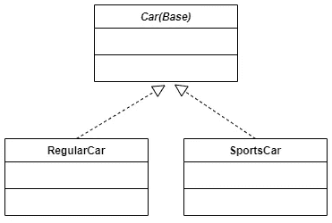

# 用 Python 解释的利斯科夫替换原理(LSP)

> 原文：<https://betterprogramming.pub/the-liskov-substitution-principle-lsp-explained-in-python-6ab92b29d0b8>

## 迈向健壮的软件，坚实的原理 3/5 解释清楚！


照片由[亚伦·伯顿](https://unsplash.com/@aaronburden?utm_source=ghost&utm_medium=referral&utm_campaign=api-credit) / [Unsplash](https://unsplash.com/?utm_source=ghost&utm_medium=referral&utm_campaign=api-credit) 拍摄

这篇文章是关于[坚实](https://en.wikipedia.org/wiki/SOLID)原则系列文章的第 3 部分。
你可以在这里找到第二个帖子[。](/the-open-closed-principle-explained-in-python-f5517488f990)

在我们深入研究这个原则的推理以及它如何与最后两个原则相适应之前，让我们先来看一下定义。

利斯科夫替代原理被正式定义为:

> *设* ϕ(x) *是关于 t 类型的对象* x *的一个可证性质那么* ϕ(y) *对于 s 类型的对象* y *应该是真的其中 s 是 t 的子类型来源:* [*芭芭拉·利斯科夫*](https://en.wikipedia.org/wiki/Liskov_substitution_principle)

面对现实吧，这对现代软件工程师来说毫无意义。

这里有一个更简单的定义:

> 应该可以用一个子类的实例替换一个超类的实例，而不会导致破坏性的改变。

假设你有一个从基类/超类派生的子类(继承)。假设你对子类做了一些改变，比如参数值类型的改变，也许还有返回类型的改变。在这种情况下，您将违反 LSP 原则，因为用子类的实例替换超类的实例将导致破坏性的变化。例如，依赖于基类的代码期望返回类型为`str`，但是当你用子类替换实例时，它返回一个`int`。这可能会导致代码崩溃或引发其他错误。

简而言之，基类的 ***行为*** 必须符合超类的行为。一般来说，子类中的函数签名(函数参数)和返回类型必须保持不变。

这个原则的主要目的是确保在引入新代码时旧的代码库不会中断。此外，它确保灵活的代码。

# 密码

让我们看一个简单的例子。我们通过考虑汽车而不是汽车经销商来稍微改变以前帖子中的场景:

`Car`类定义了一辆汽车。我们用一个名字，齿轮的数量，速度和当前的齿轮位置来初始化它。`changeGear`功能允许换档，而`accelerate`功能将车速提高 1。如果档位处于空档位置`N`，我们不改变速度，而是通知用户。相当简单。


跑车继承汽车。来源:作者。

假设我们也想要一个`SportsCar`模型。我们让它从基类`Car`继承。在初始化时，我们还定义了一个`turbos`变量，它是一个列表，显示汽车支持的涡轮级别。因为行为变化我们需要定义一个新的加速度函数，它以`turbo`为参数。`speed`增加了涡轮增压量，而不是`1`，因此跑车可以加速更快。

在`__main__`函数中，我们定义了一辆普通汽车。

问题是这样的:

如果我们试图用一个`SportsCar`的实例替换`Car`实例，这会导致代码中断，因为`SportsCar`中的`accelerate`需要一个`turbo`参数。

通过 LSP，替换上面的代码应该不会产生错误，代码应该正常运行。

有两种方法可以解决这个问题。

# 解决方案 1

一个简单的解决方案是用具有固定值的`turbo`变量替换`turbos`变量。从`accelerate`函数中删除参数`turbo`，如下所示:

如您所见，函数签名现在与基类函数签名完全相同。这意味着我们可以用`SportsCar`替换`__main__`功能中的`Car`代码，而不会出现代码断裂。耶！

然而，如果你注意到我们在这种情况下有一个固定的涡轮值`2`。如果我们想让用户像以前一样定义涡轮值，该怎么办？
这需要使用一个抽象的类。我们走吧！

# 解决方案 2 —抽象类

问题是我们制造汽车的方式。为了使上面的代码符合 LSP 并具有 turbo choice 的功能，我们必须创建一个 ***抽象*** 基类`Car`。然后我们创建两个继承它的子类，即:`SportsCar`和`RegularCar`。下图说明了这一点:



汽车是抽象的。普通车和跑车实现抽象类。来源:作者。

代码会更有意义:

我们使用`ABC`模块将`Car`转换成一个抽象类。细节并不重要。`init`函数以`@abstractmethod`开始，表示抽象函数。这确保了`Car`不会被实例化。只有从此继承的类才能被实例化。

接下来，我们创建两个继承自`Car`的类:

*   `RegularCar`表示没有涡轮增压的普通汽车
*   `SportsCar`表示带涡轮增压的跑车

`RegularCar`没有其他变化。在`SportsCar`类中，我们可以做我们想要的修改。我们定义了包含额外的`turbo`参数的`turbos`数组和`turboAccelerate`函数。

在这种情况下，改变`SportsCar`中的函数签名并不违反 LSP。为什么？因为基类`Car`是抽象的，所以不能被实例化。
不能实例化，就不能替换。

# 结论

在这篇文章中，我们看了利斯科夫替代原理及其含义。我们看到了一个违反原则的例子，并用两种方法解决了这个问题。

LSP 有助于提高代码的灵活性，并防止在用新代码扩展旧代码时出现问题。LSP 确保代码的行为在新的和旧的代码库中保持相同，从而使代码不容易损坏。总的来说，代码的健壮性因此得到了提高。

这篇文章比以前的文章更复杂，特别是因为我们以迂回的方式处理了这个问题。我想探索一个稍微增加复杂性的有趣场景。我希望你喜欢这些内容！

```
**Want to Connect?***Originally published at* [*https://haseebkamal.com*](https://haseebkamal.com/the-liskov-substitution-principle-explained-in-python/) *on*
```