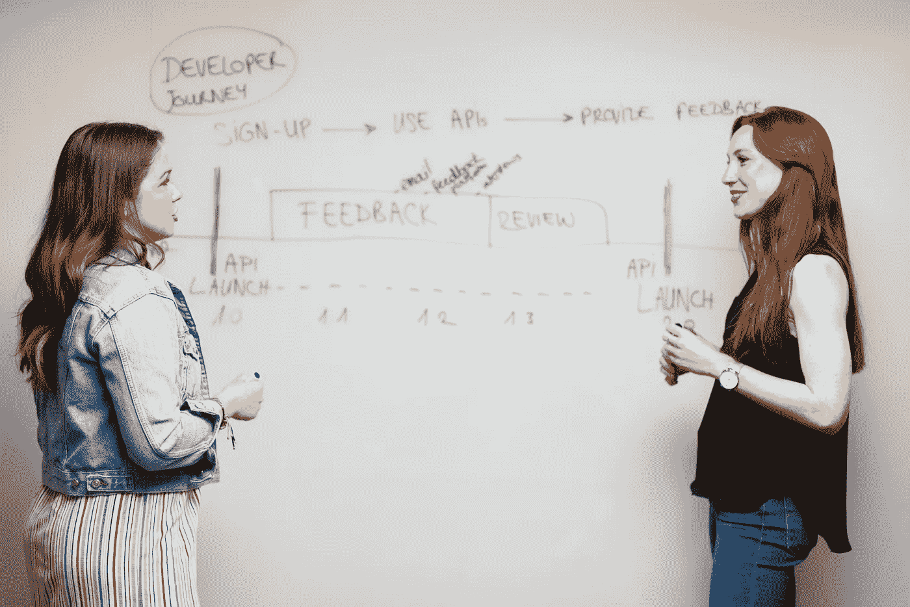

# 我从高级软件工程师那里学到的最重要的经验

> 原文：<https://betterprogramming.pub/the-most-important-lessons-ive-learned-from-senior-software-engineers-7dfbc2e0c6a>

## 你越早学会这些越好

照片由来自 [Pexels](https://www.pexels.com/photo/photo-of-women-talking-beside-whiteboard-3861952/?utm_content=attributionCopyText&utm_medium=referral&utm_source=pexels) 的 [ThisIsEngineering](https://www.pexels.com/@thisisengineering?utm_content=attributionCopyText&utm_medium=referral&utm_source=pexels) 拍摄。

我学到的最重要的软件工程课程来自两个来源:

1.  失败的项目
2.  更有经验的开发人员

以下是我在职业生涯中从高级开发人员那里学到的一些重要经验。

没有一个是非黑即白的，总有例外。只有经验可以指导你何时应该应用或忽略规则。

让我们开始吧。

# 停止过度设计

十有八九，构建不必要的基础设施、特性或抽象是浪费时间。

如果你在一家初创公司工作，情况尤其如此，那里的产品方向会随风而变。

虽然过度设计的情况很少出现(例如 [WhatsApp](https://news.ycombinator.com/item?id=7306066) ，但这对大多数公司来说都不是一个好主意。

我对此有亲身体会。我职业生涯的大部分时间都在创业公司度过，我写了大量的代码，但从未进入市场或获得任何关注。

## 过度设计有两个原因

1.  没有经验的项目经理不会削减功能。
2.  想要开发酷东西的开发人员。

工程时间是科技公司的生命线。它需要明智地使用，并在使用过程中检查是否有用。这是打造 MVP 背后的全部理念。

编写足够的代码，最小化技术债务，并且只有在证明产品/市场适合之后才扩大规模。

与流行的观点相反，短期的建设有助于你长期生存。

# 自动化一切并了解您的工具

做一个懒惰的开发者是可以的。

开发人员管理的是精力，而不是时间。上下文切换是浪费能源的最大元凶。

## 你能做的任何减少上下文切换的事情都是一个巨大的胜利

*   定制您的命令外壳。
*   在你的 IDE 中学习热键。
*   学习 Linux 命令。
*   所有东西都要写别名。
*   学 Git。

如果你每天都在使用一种工具，那么没有理由不成为这方面的专家。这会让你在以后的职业生涯中受益匪浅。当你改变项目和公司时，你会带走这些知识。

但是不要止步于此。你能有多“懒”？

如果你做任何事情不止一次，自动化它(特别是如果它涉及到部署)！

就当这次投资是值得的。

有趣的是，年长的开发人员比年轻的开发人员更了解这一点。

# 永远不要在没有计划的情况下编写代码

在开始一个新特性后立即编写代码是一个新手的错误。

在我的第一个开发角色中，我经常这样做，只是为了发现我写的代码不能工作或者已经存在。

白板非常适合规划。但是一张碎纸片也可以。

至少，在堆栈的每一层都要画出你打算接触的组件。这有助于您缩小视图，并查看各个部分是如何组合在一起的。

这也有助于别人给你反馈。我无法告诉你有多少次我向更高级的开发人员展示了我的计划，却得到一个“行不通”的回答。试试这个“回应。

众所周知，编写代码是这项工作中最容易的部分。知道什么需要编码更难。

最终，在你开始之前，你要知道你在建造什么。没有蓝图不要开始盖房子。

# 测试与黄金同等重要

编写更多的测试。

不是集成测试。用这些盖住你的快乐之路。它们编写、更新和运行都很慢。

但是单元测试是你的朋友。它们写起来和运行起来都很快，阐明了你正在构建的东西，并且防止了退化。

当单元测试发现一个可能会导致 bug 的边缘案例时，我总是感到惊讶。编写测试迫使你考虑所有的用例。

您只能维护这么多未测试的代码。我见过项目失控，在大型未测试代码库上，bug 消耗了 50%或更多的开发时间。

修复 bug 是开发人员最无趣的部分。测试帮助你避免它们。

# 问更多“愚蠢”的问题

一个愚蠢的问题比一个愚蠢的请求更好。

永远不要写一个依赖于未经证实的信息的特写。如果你不确定，你需要问。没有什么比完成一个不能解决原始问题的特性更糟糕的了。

这适用于技术和领域知识。但是后者更经常是开发者犯错的地方。当出现领域知识问题时，在工程和销售之间建立一个沟通渠道来解决这些问题是非常重要的。

我发现以“这是一个愚蠢的问题，但是……”作为问题的开头会让我感觉更好，尽管你可能比我脸皮厚。

虽然你的问题现在可能会惹恼某人，但这总比花几个小时走错方向要好。

# 人类是索引，不是字典

这是我从我的第一个高级开发人员那里学到的。

不要花太多时间去背方法或者算法。把记忆留给电脑。任何期望对功能或语法有百科知识的公司都不了解软件开发的工艺。

但是你应该有快速查找信息的能力。忘记语法是可以的，但是要知道在哪里可以找到好的例子。这需要经验和少量的意图。

与其死记硬背，不如学习更高层次的软件工程概念。了解单一责任原则、设计模式以及堆栈的各层如何通信。

这些将帮助您计算不同实现的权衡。这是人类擅长的，计算机(目前)还不擅长。

# 远离微服务

没有什么比微服务更复杂了。当事务跨越多个服务时尤其如此。

当您从整体服务切换到微服务时，预计部署、调试和规划新功能的难度会增加一个数量级。

坚持使用单一的应用程序，直到它变得太大而无法管理。否则，你就是过度工程化了。

如果你有 Spotify 的工程资源，那就去争取吧。但是如果你是一个三人开发团队，请三思。

微服务本身并没有什么问题。但在很多情况下，它们是寻找问题的解决方案，而不是相反。

# 最后的想法

对于新开发人员来说，没有什么比在有时间指导他们的高级工程师手下工作更有价值的了。

我可以把我最重要的收获追溯到过去与我共事过的几个关心我成长的人身上。

冷门观点:这比你使用的技术或者你加入的公司更重要。

虽然很容易忘记细节，但更高层次的课程会一直伴随着你。

你从其他开发者那里获得了什么宝贵的建议吗？