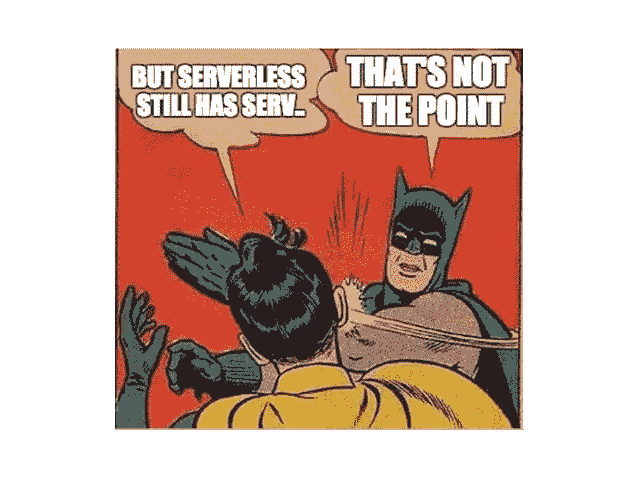

# 关于无服务器的神话和误解

> 原文：<https://betterprogramming.pub/the-myths-and-misconceptions-about-serverless-7b271b8f0dda>

## 以及为什么您应该考虑不使用服务器

照片由[乔丹·哈里森](https://unsplash.com/@aligns?utm_source=medium&utm_medium=referral)在 [Unsplash](https://unsplash.com?utm_source=medium&utm_medium=referral) 上拍摄

对无服务器计算解决方案的需求正在增长。但在我们进一步探讨之前，让我们试着解释一下这种相对较新的现象是什么。*无服务器*这个名字挺矛盾的。不，无服务器并不意味着没有服务器。当然，某个地方肯定有服务器。否则我们怎么能做任何计算呢？

那么什么是无服务器呢？维基百科是这么说的:

> 无服务器计算是一种云计算执行模式，其中云提供商运行服务器，并动态管理机器资源的分配

我最喜欢的描述来自戈杰科·阿季奇。他说，无服务器就像 WiFi 是无线的一样。因为即使有 WiFi，还是要涉及到很多线缆。一旦你无线连接到网络，你就不需要考虑所有连接路由器的电缆了。

无服务器也是如此。即使仍然有服务器运行您的代码，您也不必考虑那些服务器。

# 为什么没有服务器？

有几个原因让你应该考虑去无服务器。

## 可攀登的

想象一下这样一种情况，一个邮局可以神奇地随意增加和取消送货卡车。在情人节前后，当邮件激增时，邮局可以增加送货卡车的数量。另一方面，当需要较少的递送时，递送卡车的数量可以减少。这基本上就是无服务器应用程序能够做到的。

作为一名开发者，当你走向无服务器时，你不必考虑伸缩性，因为它是自动发生的。

## 无需管理服务器

有了无服务器，您无需担心如何为服务器安装最新的安全更新或其他需要完成的维护任务。

这就留出了更多的时间来专注于实际生产代码和核心业务。除此之外，你不需要雇佣有专业知识的人来管理服务器。

这将为你节省时间和金钱，这对每个企业来说都是宝贵的资产。

## 比较便宜的

你不需要为闲置的服务器付费——你只需要在服务器真正工作的时候付费。换句话说，如果服务器上没有运行代码，你就不必付费。

由于大多数服务器在大部分时间里并不积极地做某件事，所以无服务器可以节省很多钱。在某些情况下，成本可以降低 90%。

然而，无服务器化会对性能有一点影响。因为它不是持续运行的，所以无服务器代码在使用时可能需要“启动”。这个启动时间可能会降低性能。这就是所谓的“冷启动”

但是，如果一段代码经常被使用，无服务器提供者会让它随时准备被激活。这被称为“热启动”，不会影响性能。

## 更快、更可控的部署

使用无服务器，不需要为了发布产品的新版本而将代码上传到服务器。开发人员可以非常快速地上传少量代码并发布产品的新版本。代码可以一次全部上传，也可以一次上传一个函数。这是可能的，因为应用程序是函数的集合，而不是一大块代码。

这使得快速更新、修补、修复或向产品添加新功能成为可能。开发人员可以一次更新应用程序的一个功能，这给了他们对部署更多的控制。

## 安全的

供应商负责运行您的代码的服务器周围的系统和网络配置的安全性。当崩溃发生时，供应商将修补其所有的服务器，你甚至不需要考虑它们。

## 全部的

总的来说，我们可以说无服务器减少了开发团队的运营责任，这意味着他们有更多的时间去做对客户真正有意义的事情。

# 神话和误解

无服务器仍在不断成熟，这就是为什么有很多关于它实际工作方式的神话和误解。

## 误解 1:冷启动发生在每个请求上

人们往往夸大冷启动的作用。冷启动并不是每个请求都会发生。尽可能重复使用资源。只有当没有容器运行您的代码时，才会发生冷启动。

## 误解 2:提价

关于无服务器的成本，最常被问到的一个问题是:但是如果亚马逊决定提高 Lambda 的价格呢？这可能是一个合理的担忧，但它对市场力量相当无知。如果 Lambda 的价格提高，顾客可能会转向他们的竞争对手。

除此之外，从历史上看，数据并不支持这是一件事。亚马逊在过去五年中宣布了 67 次降价和零涨价。

## 误解 3:无服务器成本更高

无服务器可能会花费您同样多的成本，甚至更多，但是您可以完成更多的工作。没有必要投入任何时间和资源来维护服务器。你不需要花钱雇一个有知识来维护这些服务器的人。

开发人员必须做的操作工作量减少了，让他们有更多的时间来编写代码。因此，即使花费更多的钱，也可以花更多的时间来满足客户的需求。