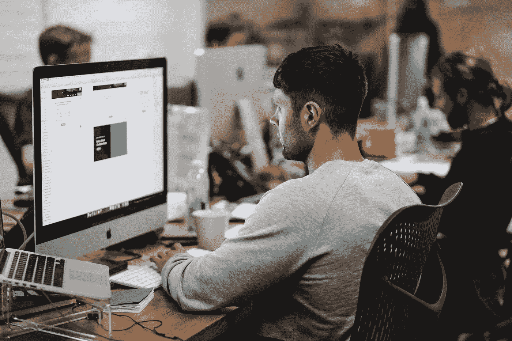

# 我在所有实习中收到的反馈中

> 原文：<https://betterprogramming.pub/the-one-piece-of-feedback-ive-received-at-all-my-internships-78a4aed74d70>

## 问很多问题

当你得到第一份实习工作时，你感到有压力要给人留下深刻印象——需要向你的新同事证明自己，不惜一切代价消除那种冒名顶替综合症。你承担起自己的责任，尽可能快地、独立地完成每一件事。如果你能很快完成所有的工作，而且都是靠你自己，那么你一定做得很好，对吗？

嗯，当然— *如果* *你可以做*。但是如果你刚刚开始(或者即使你已经有经验了)，你将很难独自完成。很有可能你会挣扎，你会落后，你会感觉很糟糕。

我知道当我在谷歌实习的时候，如果我开始落后于时间表，我会对自己非常严厉。在我实习开始的时候，有一个特别的任务，执行一些 CocoaPods 开源工作，对我来说真的很难。鉴于实习时间很短，即使我只落后了几天，这也让我很难受。

一个人努力工作是很辛苦的。

实习的好处在于你不必独自奋斗。你周围的每个人都希望你成功——你需要利用这一点。

到目前为止，我已经实习过三次了——两次在洛克希德·马丁公司，一次在谷歌公司——我在所有这些公司都得到了一个反馈:“*你问了很多问题，这真的很棒。*

当我在洛克希德·马丁公司第一次实习的时候，我还在上高中，我有一种想法，他们不会真的指望我独立工作，所以我会问他们一些问题。“我就是这么做的。起初我以为我是个麻烦，但随着夏天的推移，我开始意识到每个人都乐意帮忙。他们希望看到我解决自己的问题并取得成功。

第一次实习是用 Qt 在 C++中制作一个 GUI。我从来没有真正做过太多的 C++，我甚至从来没有听说过 Qt(我也不知道如何发音！).我试图在 StackOverflow 上寻找解决方案，我找到了一些，但当时我真的需要指导和导师来完成我的项目。提问很有帮助。

通过向你的同事提问，你会得到你想要的答案，但你也会建立更好的关系，这是非常必要和有用的。此外，如果你问的是一个技术问题，而你采取的方法是不正确的，他们会发现这一点，并把你放在正确的路线上。如果你试着在网上独自解决这个问题，你可能会找到正确的答案——但它可能会导致错误的问题！这些静态的网上文本给出的答案并不像你的导师和同事给出的那样是个人的或令人鼓舞的。

# 问问题并没有减少我在他们眼中的成就

从来没有人说过我应该停止联系其他员工。通过提问，我展示了我为解决问题所做的工作。

当我在洛克希德·马丁公司第二次实习的时候，那个本该领导我的项目，并且知道我项目所有细节的人，在第一周决定跳槽。显然，这是一个巨大的挫折，因此我很挣扎。如果我整个夏天都在努力，直到我最终得到类似“完成”的东西，我会因为完成而得到一些表扬。如果我整个夏天都在努力，最终得到了一个半成功半失败的产品，我可能不会被邀请回来。如果我经常问问题，不仅炫耀我一直在做什么，而且炫耀我在仍然失败的任务中的努力——这种努力会得到承认。在实习中，付出 100%的努力可能比完成项目更能获得回报。除了承认你的努力，正如我之前所说的，你的老板或导师会在你仍在努力的领域帮助你。

有时候，我的导师甚至建议我多接触一些人——去找一个对我遇到的问题有最佳解决方案的人——这个建议产生了奇迹。

在谷歌，我遇到了一个没人能真正帮我解决的问题——这是一个更小众的 CocoaPods 软件问题。所以我去了我们工作组的代码库，只是代码搜索类似的代码行，并做`blame`来找出是谁写了这一行。是在澳大利亚的一个家伙，在地球的另一边，他很乐意帮忙！我提问的时候从来没有被拒绝过。有时候他们在那一瞬间，甚至那一天都无法回答，但他们从来没有拒绝过我。

# 这并不是说你一遇到麻烦就应该寻求帮助

你还是应该先解决问题，因为这显示了你的主动性和积极性。立即提问可能会给人留下这样的印象:你不是在寻求学习和提高，而是想尽快完成你的工作。

根据你正在努力解决的问题的大小，在你寻求帮助之前，最好尝试解决它几个小时，或者一天。在谷歌，我通常会花大约半天到一天的时间来解决一个问题——如果我完全卡住了，那么我会问一个问题。

# 确保你问的是有内涵的问题

假设你有一个抛出异常的函数。不要用`Hey im having an issue with my code`给你的同事发即时消息。这不是一个有内涵的问题，它没有给出你的情况的背景，所以他们无法帮助你，你打断了他们的精神状态。

这里有一个好问题:`Hi, my function findPalindrome is throwing a NULLPointerException when I feed it "radar", I'm not sure why this is happening. When you get the chance can you come take a look?`。

带着那个问题，我清楚地说明了手头的情况，给了他们一些脉络，告诉他们，只要他们方便，随时可以帮我。这比隔几个小时发一次`I have an issue`会给人留下好得多的印象。

提问让我更快地完成工作，没有不必要的挣扎，这样我就可以着手下一个问题。有人曾经告诉我，你能做的最糟糕的事情就是坐在那里苦苦挣扎——如果你这样做，你就不会在实习项目中走得很远。

就像一句古老的非洲谚语:如果你想走得快，就一个人走。想走远，就一起走。