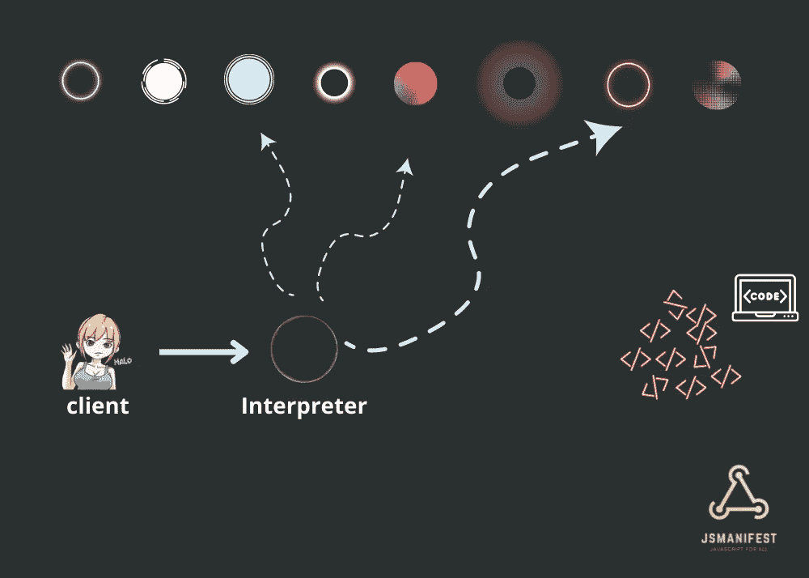
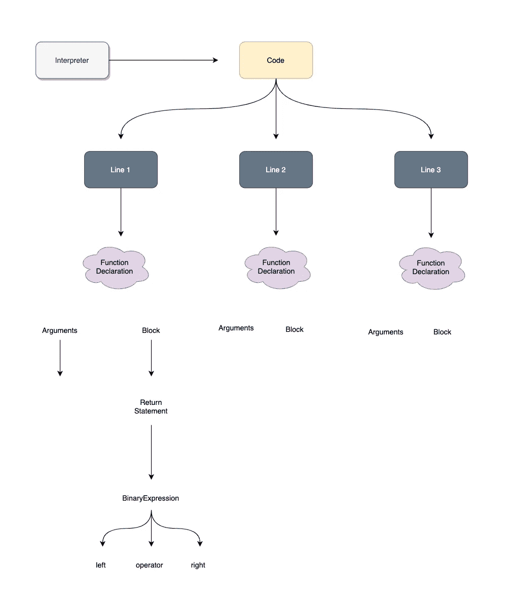
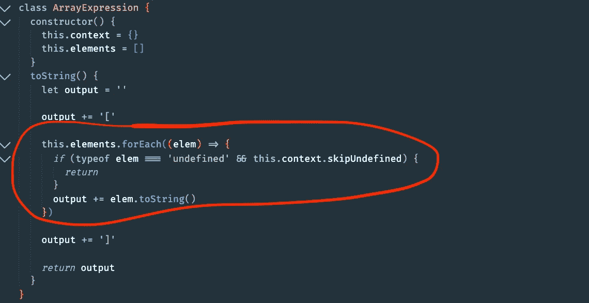
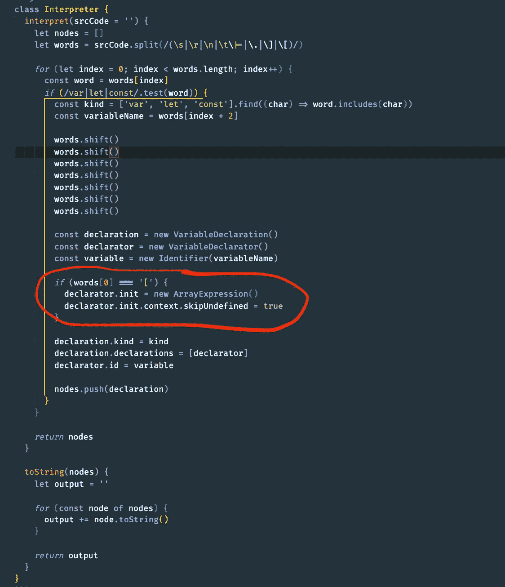
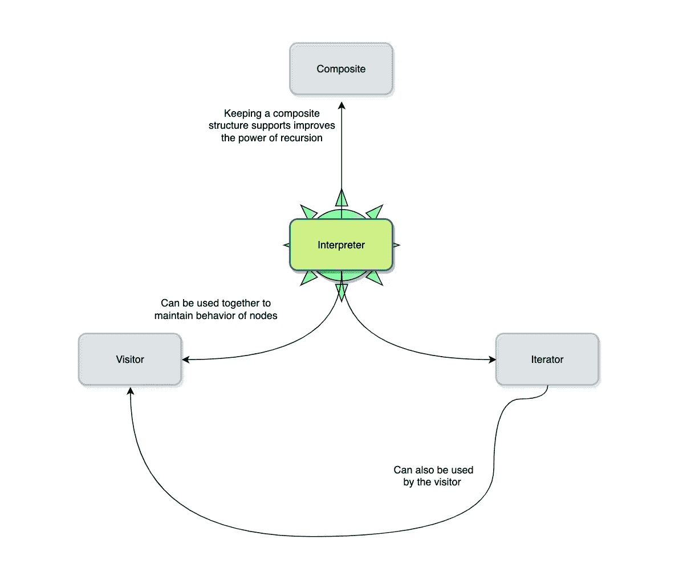

# JavaScript 中解释器设计模式的威力

> 原文：<https://betterprogramming.pub/the-power-of-interpreter-design-pattern-in-javascript-4ddd449c20e9>

## 解释是必要的

作者图片

在本文中，我们将讨论 JavaScript 中的解释器设计模式。我们将实现一个解释器以及源代码的基本语法表示。我们将创建一个供客户端代码使用的接口(例如解析器)。

设计模式分为三类:行为模式、创造模式和结构模式。解释者属于行为组。在所有的模式中，解释者似乎是最让人困惑的，但在我的经验中，从更高层次的角度(跳出框框)思考，将有助于让我们头脑中的那个灯泡突然亮起来。

# 我们什么时候需要应用解释器模式？

有时我们可能会遇到这样的情况，我们需要一些接口来告诉解释器如何根据特定的上下文进行解释。这种模式也广泛用于 SQL 解析、符号处理引擎等。

可以认为这有点像创建一种脚本“语言”

例如，数组可以在其包含更多数组的索引中包含更多数组，等等。代码如下:

目标是创建某种在大多数情况下能够递归的“语法”表示。

当我们看它的结构时，语法表示中的每个部分要么是一个复合体，要么是一棵树的一片叶子。从更高层次的角度来看，请注意这些语法表示是如何形成复合设计模式的结构的:

请注意，有些子节点包含更多的子节点，深度根据需要增加。这就是递归至关重要的地方，它在遍历算法中变得必不可少。

这种模式的主要参与者是解释器本身。

## 实现解释器和语法表示

让我们继续创建解释器。解释器将有一个`interpret`方法，负责运行我们的代码并从中产生标记。这些标记将包含解释器创建组合表达式所需的规则，以便解析器等客户端代码能够理解:

让我们看一下第一行(我们将把它初始化为一个空数组，以便于理解):

如果我们在代码中通读这一行，我们如何将名字`items`转换成`collection`？

我们可以一行一行地读，然后像这样做:

然而，这不是很有效，因为没有一种可靠的方法来查看前一个/后一个索引，以及能够判断哪一行或哪一列以特定的表达式、声明等开始。我们也没有办法做一些有用的事情，比如更新声明符的类型(`var`、`let`、`const`)。

当我们利用解释器模式时，我们创建了一个实际的接口，该接口将接受代码，将表示语法部分的相关对象连接在一起，并指示解释器如何处理它们。请记住，这些对象中的每一个都有自己的规则来指导解释器，它们产生的输出可以被客户机代码理解，就像解析器一样。

所以，回到这一行:

我们可以创建一个接口。请记住，这个接口是这个模式中最强大的部分，因为我们可以定制每个类来做我们想做的任何事情，比如覆盖默认的`toString`方法:

完美！这是解释器设计模式在起作用！我们现在有了一些语法的表示法。

这种模式非常强大。有了这个接口，我们可以看到我们将每个类上所有默认的`toString`方法都重写为`structure for our domain`。

接下来，我们需要一个解释器来接收源代码并通读它们。我们的解释器将是在实际实践中使用的更加简化的版本。为了这篇文章的缘故，我只包括了完全代表我们的一行程序所必需的部分，如下所示:

这样，客户端代码就可以利用我们的解释器并操作我们的代码行，如下所示:

## 语境

上下文对象通常用在连接解释器中。如果我们可以在所有的语法表示对象中覆盖`toString`，我们肯定可以通过在一个名为`context`的对象中输入有用的状态信息来提高解释器的能力。

例如，我们可以让客户端代码在构造数组表达式输出时能够跳过`undefined`值:

# 其他模式的提示

*   解释器模式在处理复合结构时是最强大的。换句话说，在处理复合结构时，必须将复合模式与解释器模式结合起来。
*   在构建器模式中，构建器可以用来创建语言的语法表示形式的层次结构，并允许客户机在解释器模式中使用它们。
*   抽象工厂可以用来创建复杂的对象(例如在 javascript 中，这可能是一个很长的函数返回语句，包含大量的二进制表达式)
*   像复合模式一样，访问者和迭代器模式在解释器方面也很强大。访问者通常用递归遍历算法实现，该算法本身实现迭代器模式。解释器可以利用访问者来遍历复合树。

# 结论

感谢您的阅读，期待以后有更多来自我的优质帖子！