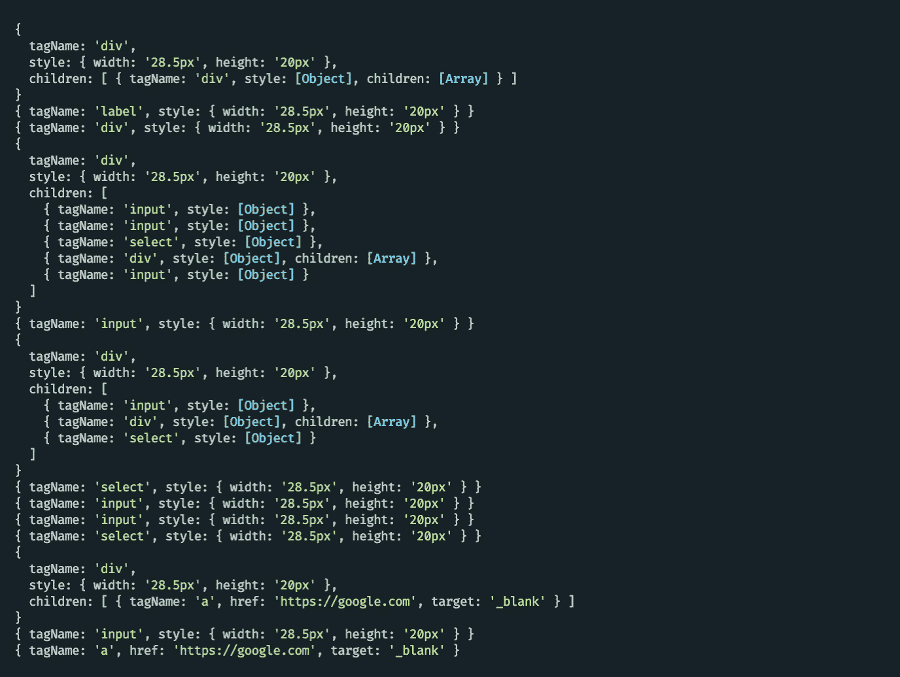

# JavaScript 中迭代器设计模式的威力

> 原文：<https://betterprogramming.pub/the-power-of-iterator-design-pattern-in-javascript-e8a9ec703fb5>

## 迭代器是每个集合最好的朋友

hitesh choudhary 在 [Pexels](https://pexels.com) 拍摄的照片

几乎在我们编写的每一个 JavaScript 应用程序中，总会有某种形式的集合循环。例如，当我们通过 HTTP 请求接收数据时，循环收集就变得很有必要。

由于数据可以采取多种形式，并不是每一种循环算法都能够比其他循环方法更快和/或更有效地完成工作。

在这种情况下，有一个明显的问题:我们需要能够在不同的算法之间切换，以便在需要时遍历集合。解决这个特定问题的设计模式称为迭代器设计模式。

也就是说，在这篇文章中，我们将回顾 JavaScript 中的迭代器设计模式，并动手实现。我们将了解为什么在开发时需要不同的算法。

# 迭代器模式的视觉外观

从视觉角度看，这是图案的样子:

# 履行

假设我们有一个数组`arr`，它是一组数字的集合:

如果我们正在开发一个程序，我们有一个常用的函数，它接受一个值列表和一个回调函数，该回调函数返回一个我们正在寻找的值，使用回调函数作为事实的来源，我们可以使用的最明显的可用策略之一是`for`循环:

或者我们可以使用迭代器模式，而不是将迭代的不同变体作为可注入算法来处理。代码如下:

将实现细节抽象出来更好的原因是，集合可以以各种数据结构出现。使用替代算法可以更有效地遍历一些数据结构。我们可以允许我们的对象能够在运行时从一个迭代器切换到另一个迭代器，只要有足够的算法来完成任务。

让我们继续我们的例子，创建一个简单的迭代器:

我们能够遍历集合并查看结果:

如果我们有一个嵌套的项目集合会怎么样？我们当前的迭代方法不再有效，因为它没有考虑更深层次的键值，如下所示:

数据集合会变得非常复杂，它们不总是简单的 JSON 对象。JavaScript 中的程序通常获取数据结构，转换它们，并且只对外部公开它们，这些外部公开的数据结构带有一些功能，可以处理一些常见的任务，比如生成最终的数据集合。

这就是为什么`Iterator`模式如此重要，因为它促进了可扩展性、可伸缩性和组合性。

也就是说，我们可以使用不同的算法来获得我们的`elems`集合的所有后代，如下所示:

我相信你已经注意到了语法`Symbol.iterator`。JavaScript 用它来为我们附加的任何对象放置默认迭代器。不要混淆，假设这是模式的一部分。只是语法糖而已。我们只是利用这种语法使`for of`能够运行，这完全与 JavaScript 有关。

让我们直接回到迭代器模式。在这些例子中，还没有太多有用的用例来展示它能变得多么强大，但我们确实经历了它在实际用例中解决的一个问题。

因此，让我们进一步扩展我们的例子，以便对我们希望如何使用集合进行更多的控制，因为理解接下来的部分对于理解这个模式如何真正帮助我们是至关重要的。

到目前为止，我们得到的是一个代表性 DOM 对象的嵌套集合。我们暴露了我们在使用常规`for loop`时遇到的一个问题，它不足以覆盖深度集合，所以我们实现了迭代器模式的变体来满足我们的需求。

然而，在每次迭代中能够看到我们当前在复杂数据结构中的位置是非常有帮助的。

让我们假设我们想要访问当前项(我们当前正在做)，我们当前所处的深度(每访问一个元素的`children`增加`depth`)，集合的当前索引，集合中的前一个和下一个项，迭代中的前一个、当前的和下一个元素(这与当前集合不同)，以及迭代中的项当前看起来像什么。

有了这些信息，我们就可以对我们的元素集合做任何我们想做的事情。

我们可以这样实现:

我们现在需要做的就是调用它并提供回调。我们的回调将在每次迭代中提供所有这些信息:

结果如下:

# 结论

希望你在这里找到了有价值的信息。以后多多关照！