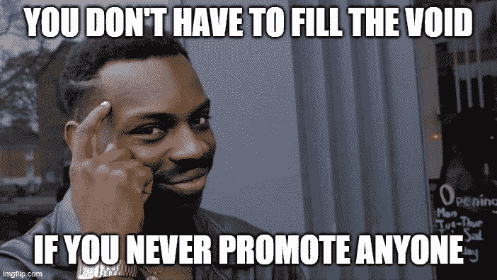
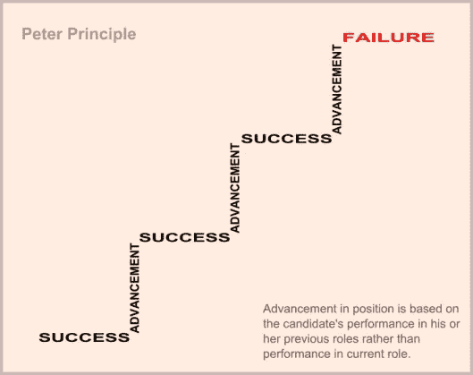

# 提升高绩效员工的问题是

> 原文：<https://betterprogramming.pub/the-problem-with-promoting-high-performers-63d52c019d74>

## 帮助你的直接下属在职业生涯中更上一层楼是一件令人兴奋的事情，但是不要忘记计划好晋升的副作用

“你做得很好，几乎太好了。我们不能提拔你，因为你不做你目前正在做的事情会伤害我们的底线。你明白，对不对？”照片由 [LinkedIn 销售解决方案](https://unsplash.com/@linkedinsalesnavigator?utm_source=medium&utm_medium=referral)在 [Unsplash](https://unsplash.com?utm_source=medium&utm_medium=referral) 上拍摄

内心的斗争是真实的。您团队中的某个人持续超出预期，并为职业阶梯中的下一个角色做好了准备，但是提升他们可能会对您的团队产生重大影响。

职责的改变，以及花在他们以前擅长的事情上的时间减少可能会令人害怕，**但是你*必须*找到一种方法让它运转起来**。如果你的团队发现你因为假设或你糟糕的计划能力而害怕提升个人，他们会开始离开，你还是要处理这些问题。

下面我概述了一些在提拔高绩效员工时产生的问题，以及防止这些问题出现的可行方法。

# 问题:它们留下了空白

如果你没有准备好，提拔一个优秀的员工会给你的团队留下严重的空白。特别是当一个人获得了内部晋升，并最终减少了他们花在交付上的时间时，你可能会无意中导致生产力的严重下降。

根据你提拔某人的级别，你*可能会*看到由于他们的缺席而产生的一系列副作用。不仅产量下降，其他团队成员的生产能力也下降了。

为了清楚起见，这是讽刺。如果你作为管理者有这种想法，请重新考虑你的角色。

## 怎么办？

*确保离开之前的角色有一个过渡期*。您和您的团队可以设定过渡的时间表，但这将有助于收集角色的所有不同部分，并让您更好地了解如何防止出现空缺。计划好这件事，不要让它拖延太久。为旧的职责设定一个有限的停止点对整个团队和被提升的个人都有好处。

*确定下一个填补角色的人是谁。*不需要马上决定下一个人选，但你应该有一两个你认为能够胜任的人选，并开始填补空缺。通过了解谁将担任这个角色，你为其他人提供了成长的机会。

认识到新角色可以创造新的倍增能力。如果你将一个人提升到可以花更多时间指导的水平，他们的乘数效应会增加。一定要给他们探索的空间，如果没有有机地发生，要有意识地创造指导的机会。

# 问题:他们可能无法胜任新的角色

我之前讨论过这个概念，即[增长不是线性的](/growth-is-not-linear-3e5eb14b1c2c)。晋升是成长的一种形式，你不应该指望一个人在新的岗位上没有一点坎坷就能顺利进入。

当他们学习如何满足新角色的期望时，会有挣扎和挫折，他们可能不会马上适应这个角色的所有方面。你可能会开始质疑自己是否犯了一个巨大的错误或者晋升得太快了。也请记住，新的角色和责任可能会引发个人的冒名顶替综合症，所以你也要与之斗争。

不要陷入彼得原理陷阱。

## 怎么办？

*对角色的清晰性和期望值加倍。*如果你还没有，确保你的公司里有每个职位的描述，有人可以被提升到这个职位。在许多公司，这是由职业水平文档来处理的，显示了个人发展过程中每个角色之间的差异。角色描述中的清晰性应该为新角色勾勒出清晰的成功标准。

*考虑一个 30–60–90 的。当你在一家新公司开始工作时，许多入职计划会给你一个 30/60/90 天的计划，那么为什么对新的角色要有所不同呢？概述在新职位的前 90 天内你对个人的期望，以及他们的新职责与旧职责有何不同。*

*不要做有抱负的晋升。"*但是他们在目前的职位上做得非常好！"确实有道理，但是他们有没有表现出他们能够在三到九个月的时间里持续地履行下一个级别的职责？在某人准备好之前提拔他，或者因为你相信他能在新的岗位上取得成功，即使他还没有表现出可靠的才能，这可能是危险的。

# 问题:他们可能讨厌自己的新角色

你问过你要提拔的人是否有兴趣被提拔吗？我知道这个问题看起来很愚蠢，但是有些情况下，个人**不想要**下一个职位。

我在一些组织中看到过很多这样的例子，在这些组织中，你可以选择员工工程师或者工程经理。

在员工方面，你的角色变得不那么亲力亲为开发和交付，更多的是关于架构和你的代码库的未来的更高层次的思考。有更多的指导，更多的理论问题解决，和更多的工程策略。不是每个人都希望如此。

对于工程经理来说，这是一个完全不同的工作。一般不再有动手操作键盘的时间或功能开发。新的重点是个人和团队的成果。我再怎么强调也不为过，不要强迫人们扮演这个角色。

“我犯了一个可怕的错误。”由[塞巴斯蒂安·赫尔曼](https://unsplash.com/es/@officestock?utm_source=medium&utm_medium=referral)在 [Unsplash](https://unsplash.com?utm_source=medium&utm_medium=referral) 上拍摄的照片

## 怎么办？

*与你的直接下属谈论他们的职业目标*。永远不要假设有人想要职业阶梯上的下一个角色。可能他们生活中发生的事情已经够多了，以至于他们满足于保持稳定。金·斯科特称这些人为“摇滚明星”。对自己的角色很坚定，对没有额外的晋升感到满意的人。

*增加签到频率*。继续检查新角色的进展情况，并考虑将你们的对话提升到每周一次。在新的角色中更容易做出修正或调整，大多数人都希望确保他们达到预期。当你们都觉得舒服的时候再拨回来。

摇滚明星没什么不好(从任何地方的任何地方突然冒出来)

# 最后的想法

提升个人在各个方面都应该是一种很好的感觉，有助于推动企业向前发展。这需要时间和努力，也是管理中最有回报的部分之一。

如果没有正确的计划，晋升可能会变得灾难性，所以花些时间想想晋升对团队和整个公司意味着什么。

注意不要和新提拔的人陷入旧的习惯，让他们承担旧的职责。给他们一个成长的机会，并相信你已经为成功建立了正确的结构。

提拔个人还需要考虑哪些因素？