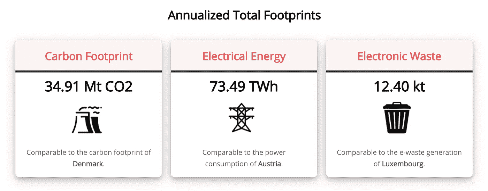
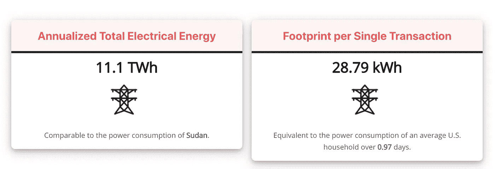

# 以太坊 2.0 风险证明旨在解决的问题

> 原文：<https://betterprogramming.pub/the-problems-that-ethereum-2-0-proof-of-stake-aims-to-solve-5361c155461a>

## 它对网络、基于网络的构建和加密挖掘意味着什么？

韦斯·希克斯在 [Unsplash](https://unsplash.com?utm_source=medium&utm_medium=referral) 上的照片

比特币和 Monero ( [XMR](https://cointelegraph.com/xmr-price-index) )社区仍然是最致力于工作证明概念的一些社区。

# 以太坊期待已久的升级

感觉已经来了很久了。那是因为它已经。它已经酝酿多年，从 2018 年开始讨论。以太坊 1.0 关注可伸缩性和安全性。随着计划中的系统升级，这些将得到改善。

 [## 以太坊

### 解散 GitHub 是超过 5000 万开发者一起工作的家。加入他们，发展您自己的开发团队…

github.com](https://github.com/ethereum) 

这次大规模升级包括重新设计整个[以太坊](https://ethereum.org/en/)平台，这将导致推出这个新的、更具可扩展性的版本。以太坊网络的实施将于 2020 年夏天开始，目前正在进行中。

所有阶段都需要完成，这可能会看到升级运行另一两年。

*   阶段 0 — **信标链—** *预计:2020 年*
*   第一阶段— **碎片链—** *预计:2021 年*
*   1.5 阶段— **Mainnet 成为碎片—** *预计:2021 年*
*   第 2 阶段— **完全成型的碎片** — *预计:2021 年+*

作为以太坊 2.0 实现的一部分，这是一个充满争议的变化，它将从工作证明变成利益证明共识。

## 从工作证明(PoW)到利益证明(PoS)

以太坊(1.0)目前是工作证明，很像比特币。

然而，以太坊网络 2.0 版正在改变其共识算法。简而言之，这意味着它正在改变同行就分布式账本的现状达成共识的方式。

这将影响 ETH 的开采方式，以及如何奖励矿工在网络上验证交易。它改变了矿工使用的方法以及验证网络和获得奖励所需的要求。首先，矿工将被更准确地称为*验证者*。

## 如果我已经拥有一些 Eth，这意味着什么？

嗯，没什么。

以太坊 2.0 将完全兼容 Eth。这是对以太坊基础设施的改变。这意味着 DApp 用户或 DApp 开发者不需要做任何事情。因此，您将能够毫无问题地在 Eth2.0 中使用您现有的 ETH。

# 工作证明支持计算能力

工作证明(Proof-of-work)或 PoW 是区块链网络中最初的共识算法。在区块链中，这种算法用于确认交易，并向链中产生新的区块。有了 PoW，矿工们相互竞争，在网络上完成交易并获得奖励。你可能听说过矿工(和他们的计算能力)在获得任何奖励之前必须解决的密码难题。

## 工作证明有一个能量问题

比特币开采是一个环境问题。多年来，批评者一直指出比特币的碳足迹是其最大的问题之一。这是工作验证方法和计算能力的副产品，而工作验证方法和计算能力是网络验证交易所必需的。开采比特币需要消耗大量电力和排放大量电力。

2019 年 7 月的一项[估计](https://www.statista.com/statistics/881472/worldwide-bitcoin-energy-consumption/)显示了比特币的能耗有多高。这项测量的年价值超过 70 太瓦时。这是一个通常附加在像澳大利亚这样的欧洲小国总用电量上的数值。尽管认识到它只占全球数字的 0.28%是很重要的，但它仍然很重要。

比特币能耗—【https://digiconomist.net/bitcoin-energy-consumption 

以太坊 1.0，也是工作证明，也有这些相同的问题。以太坊 1.0 也是这样挖掘的，有很高的计算能力，也因此有很大的能耗。话虽如此，[根据数字经济学家](https://digiconomist.net/ethereum-energy-consumption/)的说法，以太网的年发电量为 11.1 太瓦时。

如下图所示，这与苏丹的耗电量相当。尽管以太坊消耗的能量比比特币少 85%，但它仍然足以每天为 717，797 个美国家庭供电。

以太坊能源消耗—[https://digiconomist.net/ethereum-energy-consumption](https://digiconomist.net/ethereum-energy-consumption)

## 更强的计算能力=更强的控制

赢得加密挖掘彩票的机会，意味着因解决特定哈希的计算难题而获得奖励，相对于投入到挖掘中的计算能力和资源而言，会增加。这意味着 51%的攻击(在网络上占多数)将是强大计算能力的结果。它将指示网络上的大部分哈希速率。

如果你想知道一个网络遭受 51%攻击的影响，读一读[对以太坊经典](https://forkast.news/hash-power-51-attack-rent-huge-vulnerability-proof-of-work-blockchain/)成功的 51%攻击，其中黑客窃取了数百万。

 [## 加密货币能防 51%攻击吗？—解密

### 昨天对以太坊经典的 51%攻击是最近高调利用一个众所周知的问题…

decrypt.co](https://decrypt.co/4408/cryptocurrencies-protect-51-attacks) 

在较小的网络中，如以太坊经典，获得 51%的成本较低。如果你在比特币或以太坊(1.0)上获得 51%的收益，你将分别花费 549，113 美元和*247，628 美元。在以太坊经典网上，你要花 4686 美元。*

 *[## 不同加密货币遭受 51%攻击的成本| Crypto51

### 这是一个硬币的集合，也是每个网络 51%攻击的理论成本。

www.crypto51.app](https://www.crypto51.app/)* 

# *股权证明有利于资本*

*利益证明(PoS)概念表明，个人通过验证大宗交易进行挖掘的能力与他们在网络中拥有的股份数量(加密货币)相关。*

*用加密术语来说，赌注意味着将你的加密资产锁定在网络中，并因此获得回报。PoS 基于投资回报(ROI)激励节点验证网络。这意味着要在以太坊 2.0 上挖矿，你需要把你的 ETH 锁在网络里作为赌注。*

*在以太坊 2.0 中，你需要下注最少 32 ETH 才能成为验证者。然而，赌注池和服务使每个人都有可能参与其中，你将投入更少的 ETH 和分享池内的回报。*

## *更大的股份=更大的权力*

*由于以太坊 2.0 将根据股份分配采矿奖励，这意味着矿工拥有的 ETH 越多，他们拥有的采矿权力就越大。简而言之，这将让富人变得更富——这是我们在资本主义世界中再熟悉不过的事情。*

*在风险证明中，要成功实施 51%的攻击，需要获得 51%的加密货币。然而，51%攻击的动机可以通过巧妙的协议设计来缓解。*

*我们将在以太坊 2.0 中看到的 PoS 共识机制将应用旨在防止网络攻击的规则。*

*这些规则是:*

*   *任何被发现违反这些规则**的验证者将被削减并从网络中驱逐**。*
*   *其他节点**将恶意节点**和任何其他已经使用攻击者分支的节点列入黑名单。*

*斜线意味着验证器的大部分股份被移除。在最严重的情况下，这可能是整个 32 ETH 的股份。*

# *以太坊 2.0 PoS 将更具性能*

*利益证明系统通常比工作证明系统具有更好的性能。*

*[以太坊 2.0 将使用*分片*](https://cointelegraph.com/news/vitalik-buterin-proof-of-stake-sharding-to-make-blockchains-1-000x-more-efficient) 的实现，这是一种能够实现更快吞吐量的分区技术。这将以太坊区块链分割成多个并行运行的区块链。这些被称为 [*碎片链*](https://ethereum.org/en/eth2/#shard-chains) ，对于增加以太坊每秒可以处理的事务数量(TPS)非常重要。他们只需要下载、计算、存储和读取该碎片上的每一笔交易。*

*每个碎片链将能够处理与当前以太坊 1.0 网络相同的流量。因此，吞吐量的增加与碎片数量成线性关系。*

*以太坊 PoS 一致性设计被描述为*快速终结*，其中通过在验证器和网络节点之间快速达成一致性，块以比 PoW 系统更快的速度产生。*

*作为分片的结果，在每秒链上事务(TPS)和网络传输的实际结算方面，利益证明网络比工作证明网络更有性能。*

*比特币和以太坊 1.0 等工作证明系统的交易时间很慢。在比特币区块链上开采一个区块预计需要十分钟。以太坊更快，预计时间 10 到 20 秒。相对于比特币，这似乎很快，但以太坊 2.0 将在分片的帮助下缩短时间。*

*与 4.7 TPS(比特币)和 15 TPS(以太坊)相比，以太坊 2.0 最终将促进每秒大约 100，000 次交易。*

*客观地看，Visa 的高级全球处理网络(VisaNet)应该能够处理 24，000 TPS，尽管其他人估计这一数字在 1，700 左右。*

# *以太坊 2.0 PoS 安全*

*利害关系证明的批评者指出了几个漏洞，如远程攻击，这是 51%的攻击，但开始于创世块，弱主观性和“没有利害关系。”*

## *远程攻击和弱主观性*

*在 PoS 远程攻击中，攻击者将使用 genesis 块中区块链的当前状态，结合 ETH 的重要股份，来创建攻击者将欺骗网络用户使用的恶意新链。这个新的链将会取代主链，理论上可以用这些新的块和事务重写事务历史。*

*远程攻击是由于弱主观性而存在的，它会影响添加到网络中的新节点或那些在长时间离线后在线的节点。这些新节点将无法立即确定哪个分支是主链。因此，弱主观性是新节点或离线节点对其他节点关于系统当前状态的依赖。*

*在工作证明系统中，确定主链的一个很好的方法是通过*最长链规则*，它反映了创建链所花费的工作量。*

*在 PoS 系统中，由于创建最新链的(几乎)无成本的过程，最长链规则不足以确定主链，因此出现了弱主观性。*

*创建最新的竞争链在 PoS 中比在 PoW 中要容易得多。因此，新节点或长时间离线的节点必须信任它们从其他节点接收的关于哪个链是有效链的信息，从而导致弱主观性。*

*在 PoW 中，假设由于达到主链长度所需的巨大计算资源投资，竞争分支从 genesis 块开始的远程攻击是不可能的。话虽如此，标准的 51%攻击在 PoW 中理论上仍然是可能的，但 PoW 系统中的最长链规则足以对抗任何与弱主观性和远程 51%攻击具体相关的问题。*

*在 PoW 中，由于建立、运行和维护资源的成本很低，因此对网络的攻击得到了缓解。因此，花费在验证块上的计算能力保证了 PoW 区块链免受恶意参与者攻击的安全性。因此，较小的连锁店更容易受到攻击。*

## *没什么危险*

*在一个幼稚的赌注证明实现中，经济上合理的决定是将您的赌注放在所有的分支上，这样您就有更好的机会为获胜的分支做出贡献。这是有意义的，因为不像在 PoW 中花费计算能量来进行块验证，在 naive PoS 中，在验证和帮助达成共识时没有任何风险。这是一个需要达成共识的问题，因为如果每个人都被激励去验证所有的链，就主链达成共识将会很困难。*

## *以太坊 2.0 有这些问题吗？*

*理论上，是的。*

*然而，由于以太坊 2.0 的 PoS 实现，恶意参与者将不得不绕过用于防止 51%攻击和无风险的安全措施。这些保护措施使得在攻击过程中不摧毁他们所有的 ETH 几乎是不可能的。*

*在弱主观性的情况下，为了确保关于有效链的信息是准确的，新的或在一段重要时间后上线的节点将必须从可靠的来源(例如区块链浏览器)获得最近的块散列，并将其作为“检查点”插入到它们的区块链客户端中。这是处理弱主观性的方法，它依赖于对可靠来源的信任。虽然不完全符合不可信的系统，但它不应该真正成为一个问题，除非信誉良好的来源受到损害。*

*恶意攻击将导致削减，这足以使这种尝试的成本太高，无法合理地实施。以太坊的(2.0)设计还打算通过主要的网络分区保持活动，即使大量节点离线，也能限制弱主观性的影响。有了这些措施，不当行为的后果将等于存款+奖励，而不是战俘制度中的奖励。这被认为可以提高网络的潜在安全性。*

*所以以太坊 2.0 不是幼稚的 PoS。*

# *集权的风险*

*PoS 基于赌注，即用户在网络上持有的 ETH 数量。因此，更大的奖励分配给富裕的贡献者，这造成了大型令牌持有者 ROI 的滚雪球效应。这威胁到网络的分散验证过程。它本质上给了富有的验证者更多的权力。*

*由于采矿设备的固定成本，那些持有更多 ETH 股份的人也将获得不断增加的利润率，此外还有不断增加的激励力量，因为他们持有 ETH 奖励，看到他们的投资回报率上升。*

*在 PoS 系统中，拥有 32 个 ETH 的用户的硬件成本将与拥有 200 个 ETH 的用户相同，这是因为他们关注的是利益而不是采矿能力。因此，一些人认为，相对于小股东的支出，采矿成本可能过高，可能会让他们的钱包离线。这可能会导致以财富为基础的中央集权的增加。*

*然而，任何人都可以成为 PoS 验证机，而不需要专门的硬件。因此，你可能会说，由于进入门槛较低，区块链邮政更有可能分散经营。因此，由于股东和利益相关者之间的差距缩小，应该会有更少的权力分离。*

*PoW 不允许小生产持有者具有经济竞争力，因为与验证交易所需的计算能力相关的成本巨大。由于进入壁垒高，这是权力下放的一个风险。*

*然而，为了抵消这一点，比特币的电力系统被认为牺牲了性能和可扩展性，以通过限制块大小来实现更高水平的去中心化。这旨在通过控制挖掘一个块所需的计算工作量来防止运行满节点的减少。如果通过更大的块大小来增加计算工作量，您可能会看到贡献者的数量在减少。*

*尽管如此，如果挖掘池拥有大部分加密货币散列率，PoW 中的集中化仍然是可能的。考虑到挖掘比特币需要专业的计算资源，你可以看到这如何导致集中化，大型矿池是主要贡献者。*

# *这很复杂*

*归根结底，无论权力是如何获得的，它都可能腐败，并可能变得集权。因此，PoW 和 PoS 之间的分权是一个语义问题，这个问题在一定程度上是不可避免的。没有一个系统是完美的，权衡取舍永远存在。*

*利害关系证明和工作证明之间的权衡是哲学上、假设上和理论上的争论，比这里讨论的要复杂得多。这两个系统以不同的方式处理权力下放问题，尽管角度不同，但仍然容易受到影响。以太坊试图采取一种混合 PoS 系统来减轻这些风险，并改善以太坊网络，同时减少其对环境的影响。*

# *那么以太坊 2.0 进展如何？*

## *阶段 0 —信标链*

*您可以通过下面的链接了解最新信息。*

* [## 以太坊 2.0(eth 2)| ethereum.org

### 关于 Eth2 你需要知道的一切

ethereum.org](https://ethereum.org/en/eth2/) 

感谢阅读！任何问题，给我留言。*