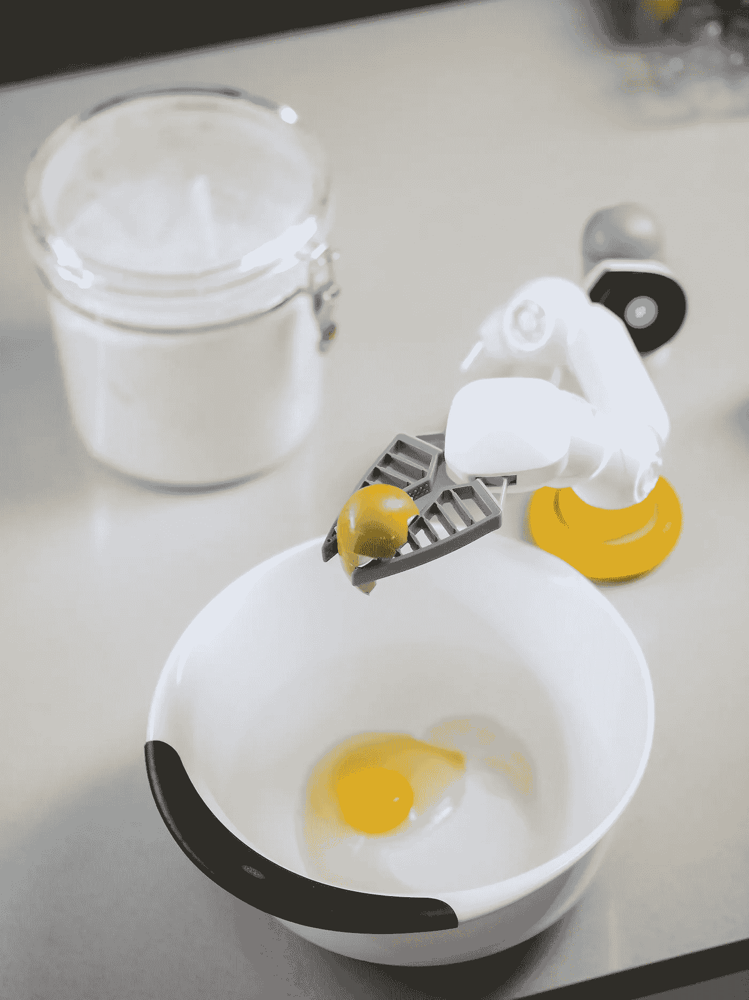
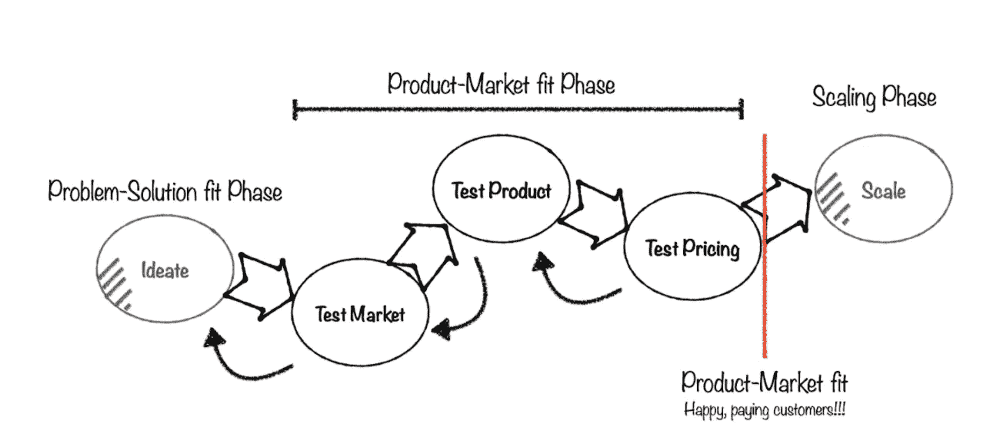

# 创业成功的真正关键时刻:如何让产品与市场相适应

> 原文：<https://betterprogramming.pub/the-real-moment-of-truth-for-your-startups-success-how-to-get-product-market-fit-right-a546ad1f3515>

## 即使投资者的压力或你烧钱的数量可能是巨大的，也不要太早开始扩大规模

学分:[this is 工程](https://www.pexels.com/de-de/@thisisengineering?utm_content=attributionCopyText&utm_medium=referral&utm_source=pexels)来自 [Pexels](https://www.pexels.com/de-de/foto/mann-frau-forschung-wissenschaft-3913031/?utm_content=attributionCopyText&utm_medium=referral&utm_source=pexels)

没有任何一个与商业相关的话题比产品与市场的契合度让我有更多的讨论和争论。这几乎是一个信仰问题，每个人都有自己的看法。问题是:许多人只是从理论上了解它。我经历过这个阶段至少五次，犯了很多错误，以后很难恢复。实际上我搞砸了两次。就在一开始。因此，我想分享我最重要的发现，并帮助你从一开始就找到适合市场的产品。

# 达到产品适应市场的重要性

你已经与潜在客户交谈，分析了市场，直到你对它了如指掌，创建了一个 MVP，并以用户为中心的方法对它进行了优化。你可能已经组织了一次封闭的测试，并分析了大量的数据。现在，你自信地推出了你的产品，但……没人买。

这并非不可能发生。永远记住:只有当你知道你的客户是否愿意为你的产品买单，以及愿意出多少钱时，你才算完成了 PMF 阶段。一旦你知道你向你的顾客提供了足够的价值，他们将无法从你的产品中得到足够的东西。

**产品-市场契合度描述了初创公司成功确定目标客户并为他们提供合适产品的阶段。**这一点至关重要:如果你没有合适的产品，或者你的目标受众不买，你需要找出原因并努力改进。

> “我试图集中注意力，但注意力吸引了我。”—李尔·韦恩

# 通常不是他们；这是你的产品

在一些罕见的情况下，你可能会找到另一个受众或市场，但通常情况下，你需要致力于你的产品，提高你向客户提供的价值。有一些公司在没有实现产品市场匹配的情况下被出售，通常是因为它们被病毒式传播。但没有一家公司在没有实现产品市场契合的情况下真正建立了成功的业务。

我曾在没有完全符合市场需求的情况下快速成长的企业工作过，因为这些产品“很好”，被数百万人使用，但从来没有提供足够的价值来实现可持续地资助整个公司的收入。我做了什么？我开始测试一个又一个商业模式，失去了重心，随着时间的推移，失去了用户。你很难找到出路的非常令人沮丧的情况。

产品与市场的契合意味着为正确的客户创造足够的价值，而足够的价值意味着你的客户要么为你的产品付费，要么——当通过广告赚钱时——为你付出他们宝贵的时间。正确的客户是受益于并认可产品价值的人。

所以你有个好主意？会改变世界的全新事物？你能提供比任何竞争对手更多的价值？您通过与符合您的客户角色的人员进行多次访谈，验证了这一想法？那么让我们跳到第一个关键时刻:测试你的价值主张和你的市场。

演职员表:[金德媒体](https://www.pexels.com/de-de/@kindelmedia?utm_content=attributionCopyText&utm_medium=referral&utm_source=pexels)来自 [Pexels](https://www.pexels.com/de-de/foto/lebensmittel-hand-technologie-kuche-9028869/?utm_content=attributionCopyText&utm_medium=referral&utm_source=pexels)

# 测试 1:你产品的正确市场

像任何实验一样，变量越少越好。例如，你可以用一个简单的登录页面测试一个价值主张，让人们注册一个封闭的测试版。这是通过一个小的活动。这样，您就生成了一个漏斗，并且已经可以在这里测试和优化定位。展示哪些优势最有效？潜在客户对你的产品有什么期望？你已经可以自动化很多，例如，一旦有人注册了 beta 测试，你就可以在一段时间内进行一系列的调查。您还可以 A/B 测试活动中或登录页面上已经宣传的不同优势。

通过这些简单的测试，你将知道你的市场是否有需求，并能感受到需求有多强。基本指标是登录页面的转换率和广告活动的每次点击成本。

下图显示了我对产品-市场契合阶段的看法:

演员表:作者

在我目前的工作中， [TRIQ](http://www.triq.ai) ，我们已经用几百美元创造了大约 3000 条线索。超过 25%的高转换率(beta-test 应用程序的访问量)和社交媒体上的热议表明，我们走在了正确的道路上。这给了我们信心，但仅此而已。

## **这个阶段的实用技巧:**

1.  预先定义您的 KPI(例如，活动 CTR 或转换率)和目标。不要走捷径。优化，直到你达到你的目标。
2.  对于 B2C 来说，我发现脸书的网络最有价值，能以相对较低的成本快速获得第一手线索。
3.  我使用营销自动化流程来欢迎和调查观众，这使他们保持活跃，并允许您随着时间的推移丰富您的数据，而无需发送庞大的调查。

# 测试 2:适合您市场的产品

第二步，你想提高你为市场创造的价值。这发生在一个 MVP 身上，理想情况下是一组与你的购买者角色相匹配的用户。

要知道，这往往是一条漫长而崎岖的道路，首先，你必须构建一个有用的产品，它已经提供了足够的价值来吸引你的用户 MVP。我推荐封闭测试有两个原因:通过只允许少量用户(比如 200 人)你可以最小化损害你声誉的风险，你可以产生早期需求，如果幸运的话，还可以在目标市场引起一些轰动。申请 beta 测试的潜在用户越多，产品成功的几率就越大。

> “你祝福了多少人，就是你衡量成功的标准。”—里克·罗斯

不管你的 MVP 是什么样子，你的重点是进一步的开发，让你的用户开心。因此，它主要是关于找出还缺少什么，以及对你的早期用户来说什么是优先的。beta 测试是你确定优先级的工具，你的工具是调查、访谈和常规的用户满意度研究。不要担心小样本:你会发现一些趋势，这些趋势在这个阶段已经很明显了。

在 TRIQ，我们在这个阶段使用了[肖恩·埃利斯测试](https://www.cleverism.com/product-market-fit-sean-ellis-test/)，以及 [NPS](https://www.qualtrics.com/experience-management/customer/measure-nps/#:~:text=Your%20Net%20Promoter%20Score%20is,be%2070%2D10%20%3D%2060.) 。即使测试的范围原则上对 NPS 来说太小，它仍然有助于了解你是否在正确的轨道上。

## **这个阶段的实用小贴士:**

1.  我建议在推出产品之前获得超过 30 的 NPS。
2.  确保你的调查有意义。我总是和市场研究专家一起创建一个初始模板。
3.  我通常不会在这个阶段使用客户流失作为 KPI，因为这仍然不是一个现实的情况。你在你选择的日期邀请测试人员，他们可能在这个时候对你的产品没有需求
4.  如果你做的是封闭测试版，那么试着总是拥有一百多个活跃用户。低于这个数字，数据往往会变弱。

# 真正的关键时刻:这对他们有什么价值？

这就是你努力了几个月的时刻。您的市场得到了验证，您的产品适应了市场并提供了附加值。但是你为此得到报酬了吗？如果是，有多少？

让我们从定价开始——令人惊讶的是，这个话题通常在所有产品市场匹配模型和出版物中都被忽略了。我是这样做的:首先，我考虑所有可用的信息:这可以是竞争对手的分析，也可以是在你的 beta 测试人员中进行的调查。然而，我不会说我喜欢价格调查，因为它们会导致低价格。你的用户会本能地看到一个影响价格的机会。

根据你的定位，把价格定得高于或低于你的竞争对手。如果你有一个定位于高端市场的产品，那么就用价格做一个陈述。要自信地做到这一点，最重要的是要明白，你的客户并不是为一套功能付费，而是为你的产品所能解决的问题的大小所带来的总体好处付费。

价格通常定得太低，以后提高价格比降低价格更复杂。永远记住，定价不仅仅是数字；它更多的是关于人类行为。为了找到最优价格，您需要进行实验，并使用尽可能少的变量来驱动一个简单的定价策略。

一旦你产生了第一批顾客，你就会知道自己的处境。如果转换率明显低于先前定义的阈值，您需要调整价格或增加产品的价值。

然后，程序是调查没有付款或提供折扣的用户。如果你不得不降低价格，转换率必须增加，以满足收入目标。此外，您应该继续使用上面建议的工具来衡量客户满意度。当使用肖恩·埃利斯测试时，尝试通过 40%非常失望的用户的门槛。

## **这一阶段的实用技巧:**

1.  你的最终目标通常是创造更多的收入。这也可以通过降低价格和提高转化率来实现。
2.  如果你想玩价格游戏，发送优惠券代码是一个找到最佳点的好策略。是少 10%、15%还是 20%？但是，不要太频繁地这样做，因为这样会带来风险，其他用户会一直等待订阅，直到他们获得折扣。
3.  使用订阅模式时:提供 2-3 种不同的模式(例如，1 个月、3 个月、12 个月)，甚至终身服务。有了这个，你就可以把顾客引向你更喜欢的模式。
4.  我喜欢[拉胡尔·沃赫拉(Superhuman 的创始人兼首席执行官)的方法](https://review.firstround.com/how-superhuman-built-an-engine-to-find-product-market-fit)，在肖恩·埃利斯测试中增加问题，并在调查前对用户进行细分。当你有一群非常不同的用户时，后者尤其有用。

# 最后的想法

即使投资者的压力或你烧钱的数量可能是巨大的，也不要太早开始扩大规模。你只会燃烧更多的流动性，永远达不到你的目标。此外，不要被追随者或非付费用户等虚荣指标所诱惑。这样你无法实现可持续发展的业务。你在这一阶段的重点应该是达到产品市场的契合度，从而拥有付费和满意的客户。

别忘了测试你的价格是产品与市场匹配的最后一步。完成所有这些步骤后，您就可以开始扩展产品了。这意味着，理论上，只要生命周期价值(LTV)和客户获取成本(CAC)的比率是健康的，你就可以在营销上花更多的预算。当然，在较小的市场中，可以很快达到极限，并且必须处理新的市场(例如，地理上或主题上)。坏消息是:在这些新市场中，产品与市场的匹配必须再次进行。