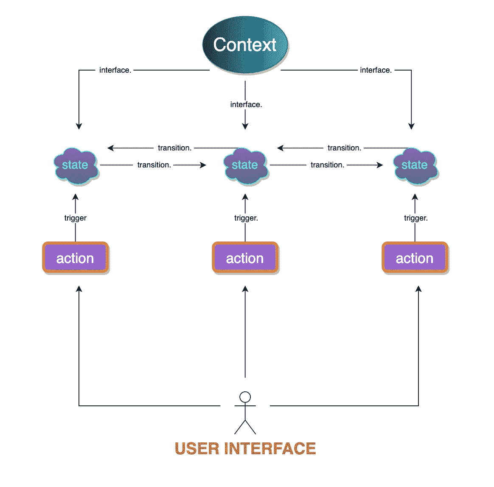

# JavaScript 中的状态设计模式

> 原文：<https://betterprogramming.pub/the-state-design-pattern-in-javascript-4eebdf5e471>

## 收获国家模式的力量

*Mikhail Nilov 在 Pexels 上拍摄的照片*

状态模式确保对象根据应用程序的当前“状态”以可预测的、协调的方式运行。

行为是在状态对象上定义的，当整体状态转换到它自己的状态时，该对象负责运行某个处理程序。这些状态对象操作的接口被称为`Context`。

这种模式在实践中的工作方式是，通过将某些动作的工作委托给代表一部分状态的状态对象，代表这部分状态的动作负责从它们对该状态的处理中更新它。

这意味着`Context`可能有一个或多个处理程序，但最终持有对`Context`触发器状态的引用的状态对象会一次一个地在它们之间完全改变。

这是因为状态对象定义了触发动作的处理程序，这些动作可以根据处理程序发生的事情来确定下一个状态转换到什么状态。

# 状态模式解决什么问题？

它解决的最重要的问题是当你的状态变大，有很多情况的时候。当我们的应用程序的状态会以多种方式改变时，尤其是当我们的应用程序变得巨大时，调试问题变得很困难。

redux 是一个库，它成功地提供了一个易于使用、可预测的接口来解决复杂的状态问题。

# 履行

假设我们正在实现某种状态，在这种状态下我们将使用计数器:

计数器从`0`开始计数，每秒钟我们将把计数器增加`1`。如果计数器小于`5`，颜色保持`"green"`。如果计数器在`5`和`7`之间，颜色将为`"orange"`。最后，如果计数器为`8`或更高，颜色将被设置为`"red"`。

如果没有状态模式，这可以通过如下方式实现:

这非常简单，而且可以完成工作。由于这段代码非常短，所以没有必要实现 state 模式，因为这样做太过了。

假设我们的代码随着时间的推移增长到 5000 行。想想吧。你认为你会有一个简单的时间单元来测试你的程序吗？如果你的代码每次都是完美的，你就不会，但是真的没有一个开发人员在大型应用程序中从不出错。在某些时候肯定会有一些错误，所以在编写代码时，我们应该小心谨慎，做出明智的决定，这是对我们最有利的。代码应该总是易于测试。

这就是为什么状态模式是有用的，因为它是容易测试的，并且对于具有大型或复杂状态的应用程序是可伸缩的。

当我们运行该代码片段时，我们得到如下结果:

这意味着我们的代码在工作。在我们的`start`函数中，实现只写了一次，但是几乎没有任何控制。*控制*也是状态模式的另一个好处。

让我们看看使用状态模式是什么样子的:

从这个例子中可以挑选出一些东西。

代码的其余部分没有使用行`const ACTION = Symbol('_action_')`,但是我想说的是，使用这种策略来验证发送给`send`方法的动作是用于更新状态的实际动作是一个很好的实践。

例如，我们可以在我们的`send`方法开始时立即进行验证:

如果我们不这样做，我们的代码可能更容易出错，因为我们可以像这样传入任何对象，但它仍然可以工作:

这看起来似乎是一件积极的事情，但是我们*想要确保触发状态更新*的唯一动作是那些由我们通过`createAction`公开提供给它们的*接口产生的对象。为了有目的地进行调试，我们希望降低复杂性，并确保错误来自正确的位置。*

接下来我们要看的是这几行:

记得之前我们说过(没有双关语的意思):

> *这种模式在实践中的工作方式是，通过将某些动作的工作委托给代表一部分状态的状态对象，代表该部分状态的动作负责从它们对该状态的处理中更新它。*

我们定义了一个`increment`动作，它负责在通过`send`使用时每秒递增一次。它接收当前的`state`并获取返回值以合并到下一个状态。

我们现在能够轻松地隔离和单元测试这种状态的行为:

在我们的第一个例子中，我们将实现硬编码到函数中。同样，对该功能进行单元测试将会很困难。我们不能像这里一样隔离代码的各个部分。

隔离在编程中非常强大。状态模式让我们孤立。隔离为将碎片组合在一起提供了更广泛的可能性，这一点现在很容易实现:

记住，我们也提到过状态模式是可伸缩的。随着我们的应用程序规模的增长，该模式用有用的组合功能来保护我们，以对抗可伸缩性:

这个故事的寓意是。状态模式*工作*。

# 大局

在这篇文章的最后，这里是这篇文章中展示的状态设计模式的一个视觉视角:

本帖到此结束！我希望你发现这是有价值的，并期待在未来更多！