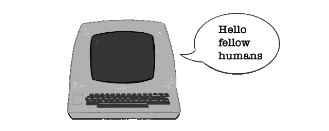

# 在终端中打印换行符这一异常困难的任务

> 原文：<https://betterprogramming.pub/the-surprisingly-difficult-task-of-printing-newlines-in-a-terminal-43a2a5d30359>

## 你的指南字符串插值怪癖混淆我们最好的



作者图片

令人惊讶的是，让计算机给出人类可读的输出并非易事。随着[标准流](https://en.wikipedia.org/wiki/Standard_streams)的引入，特别是标准输出，程序获得了一种使用纯文本流相互交流的方式；人性化和显示 stdout 是另一回事。

整个计算时代的技术都试图解决这个问题，从在视频计算机显示器中使用 [ASCII 字符](https://en.wikipedia.org/wiki/Computer_terminal#Early_VDUs)到像`echo`和`printf`这样的现代 shell 命令。

这些进步并非天衣无缝。将输出打印到终端的工作对于程序员来说充满了各种奇怪的操作，例如，扩展一个[转义序列](https://en.wikipedia.org/wiki/Escape_sequence)来打印新行这一看似简单的任务。

占位符`\n`的扩张可以通过多种方式完成，每种方式都有其独特的历史和复杂性。

# 使用回声

从它在 [Multics](https://en.wikipedia.org/wiki/Multics) 中的出现到它在现代类似 Unix 的系统中的无处不在，`echo`仍然是让你的终端说“Hello world！”的一个熟悉的工具

不幸的是，跨操作系统的不一致实现使得它的使用很棘手。有些系统上的`echo`会自动扩展转义序列，而其他系统上的[需要`-e`选项来执行相同的操作:](https://man.cat-v.org/unix_8th/1/echo)

```
echo "the study of European nerves is \neurology"
# the study of European nerves is \neurologyecho -e "the study of European nerves is \neurology"
# the study of European nerves is
# eurology
```

由于实现中的这些不一致，`echo`被认为是不可移植的。此外，通过使用命令替换的[外壳注入攻击](https://en.wikipedia.org/wiki/Code_injection#Shell_injection)，它与用户输入的结合使用相对容易被破坏。

在现代系统中，保留它只是为了与许多仍在使用它的程序兼容。POSIX 规范推荐在新程序中使用 T7。

# 使用`printf`

自从第四版[Unix](https://en.wikipedia.org/wiki/Research_Unix#Versions)以来，可移植的`[printf](https://en.wikipedia.org/wiki/Printf_(Unix))` [命令](https://en.wikipedia.org/wiki/Printf_(Unix))实质上已经是更新更好的`echo`。它允许你使用[格式说明符](https://en.wikipedia.org/wiki/Printf_format_string#Format_placeholder_specification)来人性化输入。

要解释反斜杠转义序列，请使用`%b`。字符序列`\n`确保输出以换行符结束:

```
printf "%b\n" "Many females in Oble are \noblewomen"
# Many females in Oble are
# oblewomen
```

尽管`printf`有更多的选项，使其成为`echo`的更强大的替代品，但这个实用程序并不是万无一失的，并且容易受到[不受控制的格式字符串](https://en.wikipedia.org/wiki/Uncontrolled_format_string)的攻击。

对于程序员来说，确保他们小心处理用户输入是很重要的。

# 在变量中放置新行

为了提高编译器之间的可移植性，ANSI C 标准于 1983 年建立。随着 [ANSI-C 引用](https://www.gnu.org/software/bash/manual/html_node/ANSI_002dC-Quoting.html#ANSI_002dC-Quoting)使用`$'...'`，根据标准在输出中替换[转义序列](https://en.wikipedia.org/wiki/Escape_sequences_in_C#Table_of_escape_sequences)。

这允许我们将带有换行符的字符串存储在带有换行符的变量中。您可以通过设置变量，然后使用`$`用`printf`调用它来做到这一点:

```
puns=$'\number\narrow\nether\nice'printf "%b\n" "These words started with n but don't make $puns"
# These words started with n but don't make
# umber
# arrow
# ether
# ice
```

扩展后的变量是单引号，按字面意思传递给`printf`。一如既往，正确处理输入很重要。

# 奖励回合:外壳参数扩展

在我解释 [Bash 和括号](https://victoria.dev/blog/bash-and-shell-expansions-lazy-list-making/)的文章中，我介绍了 [shell 参数扩展](https://www.gnu.org/software/bash/manual/html_node/Shell-Parameter-Expansion.html)的魔力。

我们也可以用一个展开式`${parameter@operator}`来解释转义序列。我们使用`printf`的`%s`说明符来打印字符串，并且`E`操作符将适当地扩展变量中的转义序列:

```
printf "%s\n" ${puns@E}
# umber
# arrow
# ether
# ice
```

# 人性化输出的持续挑战

字符串插值对于程序员来说仍然是一个棘手的问题。除了让语言和 shells 就某些占位符的含义达成一致之外，正确使用正确的转义序列还需要对细节的关注。

糟糕的字符串插值会导致看起来很傻的输出，以及引入安全漏洞，例如来自[注入攻击](https://en.wikipedia.org/wiki/Code_injection)。

在终端的下一次进化让我们可以用表情符号说话之前，我们最好在为人类打印输出时注意一下。