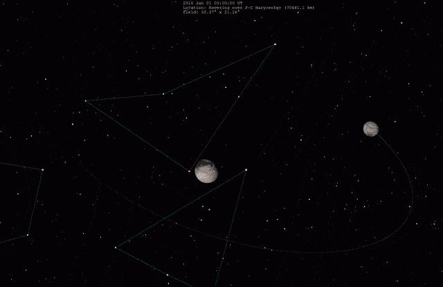
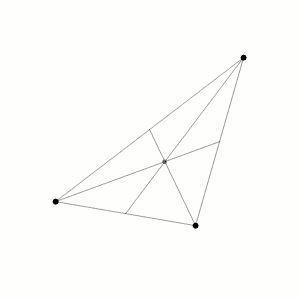

# 软件开发中的三体问题

> 原文：<https://betterprogramming.pub/the-three-body-problem-in-software-development-74adeda6807c>

## 代码中的紧密耦合是随着时间的推移而逐渐形成的，因为我们将不同的部分视为一个大的整体。我们应该避免那样做。

图片由 [Unsplash](https://unsplash.com/) 上的 [Heramb kamble](https://unsplash.com/@heramb_2k) 拍摄

这几个月很难熬。有许多工作要做，最后我只是需要休息一下。阅读让我放松，所以我拿起了的《三体》。

在我开始读这本书之前，我对这本书和这个问题一无所知，我可以说我非常惊讶。

这是一部科幻小说，是*纪念地球过去*三部曲的第一部。这本书以经典力学中最困难的问题之一——三体为例，围绕它展开了一个故事。

所以让我，在不破坏你的原始故事的情况下，用我自己的方式做同样的事情。

# 三体

为了能够解释三体及其与软件开发的关系，让我从解释单体问题开始。它被更好地称为中心力问题。当有一个中心不可移动的力源作用于质点时，中心力问题试图确定质点的运动。

坦率地说，它可以用来很好地描述轻行星绕着一颗重恒星的运动，而这颗恒星可以被视为静止的。这种运动可以用三角函数来表示。

为了使事情复杂化，现在让我们想象我们有两个巨大的物体影响彼此的运动。这就是所谓的两体问题。它可以用来描述地球和月球绕着对方运行的运动。或者更好，冥王星和冥卫一，就像下面的动画中表现的那样。

冥王星-冥卫一系统的斜视图，显示冥王星围绕自身以外的一点运行(维基百科)

对于许多力，包括引力，两体问题的一般版本可以简化为一对一体问题，使其完全解决。同样，我们有一个公式。

但是如果我们添加另一个巨大的物体，并使整个事情三体，事情变得不可预测和混乱。对于大多数初始条件，三体没有像一体问题或二体问题那样的一般闭合解。

# 软件开发中的多体问题构建

三体和软件开发有什么关系？嗯，没有。但是如果我们观察这两个过程，我们可以发现行为上的相似之处。紧密耦合的特性会相互影响，非常松散耦合的特性可以和平地共存于同一个系统中，而不会相互影响。让我们把软件开发比作 n 体问题。

一开始，一切都很容易理解。我们有一个特点，一个中心，一切都围绕着它。有少量的功能不会相互冲突。

例如，我们正在构建一个库存应用程序。我们所需要的是插入新项目、减少或增加数量的可能性，以及对库存状态的洞察力。所以我们实现了它。

随着时间的推移，我们最终想要添加新的东西。这将是真的很好，有一个网店，能够在网上销售我们的产品。所以我们开始在库存中添加东西。

首先，一个网页。我们获取可用数量的库存状态。现在，web 页面需要描述可用库存的状态。但这并不意味着那些项目不再在库存中，只是它们处于不同的状态。所以我们需要在库存中引入状态。我们需要有“库存”状态和“准备装运”状态的数量。

但是现在需要更改网上商店可用数量的获取，以反映这种变化。如果我们卖不出去，仓库里真的有多少东西也没用。我们只想在我们的网上商店显示“库存”数量。我们又要换网店了。

系统一部分的引力会拉动系统的其他部分发生变化。在这两个特性之间建立稳定的关系之前，它们之间会有一场“权力斗争”。一旦我们最终完善了功能，一切都回到了可预测的状态。一切都按照我们的计划进行，我们很高兴。我们仍然可以相对容易地预测这将会发生，以及一部分的变化如何反映到另一部分。

两个质量有“微小”差异的物体围绕一个共同的重心运行(维基百科)

但是事情可以变得更好。我们可以为顾客提供送货服务。因此，我们仔细检查现有系统，并在每一步都做出改变。配送服务改变库存，库存改变网页，网页改变配送服务，库存改变配送服务…

送货服务帮助了我们的业务增长。一个仓库已不足以满足我们的需求。我们希望将我们的业务扩展到更多的地方，并使系统能够支持这种工作方式。但是这将如何影响现有的系统呢？需要更改库存以启用多个位置。由于该网页正在减少库存中的商品数量，因此需要对其进行更改以支持多个位置。但是如何做到这一点呢？这将迫使库存和配送服务发生变化…混乱。

位于不等边三角形的顶点且初始速度为零的三个相同物体的近似轨迹(维基百科)

# 归结为一个问题

那么如何才能避免这个问题呢？我们如何避免一个特性对另一个特性产生巨大影响？

太阳系充满了大到足以影响其他物体运动的物体。然而，如果我们试图预测地球围绕太阳的轨道，我们可以安全地忽略它们，只关注太阳和地球。这将给我们一个真实运动的良好的初始近似。木星或任何其他行星也是如此。

如果我们将特征彼此分离，我们可以像对待太阳系中的行星一样对待它们。一颗行星的引力不应该影响另一颗行星的轨道。事实上是这样的，但我们在大多数情况下可以忽略它。同样的事情也会发生在特性上。它们仍将相互影响，但这些变化将没有那么强烈，在某些情况下甚至不存在。

想象一下，如果我们试图计算未来 10 年的复活节日期。复活节是基督教的节日，在春分后第一个满月后的第一个星期天庆祝。当我们试图计算这些日期时，我们真的关心木星的 79 个卫星吗？我们要关心他们吗？当然不是。我们不需要这么做。

我们把我们的解分成小块，让它们绕着“太阳”转。在我们的例子中,“太阳”可以是一个消息代理、服务总线，甚至是一个已经建立的契约(接口)。我们决定我们的太阳系需要去耦合到什么程度。那些围绕太阳运行的小块是模块、域还是微服务都不重要，重要的是它们尽可能的独立。这使得它们更容易理解。这样，即使不知道木星有 79 颗卫星，也可以计算出复活节的日期。

地球的月亮对它的轨道影响很大，这是事实。如果我们观察太阳和地球的关系，我们就不会谈论地球和月亮围绕太阳的轨道。我们只谈论地球的轨道。无论整个(太阳系)系统中的特征有多复杂(木星有 79 个卫星),我们都应该把它当作一个整体来对待。

这样，我们在太阳系中就没有(大约)1 20 万个天体。也没有 700 颗行星、小行星或卫星。我们有八颗行星。因为，一般来说，当我们谈论太阳系时，我们只关心这 8 颗行星。现在我们可以更容易地确定它们的运动。尽管结果并不完美，但对我们来说已经足够好了，可以毫无问题地处理它。

# 简化事物

当我们想到库存时，我们会想到什么？大概是某个大仓库，里面存放了很多物品。库存的工作是什么？存放物品并妥善保管，直到有人来取走。我们的软件解决方案应该只涵盖这些功能。

网上商店应该只是展示物品和创造购买。但是网上购物需要改变库存状态。那么，如何做到这一点呢？现在，这可以用许多不同的方法来完成，但是我来做。

购买是足够复杂的功能。它获取订单，检查库存以查看商品是否可用，进行计费并创建发货。这可能看起来只是另一个功能，但由于其大小，它可以很容易地被分成一个单独的部分。

我们为库存创建严格的契约，在契约中我们可以获得所有项目、所有活动项目的列表，检查项目是否可用，并减少它们的数量。网店只需要知道活动物品。如果我们在某个时候决定支持软删除，或者像我们在上面的例子中所做的那样支持多种状态，网络商店不需要知道这些变化。唯一会改变的是它接收到的数据，而这是在网店不知道的情况下发生的。

对于购买功能，我们需要做同样的事情。合同需要有一个购买行为。网上购物调用该动作，其工作完成，购买功能接管。它检查一个项目是否可用，如果一切正常，它完成购买并减少库存数量。

如果我们看我们的系统，我们有一个清晰的独立的特性分离(一些比另一些更多)。我们从一份清单开始，所以它肯定可以是一个自己的系统。然后，我们添加了一个可以独立实现的网上商店和购买功能。

我们有送货服务，但是到目前为止整个过程都不需要知道它的存在。所以我们也应该把它当作一个独立的系统。我们不应该仅仅为了让它适合而强行把它推进现有的功能中。

我们开始吧。现在，我们还没有一个系统拥有一系列复杂依赖关系的功能。我们有一组子系统，每个子系统都有特定的复杂性，它们共同构成一个易于理解和维护的解决方案。

# 结论

构建、维护和扩展软件是困难的。开始时，这似乎很容易。“就加这个功能”。但是我们添加的东西越多，等式就变得越复杂。如果我们试图推进太多的事情，最终我们会发现自己有一个无法解决的问题。这两者之间只有一线之隔。

另一方面，我们可以试着简化它，把它分成许多小块。有更多的人可以处理这些小的部分。解决一个身体问题是学校里的青少年做的。另一方面，三体似乎是一个无法解决的问题。然而，乍一看，这两者之间的差别是如此之小。