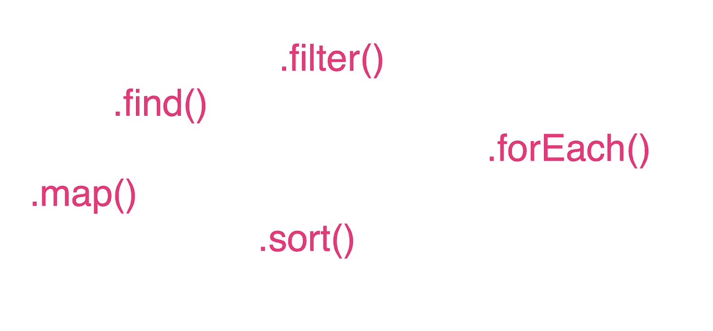
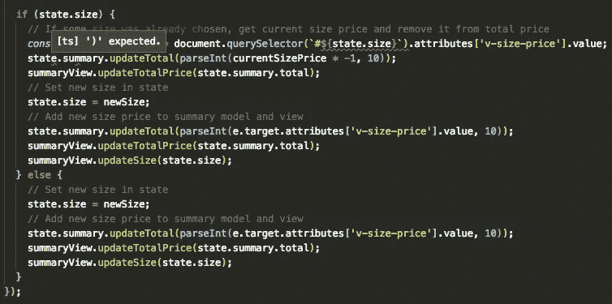

# 初级开发人员最常见的标志

> 原文：<https://betterprogramming.pub/the-three-most-common-signs-of-a-beginner-developer-f8a9af417dd0>

## 检查编程中的自满情绪，以便避免它

由 [Valeriy Khan](https://unsplash.com/@valeriydmi?utm_source=unsplash&utm_medium=referral&utm_content=creditCopyText) 在 [Unsplash](https://unsplash.com/s/photos/developers?utm_source=unsplash&utm_medium=referral&utm_content=creditCopyText) 上拍摄的照片

学习一门新手艺可能是一个令人困惑的过程。特别是作为一名开发人员，您可能熟悉困扰初学者的一个常见问题:寻找有效的模式并坚持使用它们，代价是学习新的或者更好的方法来解决问题。

根据我的经验，我发现初级开发人员面临的最常见的陷阱通常源于在他们的学术或职业生涯早期就制定了某些模式和过程，然后坚持这些模式和过程，而没有学习任何替代方案。

因此，我已经缩小了我发现的模式/过程中这种“自满”产生的三个最常见的陷阱，并提供了一些说明它们的实际例子。希望阅读这些文章能让你反思自己的编程习惯，并能够批判性地思考你的编码的其他方面，这些方面可能是你无法超越的旧模式。虽然我是在我的例子中使用 JavaScript 写这篇文章的，但是下面的例子可以适用于任何语言或框架。

# 1.与单一方法结合

很多时候，初学编程的人会熟悉一种方法，然后扩展它的能力，使它能够解决用不同的方法可以更简单(或者，事实上，正确)解决的问题。

例如，假设一个初学者已经熟悉了使用 JavaScript `.forEach`数组方法，无论是通过他们的学习还是实践经验。他们可能倾向于在解决方案中使用`.forEach`方法，而`.map`或`.filter`方法可能更合适。

假设您有一个数字数组，并希望创建一个包含这些数字乘以 2 的新数组。一些过于习惯使用`.forEach`方法的人可能会倾向于做一些事情，比如创建新的空数组，并将原数组的每个成员乘以 2 放入空数组。

然而，在这种情况下，使用`.map`方法不仅可以用更少的代码行完成工作，而且计算效率更高。虽然第一个例子可行，但后者显示了对该语言更深的理解。

# 2.分配太多变量

离开上面的例子，创建一个新变量(一个新元素将被推入的空数组)并不总是最好的或者最节省内存的方式。这是我在初学者中观察到的另一个非常常见的陷阱，尤其是那些在学术生涯早期学习算法解决方案的人。许多针对初学者的算法解决方案通常包含初始化变量，然后由算法操纵这些变量，以便返回期望的结果。

例如，初学编程的人常常会熟悉编写算法函数，这些函数要求他们在函数开始时初始化一个空数组、一个空字符串或一个空对象。获得解决这类问题的实践，虽然毫无疑问是有帮助的，但可能会产生一种误导模式，即通过在开始时初始化一个变量来解决所有类型的问题。

然而，在优先考虑内存效率的专业环境中，将分配变量作为问题的首选解决方案可能不是处理事情的最佳方式。相反，问问你自己你想要的结果是否绝对需要一个初始化的变量。通常，您可以操作现有的对象，或者利用现有方法/函数的返回值来构建，这将大大提高内存效率。

# 3.在函数中做得太多

我在许多初学者开发人员中看到的一种常见的编码模式是一种“思路，即写即用”的方法，这种方法经常导致函数和类过载。这是因为开发人员在解决问题的同时编写代码，而不是为了重构和分解而重新编写代码。这导致函数内部有许多不同的过程和方法。

这在所有语言中都是不利的做法，尤其是像 JavaScript 这样的函数式语言，在这种语言中，语言的“主要思想”是编写简洁的、单一用途的函数，然后可以移动这些函数以服务于不同的目的。

看看你的代码，总是问自己:“这个函数在做什么？”如果这个问题的答案包含“和”、“那么”、“也”或任何这样的副词，也许你的功能只是试图做得太多，可以分解成多个功能。这样做不仅可以为您和其他观察您的代码的开发人员创建更容易使用的代码，还可以在将来减少错误和 bug，因为数据和对象不会在大型重载函数的噪音中丢失。

也许你已经发现自己作为一个初学者或者有经验的开发人员犯了这些错误——我知道我不止一次犯过。也许你过去犯过这样的错误，并且熟悉这些陷阱以及如何克服它们。

无论您的经验水平如何，我希望通过阅读这三个例子，您已经了解或更新了可能导致常见错误或低效的编码模式。学习一种最适合你的编程风格是编写快速、智能代码的好方法。但这也可能导致你过于依赖某些模式或解决方案，从而阻碍你跳出这些模式思考，学习或实现更好、更有效的解决方案。