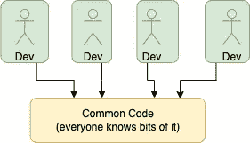
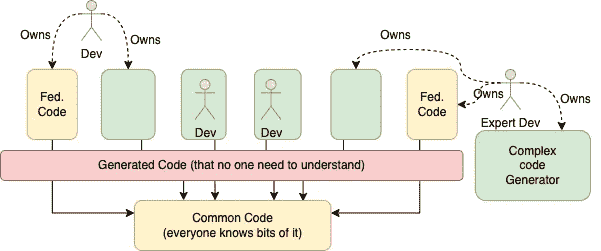

# 代码所有权的重要性

> 原文：<https://betterprogramming.pub/the-underestimated-importance-of-clear-code-ownership-baed758e47b8>

## 软件世界

## 良好拥有的代码是维护良好的代码

蒂尔拉·马洛卡在 Unsplash[拍摄的照片](https://unsplash.com?utm_source=medium&utm_medium=referral)

“你写吧；你拥有它。”这是我曾经工作过的一个软件工程部门的哲学。确保任何书面代码的可问责性是一个伟大的理念。

但是说起来容易做起来难。

代码所有权，虽然听起来很简单，但随着时间的推移，也很容易被忽视。它的后果是巨大的。代码将变成意大利面条，不可维护，并且很快成为一个遗产，没有人能弄清楚它是如何工作的。

## 每一段代码都是有人写的，所以写的人就是所有者，不是吗？

这是一个非常简单的观点。只适用于单人项目或者小项目的小团队。

事实上，大多数重要和成功的项目，即使它们开始时规模很小，也会经历不同的阶段，将一段令人自豪的闪亮代码变成一段人人害怕和鄙视的可怜的神秘代码。

要知道这是如何发生的，下面是一个变得丑陋的项目的代码演变的七个阶段。

# 1.出生

开发人员开始了一个全新的项目，有一个经过深思熟虑的架构和干净的代码结构。这是一个足够小的项目，单个开发人员了解整个流程和集成。

一个人本质上拥有代码。

代码被主开发人员很好地理解和拥有

# 2.成长

我们开始有更多的开发人员为代码做贡献。也许是一个由 3-5 名开发人员组成的团队。我们有同行代码评审。我们有代码配对。每个人都理解代码的所有部分。我们有一个主要的首席开发人员来决定要遵循的惯例。干净一致。

团队本质上拥有代码。

代码被团队很好地理解和拥有

# 3.可重用性

随着更多的特性被添加到项目中，理想情况下，我们不想重写所有的东西。我们尽量重复利用。我们使用像面向对象继承这样的方法，将公共代码重构为一些公共类。

每个开发人员都拥有自己的部分特性，但都拥有公共层。每个人都喜欢使用公共层，但人们试图避免修改它，因为它可能涉及到改变其他人的代码。

没有人拥有公共代码。随着时间的推移，对通用代码的理解逐渐淡化

# 4.联邦

鉴于它只有一个 3-5 名开发人员的团队，我们没有足够的开发人员能够处理所有需要的功能。企业决定从其他项目中雇佣临时承包商或贷款团队成员来处理这个不断增长的项目，以满足眼前的项目需求。

后来的代码在技术上仍然归团队所有，但是团队并不编写所有的代码。团队成员忙于其他功能，不能完全拥有联邦代码。承包商或贷款团队成员后来离开了，留下了部分代码。

联邦代码是做出来的，但不是拥有的。然而，团队最终必须拥有联邦代码，但不能完全理解它。这是因为他们还有其他正在开发的特性，因此对联邦代码有所了解。

# 5.自动化

一个聪明的开发人员想到了一个在没有更多开发人员的情况下进一步加快工作速度的主意。他们看到一些可以自动生成的样板文件和常见模式。为了简化自动化过程，他们开发了一个复杂的算法代码生成器来生成代码样板代码。

没有人需要拥有生成的代码，因为它是“良好生成的”随着时间的推移，开发人员使用它，但不知道它是如何工作的，因为“没有必要”这样做。聪明的开发人员拥有代码生成器…但是不久之后…(参见下面的阶段 6)

自动化刚开始的时候很棒。但是生成代码的用户会慢慢忘记他们对正在发生的事情的理解。

# 6.转变

聪明的开发者很聪明，找到了更好的工作，继续前进。其他一些团队成员也继续前进。也许组织被重组了。队伍缩小了。管理层决定雇用新人来填补一些空缺职位。在最初的团队发生变化并被新的团队成员填满之前，会发生几次迭代。

团队“拥有”许多代码，但是没有一个代码有所有权意识。他们中的一半人知道一些代码，但绝大多数人只在“需要”的基础上学习。对它的任何代码更改都只是“补丁”，因为他们试图避免更改任何“原始”的东西，因为没有人知道它是如何工作的。

如果没有足够的时间来理解代码，这个转换对代码的影响是最糟糕的。不写原代码的新开发人员对代码有一种距离感。最糟糕的是没有人能轻易理解复杂的代码生成器。

# 7.迁移

过了一段时间，每个人都讨厌在原始代码库上工作。有些人建议我们应该重写整个应用程序。此外，还引入了新的技术堆栈。因此，我们还需要转向新的技术体系。

然而，企业明白完全重写是一个很大的风险，因为应用程序已经在生产中大量使用。它无法承受耗时的全面重写，也不能保证与现有应用程序的工作方式相同。

因此，决定是慢慢地评估如何慢慢地迁移到新的系统，同时保持“遗留代码”的活力。旧的“拥有”代码现在变成了“烫手山芋”，每个人都试图避免接触它。

每个人都喜欢跳槽去开发新的代码库。旧代码现在是一个鬼屋，每个人都试图避免

正如您最后看到的，开发人员现在不喜欢处理原本打算增长和扩展的原始代码。

从上面可以看出，问题似乎是由“可重用性”、“联合”、“自动化”和“转换”引起的，但它们不是问题的根本原因。

所有的基本问题都可以归结为一个普遍的问题，“随着时间的推移，代码所有权的意识逐渐淡化。”

# 代码拥有感是如何退化的？

正如我们所见，这一切开始得很好。但是随着时间的推移，事情会变得越来越糟，螺旋下降。以下是一些原因:

## 1.不断增加的功能

只增加和添加功能而不删除任何功能的软件是一个定时炸弹。我们期望开发人员不断地创造越来越多的新功能，同时仍然拥有他们曾经编码的其他旧功能。

旧的特性很快变得陈旧，因为最初的编码人员可能已经“很长很长”时间没有接触代码了，因为他们正忙于开发新的特性。虽然一个人仍然热爱代码并有一种主人翁感，但他真正能拥有的东西是有限的。

## 2.每个人都拥有它=没有人拥有它

这发生在普通代码中。如果没有一个人或一个团队来监督公共代码，很快，它要么会变成:

*   鬼城——没有人愿意对它进行改动，因为任何改动都可能会不小心影响到其他功能。很快就没人知道里面是怎么运作的了。
*   wild-wild west——也就是说，代码将变异为非通用的，每个团队都制作了他们特殊的非通用钩子和 API。很快，就变得杂乱了。

## 3.编码它，但不拥有它

一些组织喜欢有一组开发人员，他们从一个项目到另一个项目，暂时支持每个项目，然后转移到另一个项目。这个想法是在多个项目中共享资源。

虽然这听起来对组织“业务友好”,因为资源是共享的，但挑战是，谁将最终拥有他们编写的代码？

与硬件产品不同，软件产品是不断变化的，需要不时地改变，以确保它被很好地理解和维护。但是如果只是“暂时”拥有这样的代码，它很快就会变得陈旧。

## 4.简单化伴复杂化

为了帮助加速编码，有时开发人员会构建复杂的

*   避免样板文件的代码生成器
*   旨在简化其用法的基类或函数

这些都是很好的举措，有助于提高生产力。成本不在于建造它，而在于维护它。由于它很复杂，维护它的成本可能也很高，而且传递知识并不容易，而且经常被忽视。

很快，没有人会明白它是如何工作的，也没有人想去碰它。

## 5.我们不会永远在那里

几乎可以肯定的是，最初的代码开发人员不会继续参与这个项目。他们要么将转移到另一个组织，一个更高的位置，或者由于公司重组。

通常，几年后整个开发团队都会发生变化。如果没有适当的过渡计划，新一批开发人员很可能会:

*   也不懂代码
*   对代码没有任何依恋感
*   对于如何编写代码有不同的偏好

由于上述所有原因，当前代码库的所有权意识可能会恶化

# 如何保持良好的代码拥有感？

为了确保由个人或团队进行适当的所有权管理，以下是一些建议的注意事项:

## 1.对共享所有权说不

任何代码都不应被保留为“共享所有权”如果我们想让一些公共代码普遍共享，它也应该有一个完全拥有它的开发人员或团队。

所有者必须维护代码健康，这是对代码做出贡献的指导原则(拥有的代码仍然允许其他人做出贡献，就像任何开源代码一样)。

## 2.明确的界限和自主权

代码所有者应该被一个清晰的边界清晰地分开:包、模块或者存储库。这避免了模糊性，也更容易构建一个管理所有权的系统。这也确保了代码总是在开发人员或团队可管理的范围内。

虽然理想情况下，我们希望代码之间尽可能的一致(例如，使用相同的语言)，但是我们应该为每个代码所有者提供决定其结构的自主权。这种灵活性使代码所有者感觉更有能力编码并热情地拥有它，并根据需要为将来更容易的代码演变做准备。

## 3.代码一旦发布，就没有完成

代码意味着不断地改变。它需要不断的维护和改变。一段时间(例如 1-2 年)无人问津的代码往往会过时。总有一些东西需要不时地改变和改进(例如，库升级、重构等)。)

为了确保代码总是更新，应该总是分配时间来改进它们，而开发人员则致力于其他特性。也许是代码重构，改进测试，以及合并更新的开发实践。

## 4.代码删除是健康的

假设每个代码都拥有并需要被分配时间来不时地进行彻底检查，那么每个开发人员只能拥有一定大小的代码。

为了确保代码的可维护性，除了添加新特性和新代码，企业还应该考虑删除不再有效的特性。这种移除将有助于减少需要维护的代码。(* *这也是为什么一个清晰的特性代码分区对于更容易地删除该特性是必不可少的。)

如果我们必须在不废弃任何功能的情况下增加功能，我们可能需要考虑聘请更多的开发人员。代码维护不是免费的。

## 5.自动化不是免费的

自动化是开始阶段比较有趣的软件开发之一。从事这项工作可能具有挑战性，但它会带来很多满足感。

更大的实际成本在后面——它的维护。我们需要确保有人不仅拥有它，而且完全理解它。这是为了确保将来需要的任何问题或改进都能够得到解决。对于不知道自动化代码上下文的后续所有者来说，这样的工作通常令人望而生畏。

尽管自动化看起来像是一旦完成就能神奇地提高生产力，但它应该不时地发展以确保得到良好的维护。后者的成本有时比初始成本更高。因此，我们需要在进入之前权衡一下。

更多的插图，请查看下面的文章。

 [## 软件自动化的隐性成本

### 自动化要避免的陷阱。过去的教训

better 编程. pub](/the-hidden-cost-of-software-automation-fa238bfb473b) 

# 良好拥有的代码是维护良好的代码

在软件开发中，我们学到了构建可伸缩和可维护代码的许多方面，例如编写干净的代码、良好的注释等。这些都是伟大的软件开发实践，每个开发人员都需要坚持。

然而，现实情况是代码仍然在许多组织中变成遗产，因此成为开发人员难以维护的负担。

在大多数情况下，问题是这些代码不再被很好地拥有。一旦发生这种情况，代码质量就会下降，最终变得难以管理。

就像任何关系一样，代码需要持续的“爱”如果我们不断地“培育”它，它将继续繁荣。否则，它会很快老去，并很快回来困扰我们。