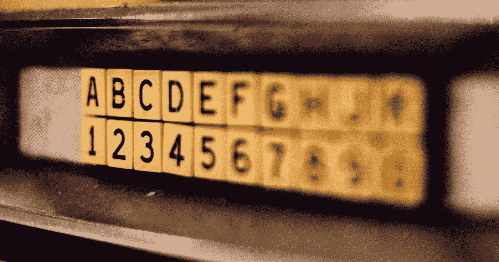

# Python 的排列和组合函数的有用性

> 原文：<https://betterprogramming.pub/the-usefulness-of-pythons-permutations-and-combinations-functions-316245534a16>

## 如果你使用了大量的嵌套循环，这是值得一读的



Patrick Fore 在 [Unsplash](https://unsplash.com/?utm_source=unsplash&utm_medium=referral&utm_content=creditCopyText) 上拍摄的照片。

最近写了很多 Python。作为一个相对较新的语言，它的多功能性和“生活质量”特性继续给我留下深刻印象。对于最近它在开发者中获得如此多的欢迎，我并不感到惊讶。

我最近发现的两个这样的特性是 Python 的 [itertools](https://docs.python.org/library/itertools.html) 模块的`permutations`和`combinations`函数。该模块基本上是一组方便的函数，用来产生迭代器以满足各种需求。

现在，我只打算把重点放在`permutations`和`combinations`上，因为我发现它们最有用也最容易理解。如果你发现自己做了很多循环——尤其是嵌套循环——它们值得一试。这些函数在数据科学、神经网络、竞争编程和日常编码中有广泛的应用。基本上，无论在哪里使用循环，这些函数都可以让您的生活变得更加轻松。让我们开始吧！

# 排列

像所有好名字一样，这个名字描述了函数的功能。它产生给定项目列表的所有排列(排列方式)，如数字或字符。让我们来看看[的定义](https://docs.python.org/library/itertools.html#itertools.permutations):

```
def permutations(iterable, r=None):
# permutations('ABCD', 2) --> AB AC AD BA BC BD CA CB CD DA DB DC
# permutations(range(3)) --> 012 021 102 120 201 210
```

每个项目在排列中只使用一次，顺序很重要。给定[0，1]，它的排列是[0，1]和[1，0]。让我们看一个代码示例:

我们可以看到，我们得到了数字 1、2 和 3 的所有可能的排列，代码很少。

注意:如果需要的话，可以通过调用`list(your_tuple)`很容易地将元组转换成列表。

可选的`r`参数可用于指定排列的长度(否则，它使用给定的项目数)。使用与上面相同的例子，但是将`r`设置为 2:

现在我们得到了数字 1、2 和 3 所有可能的 2 长度排列。您也可以对字符串使用这个函数(以及我们将讨论的其他函数):

这有许多有用的应用(例如，生成点之间的路由或操作顺序)。如果我们处理 A，然后 B，然后 C，结果会是什么？那 A 呢，然后 C，然后 B 呢？

现在让我们看看下一个函数。

# 组合

这个函数产生了组合一组给定项目的所有方法。[定义](https://docs.python.org/library/itertools.html#itertools.combinations):

```
def combinations(iterable, r):
# combinations('ABCD', 2) --> AB AC AD BC BD CD
# combinations(range(4), 3) --> 012 013 023 123
```

这与`permutations`类似，但每个项目只能使用一次(即它与顺序无关)。给定[0，1]，唯一的组合将是[0，1]，因为[1，0]是 0 和 1 的组合的置换。`r`参数在这里也是强制的(否则，项目列表的组合就是列表本身)。

如果你很难区分这两者，可以这样想:“面包和奶酪”和“奶酪和面包”是[面包，奶酪]的排列。然而，这两种食物只有一种组合——面包和奶酪(排名不分先后)。

演示:

当你想处理某样东西的所有组合，而顺序并不重要时，这是很棒的。例如，在图论中，这是一种快速计算无向图中给定顶点之间的边(或缺少边)的方法。对于有向图，你可以使用`permutations`(如上)。

这个函数还有一个变体值得一试。

# 奖励:可替换的组合

尽管它的名字很长(现在我们的 ide 都有自动完成功能)，`combinations_with_replacement`可能特别有用。首先，它的[定义](https://docs.python.org/library/itertools.html#itertools.combinations_with_replacement):

```
def combinations_with_replacement(iterable, r):
# combinations_with_replacement('ABC', 2) --> AA AB AC BB BC CC
```

与`combinations`基本相同，但项目可以重复。看看它是如何工作的:

现在让我们来看看我们可以用这个函数做的一些很酷的事情:

这就对了:一行程序可以让您轻松地迭代 3D 网格中的每个 x、y 和 z 坐标——可以根据需要适应其他场景。没有嵌套循环。

注意:你也可以用[列表理解](https://docs.python.org/2/tutorial/datastructures.html#list-comprehensions)来做这件事，但是我发现这种方法可读性较差。

这对于处理矩阵、网格系统和笛卡尔平面非常有用。这也是一个简单的嵌套循环替换。神经网络怎么样？生成一些初始权重或测试数据，以投入到您的网络中。可能性是无限的！

# itertools 模块的其余部分

从[文档](https://docs.python.org/library/itertools.html)中:

> 这个模块实现了许多迭代器构建块，灵感来自 APL、Haskell 和 SML 的构造。每一个都被改写成适合 Python 的形式。
> 
> 该模块标准化了一组快速、内存高效的核心工具，这些工具可以单独使用，也可以组合使用。它们一起形成了一个“迭代器代数”,使得用纯 Python 简洁高效地构造专用工具成为可能。"

那里有很多魔法可以探索。如果您发现自己想要以某种模式迭代数据，请考虑这个模块，看看是否有这样的函数。

# 概述

扔掉那些嵌套循环！让 Python 为您做这些工作，并根据您的需要进行迭代，所有这些都用一个可读的一行程序完成。通过使用这些函数，很容易从一个集合中获取每个排列或组合(有或没有重复的术语)。你的代码会因此变得更干净。

迭代愉快！

# 参考

*   排列:[https://docs . python . org/library/ITER tools . html # ITER tools . permutations](https://docs.python.org/library/itertools.html#itertools.permutations)
*   组合:[https://docs . python . org/library/ITER tools . html # ITER tools . combinations](https://docs.python.org/library/itertools.html#itertools.combinations)
*   带替换的组合:[https://docs . python . org/library/ITER tools . html # ITER tools . combinations _ with _ replacement](https://docs.python.org/library/itertools.html#itertools.combinations_with_replacement)
*   itertools 模块:
    [https://docs.python.org/library/itertools.html](https://docs.python.org/library/itertools.html)