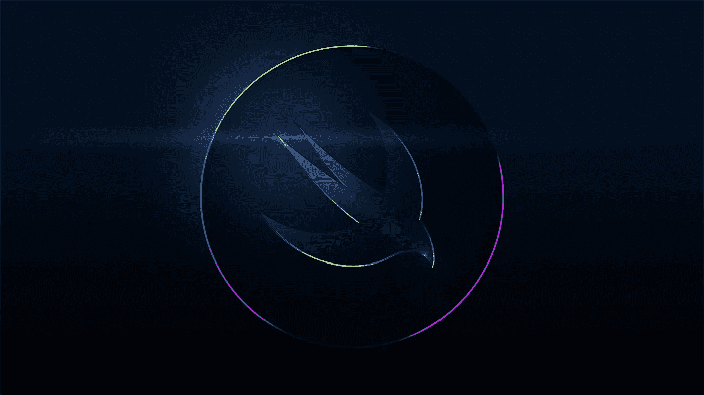

# WWDC 2022 版

> 原文：<https://betterprogramming.pub/the-wwdc-2022-edition-6496fafe17e6>

## 教程和指南帮助您快速入门

嘿大家好，

欢迎来到第 35 版《咖啡字节》,这是一份由 Better Programming 出版的时事通讯，这是一份独家报道，涵盖了一些最好的 WWDC 22 指南。

让我们看看上个月推出的最新公告和一些新发布的框架。

# SwiftUI 有什么新功能？

很快，SwiftUI 有了很多有益的变化。开始吧，给保罗·哈德森的[添加书签，看看 iOS 16 版 SwiftUI 有什么新功能](https://www.hackingwithswift.com/articles/250/whats-new-in-swiftui-for-ios-16)。这是一本几乎包罗万象的百科全书！

为了更深入地研究新框架——比如`WeatherKit`和`Charts`——这里有一个教程列表:

*   [Rob Sturgeon](/wwdc22-get-started-with-weatherkit-202794853c01)的[ImageRenderer](https://medium.com/u/1de9d252156e#285c)的 [API](/swiftui-ios16-d7685c08f8d5#285c)

关于 macOS 的 SwiftUI 新特性的详细概述，[请查看由](https://troz.net/post/2022/swiftui-mac-2022/) [Sarah Reichelt](https://twitter.com/trozware) 撰写的本指南。

# Swift 和 Xcode 14 有什么新功能？

自 2014 年以来，Swift 编程语言取得了长足的进步。我们现在有分散的演员，费德里科·扎内泰罗有一个完美的帖子可以让你开始——在 Swift 与分散的演员见面。

要了解更多关于 Swift 5.7 的最新功能，如新的时钟 API 和缩短的`if let`、`guard let`语法，让 Rob Sturgeon 通过他的帖子为您导航——来自 WWDC 2022 的 [3 个强大的 Swift 技巧。](/3-powerful-swift-tricks-from-wwdc-2022-8369a9a141c6)

还有一个新的`RegexBuilder`来在 Swift 中编写声明性正则表达式。 [kishikawa katsumi](https://twitter.com/k_katsumi) 已经建立了一个在线工具( [swiftregex](https://swiftregex.com/) )来帮助你快速测试和转换文本中的`Regex`。

Xcode 14 今年也推出了一些出色的功能。喜欢万能图标！[劳尔·费雷尔](https://medium.com/u/96dd69cf281?source=post_page-----6496fafe17e6--------------------------------)在他的帖子中向我们展示了它的能力——一个图标统治所有人[。为了更深入地了解我们最喜欢的 IDE 的新特性，Paul 为您准备了一个 24 分钟的视频指南。](/xcode-14-one-icon-to-rule-them-all-e32ebd20b942)

# 一些 UIKit 添加

UIKit 公告可能不再那么引人注目，但它仍然是许多生产应用程序的首选框架。为了保持他的年度传统，[乔丹·摩根](https://twitter.com/jordanmorgan10)有一篇关于 iOS 16 中 UIKit 的[显著增加的文章。](https://www.swiftjectivec.com/ios-16-notable-uikit-additions/)

你最喜欢的 UIKit 功能是什么？ [Swapnanil Dhol](https://medium.com/u/c1a06bb845e3?source=post_page-----6496fafe17e6--------------------------------) 探讨了[如何在 iOS 16](/uicalendarview-tutorial-593731e52b72) 中使用 UICalendarView，同时我已经给出了对`UICollectionView`——[对自调整单元格的开箱即用支持的重要增强的快速概述。](/new-in-ios-16-self-resizing-uicollectionview-cells-f02fbb7b45b1)

但是在`UICollectionView`中使用 SwiftUI 视图的能力是我最喜欢的功能。 [Sundell](https://twitter.com/swiftbysundell) 就如何在 iOS 16 上 `[UITableView](https://www.swiftbysundell.com/articles/rendering-swiftui-views-within-uitableview-or-uicollectionview/)` [或](https://www.swiftbysundell.com/articles/rendering-swiftui-views-within-uitableview-or-uicollectionview/) `[UICollectionView](https://www.swiftbysundell.com/articles/rendering-swiftui-views-within-uitableview-or-uicollectionview/)` [单元格内](https://www.swiftbysundell.com/articles/rendering-swiftui-views-within-uitableview-or-uicollectionview/)[渲染 SwiftUI 视图发表了一篇精美的帖子。](https://www.swiftbysundell.com/articles/rendering-swiftui-views-within-uitableview-or-uicollectionview/)

虽然这总结了 WWDC 2022 的主要公告，但还有更多东西可以启发你构建令人惊叹的应用程序。像 [Live Text API 快速扫描图像和视频中的文本](/scanning-data-with-the-camera-in-swiftui-491741e36f69)，或者[新的应用意图框架](https://www.wwdcnotes.com/notes/wwdc22/10032/)，或者 SF Symbols 4 获得可变颜色，或者[在 iOS 16 中访问目录的简洁方式](https://nilcoalescing.com/blog/GetURLsForSystemFolders/)。

我特别喜欢 [Paul 的视频，它演示了如何在 SwiftUI 视图中添加新的内部阴影，同时还利用 CoreMotion 带来 3D 效果](https://www.youtube.com/watch?v=ZIs3Gco-lrw)。你最喜欢的《WWDC 22》帖子是什么？让我们知道。

暂时就这样了。直到你下次喝咖啡，

[Anupam](https://anupamchugh.medium.com/) 和更好的编程团队。