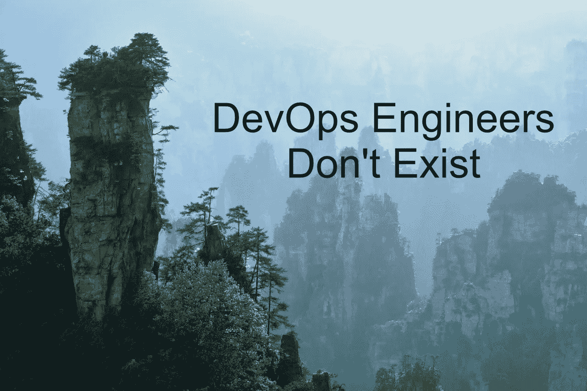

# 没有“DevOps”工程师这种东西

> 原文：<https://betterprogramming.pub/theres-no-such-thing-as-a-devops-engineer-68eb8075a6ef>

## 有一个更好的标题

# 介绍

好吧，所以有 DevOps 工程师，但标题是误导性的，理论上，它不应该被使用。

DevOps 不是任何一个人的责任。就在名字本身。改进开发者和操作者之间的过程是持续的目标。这感觉就像给某人一个头衔，将 DevOps 实践的责任放在那个人身上，而不是在所有工程师之间分担责任。

暗示某人纯粹是 DevOps 工程师，似乎暗示他们是敏捷教练或类似的人。就像，他们不做任何编码，他们只是推动人们进入更好的 DevOps 实践。

但现实中，DevOps 工程师永远是做代码的操作员。那么为什么要使用 DevOps 这个术语呢？嗯，可能是因为首先对操作员做什么感到困惑，用一个模糊的术语来称呼那些职责模糊的人似乎更合适。

所以在这篇博文中，我将谈论一个 DevOps 工程师可以做的许多工作，相应的头衔，以及我认为应该是实际头衔的地方。

# 标题

## 管道工程师

我从未见过任何人真正使用这个术语，尽管我觉得它肯定是一个。DevOps 工程师花费大量时间来构建和配置管道，以自动化应用程序的构建、测试和部署工作。

我认为这项工作已经足够了，你可以雇一个人专门从事这些工作。尤其是当您深入研究可以添加的无数安全和性能工作时。

你也可以使用 CI 工程师、CD 工程师或 CI/CD 工程师的头衔。这些可能会更清楚，因为管道工程师听起来像是石油和天然气行业的工作。

## 云工程师

从某种意义上说，DevOps 工程师提供、配置和维护基础设施、网络和数据库。所以，你可能会想用这样的标题:

*   基础设施工程师
*   网络工程师
*   数据库管理员

只不过这些角色实际上意味着更具体地使用这些对象，比如使用本地服务器、构建路由器或专注于数据库性能调优，而不是在云中使用这些对象。

云工程是一个更恰当的术语。然而，我不认为它真的包含了全部的角色。我开始使用术语云工程师来指代那些只知道如何使用云平台的工程师。他们往往是有云证，没有很强工程背景的人。他们往往缺乏系统管理员的命令行忍术。

## 系统管理员

我遇到的大多数真正高级的“DevOps”工程师都曾经是系统管理员。这个术语意味着你在服务器上安装和配置大量的软件，同时配置它们的网络连接。但由于它是一个较老的术语，它通常不包括云平台的经验。

将系统管理员和云工程师结合起来是最接近“DevOps”工程师的事情。

## IT 管理员

我把这个放进去只是为了区别一下。如果你想知道某件事情是否应该是 DevOps 人员的责任，问问你自己:“这是开发人员专用的东西吗？”。

如果是为开发人员，这可能是 DevOps 人员的工作。如果是整个公司或公司其他部门的事情，那是 it 管理员的责任。

## 现场可靠性工程师

你可能很想使用网站可靠性工程师这个头衔，但这个术语是由谷歌的工程师创造的，要成为一名工程师，你必须遵循他们出版的书中列出的所有原则。我不认为这符合 DevOps 的精神，这是一个开放式的讨论。

就此而言，我也从来没有真正喜欢过这个头衔，因为我认为这个头衔暗示了一个站点可靠性工程师的范围比人们所期望的要窄。

例如，您可能会认为创建一个构建工作与致力于站点可靠性相去甚远。但我认为这是你希望成为工作一部分的工作。

## 操作员

好吧，就叫接线员怎么样？我一直在使用这个术语，但可能没有足够好的理由。DevOps 其实是“开发”和“运营”的合成词，而不是“开发者”和“运营商”。

但是很容易混淆。开发人员从事开发工作，称自己为“开发人员”。按照逻辑，操作员从事操作工作，并自称为“ops”。

最后，我发现这个标题太模糊了，不可否认，我不应该用这么多。如果你告诉某人你在运营部工作，那可能是公司的任何部门。什么操作？什么的操作员？

我还搞不清楚我是指操作员还是操作员应用程序(Kubernetes 操作员)。

## 软件架构师

这个有点像 IT 管理员。我把它包括在内是因为它不应该是工作的一部分，但它经常是 DevOps 工程师发现自己在做的工作。实际上，高级开发人员应该做这种工作，因为它需要应用程序开发，但我经常看到高级开发人员选择三种方式之一:

他们要么决定只专注于一件事(与建筑师相反)，他们进入管理层，要么他们决定擅长很多事情，然后发现自己只是一名开发工程师。

这并不总是发生，但是我认为软件架构师应该是一个组织中最资深的开发人员(不包括那些管理人员)。我也认为一个只做好一件事的开发人员不应该是资深的，但是我会在另一篇博客文章中解释这一点，因为我认为雇佣“专家”是个坏主意，这需要一个冗长的解释。

## 平台工程师

这是我认为真正包含角色的标题。我们提供服务器、网络、数据库和其他基础设施。我们为构建、测试和部署应用程序创建自动化管道。我们将所有这些都设置为高度可用，并设置监控来提高所有设备的正常运行时间和性能。我们经常发现自己在偶尔的宠物服务器或遗留节点上做一些系统管理。

但是我们创建和管理的所有这些东西建立了一个应用程序运行的平台。这是一个故意含糊的标题，因为这份工作有点模糊。但是由于它使用了平台的范围，所以不会太模糊。

这也有点适合这个角色的氛围。当有人走进一所房子时，他们通常会看固定装置、墙壁、窗户、门等。，就像有人在查看应用程序中的按钮、页面和数据。

但是一个房子没有强大的基础就不能存在，就像一个应用没有强大的平台就不能存在一样。平台工程师对一家科技公司的健康发展至关重要，但除非基础出现裂缝，否则你不会真正注意到他们。

# 包扎

这就是我在标题上的 2 美分。我过去用过 DevOps 工程师这个头衔。很难摆脱。这是这个角色最容易辨认的头衔。

我自己实际上用的是 Kubernetes DevOps 工程师这个头衔。不是因为我认为它准确地描述了我所做的工作，而是因为它是公司经常需要的东西，而且很难找到真正拥有在 Kubernetes 上建立最佳 DevOps 实践的技能的人。

但是我想如果标题是完美的，我们将会是平台工程师，专门研究这个，那个和其他的。就像医生专攻某个领域一样。

感谢阅读！如果你喜欢我的帖子，请考虑订阅。