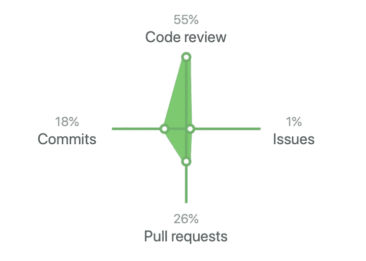

# 我从一位高级软件工程师那里学到的东西

> 原文：<https://betterprogramming.pub/things-i-learned-from-a-senior-software-engineer-3cf622f3d835>

## 我在一个高级软件工程师旁边坐了一年。以下是我学到的

照片由 [Arian Darvishi](https://unsplash.com/@arianismmm?utm_source=medium&utm_medium=referral) 在 [Unsplash](https://unsplash.com?utm_source=medium&utm_medium=referral) 上拍摄

一年前，我开始在彭博全职工作。那是我想象写这篇文章的时候。我想象自己满脑子的想法，到时候可以吐在纸上。

仅仅过了一个月，我意识到这不会那么容易；我已经忘记了我学过的东西。它们要么变得如此内在化，以至于我的大脑欺骗我，让我相信我一直都了解它们，要么它们就被我遗忘了。

这也是我开始保存人类日志的原因之一。每天，每当我遇到一个有趣的情况，我就把它记录下来。

多亏坐在一位高级软件工程师旁边，我可以近距离观察他们在做什么，以及他们和我要做的有什么不同。我们进行了大量的结对编程，这使得这项工作变得更加容易。

此外，在我的团队文化中，在编写代码的人背后“窥探”是不会被反对的。每当我感觉到有什么有趣的事情发生，我就会转过身去看发生了什么。由于经常性的单口相声，我总是有上下文。

我在一个高级软件工程师旁边坐了一年。以下是我学到的。

# 写代码——如何命名

我做的第一件事就是 React UI。我们有一个主组件来容纳所有其他组件。我喜欢在我的代码中加入一点幽默，我想把它命名为`GodComponent`。

接下来是代码审查时间，那时我明白了为什么给事物命名是困难的。

> "在计算机科学中有两个难题:缓存失效、命名事物和一个接一个的错误."— [*莱昂·班布里克*](https://twitter.com/secretGeek/status/7269997868)

我洗礼的每一段代码都有隐含的意义。`GodComponent`？这是所有我懒得放在正确位置的垃圾的组成部分。它容纳了一切。

如果我把它叫做`LayoutComponent`，future-me 会意识到它所做的只是分配布局。它没有状态。

我发现的另一个很大的好处是:如果它看起来太大，就像一个包含大量业务逻辑的`LayoutComponent`，我就知道是时候重构了，因为业务逻辑不属于那里。有了`GodComponent`这个名字，那里的商业逻辑不会有什么不同。

命名您的集群？以运行在它们上面的服务命名它们是很棒的，直到你开始在它们上面运行其他东西。我们最后用我们的队名给他们命名。

函数也是同样的道理。是一个可怕的名字，并且会产生很多后果。如果这个函数做了所有的事情，那么测试函数的特定部分将会变得非常困难。

不管这个函数有多大，你都不会觉得它太怪异，毕竟，这个函数应该做所有的事情。改名。重构。

有意义的命名也有它的另一面。名字太有意义，隐藏了一些细微差别怎么办？

例如，当您在 [SQLAlchemy](https://www.sqlalchemy.org/) 中调用`session.close()`时，[关闭会话](https://docs.sqlalchemy.org/en/13/core/pooling.html#pool-disconnects)不会关闭底层 db 连接。(我应该使用 RTFM 并阻止这个错误——更多信息请见[调试](https://neilkakkar.com/things-I-learnt-from-a-senior-dev.html#war-story)。)

在这种情况下，把名字想成`x`、`y`、`z`，而不是`count()`、`close()`、`insertIntoDB()`，可以防止给它们赋予隐含的意义——并迫使我仔细审视它们在做什么。[2]

我从没想过我会有不止一句关于如何命名的话要说。

# 遗留代码和下一个开发者

你有没有看过一些代码觉得很诡异？他们为什么这样做？这毫无意义。

我有幸使用了遗留代码库。带有注释的那种，比如“当 Mohammad 发现情况时，取消注释代码”你在这里做什么？穆罕默德是谁？

我可以在这里做一个角色互换，想想下一个来看我的代码的人，他们会不会觉得奇怪。同行评议在某种程度上解决了这个问题。这让我想到了上下文的概念:了解我的团队工作的上下文。

如果我忘记了代码，以后再来看，我不能重新创建上下文，我会这样:“他们为什么这样做？这毫无意义……哦，等等，这是我干的。”

这就是文档和代码注释的来源。

# 文档和代码注释

他们帮助保存背景和分享知识。

正如李在[中所说*如何构建好软件*](https://www.csc.gov.sg/articles/how-to-build-good-software) :

> “软件的主要价值不是产生的代码，而是生产代码的人积累的知识。”—李

我们有这个随机的面向客户端的 API 端点，似乎从来没有人使用过。我们删除它吗？毕竟是科技债。

如果我告诉你，在一个特定的国家，每年有 10 名记者将他们的报道发送到那个端点，会怎么样？你如何测试这个？如果没有文档(以前没有)，我们就不能。所以，我们没有。

我们删除了那个端点。几个月后，每年的这个时候。10 名记者无法发送 10 篇重要报道，因为端点已不存在。

了解产品的人已经离开了团队。果不其然，现在代码中已经有了解释端点用途的注释。

据我所知，文档是每个团队都在努力解决的问题。不仅仅是代码文档，还有围绕代码的过程。

我们还没有想出一个完美的解决方案。

我喜欢 Antirez 对不同类型的[有价值的代码注释](http://antirez.com/news/124)的分类

# 原子提交

如果你必须回滚(你会的。参见[测试](https://neilkakkar.com/things-I-learnt-from-a-senior-dev.html#testing)。)，这个 commit 作为一个单元有意义吗？

# 变得有信心删除狗屎代码

删除垃圾或过时的代码让我很不舒服。我认为亿万年前写下的东西是神圣的。

我的想法是:“他们写这个的时候一定有什么想法。”这是传统和文化与[第一原则思维](https://medium.com/@neilkakkar/a-framework-for-first-principles-thinking-522eff9d589c)。这与删除一年一次的端点的情况相同。我在那里学到了非常具体的一课。[3]

我试着绕过代码，高年级学生试着理解它。全部删除。一份永远无法达成的声明？一个不该调用的函数？是的，都没了。

我吗？我会把我的函数写在上面。我没有减少科技债务。如果有的话，我只是增加了代码的复杂性和误导。下一个人将更难把事情拼凑起来。

我现在使用的启发式方法是这样的:

有些代码你不懂，有些代码你知道你永远也不会懂。删除你永远不会接触到的代码，对你不理解的代码要小心。

# 代码审查

代码评审对于学习来说是很神奇的。这是一个关于你如何写代码和他们如何写代码的外部反馈循环。

有什么不同？一种方法比另一种好吗？在我做的每一次代码审查中，我都问自己这个问题:“他们为什么这样做？”。每当我找不到合适的答案时，我就会去找他们聊天。

第一个月后，我开始在队友的代码中捕捉错误(就像他们为我做的一样)。这太疯狂了。同行评审对我来说变得有趣多了——这是一个我期待的游戏，一个提高我的代码感的游戏。

我的启发是:不要批准代码，直到我明白它是如何工作的。

*我的 Github 统计数据*

# 测试

我已经非常喜欢测试了，以至于在没有测试的情况下用代码库写代码让我感到不舒服。

如果你的整个应用程序只做一件事(就像我所有的学校项目)，那么手动测试还是可以的[4]。我以前就是这么做的。

但是当应用程序做 100 种不同的事情时会发生什么呢？我不想花半个小时测试所有的东西，有时忘记我需要测试什么。那是一场噩梦。

测试和测试自动化来了。

我认为测试就是文档。这是我对代码的假设的文档。测试告诉我，我(或我之前的人)期望代码如何工作，以及他们期望哪里出错。

因此，当我现在编写测试时，我会牢记这一点:

1.  展示如何使用我正在测试的类/函数/系统。
2.  展示我认为可能出错的地方。

上面的推论是，在大多数情况下，我测试的是行为，而不是实现。([这里有一个例子](https://testing.googleblog.com/2013/08/testing-on-toilet-test-behavior-not.html)，是我在谷歌上厕所的时候发现的。)

我在第二点中忽略的是错误的来源。

因此，每当我发现一个 bug，我都会确保代码修复有一个相应的测试(称为回归测试)来记录信息。这是事情出错的另一种方式。[5]

然而，仅仅写这些测试并不能提高我的代码质量，但是写代码可以。但是我从阅读测试中获得的洞察力帮助我写出更好的代码。

这就是测试的总体情况。

但是，这不是唯一要做的测试。这就是部署环境的用武之地。

你可能有完美的单元测试，但是如果你没有系统测试，就会发生这样的事情:

*锁的作用(？)* [*来源*](https://natooktesting.wordpress.com/2017/08/24/x-unit-tests-0-integration-tests/)

这也适用于经过良好测试的代码。如果你的机器上没有你需要的库，你会崩溃。

*   有你开发的机器(所有“它在我的机器上工作！”模因)。
*   有您测试的机器(可能与您开发的机器相同)。
*   最后，还有您部署的机器(请不要让它与您开发的机器相同。).

如果测试和部署机器之间的环境不匹配，您将会有麻烦。这就是部署环境的用武之地。

我们有本地开发，在我的机器上的 Docker 中。

我们有一个开发环境，机器上安装了一组库(和开发工具),我们安装在这些库上编写的代码。其他相关系统的所有测试都可以在这里进行。

然后是 beta/stage 环境，和生产环境一模一样。最后，产品或生产环境，即运行代码并为实际客户服务的机器。

这个想法是试图捕捉单元和系统测试不会发现的错误。例如，请求和响应系统之间的 API 不匹配。

我想，在个人项目或小公司中，情况会非常不同。不是每个人都有资源建立自己的基础设施。然而，这种想法仍然适用于 AWS 和 Azure 等云提供商。

您可以为开发和生产设置单独的集群。AWS ECS 使用 Docker 映像进行部署，因此在不同的环境中保持相对一致。棘手的是其他 AWS 服务之间的集成。您是否从正确的环境中调用了正确的端点？

你甚至可以更进一步。下载其他 AWS 服务的备用容器映像，并使用 [Docker Compose](https://docs.docker.com/compose/) 建立一个本地成熟的环境。它加速了反馈循环。[6]

一旦我的副业开始运作，我可能会有更多的经验。

# Derisking

消除风险是用您部署的代码降低风险的艺术。

你能采取什么措施来降低灾难风险？

如果这是一个新的突破性变化，当出现问题时，您如何确保最小的中断？

“我们不需要对所有这些新变化进行全系统部署。”哦，等等，真的吗？我怎么从来没想到这一点！

# 设计

为什么我把设计放在写代码和测试之后？

嗯，设计可能是第一位的，但是如果我没有在我所处的环境中编码和测试，我可能不会很好地设计一个尊重环境特点的系统。[7]

设计系统时需要考虑的事情太多了:

*   使用次数是多少？
*   存在多少用户？预期增长是多少？(这将转化为多少数据库行。)
*   未来的陷阱可能是什么？

我需要将它转换成一个名为“收集需求”的清单。今年我在这方面还没有足够的经验，这是我在彭博的下一年要解决的问题。

这个过程有点违背敏捷——在实现之前，你能设计多少？这是一种平衡，你需要选择什么时候做什么。什么时候头朝下跳水有意义，什么时候后退一步？

当然，仅仅收集需求并不是要考虑的全部。我认为在设计中包含开发过程也是值得的。

比如:

*   地方发展将如何运作？
*   我们将如何打包和部署？
*   我们将如何进行端到端测试？
*   我们将如何对这项新服务进行压力测试？
*   我们将如何管理秘密？
*   CI/CD 整合？

我们最近为 [BNEF](https://www.bnef.com/) 开发了一个新的搜索系统。从事这项工作太棒了。我开始设计本地开发，学习 DPKGs(打包和部署),并与秘密部署搏斗。

谁想到将秘密部署到生产中会变得如此棘手？

1.  你不能把它们写在代码里，那样任何人都可以看到它们。
2.  就像[的 12 因素应用](https://12factor.net/)建议的那样，把它们作为一个`env`变量？这是个好主意。你怎么把它们放在那里？(每次机器启动时访问生产机器来填充`env`变量是一件痛苦的事情。)
3.  作为机密文件部署？文件从哪里来？它是如何被填充的？

我们不希望事情是手动的。

最后，我们选择了具有角色访问控制的数据库(只有我们的机器和我们可以与数据库对话)。我们的代码在启动时从这个数据库中获取秘密。这在开发、测试和生产中复制得很好——秘密在各自的数据库中。

同样，对于像 AWS 这样的云提供商来说，这可能会非常不同。秘密不用想太多。获取您的角色帐户，在 UI 中输入秘密，当您的代码需要它们时，它会找到它们。

它在多大程度上简化了事情，这很酷——但我很高兴有体验来欣赏这种简单性。

# 考虑维护的设计

设计系统是令人兴奋的。维护它们？没有那么多。

我的维护之旅让我想到了这个问题:“系统为什么会降级，又是如何降级的？”

第一部分是不贬低旧的东西，总是添加更多。对增加而不是删除的偏爱。(让你想起一个人？)

第二部分是在头脑中设计一个最终目标。一个不断进化去做它不应该做的事情的系统，并不像一个从头开始设计去做同样事情的系统那样有效。

这是一种后退一步的方法，而不是敏捷地快速前进。

我现在知道至少有三种方法可以降低降解速度:

1.  保持业务逻辑和基础设施的分离。降级的通常是基础设施——使用率增加、框架过时、零日漏洞出现等等。
2.  围绕维护构建流程。对新位和旧位应用相同的更新。这防止了新旧代码之间的差异，并使整个代码保持“现代”。
3.  确保你不断修剪所有不需要的/旧的东西。

# 部署

我是应该将功能捆绑在一起还是逐个部署？

根据现有的流程，如果答案是将功能捆绑在一起，那就有问题了。

接下来要问的问题是:“为什么要将特性捆绑在一起？”

*   部署是否需要太多时间？
*   代码审查不容易发生吗？

不管是什么原因，这是需要解决的瓶颈。

我知道捆绑销售至少有两个问题:

1.  如果一个特性中有 bug，你就是在自我屏蔽另一个特性。
2.  你在反对或增加事情出错的风险。

然后，无论您选择什么部署过程，您总是希望您的机器像牛一样，而不是像宠物一样。它们并不珍贵。

你确切地知道每台机器上运行的是什么，以及在死亡的情况下如何重新创建它们。当一台机器死了，你并不难过，你只是转了一台新的。你放牧它们，而不是饲养它们。

# 当事情出错时

因为当事情出错时，他们会出错，黄金法则是*最小化对客户的影响。*

当事情出错时，我的自然倾向是解决问题。事实证明，这不是最优解。

与其修复哪里出了问题，哪怕是“一行修改”，首先要做的就是回滚。回到以前的工作状态。这是让客户回到工作版本的最快方法。

只有到那时，我才应该看看哪里出了问题，并修复这些错误。

对于集群中的一台“被破解”的机器也是同样的想法——在试图找出机器的问题之前，先把它放下，标记为不可用。

我发现这很奇怪，我的自然倾向和本能是如何偏离最优解的。

我认为这种本能也让我走上了解决 bug 的漫漫长路。有时，我发现它不起作用是因为我写的东西有问题，我会检查我写的每一行代码。类似深度优先搜索。

当结果是配置改变时，也就是说，我没有首先启用这个特性，这让我很恼火。我在 bug 发现过程中是如此的次优。

从那以后，我的启发就是在深度优先搜索之前先进行广度优先搜索，去掉顶级节点。使用当前资源，我可以确认什么？

*   机器启动了吗？
*   是否安装了正确的代码？
*   配置到位了吗？
*   < Code specific configuration >，如:代码中的路由是否正确？
*   模式版本是否正确？
*   然后，进入代码。

我们认为 [NGINX](https://www.nginx.com/) 没有正确安装在机器上，但结果是配置被设置为假。

当然，我不需要总是这样做。有时，仅仅是错误消息就足以缩小搜索空间，直接搜索我的代码。

当我不能解决问题时，我会尽量减少对代码的修改以解决问题。变化的次数越少，我就能越快发现真正的问题。将推理跳跃保持在最低限度。

我现在还记下了那些花了我一个多小时才解决的错误。我错过了什么？通常是一些我忘记检查的愚蠢的事情，比如设置路由，确保模式版本和服务版本匹配，等等。

这是熟悉我使用的技术堆栈的另一个步骤，也是只有经验才能给予的东西——找出事情不工作的确切原因的直觉。

# 战争故事

这是调整参数和玩弄统计数据与修复根本原因之间的一场舞蹈。

如果没有[战争故事](https://www.merriam-webster.com/dictionary/war%20story)，这篇文章怎么可能完整？我喜欢读它们，现在我至少有一本可以分享。

这是搜索和 SQLAlchemy 的故事。在 BNEF，我们有很多分析师写研究报告。每当有报告发布时，我们都会收到一条消息。

每当我们收到一条消息，我们就通过 SQLAlchemy 进入我们的数据库，获取我们需要的所有东西，转换它，然后发送给我们的 [Solr](https://lucene.apache.org/solr/) 实例进行索引。现在，该是奇怪的虫子的时候了。

每天早上，连接到数据库都会失败，并显示错误“MYSQL 服务器已经消失”有时候，在下午也是。机器在下午运转，所以这是我检查的第一件事。

不，机器转动时从来不会出错。我们全天向数据库发出数千个请求，没有一个失败。那么，这个非常低负载的触发器为什么会失败呢？

哦，也许我们不会在交易后结束我们的会议？所以，如果是同一个会话，过了一段时间后又有下一个请求，我们就错过了超时，服务器也就消失了。

快速查看一下代码，果然，我们对每次读取都使用了上下文管理器，在`__exit__()`上调用`session.close()`。

在经历了一天所有可能出错的事情后，毫无进展，第二天早上我去上班，偶然遇到了。

这个错误也发生在今天早上。错误发生一秒钟后，另外三个索引请求成功了。这是一个不恰当的会议结束的所有症状。你知道这个故事的结局。

在 MySQL 方言 SQLAlchemy 中的`Session.close()`不会关闭底层的 db 连接，除非你使用的是`NullPool`。是的，这就是解决办法。

有趣的是，这个错误是如何发生的，仅仅是因为我们没有在晚上和午餐时间发表研究报告。

这是另一个教训——大多数堆栈溢出答案(当然，我谷歌过了！)调整会话超时时间，或者控制每个 SQL 语句可以发送的数据量的参数。

这两者对我来说都没有意义，因为它们与根本问题几乎没有关系。我检查了我们的查询大小是否在限制范围内，并且我们正在关闭会话( *lol* )，因此不会发生超时。

我们可以通过将会话超时值从一小时增加到八小时来“修复”这个错误。这似乎可以解决问题，直到我们下一次放假，第二天早上的第一份研究报告就会失败。

这是调整参数和玩弄统计数据与修复根本原因之间的一场舞蹈。

# 监视

这是我以前从未想过要做的事情。公平地说，在全职编码之前，我从来没有维护过系统。我只是建造了它们，用了一个星期，然后继续前进。

通过使用两个系统，一个有很好的监控，另一个没那么好，我开始非常喜欢监控。如果我不知道 bug 的存在，我就无法修复它们。最糟糕的感觉之一是从客户那里发现 bug。

“我在做什么？我甚至不知道我拥有的系统出了什么问题？”

我认为监控由三个部分组成——日志、指标和警报。

登录代码，就像人类的日志一样，是一个进化的过程。

你找出可能需要监控的东西，记录下来，运行你的系统。随着时间的推移，您会发现一些您没有足够信息来解决的 bug。这是增强日志记录的好时机——您的代码遗漏了什么？

我认为你凭直觉就知道哪些事情需要记录。他(老 SWE)和我在我们的服务中记录的东西有很多不同。

我认为只有请求-响应日志就足够了，而他有很多指标，比如查询执行时间、代码进行的一些特定内部调用，以及何时轮换日志，所有这些都已经整理出来了。

没有日志几乎不可能调试东西——如果你不知道系统的状态，你怎么能重建它呢？

指标可以从日志中获得，也可以在代码中单独获得。(比如向 AWS [CloudWatch](https://aws.amazon.com/cloudwatch/) 和 [Grafana](https://grafana.com/) 发送事件)。您决定度量标准，并在代码运行时发送数字。

警报是一个伟大的监控系统的粘合剂。如果一个指标是当前在生产中运行的机器数量，当这个数字下降到 50%时，这是一个很大的警报——您知道出了问题。

失败次数超过某个阈值？是的，又一个警报。

我晚上可以睡得很好，因为我知道，如果出了问题，我会被吵醒。(等等，什么？)

这暗示了另一个需要养成的习惯。当您修复 bug 时，您不仅仅关注如何修复 bug，还关注为什么您没有早点发现它。有警报吗？如何更好地监控以防止类似问题的发生？

我还没想出如何监控 UI。测试组件是否就位并不足以了解出错的情况。这通常是客户进来告诉我们——事情看起来不对劲的时候。

# 结论

在过去的一年里，我学到了很多。我很高兴当我开始写这篇文章的时候，我做了这个决定——当我回顾这篇文章的时候，我会更加感激我成长了多少。我希望你也能从中学到一些东西！

我也很幸运拥有一个伟大的团队——我们写了很多代码，笑了很多，我们从头开始设计系统，并与许多其他团队合作。

今年，我坐在两位资深开发者旁边。让我们看看这是怎么回事！谢谢，队员们！

> “优秀的工程师自己会设计更健壮、更容易被他人理解的系统。这具有乘数效应，让他们的同事更快更可靠地构建他们的工作”“[如何构建好的软件](https://www.csc.gov.sg/articles/how-to-build-good-software)

# 我不确定的事情

我还没有破解软件工程的代码。所以，这一节提醒了我。还有很多东西要学！

如果我做的没错，这个列表明年会变得更长。

1.  从抽象还是实现的角度思考？
2.  我应该对如何做事有强烈的看法吗？也许是因为之前被咬过？我做了发表意见所需的[工作](https://fs.blog/2013/04/the-work-required-to-have-an-opinion/)了吗？
3.  为工作流程开发流程。如果因为紧急情况或事件，你需要改变做事的方式——流程是否中断了？是要修的东西吗？
4.  utils(你随意放东西的文件夹，你不知道放在哪里)是一种代码味道吗？
5.  如何处理代码和工作流的文档？
6.  如何监控 UI 以发现事情看起来不对劲？
7.  花时间设计完美的 API/代码契约，而不是一遍又一遍地破解和迭代，以找出最有效的方法。哪个更好？
8.  简单的方法和正确的方法？我不相信正确的方法是优越的，总是这样。
9.  自己做事情 vs .给那些不知道怎么做的人看。前者完成得很快，后者意味着你很少需要自己再做一遍。
10.  当重构和防止巨大的 PRs 时:“如果我首先改变了所有的测试，我会看到我有 52 个文件要改变，这显然太大了，但是我首先弄乱了代码而不是测试。”分手值得吗？
11.  进一步探索去风险化。存在什么策略来降低项目风险？
12.  收集需求的有效方法？
13.  如何降低系统退化的速度？

今年我写了一篇后续！如果你喜欢这个，你也会喜欢的。

 [## 我成为高级软件工程师所学到的东西

### 2018 年，我开始在彭博工作。从那以后，事情发生了很大的变化

medium.com](https://medium.com/better-programming/the-things-i-learned-to-become-a-senior-software-engineer-1083686d70cd) 

# 结束注释

[1]很多事情都会这样。你知道怎么骑自行车吗？可以教人吗？告诉他们你做的具体步骤？

[2]这并不是说用名字`x()`、`y()`、`z()`写代码，只是把它们想成`x()`、`y()`、`z()`。不要假设 [WYSIATI](https://facilethings.com/blog/en/what-you-see-is-all-there-is) 。

[3]经典的[切斯特顿的栅栏。](https://en.wikipedia.org/wiki/Wikipedia:Chesterton%27s_fence)

[4]不过，我不会再这样做了。一旦你进入了自动化测试领域，你就再也不会回头了？

[5]有一种观点认为，对一切可能出错的东西进行一百万次测试，会使事情失去控制。就我所见，还不是这样。

[6]我已经有一段时间没有这样做了，所以不确定找到/构建特定于 AWS 的 Docker 映像有多容易。

[7]这里的环境可能意味着您的技术堆栈。