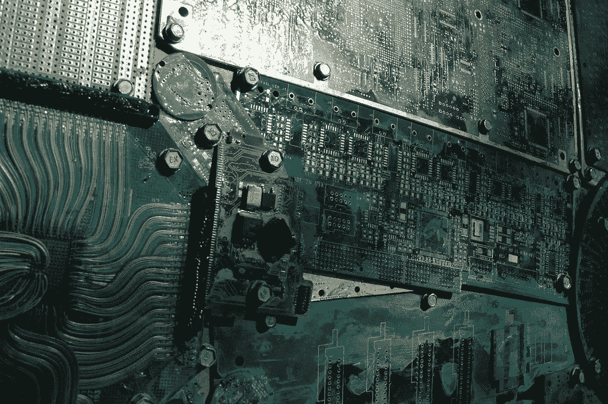

# 库伯内特的思考(K8s)

> 原文：<https://betterprogramming.pub/thinking-in-kubernetes-k8s-3770bf14c463>

## 在群集之前校准你的大脑

当我第一次被介绍给 Kubernetes 时，它是一个“容器编排平台”,处于我的专业雷达的边缘。Kubernetes 是一个奇怪的词——它在以英语为母语的人的嘴里不太好听。

当我参与到这个平台中时，我意识到它是有意义的。它带来的自动化程度是我以前从未见过的。它打开的门无法关闭。我必须学习更多。

然后我遇到了一个问题。

## 当你思考传统的时候，你是在和库伯内特人战斗

Kubernetes 不是某种预包装的银弹解决方案——它也没有声称自己是。然而，许多人从这个角度来看待它。不像下一个甲骨文怪物将*真正改变你的业务*(理解:花费你的钱)，Kubernetes 扮演一个更卑微的角色。除非你有正确的心态，否则这个角色可能看起来很奇怪。

所以我想我应该写下一些 Kubernetes 鼓励的心态变化。如果你能早点解决这些问题，你将会有一个更顺利的穿越库伯内特丛林的旅程。

# 控制反转

Kubernetes 内置了令人难以置信的自动化功能。自动冗余、高可用性、自我修复、配置管理等等。我见过有人为此而纠结。

他们花了数年时间来构建他们自己的自动化系统，现在有了一个解决方案，它带来了更多的东西。自然，他们保持他们的程序思维。

## 声明，不要发号施令

幸运的是，接受这种自动化很简单。当你定义 Kubernetes 资源时，要声明性。告诉 Kubernetes“好”是什么样子。目的是尽可能多地投入 K8s 控制世界。在需要的地方补充自动化。

让 Kubernetes 做它最擅长的事情，你可以为你的业务填补空白。

# 平台思维

Kubernetes 的许多概念非常适合于*平台思维*。这鼓励构建共享的中央服务，并通过定制解决方案消除项目的浪费和返工。

平台思维伴随着风险。如果每个人都依赖同一个共享监控服务，那么一次中断可能会产生巨大的爆炸半径。您可以为您的监控解决方案决定一个分离来限制这种影响，但是，最终，您会增加单个服务的责任。

Kubernetes 可以很高兴地支持这两者，但是当你们都生活在同一个集群中时，*集中式战略服务*比筒仓中的产品特定服务更自然地建立起来。它们的好处显而易见:

*   利用生产级服务进行实验
*   因为你降低了部署新事物的成本，更多的新事物被尝试，更多的实验带来更多的学习

# 从“生产”中取出“产品”

除非您的产品非常大，否则您的产品很可能会部署到现有的生产集群中。最初，生产环境与应用程序的这种分离是很奇怪的。

使用不同的技术，您只需在产品准备发货时构建您的环境。你拥有整个环境。

但是现在呢？你身处一个共享的生活空间——同时是房客和客人。很不舒服，感觉像是对自主权的限制。以前，你可以对你的环境随心所欲。现在吗？每样东西上都有别人的名字，你必须小心。那么如何打破这种定势呢？

## 合作

这可能会令人不安。你不了解其他人。如果他们完全特立独行呢？你所经历的是信任的开始。你已经认识到你需要依靠另一个政党。这是一个共同的责任。处理这件事的最好方法是什么？见面，解释你的焦虑，建立一些松散的工作方式，并定期改进它们。

你共享的 Kubernetes 集群会强迫你说话。如果你避而不谈，你会很挣扎。为更积极、更紧密的合作形式做好准备。这需要一些时间来适应，这可能感觉像是对你的团队所占据的神圣空间的侵犯，但只要稍加练习，就会变得非常自然，好处就会显现出来。

# 自动化—很多自动化

Kubernetes 鼓励声明性配置，而不是一系列严格告诉 K8s 做什么的程序性命令。这是它的一大优势，它提高了应用程序的自动化程度。你会喜欢简单地编写 YAML 并把它推给 Kubernetes，安全地知道 API 服务器会保护你。

***然后你会看到你的集群周围的一切……***

那些手动创建的数据库、手工制作的安全组、分散的 EC2 实例。你会渴望你的集群的甜蜜的自动化幸福。但是你已经走出了柏拉图的洞穴，无论你怎么努力，你都无法回到过去。是时候卷起袖子了。

这个头骨代表了 DBA 笔记本电脑上的可疑脚本

Kubernetes 设置了标准，很容易使你的任务是将其他一切都提升到那个标准。我唯一的建议是:*节约。自动化很好，但是自动化程度越高，需要管理的就越多。通常，更难回答的问题是，一旦你构建了自动化工具，你将如何操作性地维护它们。*