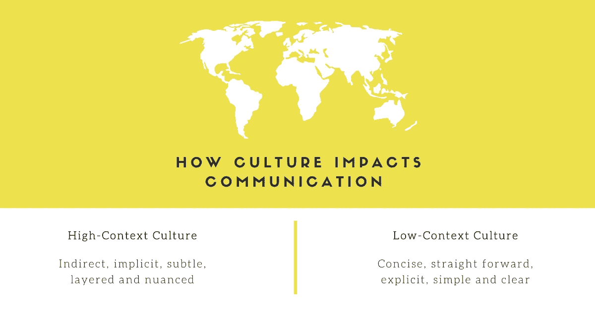

# 这就是文化如何影响交流

> 原文：<https://betterprogramming.pub/this-is-how-culture-impacts-communication-cd2585fda0a0>

## 了解高语境文化和低语境文化的区别

鸣谢:作者

那是一个星期一的早上，我在我的小隔间里焦急地等待鲍勃来办公室。我已经下定决心明确告诉他，新项目的时间表非常严格，我们不可能完成。我在马萨诸塞州的客户站点，Bob 从客户的角度处理整个程序。

在他出现的第一个迹象，我走向他，希望传达我对报名参加这个项目的不安。我们的谈话是这样进行的:

我:嘿，鲍勃。希望你周末过得愉快。你做了什么？

鲍勃:一周后是我妻子的生日。我大部分时间都在忙着筹备惊喜生日派对。

我:太好了。我肯定她会喜欢的。

拐弯抹角了一会儿，我终于说到了点子上。

我:我希望我们能讨论这个新项目。听起来真的很难。

鲍勃:是的，这是一个艰难的项目。一旦我们成功了，就有理由庆祝了。

我:是的，我想是的。你认为这个项目计划怎么样？

Bob:我们已经完成了将项目分解成更小的里程碑的详细工作，这样我们就可以跟踪整个过程的进展。你认为我们错过了什么吗？

我:不，我想我们已经涵盖了一切。

鲍勃:我相信你的团队会做得很好。

我:我也希望如此。这很难完成，但我会尽力而为。

在我整个谈话过程中，我从未提及我对项目时间表的直接关注。然而，我认为我传达了我的观点，并希望鲍勃能领会言外之意。

当项目进展不顺利，Bob 向我寻求解释时，我的回答是，“我告诉过你我们不能按时完成。”鲍勃非常生气。据他说，我们不仅“错过了时间表”，而且我从未真正表达过对此的担忧。

从我的角度来看，Bob 忽略我的信息是错误的，从他的角度来看，我显然是搞砸的那个人。好吧，这是 14 年前的事了，我后来才知道，我们俩在自己的方式上都是对的。来自印度的高语境文化，我希望鲍勃能领会我微妙的暗示，而鲍勃，作为一个来自低语境文化的美国人，希望我直截了当。

当我们为了工作跨越全球边界，走出自己的文化茧与世界各地的人交往时，这只是我们可能遇到的许多冲突之一。

无论是面对面的交谈，通过 Zoom 电话联系，还是通过 Slack 或电子邮件互动，如果我们希望有效地沟通，我们需要了解文化如何影响沟通。

# 为什么文化在交流中很重要

文化多样性——如果处理不好——可能是工作中低效、混乱、沮丧、焦虑和压力的来源。当我们没有意识到其他人如何传达和解释信息的文化差异时，我们更容易误解他们。

当来自其他国家和文化的人不按照我们的文化规范行事时会发生什么？我们陷入了基本的归因错误，把他们的行为归因于他们的个性——这就是他们是谁。我们也很方便地遵从文化上的刻板印象，而没有试图去理解文化是如何在他们的交流方式中发挥作用的。

INSEAD 大学组织行为学教授、跨文化管理领域的专家艾琳·迈耶在她的书《T2:文化地图:突破全球商业的无形边界》中写道

> “国与国之间沟通模式的细微差异以及良好商业行为或常识的复杂差异，对我们如何相互理解，并最终对我们如何完成工作产生了巨大影响。
> 
> 让我们在一个国家的一群人身上取得成功的技术可能对另一个国家的另一群人不起作用。为了合作，我们需要拥抱文化多样性，并开放自己，学习不同的沟通方式，并在此过程中做出调整。我们需要学习、抛弃和重新学习新的策略，以便与不同的人群进行有效的沟通。
> 
> 通过避开常见的刻板印象，并学会解读其他文化的行为，我们可以避免冒犯(和接受)他人，并更好地利用日益多元化的优势。”

美国人类学家 [Edward T. Hall](https://en.wikipedia.org/wiki/Edward_T._Hall) 在 20 世纪 30 年代开发了一种使用高语境和低语境来衡量跨文化交流差异的方法。他研究了阻碍或促进不同文化背景的人之间交流的因素。

一旦我们理解了高语境和低语境文化中的交流是如何变化的，我们就能够理解这些差异，并采取措施来减少交流差距——而不是被文化差异所困，导致误解和不必要的冲突。

# 高语境文化与低语境文化

艾琳·迈耶说，

> “在低语境文化中，如果我做演讲，我应该告诉你我要告诉你什么，然后我告诉你，然后我告诉你我已经告诉你的。为什么我对你说同样的事情三次？因为一切都是关于信息的简单明了。在高语境文化中，我们假设我们有更多的共享参考点。在这些文化中，我们相信良好有效的职业交流要复杂得多，更加细致入微，含蓄而有层次。”

让我们来了解一下来自高语境和低语境文化的人在交流时期望的差异。

## 高语境文化需要解读字里行间的含义

在高语境文化中:

1.  交流是间接的、含蓄的、微妙的、分层的和微妙的
2.  像语调、眼神、手势和面部表情这样的非语言暗示承载着大量的意义
3.  信息的真实意图不是口头传达的，通常由个人来解释，这需要上下文的理解和字里行间的解读。换句话说，口头信息是间接的，通常围绕着主题，并且需要共享的文化背景来表达意思
4.  注重长期关系以获得意义，这使得明确的沟通变得没有必要
5.  在会议期间，不要总结要点，也不要用书面交流来跟进。假设每个人都做对了自己的角色
6.  重视高语境交流的人发现低语境交流方式非常详细、不信任，并且由于信息的重复而浪费时间。艾琳·迈耶补充道，

> “如果你来自高语境文化，你可能会认为低语境交流者不恰当地陈述了显而易见的事情——“你不必说出来！“我们都明白，”或者甚至是居高临下和居高临下——“你跟我们说话就像我们是孩子一样”。

## 低语境文化要求如实陈述

在低语境文化中:

1.  沟通简洁、直截了当、明确、简单、清晰
2.  需要注意单词的字面意思，而不是它们周围的上下文
3.  重点是发送和接收准确的消息。没有什么需要解释的，真正的意图是用语言表达的。重复经常被用来提供必要的清晰度
4.  交流的目的和结果优先于人际关系。专注于遵循标准和程序会导致短期关系。这需要更多的价值放在信息的逻辑、事实和直接性上
5.  总结会议的要点，并把事情写下来，这样可以避免混乱，并设定明确的期望
6.  重视低语境沟通的人发现高语境沟通者懒惰、散漫、神秘、缺乏透明度、无法有效沟通，或者那些浪费大量时间试图建立关系而不是完成工作的人

# 映射跨文化交流

鸣谢:作者

Erin Meyer 开发了一个八级模型，展示了文化如何从一个极端到另一个极端发生变化。她说，

> “文化太复杂，无法仅从一两个维度进行有意义的衡量。当研究来自不同文化的人如何相互联系时，重要的不是任一种文化在标尺上的绝对位置，而是两种文化的相对位置。正是这种相对定位决定了人们如何看待彼此。”

根据她的研究:

> “美国是世界上文化背景最低的国家，其次是加拿大、澳大利亚、荷兰、德国和英国。所有盎格鲁-撒克逊文化都落在天平的左侧，英国是盎格鲁-撒克逊文化群中最高的文化背景。所有说罗曼语的国家，包括像意大利、西班牙和法国这样的欧洲国家，以及像墨西哥、巴西和阿根廷这样的拉丁美洲国家，都属于中等偏右的范围。巴西是这一组中背景文化最低的。许多非洲和亚洲国家与日本的差距甚至更大，日本是世界上文化背景最高的国家。”

这是比较跨文化交流风格的一个重要方面。

我们可以用这个量表来理解团队成员、客户、合作伙伴或其他任何与我们共事的人的不同沟通风格，而不是批评他人的沟通风格，并假设我们的沟通风格是至高无上的。

# 与来自高背景和低背景文化的人有效合作的策略

遵循以下四个关键策略进行有效的跨文化交流:

## 1.确定你的风格

在实施有效的跨文化沟通实践之前，确定你自己的风格:

*   如果你同时依赖语言和非语言的暗示，你就使用高语境交流。你可能经常含蓄地陈述你的意图，并期望别人从上下文中得到意思。简而言之，你期望别人能从字里行间读出意思。
*   如果你以更直接的方式明确表达你的期望，你就是一个低语境沟通者。这种风格帮助别人理解你的话，而不必解释你想说什么。简而言之，你说你的意思。

## 2.与来自高背景文化的人一起工作

艾琳·迈耶说，

> “当与来自另一种文化的人交往时，试着多看、多听、少说。先听后说，先学后做。”

如果你来自低语境文化，而与来自高语境文化的人一起工作，不要依赖于对单词的字面意义。此外，试着解释信息背后的含义。为此:仔细倾听，观察他们的肢体语言，思考他们的意图，并问[开放式问题](https://www.techtello.com/open-ended-questions/)以获得潜在的信息。

问开放式的问题，而不是寻求是/否的回答，对于理解信息的意图至关重要。澄清你们的理解总是比假设你们已经很好地理解了对方要好。

请注意这些短语，它们是获取更多信息的标志:

*   我会考虑的。
*   我想是的。
*   我会尽力而为。
*   这将非常困难，但我会试一试。

当轮到你向来自高语境文化的人传递信息时，尽量少重复，观察你的信息是否被很好地接受。使用[有效倾听](https://www.techtello.com/active-listening/)作为一种方法来确定他们的理解水平，并利用这种学习来补充缺失的信息或做出更正。

## 3.与来自低背景文化的人一起工作

如果你来自高语境文化，而与来自低语境文化的人一起工作，那么专注于信息的内容，而不是寻找隐藏的意义。如果意图不明确或信息听起来令人困惑，不要犹豫问澄清性问题。

来自低语境文化的人会欣赏你寻求清晰的直接性，而不是保持沉默并在以后了解理解上的差距。

向来自低语境文化的人传递信息时，要清晰明确。首先传达主要思想，不要等到最后才陈述你真正想要传达的内容。拐弯抹角，不切入正题，肯定会失去他们的注意力，引起混乱。口头和书面总结要点也是一个好主意。

## 4.就沟通框架达成一致

当与跨文化的人一起工作时，有时最有效的方法是团队开发他们自己的交流语言。

通过成为共享环境的一部分，理解文化差异和由于这些差异而产生的误解，团队可以更好地理解这些差异，并设计出对每个人都有利的策略。

创建沟通框架的另一个优势来自于明确地寻求团队所有成员的一致意见，并让每个成员都对此负责。通过明确地签约，团队成员将会更舒服地走出他们通常的交流方式，去探索一种适合团队所有成员的方式。

# 跨文化交流差异的例子

## 不同的意见

摘自艾琳·迈耶的著作《文化地图:突破全球商业的无形界限:

> 在中国为一家中国纺织公司工作了 15 年的西班牙高管 Pablo Díaz 评论道:“在中国，预先传达的信息不一定是真实的信息。我的中国同事会给我暗示，但我不会去领会。后来，仔细想想，我会意识到我错过了一些重要的东西。”迪亚兹讲述了他与一名中国员工的一次讨论，内容大致如下:
> 
> 迪亚斯:看起来我们中的一些人周日必须在这里接待客户拜访。
> 
> 陈先生:我明白了。
> 
> 迪亚斯先生:你能在星期天加入我们吗？
> 
> 陈先生:是的，我想是的。
> 
> 迪亚斯先生:这将是一个很大的帮助。
> 
> 陈先生:是的，星期天是一个重要的日子。
> 
> 迪亚斯先生:以什么方式？
> 
> 陈先生:今天是我女儿的生日。
> 
> 迪亚斯先生:真好。我希望你们都喜欢它。
> 
> 陈先生:谢谢你。我感谢你的理解。
> 
> 迪亚兹对现在的情况一笑置之。“我很确定他说过他要来，”迪亚兹说。“陈先生非常肯定他已经传达了他绝对不能来，因为他要和他的家人一起庆祝他女儿的生日。”
> 
> 迪亚兹从经验中学会了如何避免陷入这些沟通混乱:如果我不能百分之百确定我听到了什么，耸耸肩，带着我认为我听到的信息离开不是一个好策略。如果我不确定，我有责任要求澄清。有时我不得不问三四次，虽然这对于我和我的同事来说都有点尴尬，但这并不像把生产线准备好，在别的地方心满意足地唱着生日快乐歌的陈先生那样尴尬。

## 佳洁士牙膏广告

摘自[维基百科](https://en.wikipedia.org/wiki/High-context_and_low-context_cultures):

北京英语教学研究所的何白对两个不同的广告进行了分析，这两个广告迎合了不同的语境文化。

第一个广告

> “现在有更多的牙医可以为你的牙龈推荐一些被证明有助于牙龈健康的东西。佳洁士口香糖是唯一如此有效的抗蛀牙牙膏，临床证明它有助于预防牙龈疾病-牙龈炎。正是牙医所要求的。”

这个广告是为处于低语境文化中的人们设计的，它直接且信息丰富。关于蛀牙保护、临床研究和牙医建议的信息都在这三句话里。处于低语境文化中的人，因为他们喜欢直接交流，会发现这个广告很有帮助。

第二个广告

> "在健康的笑容背后，有一个佳洁士."

第二个广告是针对高语境文化的，信息不太直接。因为信息是隐含的，所以广告对高语境文化中的人有吸引力。

## 营销和广告视角

摘自[维基百科](https://en.wikipedia.org/wiki/High-context_and_low-context_cultures):

> “广告和营销中的文化差异也可以通过高语境文化和低语境文化来解释。一项关于麦当劳在线广告的研究比较了日本、中国、韩国、香港、巴基斯坦、德国、丹麦、瑞典、挪威、芬兰和美国，发现在高语境国家，广告使用更多的颜色、动作和声音来提供语境，而在低语境文化中，广告更关注口头信息和线性过程。

# **总结**

为了避免与来自高语境和低语境文化的人交流时的不确定性:

1.  你的风格:确定你自己的沟通风格——高语境或低语境。
2.  相对位置:根据前面总结的 Erin Meyer 的标准找到个人，看看他们适合什么位置。相对于你在量表中的位置，他们是高背景还是低背景？
3.  做出调整:如果他们比你所处的环境更高，试着通过超越文字去理解意图，观察肢体语言，使用开放式问题来寻求澄清。如果他们来自一个比你文化背景低的地方，就从表面上接受这个信息。
4.  沟通语言:当与由来自不同文化的个人组成的团队合作时，让团队理解这些差异的重要性，然后开发他们自己的语言来有效地沟通。

*原载于 2021 年 1 月 14 日 https://www.techtello.com***。**