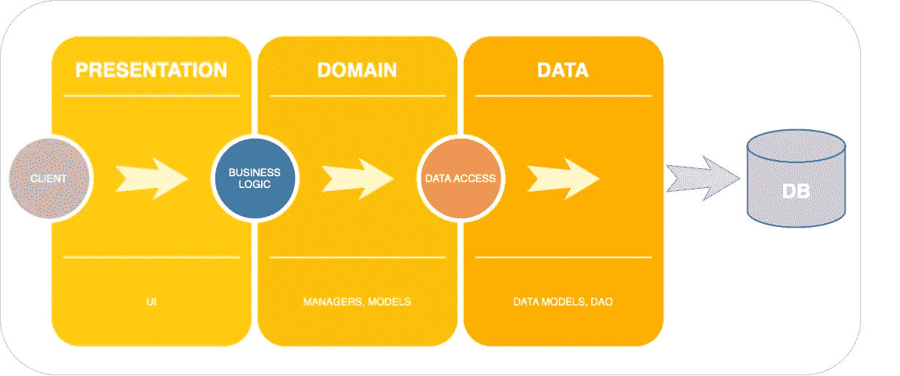
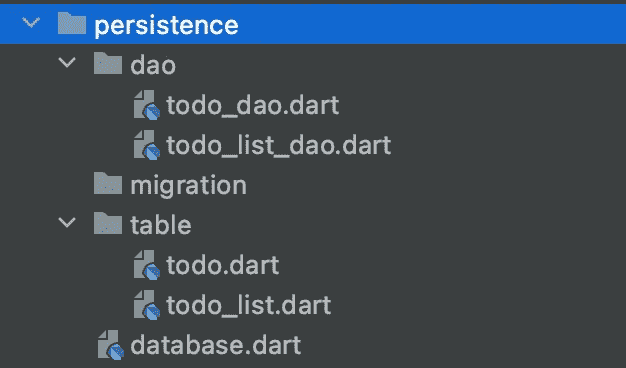
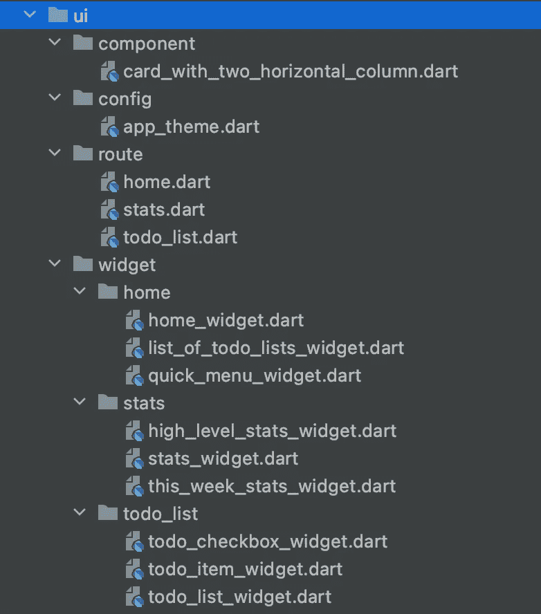
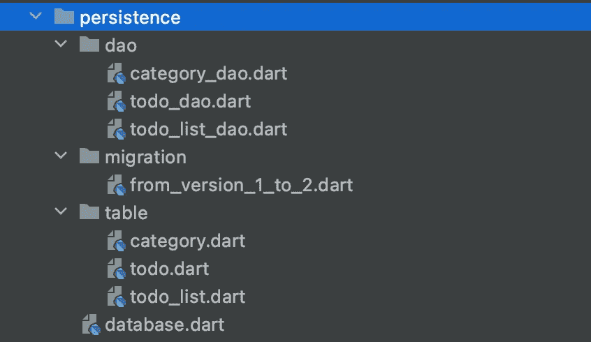
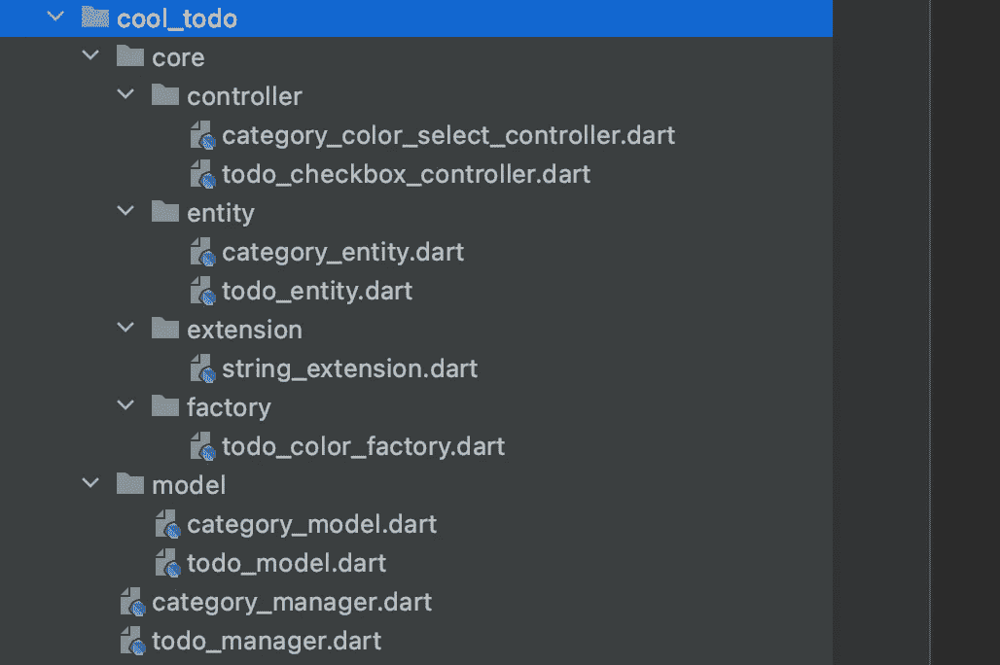

# 这就是我如何组织我的 Flutter 项目以获得更好的可伸缩性

> 原文：<https://betterprogramming.pub/this-is-how-i-keep-my-flutter-projects-organized-for-better-scalability-870f22706915>

## 如果你的项目随着时间的推移变得凌乱不堪，那你来对地方了

三层架构—由作者创建

有许多软件架构模型，但最常见的是三层架构，它由三个不同的层组成:

1.  表示层
2.  领域或业务层
3.  数据或持久层

关于这个架构，我将描述我如何组织我的项目。无论您在项目中使用哪种架构，主要思想都是相同的。

保持你的图层尽可能的分离，因为当项目变大时，这将会派上用场。在 UI 代码中包含业务逻辑是一种糟糕的做法，但如果你正在 YouTube 或 Udemy 上观看视频教程，讲师会犯这个错误，以帮助你更快地开始。这并不是说你应该继续犯同样的错误。

# 数据层

这一层应该包含处理数据访问的类。我使用 [Moor](https://pub.dev/packages/moor) 库来管理数据，因此这一层包含表定义和 Dao(数据访问对象)。这一层还旨在包含迁移逻辑。当我说迁移时，我指的是不同版本的应用程序的数据模型的差异。

假设我们正在开发一个待办事项应用程序，允许你建立几个待办事项列表。为了表示数据层，我们首先创建一个名为`persistence` 的文件夹。之后，我们将专注于数据模型。这将是一个简单的设计，将`todo_list`和`todo`表放在`table`目录中。最后，我们将开发允许我们操作数据库的 DAO 类。因此，`todo_list_dao`和`todo_dao`类将在`dao`目录中找到。除了这些目录，还会有一个`migration`文件夹，一开始会是空的，但在更新应用时会很有用。

因此，数据层将如下所示。随着应用程序的增长，新的表和 Dao 将有序地添加进来。

简单 todo 应用程序的持久层

# 畴层

应用程序的业务逻辑存储在域层(也称为业务层)。数据层可以依赖于域层，但域层不能依赖于数据层。除了数据和 UI 相关的项目，这是我放所有东西的地方。当然，这里的结构是最灵活的，因为这一层是程序运行的基础。

我们以同一个待办 app 为例。这里可能的逻辑是什么？首先，我们需要一个 todo 管理器类，它可以加载所有可能的 todo 列表或一个特定的列表，或者更改特定 todo 项的状态。模型也可以包含在这一层中。请记住，用户界面将依赖于这一层，因此将从这一层使用这些模型和管理器。

到目前为止，结构看起来如下。然而，它可能会随着应用程序的增长和对更多功能的需求而发展。

todo 应用程序的域层

我一般在这个文件夹里放两个子文件夹:`core`和`model`。当我不需要那么多的管理器类时，我把它们放在这个文件夹的根目录下。当我需要多个管理器时，我通常为每个屏幕(或路径)创建子文件夹，并将管理器类放在其中。

# 表示层

表示层是最容易理解的，但是它也包含了大部分的歧义。即使在企业级，我也见过直接在 UI 中使用 DAOs。为了加载所有的待办事项，你在网上找到的第一个待办事项应用教程很可能会直接调用数据库。这是完全错误的。表示层不能依赖于数据层。最佳实践是依赖管理器界面。

Flutter 在用户界面方面提供了很多东西。但是，您可能会注意到，代码几乎立即变成了大量嵌套。大多数 UI 代码应该按照某种逻辑进行划分和组织。对于依赖注入和路由，我使用[模块化](https://pub.dev/packages/flutter_modular)插件。route 小部件通常包含一个脚手架及其`body`，是我进入每个屏幕的入口点。例如，如果我有一个`todos_route.dart`，我总会有一个`todos_widget.dart`成为脚手架的主体。

TodosWidget 包含应用程序入口页面的所有 UI 代码，而不是 TodosRoute

我在这一层还有两个子文件夹叫做`component`和`widget`。术语`component`指的是更通用的小部件。例如，有三列的卡片是一个组件，而 todo 项是一个小部件。组件可以在任何地方使用，但是，小部件通常是领域专用的，应该只在您的应用程序中使用。

总而言之，路径文件夹存储了应用程序的所有路径。在 Components 文件夹中，您会发现一些更常见、更通用的小部件。在 Widget 文件夹中，每个路由都有子文件夹，每个子文件夹都包含该路由实现中使用的所有 Widget。

在此迭代中，项目的 UI 文件夹将如下所示:

因为 UI 代码随着时间的推移变得越来越混乱，所以我们需要对这一层进行更好的组织。

最后，如果你能把你的屏幕分成五个面板，你应该有五个部件来代表它们，并且你应该在不同的文件中实现这些类。这样，当需要改变的时候，你就知道该去哪里找了。

# 变更请求示例:为待办事项列表添加类别

到目前为止，我们相信我们有一个可扩展的架构。如果我们可以添加类别，并为某个类别分配待办事项列表，那就太好了！将您的工作优先放在持久层，这是您应该开始的地方。这需要创建一个名为`category`的新表和一个名为`category_dao`的新 dao。我们需要创建迁移代码，因为我们正在改变数据库模型。

添加了'**类别'**功能后的持久层。

完成持久层之后，我们应该继续到领域层。显然，最重要的增加将是`category_manager`类，它将使用`category_dao`和可能的`todo_list_dao`操作数据。我可能会在`core`子文件夹中添加更多的类，但是如前所述，这一层的组织完全取决于您的应用程序，所以要灵活，但是在添加任何东西之前要三思，尽量不要破坏有意义的层次结构。现在看起来是这样的:

添加**类别**特征后的域层

最后，我们已经完成了用户界面的修改。因为这是一个假设的 app，所以我们会虚构一些需求。首先，我们希望在主页上有待办事项列表`categorized`。我们习惯在回家的路上列出所有的待办事项。我们的类别面板现在将滑动，因此我们将需要一个新的部件和组件。此外，我们还需要一条新的路线，这样我们也可以更改这条路线上的类别。UI 文件夹最终会是这样的:

引入类别功能后的 UI 层

我使用这种方法已经有一段时间了，尤其是对于 UI，随着项目的发展，代码变得更容易处理。因为我几乎总是在我的辅助项目中使用三层设计，所以我从未有过例外。

# 结论

您使用的体系结构会对文件夹的结构产生重大影响。即使您试图使用微服务架构，您也可以使用上述结构，至少对于 UI 是这样。我想说，如果你的 UI 代码组织得很好，随着项目的进展，你会有更少的麻烦。

你在这里读到的东西都不是一成不变的。然而，我强烈建议你重新考虑你的结构，以便在你发展的后期更容易成长。如果你使用任何其他有效的组织策略，请在评论中分享，以便我改进这个结构。