# 这就是如何在 Anvil 中使用版本控制

> 原文：<https://betterprogramming.pub/this-is-how-to-use-version-control-in-anvil-60747ab536e2>

## 了解如何使用 Anvil 的内置版本控制来跟踪更改


照片由[扬西·敏](https://unsplash.com/@yancymin?utm_source=medium&utm_medium=referral)在 [Unsplash](https://unsplash.com?utm_source=medium&utm_medium=referral) 上拍摄

如果没有像 [Git](https://git-scm.com/) 这样的版本控制软件，跟踪你对代码所做的更改可能会很复杂。Anvil 是一个只使用 Python 构建 web 应用程序的平台，它带有由 Git 支持的内置版本控制。

在本文中，我将快速浏览一下 Anvil 中的版本控制，向您展示它的易用性和强大功能。让我们开始吧。

# Anvil 的版本控制实际上是做什么的？

Anvil 的版本控制，像许多其他版本控制系统一样，做许多事情。它可以让您:

*   [跟踪应用程序的变化](#f431)
*   [创建分支并同时处理特征](#b241)
*   [将分支合并在一起](#502b)
*   [恢复到以前的应用版本](#ea30)
*   [发布具体 app 版本](http://55fe)

让我们从跟踪更改开始。

# 跟踪更改

了解一个特性的最好方法是尝试它，所以我创建了一个简单的示例应用程序供您在阅读本文时使用。这个例子是一个简单的反馈表格应用程序。使用下面的克隆链接开始并跟随(它是免费的):

[](https://anvil.works/build#clone:3JB7HB4RWNCHP2LD=JC6652EFYXHQ4EP3UXZ4W7FH) [## 克隆示例应用程序

铁砧工厂](https://anvil.works/build#clone:3JB7HB4RWNCHP2LD=JC6652EFYXHQ4EP3UXZ4W7FH) 

点击克隆链接将带您进入 [Anvil 编辑器](https://anvil.works/docs/editor/new-editor-beta)。

## 承诺

提交是整个应用在某个时间点的快照。提交是项目时间表的构建单元。

要查看应用程序的提交，请单击 Anvil 编辑器底部的向上箭头，并选择 Version History 选项卡。

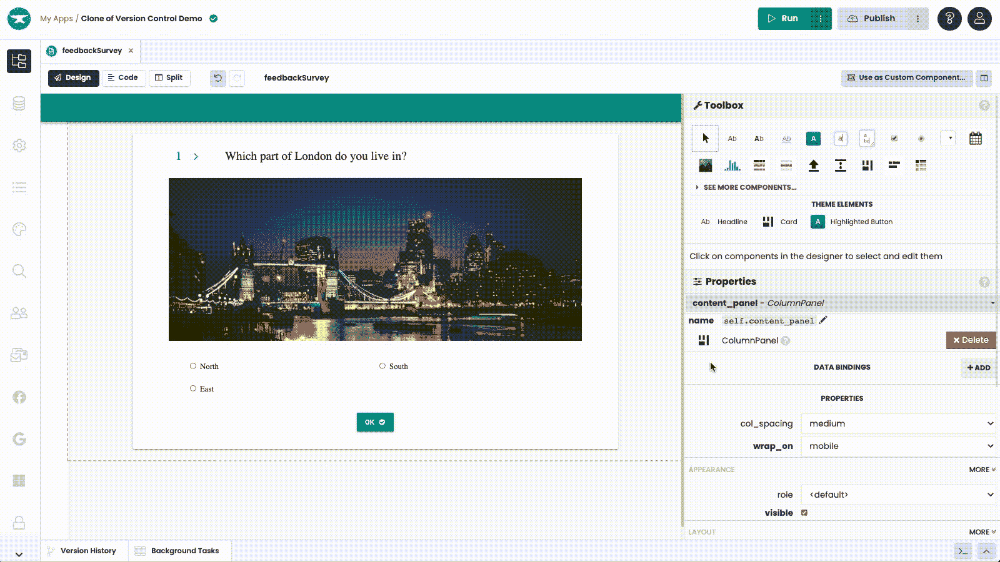

单击编辑器底部的向上箭头

在我们的示例中，您将看到一个描述为“克隆的应用程序”的提交

Anvil 会在您每次更改应用程序时创建一个新的提交。如果您在短时间内重复更改应用程序，Anvil 会将所有更改“压缩”到一次提交中(我们将在下一节了解更多关于自动提交的信息)。

让我们通过将一个`[RadioButton](https://anvil.works/docs/client/components/basic#radiobutton)`组件拖到我们的表单中来查看新的提交。

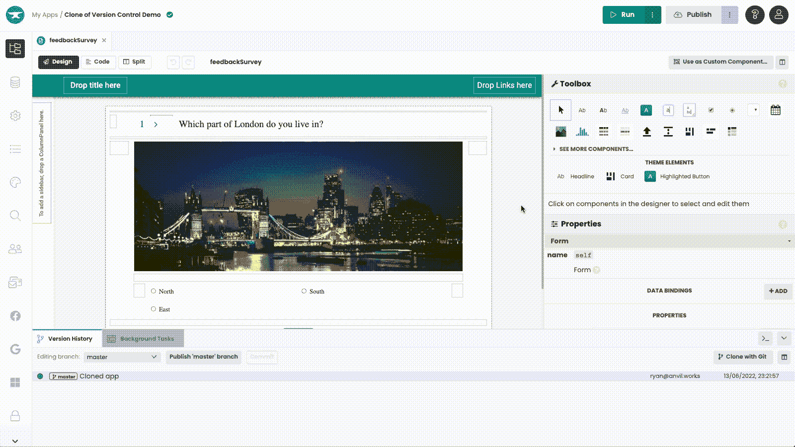

通过拖动 RadioButton 组件来更改我们的应用程序

提交按时间倒序显示，所以较新的提交(子代)出现在较旧的提交(父代)之上。

每一次提交都向您显示了关于更改了什么、谁更改了它以及何时提交的信息。如果双击某个提交，它会在右侧打开一个比较窗口，将所选提交与其父提交进行比较。


查看提交的详细信息

## 手动创建提交

如果您想用更具体的描述创建自己的提交，您可以随时使用`Commit`按钮手动创建一个提交。

我们可以通过选择前面添加到表单中的`RadioButton`并将文本改为“西部”来尝试一下然后，在版本控制面板中，选择`Commit`并写一条消息来描述我们所做的更改。

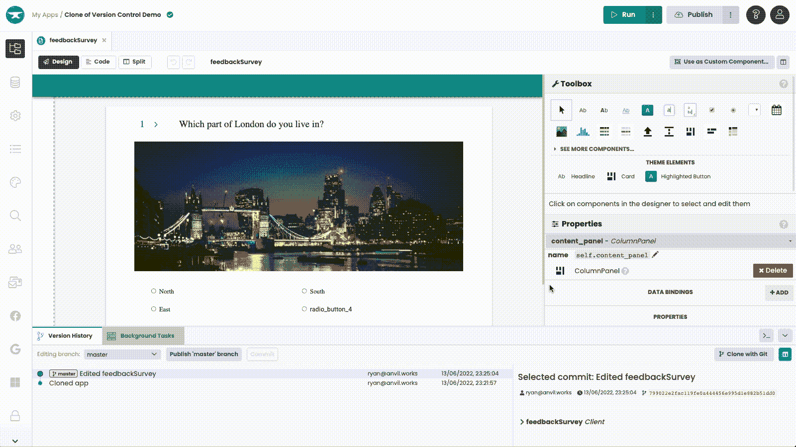

冻结提交

## 自动提交

您对 Anvil 应用程序所做的每个更改都会产生一个提交。为了避免大量的提交，如果您快速连续地进行更改，Anvil 会将每个新的更改“挤压”到最新的提交中，即，它会用您的最新更改和以前的更改创建一个新的提交。这有效地用新的提交替换了最新的提交(在 Git 中，这被称为[修改提交](https://www.atlassian.com/git/tutorials/rewriting-history))。)

如果您想要“冻结”提交，以便在新的提交中发生任何新的更改，请单击 commit 按钮(就像我们在手动创建提交部分中所做的那样)。

# 分支

## 创建分支

当你创建一个应用程序时，它有一个名为`master`的分支。你可以把`master`分支想象成你的应用程序的“默认”分支。最初，所有添加到应用版本历史的提交都被提交到`master`。

您还可以创建其他分支。额外的分支允许您从一个特定的提交“分支”,做您自己的事情，而不影响原始分支上的进一步提交。


带有“分支”示例的 Git 树

当你想要添加一个新的特性或者修复一个 bug 时，分支是一个强大的工具。将变更提交到新的分支可以让您封装您的变更。这使得不稳定的代码更难合并到应用程序的主要代码库中(我很快会解释合并！).

让我们尝试通过右键单击最近的提交来创建一个分支，并将该分支命名为`client-code-changes`。然后我们将对`feedbackSurvey`表单的客户端代码做一个小小的修改。

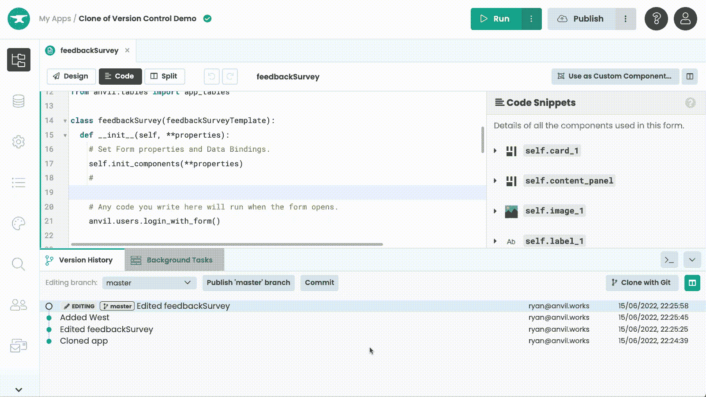

该分支现在将在版本控制选项卡中可见。


“版本控制”选项卡显示了我们刚刚创建的分支

当您编辑应用程序时，这个分支将会移动，在您创建它时指向每个新的提交。

## 切换分支

你可以从`Editing Branch`下拉菜单中选择你正在编辑的分支，或者右击分支并选择`Checkout branch`。

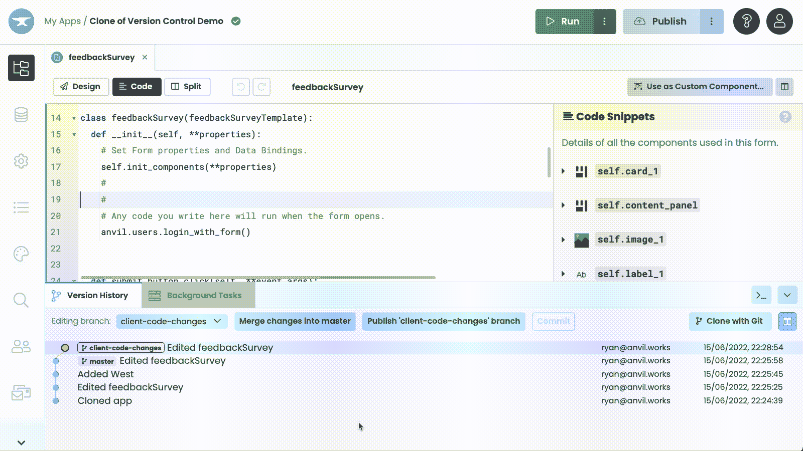

切换分支

让我们切换回`master`。接下来，我们将了解如何合并分支。

# 合并

合并是 Git 将分支重新组合在一起的方式。Git 找到两个分支之间的公共父分支，并使用它来计算出在起始点和您要合并的每个提交之间发生了什么变化。然后，它将组合两组更改。

让我们在`master`上提交，这样版本控制选项卡中的 Git 树看起来就像这样:


Git 树显示对主树旁边的一个分支的更改

检查完`master`后，右键单击您想要合并的分支并选择`Merge`。写一条消息，详细说明您要合并的内容，然后选择`Merge`。

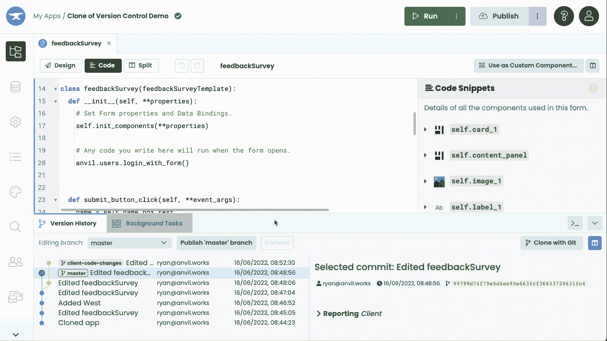

合并分支

Git 树然后显示被合并的分支:


显示合并的 Git 树

合并是 git 的超能力，因为它为您集成了所有的更改，然而，有时两个分支会对同一个文件进行 Git 无法解决的更改。当这种情况发生时，Git 会引发冲突。

# 冲突

当两个人更改了文件中的相同行，或者一个开发人员删除了一个文件而另一个开发人员正在修改它时，通常会产生冲突。在这些情况下，Git 不能自动确定什么是正确的。

当尝试的合并因冲突而失败时，Anvil 将通过一个对话框通知您:


冲突对话框

## 代码冲突

如果合并的双方都更改了相同的代码行，您将看到代码冲突:

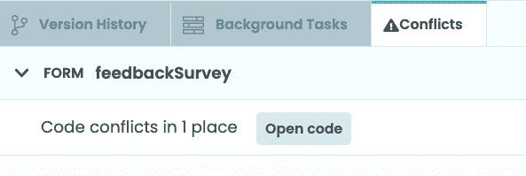

代码冲突

如果您选择`Open code`，冲突的代码行将在合并的每一边以不同的颜色显示。下面是一个相互矛盾的评论的例子:

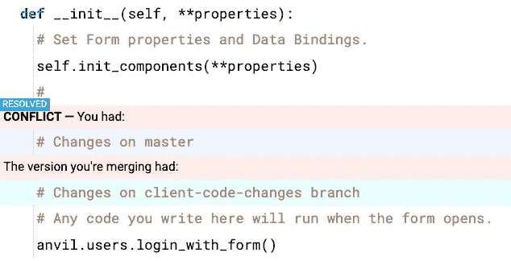

冲突代码

您现在必须编辑此范围内的文本以解决冲突。完成此操作后，单击冲突标记上的“已解决”按钮。


正在解决合并冲突

## 组件或配置冲突

如果冲突涉及对表单上相同组件或应用程序部分配置的更改，您将看到组件冲突:


组件冲突

或者配置冲突:


配置冲突

对于组件冲突，编辑组件以解决冲突，通常是通过合并在您要合并的分支上所做的更改，而不是您所在的分支。完成后，只需点击`Ignore`按钮。

配置冲突是相同的，编辑您的应用程序的配置以解决冲突并选择`Ignore`。

## 将冲突标记为已解决

一旦您解决了表单、模块或应用程序配置中的所有个别冲突，您需要确认此项目已完全解决:

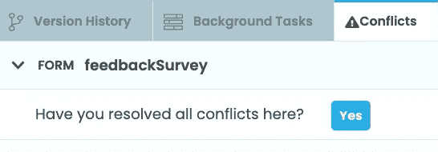

确认项目已完全解决

确认所有冲突都已解决后，您可以单击“版本历史记录”选项卡中的“完成合并”按钮:


解决冲突后完成合并

以下是解决冲突的完整流程演示:


解决冲突的示例

# 恢复到以前的版本

Anvil editor 让一件事情变得非常简单，那就是将你的应用恢复到之前的版本。我们需要做的就是右键单击我们想要返回的提交并选择`reset *<branch-name>* to here.`


恢复到以前的版本

# 发布特定版本

通常，当你开发应用程序时，你会在几个不同的环境中运行相同的代码。您可能有一个开发环境、一个测试环境和一个生产环境。这允许你继续开发和测试你的应用程序，而不影响你的用户。

Anvil 应用程序也不例外，为了便于维护不同的环境，Anvil 自带了内置的[部署环境](https://anvil.works/beta-docs/deployment-new-ide/environments)。


Anvil 中某些环境的示例

对于每个环境，您可以选择要部署的特定提交或分支。让我们通过为我们的应用程序创建两个环境来尝试一下，一个叫做`production`，另一个叫做`development`。

## 发布特定的提交

在编辑器的右上角，点击`Publish`按钮。接下来，点击`Publish this app`按钮。这将创建一个名为`Published`的环境。

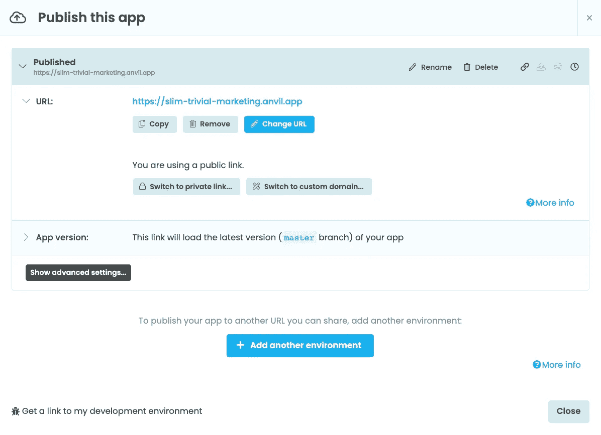

我们刚刚创建的“已发布”环境的示例

现在我们已经创建了一个环境，我们可以选择我们希望这个环境使用的提交。展开`App version`部分并选择`Link to a different version`。

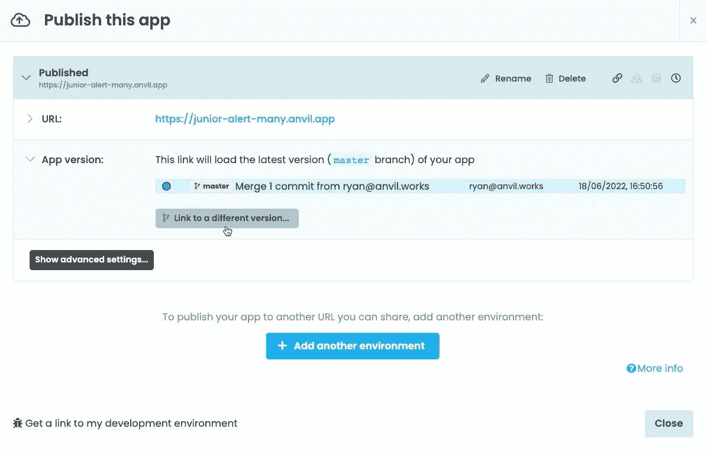

突出显示“链接到不同版本…”的环境

单击`Select this commit`选择之前的提交。


链接到不同版本对话框

您现在将看到我们的`Published`环境将加载一个特定的提交。这是整个过程的完整 gif 图:

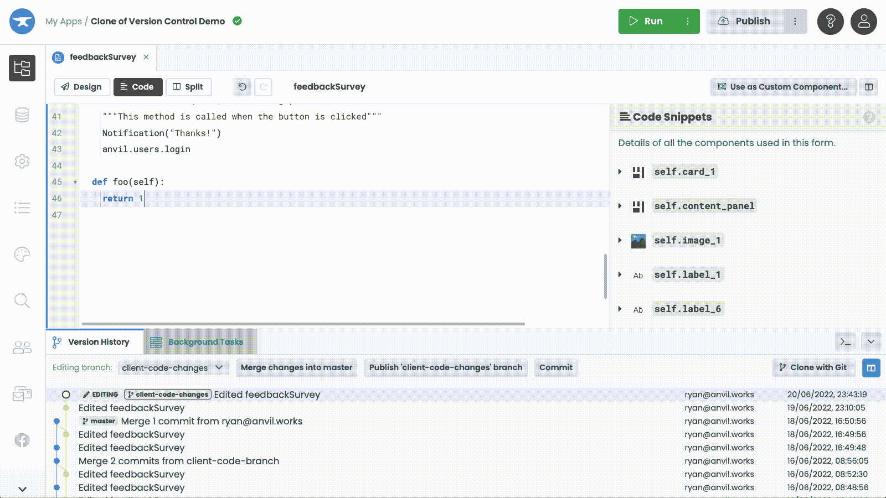

发布特定提交

## 发布特定分支

接下来，让我们创建一个开发环境，但是我们不是选择一个特定的提交来发布，而是为这个环境选择一个分支来发布。首先点击`Add another environment`按钮，并将其重命名为`development`。然后，在`App version`部分选择`Link to a different version`。

最后，点击我们之前制作的分支头部，按下`Select branch '<name of branch>'`。


选择环境应该使用的分支

现在，当您导航到该环境的 URL 时，应用程序将加载来自该分支的任何最新代码——这对于在开发中进行大量更改并测试它们非常有用。

这是整个过程的完整 gif 图:

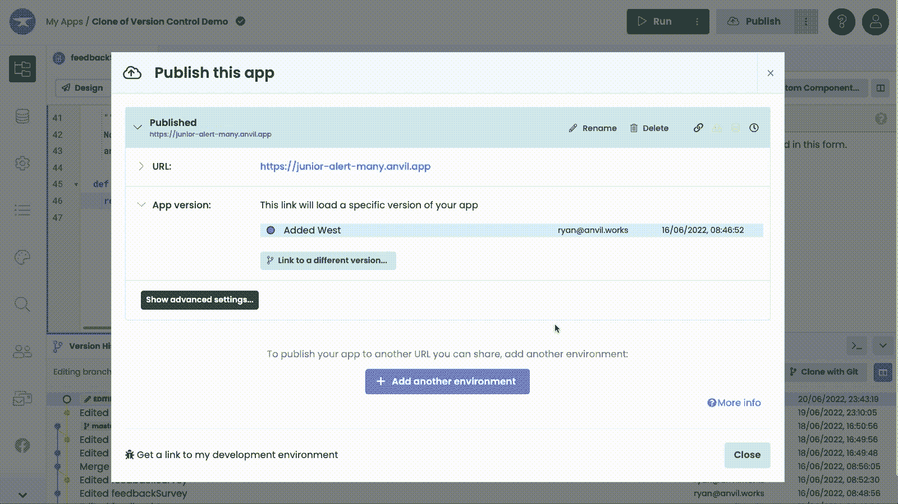

发布特定分支

就是这样。我们现在有两个环境，有两个不同的 URL，每个 URL 指向我们应用程序的不同版本。

# 结论

这是对 Anvil 版本控制的介绍。我们已经看到了它的简单易用和强大功能。我们在本文中讨论了很多，包括以下内容:

*   [跟踪应用程序的变化](#f431)
*   [创建分支并同时处理特征](#b241)
*   [将分支合并在一起](#502b)
*   [恢复到以前的应用程序版本](#ea30)
*   [发布具体应用版本](http://55fe)

Git 可能会让人不知所措，尽管 Anvil 提供了一个很好的简化界面，但学习更多关于 Git 如何与像[LearnGitBranching.js.org](https://learngitbranching.js.org/)这样的可视化工具一起工作是很有用的——当我开始工作时，它真的帮了我很多。

请在评论中告诉我你对这篇文章的看法。感谢阅读！

```
**Want to connect?**[Follow me for more](https://codingwithryan.medium.com/) software development content!
```