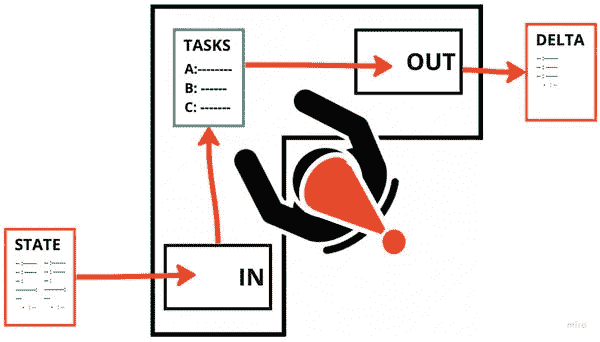
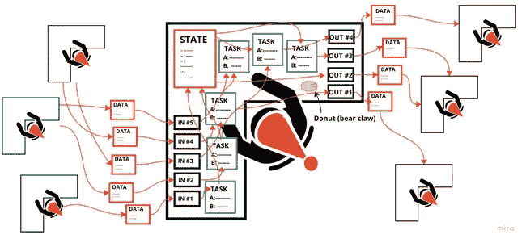
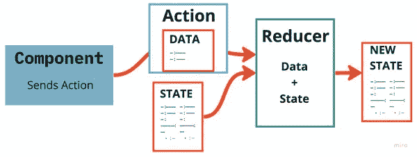

# 解耦应用的三个核心原则

> 原文：<https://betterprogramming.pub/three-core-principles-of-decoupled-applications-a959fc9992a9>

## 面向对象设计的最大错误是封装了长期状态。如果我们没有呢？


萨汉德·巴巴里在 [Unsplash](https://unsplash.com?utm_source=medium&utm_medium=referral) 上的照片

```
**Table of Contents**

[Encapsulate Business Logic, Not State](#5a18)
[Separate Message Passing from Business Logic](#1df9)
[State Should be Immutable](#6ef8)
```

# 我犯了太多的错误

当然，通过这些年来的每一次迭代，我的目标是提高我的技术。我会自豪地解决一些之前的问题，但其他同样严重的问题总是会出现，取代他们的位置，就像我手指上的鼻屎一样顽固。

这些问题通常集中在州政府。无论我多么小心地划分我所有的控制器和管理器，总有一些未计算的代码需要访问状态。这些特殊情况慢慢地损害了我的原始设计，使我再次陷入了控制器管理器混乱的紧密耦合的道路。

疯狂的定义是重复同样的动作，却期待不同的结果。最终，我准备停止疯狂。我准备尝试一些不同的东西。

# 寻找替代方案

我探索了我能找到的每一个范例。我挑选了一些成功的图书馆，寻找如何成为更好的玩家的线索。

最终，我说服我的团队为我们的下一个播放器迭代开发一个完全不同的架构。这是一个巨大的风险。我们盲目飞行，除了野心和绝望中产生的固执。失败不是一个选项。

我们成功了。我们以创纪录的速度完成了比赛。我们设计的播放器很健壮；多年来，我们一直没有升级核心功能。它是可扩展的；我们添加了没有耦合的特性。它是可扩展的；我们有来自其他公司的其他团队修改球员没有问题。此外，我们由四至六名工程师组成的团队比其他二十人的团队更有效率。

唉，这款播放器和它的创新设计没能幸免于公司解体的突发奇想。

因此，我写这些文章是为了传递我的团队来之不易的知识，即使代码已经不存在了。

# 原则#1:封装业务逻辑，而不是状态

如果你把长期状态的每一部分都集中起来，只是把它们从你的类中去掉，会发生什么？

我们不得不问自己这个关于我们新球员设计的问题。我们要创造一些 Redux 的变体，但是规模要大。我们相信拥有一个容易获取的真理来源将会解决大量的问题。

但是除去国家，我们还剩下什么？

老实说，只是一堆没有意义的商业逻辑，因为它们就像巴黎人行道上的狗屎一样涂在整个应用程序上。(事实上，巴黎已经彻底清理了它在人行道上便便的问题，但我仍然记得在九十年代走在那些街道上。)

然后它就像钻石子弹一样击中了我的前额。这是商业逻辑。商业逻辑。

# 的。生意。逻辑。

[状态只是不同业务逻辑位之间随着时间的推移而进行的通信](https://medium.com/better-programming/the-heart-of-software-architecture-is-weirdly-empty-eceff9abfc45)。

我们一直在封装错误的东西。

# 不同条纹的侏儒


由[大卫·布鲁克·马丁](https://unsplash.com/@dbmartin00?utm_source=medium&utm_medium=referral)在 [Unsplash](https://unsplash.com?utm_source=medium&utm_medium=referral) 上拍摄的照片

想象一下，我们关掉电脑程序，一群侏儒坐在一个房间的桌子前。

在一个房间里，我们称之为反应室(伏笔…检查)，你给每个侏儒一组任务。每隔几分钟左右，他们的收件箱里就会收到一张纸，上面有他们完成任务所需的所有数据。他们进行计算(他们的业务逻辑)。他们将他们的更改放入发件箱。完成了。



在反应室里，每个侏儒都有一项工作。业务逻辑绿色。(其余图片由作者提供)

对于任何 gnome 来说，in 框中的数据来自哪里，或者在他们将数据放入 OUT 框后，数据会被放在哪里都无关紧要。一个反应型侏儒不需要和其他侏儒呆在同一个房间里:当他们被训练或测试时，他们可以拿到任意一张纸来确保他们知道自己在做什么。

此外，众所周知侏儒会制造麻烦。他们会毫无理由地减速，或者更糟，他们会偷你的甜甜圈。在反应室里，对偷吃甜甜圈慢的人没有容忍度；问题侏儒立刻被替换。

就在隔壁，在面向对象的房间里，事情并不那么有序。每个侏儒都有一张写满神秘笔记的纸。他们不愿意分享这些笔记，因为害怕一些反复无常的涂鸦者会意外地更改数据，所以他们设置了一系列收件箱。如果其他侏儒需要用他们的数据做些什么，他们需要友好地请求。



面向对象的 gnome 必须和他所有的 gnome 同事成为好朋友。

这些侏儒的任务清单可能是杂乱无章且晦涩难懂的，涉及到很多要弄清楚他们周围的其他侏儒在做什么。这通常意味着他们正在执行更大任务的一小部分。即使他们理解他们自己的部分，他们也可能看不到他们的工作是如何影响三张桌子下面的那个不停发送没有人理解的疯狂错误信息的 Gnome。

最重要的是，你注意到一个侏儒在啃你的熊爪。

当你威胁要取代他们时，那个侏儒傻笑着说:“你不知道我是做什么的。”

*你的*熊爪。

那么，你更愿意在哪个房间吃甜甜圈呢？希望你不必对此想得太多。

# 原则#2:将消息传递与业务逻辑分开

你当然想待在反应室。管理起来就容易多了。

你的侏儒们不需要知道数据是如何进入他们的收件箱的，他们也不必担心数据放入他们的收件箱后会发生什么。

飞行的精灵可以从一张桌子飞到另一张桌子，或者信息可以被包裹在燃烧的箭中；没关系。

## 但是，等等，我们如何决定将哪些消息发送到哪里？

让我们离开 gnome 类比，看看一个实际的解耦消息传递系统。再来看 Redux。

在 Redux 中，想要启动特定业务逻辑的组件代码将分派一个动作以及要执行的动作的相关数据。这个动作被路由到一个特定的 reducer，这个 reducer 只是一个从动作中获取数据的函数，在当前应用程序状态上执行一些业务逻辑，然后返回一个新的应用程序状态。



Redux。绿盒中的业务逻辑。

这个方案在 React 甚至 Angular 上都能很好地工作，但是 Redux 必须被扩展以处理更复杂的用例。因此，它不太适合具有复杂状态的应用程序。

但是，行动的概念非常有趣。

## 行动胜于事件。

明确地说，动作不是事件，尽管它们是表亲。事件让您知道刚刚发生的事情，例如，视频暂停。一个动作让你知道特定的事情即将发生，例如，暂停视频的时间到了。

你可以把一个动作看作是分派动作的代码和接收动作的代码之间的契约:完成你的工作所必需的数据已经被正确地设置了——把它拿走。

我们可以使用动作作为连接复杂业务逻辑的基础。


我们可以使用动作通过应用程序的业务逻辑来传输我们的状态。

这个业务逻辑不在一个减速器里。这些是不同的野兽。这段代码必须消费和调度状态在应用程序中移动的动作。

这种类型的代码恰好有一个行业标准名称。

# 演员

我希望我没有让太多人感到惊讶:我说的是来自[的](https://nairihar.medium.com/reactive-programming-e4698b6ee3f)[演员模式](https://mattferderer.com/what-is-the-actor-model-and-when-should-you-use-it)和。嘿，我预示了这一切。

你可以把反应式编程想象成流编程。一个参与者的工作流入另一个参与者，然后是另一个，通过你的应用程序创建一条令人愉快的奔流状态之河。

反应流有很大的灵活性。

您可以让一个执行元有条件地分派不同的操作，如下图所示:


流可以被分割以处理不同的业务逻辑集。

或者您可以实现状态机或启用计时器来启动其他参与者。

此外，你并不局限于每个动作只有一个演员。你可以像这样把它们串起来:


您可以构建供参与者一起使用的方法，比如将增量与状态一起传递。

在许多用例中，多个参与者与相同的动作进行交互。您可以进行一场比赛，第一个参与者获胜，或者进行一次并行执行，多个参与者，甚至是同一个参与者的多个实例一起工作来分担一项任务。

用于 Java 运行时的 Akka 库提供了这些连接器的健壮套件。然而，通常这种库是面向后端系统的。我不知道 JavaScript 中有什么类似的东西是可行的(尽管我很想知道是否有这样的东西)。对于我自己的应用程序，我创建了一个相当简单的 DSL。

我将在以后写更多关于实现的内容，但是现在主要的要点是:

*   因为消息传递与参与者是分离的，所以如果应用程序的需求发生变化，参与者可以以不同的方式使用，而不需要改变它们的实现。

这种围绕业务逻辑的灵活性是反应式编程和角色模式的巨大优势。[它允许有状态应用程序随时间扩展](https://medium.com/better-programming/how-do-applications-scale-3dad5c89df1e)。

面向对象设计？没有那么多。

# 原则 3:状态应该是不可变的

谁知道一个演员需要什么数据来施展他的商业逻辑魔法呢？开发复杂应用程序的一个严峻现实是，很难预测状态将如何以及何时被使用。

因此，我们应该允许参与者访问所有状态。是的，所有的，甚至是一开始看起来不相关的东西。为什么要限制未来的自己？我们在客户端工作；传递对大型对象的引用没有额外的开销。

但是，为了允许参与者访问所有状态，我们需要设置限制。状态必须是不可变的。演员可以读取他们想要的任何状态，但不能直接覆盖它。那将是不可预测的，非常不符合我们的风格。

我们也不希望参与者承担修改状态的负担，因为这会将状态转换耦合到业务逻辑。这在 Redux reducer 中可能没问题，但它的伸缩性不好。

我们使用一个 delta 对象来处理修改。


只有状态存储可以改变状态。

这个增量对象可以被类型化并与特定的动作相关联。这允许编译时或运行时验证。

中央状态存储允许我们交换变异过程。使用无缝的-不可变的但是想要更快的速度？升级到`immutable.js`，应用的其他部分都不需要改变。

# 这个故事的寓意

这三个原则是相互反映的。如果不将业务逻辑从状态和消息传递中分离出来，就无法封装业务逻辑。

好吧，你可以。至少你可以试试。根据我自己的经验，不彻底的措施已经成为我的团队必须解决的系统中的弱点。

但是，嘿，我原谅我自己。就像我说过的，我不讨厌别人。所有的软件都必须重构，否则最终会被抛弃。

重要的是我们做出的下一个版本更好，我们不会一遍又一遍地重复同样的错误，并把它称为面向对象设计。

如果你是一个敏锐的读者(我知道你是)，你会意识到这三个原则不足以构成一个有效的应用程序。在我的下一篇文章中，[我将添加关于输入/输出和副作用](https://medium.com/better-programming/the-four-aspects-of-scalable-i-o-8a8a2c25c756)的背景——我们最初开发应用程序的原因。

在那之前，编码快乐！