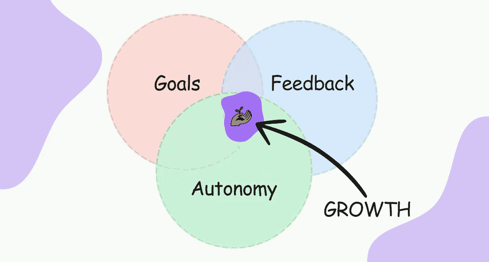

# 要求经理支持你职业发展的 3 件事

> 原文：<https://betterprogramming.pub/three-things-you-should-ask-from-your-manager-to-support-your-professional-growth-c0c97b48fab9>

## 来自软件团队领导的建议



你应该向你的经理要求的支持你成长的三件事是:

*   明确的目标
*   可操作的反馈
*   自治

如今，雇佣和留住优秀员工变得越来越困难，公司在员工的个人发展计划上投入了大量资源。但同样，这些公司的客户在接受服务时也要求个性化服务。同样，公司的员工也要求对他们的个人发展采取个性化的方法。

我认为与经理进行高质量的一对一会谈是制定和执行员工职业发展计划的最佳方式。这比让每个人都有一个标准化和集中化的流程要好，这个流程由团队以外的人领导，并且不直接参与员工的日常协作。

另一个重要方面是，员工不是唯一负责定义自我发展计划的人。相反，它必须与经理密切合作来完成。实际上，经理必须是领导这个过程的人。因为对组织的需求和战略有了更深的理解，知道自己感兴趣的是什么，驱动的是什么。

从我作为一个软件工程团队的团队领导的经验来看，明确目标的定义，提供可操作的反馈，以及给予人们自主权使得自我发展更加成功，并为成功的职业成长铺平了道路。

# **定义目标并描述成功的样子**

你的经理是最了解你的组织和你的职业需求的人。在经理的帮助下，你可以设定对双方都有利的目标。帮助员工成长并同时发展组织的目标。

此外，你的经理应该负责定义你在某个时期的成功，因为目标必须是有时间限制和可衡量的。

目标设定可以有多种形式，既可以是个人发展计划，说明你必须在何时实现什么目标。另一种方法是定义一个策略，并计划如何实施一个计划。目标设定的结果应该是一份书面文件，您和您的经理可以在一对一的会议中定期查看。

# **提供可行的反馈**

有了明确的目标，定期回顾进展是至关重要的。您的经理应该对您的进展提供可操作的反馈，您可以利用这些反馈来调整您实现目标的方法。它应该能帮助你最有效地实现目标。以及最大化目标的产出和成功率。

定期的一对一会议是一个很好的地方，可以回顾你在设定目标时制定的计划。因此，您应该会收到反馈，知道在下一阶段应该避免什么以及应该关注什么，以便更接近您的目标。

# **支持你实现目标的自主权**

当设定了目标，并且提供了可操作的反馈时，你就有了选择如何实现目标的自由和责任。这不仅意味着您可以自由选择自己的工作方式，还可以访问组织内可用的资源，以最有效地完成工作。根据我的经验，这还包括你向你的经理提出行动要点，经理必须采取这些行动来疏通你，帮助你提高实现目标的成功率。

例如，当您从另一个团队的参与和帮助中受益时，经理可以负责发起对话或安排启动会议。经理安排会议和召集更多团队并不意味着经理在主持会议。推动讨论和协作仍然取决于您。经理可能会在会议结束后或在您的一对一会议中观察流程，以提供可操作的反馈。

# **结论**

有了明确的目标，你应该能够描绘出成功是什么样子的。

可操作的反馈允许你调整你的行动，以增加达成目标的成功率。

这种自主性会激发你的创造力，让你找到达到目标的最佳解决方案和方法。

所有这些都应该让你获得自我发展的动力，并增加你在工作中的成功。

```
As always you can find me on [Twitter@andrejsabrickis](https://twitter.com/andrejsabrickis) or [LinkedIn@andrejsabrickis](https://www.linkedin.com/in/andrejsabrickis)
```