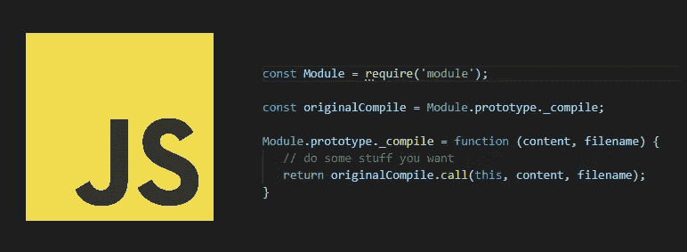

# Node.js 中的时间分析

> 原文：<https://betterprogramming.pub/time-profiling-in-node-js-7f82a95d6a9a>

## 如何跟踪并返回函数的执行次数



在最近的一个项目中，我的任务是为多个函数创建一个报告，并记录它们的执行时间。这似乎是一个微不足道的任务，但是一旦您开始使用 V8 profiler 进行概要分析，您将会迷失在大量的异步、匿名函数和其他内部方法中。这些需要时间，而你的函数(那些函数的唯一调用方)需要几毫秒。从 V8 profiler 获得合理的结果可能相当具有挑战性。

所以，我想:“好吧，肯定有成吨的`npm`包裹能让我免受这种痛苦。”

我去谷歌上试着找些东西。我很惊讶，没有什么真正适合我的情况。我发现有几篇文章建议在函数的开头和结尾添加一些日志，然后只计算差值。如果我的票的范围不是数百个函数，这就好了。

其他人推荐使用异步挂钩并监听事件的前后。然而，这创建了与 V8 profiler 相同的树结构，我需要跟踪我的函数的所有子函数，并尝试计算时间。对于一些并行运行的承诺，这变得更加困难。它只适用于异步调用，而我的解决方案需要使用同步和异步函数进行计算。

经过长时间的搜索，我找到了一个包，它并没有做我真正需要的事情，但它背后有一个非常有趣的概念。写这篇文章时，我再也找不到它了。如果有人知道，请发给我，我会在这里链接。

该包劫持了模块编译方法，以添加一些额外的代码来做一些跟踪。我的想法是使用这种方法为所需模块中的每个函数添加一个包装器，以跟踪该函数的调用及其完成时间。这将使我可以选择将所有函数包装在我需要跟踪的模块中。所以，我决定牺牲半天的时间来创造一个原型。

假设我们有下面的应用程序。我们有`index.js`，它需要一个包并从包中调用函数。

所以，让我们看看如何劫持模块编译方法。这很简单:

如您所见，您可以访问文件的内容和文件名。这使您有机会做一些过滤，只对选定的文件名进行更改。我使用了`minimatch`包，只在一些选定的文件上应用 profiler，而不是在所有的文件上。过滤掉`node_modules`特别有用。

对我们来说重要的是内容。如果您尝试将其注销，您将会看到它是一个字符串，包含文件中编写的全部源代码。我们可以更改源代码，然后提供这个更改后的源代码，由原来的编译方法进行编译。

那么我们如何做时间分析呢？让我们有一个简单的分析存储工具，它有两个方法:一个用于存储函数的持续时间，另一个用于返回所有数据。

```
const profile = {};
module.exports.add = (name, duration) => profile[name] = duration;
module.exports.get = (name) => profile[name];
```

请注意，在实际的应用程序中，我们可能会有更好的实现。但是，对于这一块，这应该是好的。

我们现在需要在每次函数结束时用正确的函数名调用`profiler.add`。要做到这一点，我们可以创建一个简单的`wrapFunction`，将真正的函数包装到`Promise`链中，该链将调用带有正确值的分析器。

注意，我将`moment`和`profiler`命名为注入。那是因为我们将使用`hijacker`中的函数来包装实函数。要运行这段代码，我们需要在所有被劫持的文件中导入`moment`和`profiler`。我决定将其命名为 injected，这样它就不会与已经导入的`moment`或`profiler`(如果实现中有)冲突。

我们将如何在劫机者中使用这个包装功能？简单。一个重要的方法是创建能够匹配我们文件中函数的`regex`。对于这件作品:

```
/function ([\w]+)[\s]?\([\w, ]*\)[ ]?{/gm 
```

就够了。但是，对于您的代码，您可能需要使用更复杂的提取器。当在我的项目中实现它时，对我来说更容易改变一些声明，然后用`regex`来匹配函数声明中的每一个细微差别。

我们将这样使用它:

如您所见，这是劫持编译方法的扩展实现。首先，我们在所有文件中导入 moment 和 profiler，以便它们可以在我们之前展示的`wrapFunction`中使用。

注意我用的是`require(‘./profiler’)`。如果有一些文件夹结构，您可能需要使用绝对路径。或者，只是创建一些私有的 npm 包，你不需要关心路径。

然后我开始遍历找到所有函数声明的`regex`的所有匹配。使用`changedContent`，我们用我们的`wrapFunction`替换每一个函数声明，它被重命名为它所替换的函数。

该函数的真正实现封装在第二个函数中，这个函数叫做`_nameOfTheFunction`。假设我们的函数是`hello()`，那么它将被替换为:

就是这样。该函数被包装，并且应该将其持续时间发送给分析器。现在，当我们在一切完成后调用`index.js`中的`profiler.get`时，我们应该得到函数运行所花费的时间。

值得一提的是，我们只能在分析器改变模块编译后包装需要的模块。这就是为什么我们必须在`index.js`开始时要求我们的侧写员。

现在我们可以检查节点`index.js`返回什么:

```
Error
done
someFunctionToTrack took 1010 ms to finish.
```

正如我之前写的，这个侧写和劫持者相当简单。我们可以扩展它来存储更复杂的数据，或者只过滤一些被劫持的文件。除了 profiler 之外，您还可以考虑这种方法的其他一些应用。你可以在评论中写下你对这次劫持的看法。随意看看[这个应用的完整源代码](https://repl.it/@PavolKogler/ScaredFluidGigahertz)。

感谢阅读:)干杯！