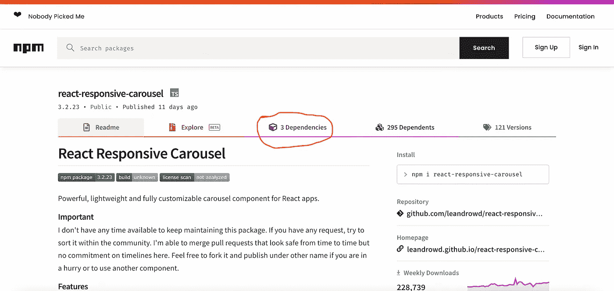
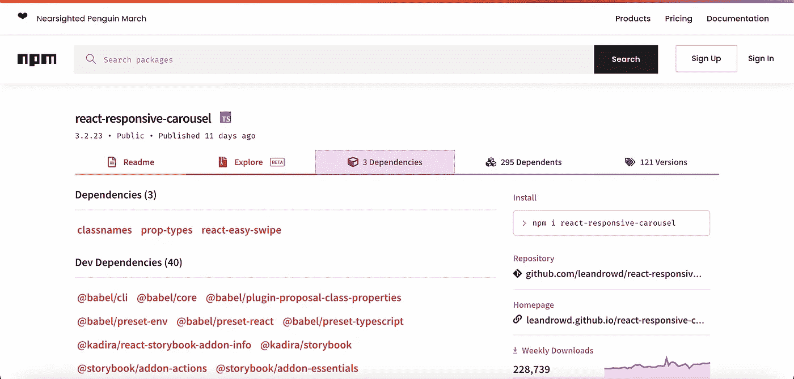
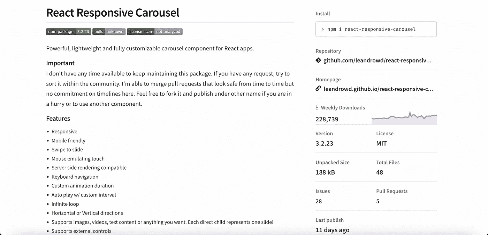

# 减少单页应用程序初始呈现延迟的提示

> 原文：<https://betterprogramming.pub/tips-for-reducing-initial-render-latency-of-single-page-applications-1929f0043af2>

## 因为单页应用程序加载速度很慢

[pix abay 的 flo222 高速公路灯](https://pixabay.com/photos/highway-lights-night-road-2025863/)

用 React 和 Vue 等现代 Javascript 框架构建的单页面应用程序是当今构建 web 应用程序的标准。在当今时代，速度是最重要的，每个人都从来没有这么不耐烦过，几秒钟的延迟可能是一个新客户和 Twitter 上一个差评的区别。

在本文中，我们将探索不同的方法来减少单页应用程序的初始渲染延迟。

# 问题是

在我们深入探讨减少初始渲染延迟的技巧之前，我们应该先花几秒钟来讨论一下为什么这个问题值得我们去操心。单页面应用程序(SPAs)的要点在于，它们一次加载网站的全部 JavaScript 和 CSS，然后用 JavaScript 显示或删除页面的部分内容，从而带来快速、无缝的现代体验。

您只得到一个 HTML 文件，该文件的内容由 JavaScript 管理，因此是“单个页面”这是如何实现的？使用模块捆扎机。

spa 使用 Webpack、Rollup、Vite 等模块打包器将你在整个应用程序中编写的所有 JavaScript(以及从`node_modules`开始你需要的所有代码)打包成一个大规模的 JavaScript 文件，然后将你编写的所有 CSS 打包成一个大规模的 CSS 文件。

它还可以跟踪和管理你的其他资产。当客户第一次访问您的网站时，您的浏览器会下载大量的 JS 和 CSS 文件，这样，您的浏览器就拥有了通过 JavaScript 管理和操作整个网站所需的所有信息。

结果是，第一次加载这些必要文件的过程会很慢，但是在必要文件被下载之后，我们获得了矿泉疗养地众所周知的无缝体验。

现在我们知道了这一点，当浏览器加载我们的 SPA 最初需要呈现的文件时，我们可以做些什么来减少这种不可避免的延迟呢？

# 解决方案

正如上面所讨论的，spa 被设计成在下载他们需要的文件时加载缓慢。我们可以使用许多技巧来将这一时间减到最少，我们将在下面讨论它们:

## 1.延迟加载和代码分割

延迟加载是在真正需要的时候加载应用程序的一部分，而不是一次性加载整个应用程序。代码分割就是指示你的模块捆绑器将 JavaScript 分割成逻辑束，而不是将整个 JavaScript 打包成一个文件。它将创建不同的文件，只有当我们在需要这些文件的应用程序上执行操作时，才会下载这些文件；他们会偷懒。

所有现代的模块捆绑器都带有代码分割功能。当我们这样做时，模块捆绑器将拥挤的文件分成逻辑部分，以便浏览器只下载第一次需要渲染的部分，并在需要时下载系统其他部分的代码。

大多数支持单页应用程序的模块捆绑器使用动态导入语法`import()`进行识别。一个很好的问题是我们在什么时候分割我们的应用程序？一个好的起点是特定的路线。所有不需要在第一次渲染时立即访问的路径都可以拆分到一个单独的包中。

例如，我们可以将我们的身份验证页面与仪表板页面分开，因为未经身份验证的用户在初始呈现时不需要任何仪表板特性，他们无论如何都必须等待登录过程才能访问仪表板页面。我们还可以将我们的仪表板路径分块，就像一个类似操作所需的所有页面都可以拆分成一个单独的包。

因为这篇文章实际上不是关于代码拆分的，所以这里有一些好的读物来学习如何在你的 Vue 和 React 应用中实现代码拆分。

[使用 React.lazy 和悬念进行代码分解](https://reactjs.org/docs/code-splitting.html)

[使用 React 路由器在路由上进行代码分割](https://v5.reactrouter.com/web/guides/code-splitting)

[使用异步组件在 Vue3 中进行代码拆分](https://vuejs.org/guide/components/async.html)

[用 Vue 路由器惰性加载路由](https://router.vuejs.org/guide/advanced/lazy-loading.html)

## 2.注意你对第三方的依赖

npm 上有无数的包，你想做的每一件小事都有一个包。要记住的是，这些包最终会成为您的包，以便一切正常工作。这些包通常有它们依赖的其他包，这些包又有它们依赖的其他包。它可以继续下去，给我们一个凑合的 Droste 效应。

你明白要点了吗？

[JuliusH 对 Pixabay 的 Droste 效应](https://pixabay.com/photos/picture-in-picture-imac-computer-4354466/)

让我们现实一点，使用第三方插件是不可避免的。由于构建单页面应用程序，您已经使用了大量的第三方依赖项。我们至少可以注意我们使用的包装。记下它们拥有的依赖项以及它们的依赖项的依赖项。

我们用第三方插件导入的代码越少，进入我们包的代码就越少，浏览器运行所需下载的代码也就越少。

下面是检查要添加到项目中的下一个包的依赖项的方法:

React 响应转盘有 3 个依赖项

如上图所示`react-responsive-carousel`有三个依赖关系。不过这真的不是坏消息，点击那个链接会向我们展示它的三个依赖项。

React Responsive Carousel 的三个依赖项

三个依赖项足够小，不用担心，我很乐意在我的应用程序中使用这个包。然而，如果你像我一样决定深入研究，让我们看看`react-responsive-carousel`的依赖项。`classnames`没有依赖关系，`react-easy-swipe`只有一个依赖关系`prop-types` , `prop-types`也是`react-responsive-carousel`的第三个依赖关系。

`prop-types`是一个无论如何都要使用的包，但是如果你继续深入研究的话，`prop-types`有三个依赖项；`loose-envify`、`object-assign`和`react-is`。React 本身依赖于所有这些依赖项，除了`react-is`和`react-is`没有依赖项。这向您展示了包是如何相互依赖的。幸运的是，模块捆绑器能够一次性安装这些依赖项并跟踪它们。

另一件要注意的事情是包装的未包装尺寸。再向下滚动一点，我们会看到`react-responsive-carousel`解压缩后的大小为 188KB。这也足够小，不用担心。如果一个包的解压缩大小接近兆字节，你应该会皱起眉头。

不过，这也取决于你是否会在最初的渲染中使用整个东西。在撰写本文时，像`bootstrap-vue`这样的包的未打包大小为 49MB，但是我们可以使用它，因为我们很可能会使用它的一小部分，这就是我们的包中的内容。

React 路由器转盘的解压缩大小为 188kb

是时候回答这个价值五千万美元的问题了:*我会对我加入 SPA 的每个产品包进行广泛的调查研究吗？* F*ck No！天啊。😂。知道所有这些很重要，但是真的没有必要知道您想要安装的软件包的每一个依赖项。

一般来说，我只看解压缩后的大小，以及依赖项的数量；然后，我检查做同样事情的其他包，并根据功能和大小做出明智的决定。

虽然依赖项的数量和未打包的大小是选择包的好标准，但是也要记住，有时并不是整个包都包含在我们的包中。许多第三方依赖项，如`lodash`和`chakra-ui`，也让我们只安装我们应用程序需要的特定功能，我们应该利用这一点，而不是安装整个应用程序。

如果你没有从这一部分学到任何东西，记得有意识地努力检查你是否可以安装更少的东西来使你的应用程序工作。

## 3.密切关注你的形象

图片在网站中起着巨大的作用。无论如何，我们几乎没有任何没有图像的应用程序。为了正确渲染任何页面，必须下载图像，我们有一些方法可以减少下载图像的大小。

我们需要做的第一件事是尽可能地调整图像的大小。我们需要注意照片的分辨率。很多时候为了清晰起见，我们使用高分辨率的图片，这对网站来说简直是大材小用。

根据经验，尽量保持图像分辨率不超过 2000 像素宽(或长)。有几个工具，比如用于 Windows 的 [Pixresizer 或者用于 Mac](https://pixresizer.en.softonic.com/) 的 [Preview，我们可以用来调整图像大小和降低分辨率，同时保持图像相当清晰。当一张图片超过 500KB 时，我们可能需要调整它的大小。](https://support.apple.com/en-ng/guide/preview/prvw2015/mac#:~:text=image's%20file%20size-,In%20the%20Preview%20app%20on%20your%20Mac%2C%20open%20the%20file,is%20shown%20at%20the%20bottom.)

我们需要做的第二件事是尽可能选择 SVG 而不是 png。SVG 是用于图形的无损文件格式。比起 png，我更喜欢 SVG，因为它们体积更小，无论你如何调整它们的大小，它们看起来都很清晰。

使用 SVG 可以对你的 SPA 最初渲染的速度产生合理的影响。

## 4.正确管理字体

渲染阻止资源是浏览器需要等待以渲染页面的文件。在下载完这些资源之前，它通常不会在屏幕上绘制任何东西。这些通常是在 HTML 文件的`<head>`中定义的资产，比如 JavaScript 文件、CSS 文件和字体。

SPA 模块捆绑器负责处理 JS 文件和 CSS 文件所需的大量工作，我们已经讨论了我们需要手动完成的工作，但是我们还没有讨论字体。

使用字体时，有两个主要策略可以使浏览器正确使用字体。第一个是`font-display: swap` CSS 属性和值。当设置`@font-face`时，要记住设置这个属性，因为它告诉你的浏览器加载一个系统字体，直到它完成自定义字体的加载。这允许用户在字体加载之前看到一些东西。

我们可以做的第二个优化是从我们的服务器本地提供字体，而不是从 cdn。原因是，字体提供商往往会添加比你可能需要的更多的`@font-face`规则。这可能会对应用程序的渲染时间产生负面影响，一些字体提供商也没有添加`font-display: swap`规则，如果字体文件很大或者用户的互联网速度不快，这可能会导致初始渲染延迟

# 结论

在本文中，我们讨论了几种减少单页应用程序首次呈现时间的方法。我们研究了为什么 SPAs 比传统的 web 应用程序需要更长的渲染时间，以及为什么我们应该为这些优化而烦恼。

采取以上所有步骤将会在减少渲染时间上产生显著的效果。

我希望你今天学到了一些新东西，我会在下一篇文章中与你联系。