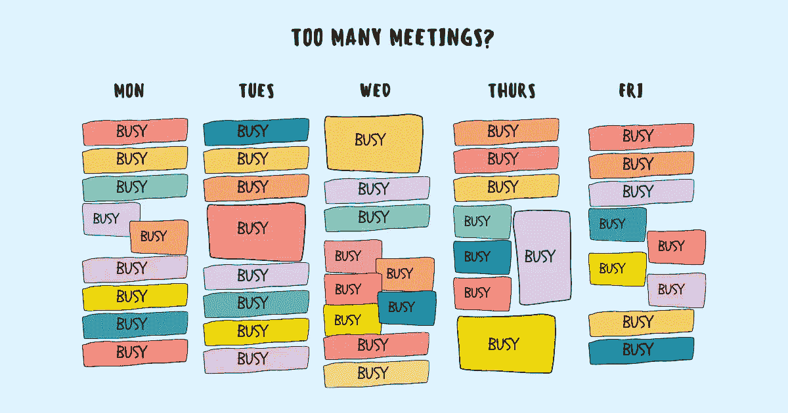

# 工作会议太多？以下是如何停止疯狂开会的方法

> 原文：<https://betterprogramming.pub/too-many-meetings-at-work-heres-how-to-stop-the-meeting-madness-de6c9cc5cf55>

## 别胡说八道了，开始给你的工作加点理智吧

作者图片

会议太多了。那个月，这三个字我已经说了太多次了。有时作为对自己的一个短暂的评论。其他时候是以自怜的形式，对我目前的工作状态过度的、自我专注的不愉快。

我没有声嘶力竭地喊叫，也没有让自己摆脱已经陷入的窠臼，而是简单地接受了这种生活方式——“事情就应该是这样的，我真的无能为力。”毕竟，我有意识地选择成为一名经理，太多的会议似乎是经理工作的一部分。

几个月过去了，事情变得更糟了。我的范围扩大了，我的团队规模增加了一倍多，会议的次数也增加了。我完全失去了对自己时间的控制。我整天处于一种持续的疯狂状态，从一个会议走向另一个会议，结果却是筋疲力尽、迷失方向、脾气暴躁。

我爱我的组织和团队。但是我对我的工作感觉不是很好。过多的会议已经成为逃避需要我的时间和注意力的事情的一种简单的逃避和借口，比如[规划未来](https://techtello.com/how-to-develop-strategic-thinking-skills/)，为我的团队识别更好的机会，或者投资于我自己的学习。

我经常在一天结束时想知道那天我是否增加了任何真正的价值。是的，我在工作中领导了很多伟大的项目，但是我觉得我的工作没有成效。感觉工作没有效率让我感觉[筋疲力尽](https://www.techtello.com/wrong-about-burnout-at-work/)。

我让“会议太多”和“这是经理的生活”这样的借口持续太久了。是时候让我变得真实了。认真审视一下我的生活，面对现实。我想摆脱自己的胡言乱语，开始在工作中投入一些理智。

这个过程始于一个简单的目标——重新控制我的时间去做有价值的工作。

> “腾出时间是一个框架，用于选择你想关注的事情，积累精力去做这件事，打破默认的循环，这样你就可以开始更有意识地生活。”—杰克·纳普，“腾出时间:如何专注于每天重要的事情”

当然，优化会议时间是实现这一目标的重要组成部分。那是我开始的地方。我决定从小的改变开始，以避免回到我的默认模式，因为我害怕一切会怎样。

每周，我都会看着日历，问自己这些问题:

1.  我将如何为这次会议增加价值？
2.  我能从这次会议中学到什么？
3.  有其他人能代替我吗？
4.  如果我不参加这个会议会发生什么？

这些简单的问题激发了我对会议的意识，而不是我日历上出现的每个会议的默认模式。我最终还是参加了相当多的课程，但是一种控制我的时间表的感觉激励我将这个过程提升到下一个层次。

我决定全力以赴，创建一个循序渐进的过程，任何人都可以通过停止将会议作为填补时间并开始创造价值的方式来更好地利用时间。

# 克服“工作会议太多”综合症

如果你不知道艾森豪威尔的紧急/重要矩阵，我建议你先对这个框架有个基本的了解。当你开始实际执行下面列出的策略时，这个框架会非常有用。

## 第一步:为重要任务预留时间(没有会议活动)

重要的任务为你和你的组织创造长期价值。它们是高杠杆活动，将推动您的团队和您的组织更上一层楼。

作为一名经理和领导者，你工作的很大一部分是花时间思考你团队的未来，计划未来将如何发展，并采取措施将其变为现实。团队中没有其他人能做到这一点。

> “第一个做法是询问需要做什么。注意，问题不是“我想做什么？“询问必须做什么，并认真对待这个问题，是管理成功的关键。问不出这个问题，即使是最能干的高管也会变得无能。”—彼得·德鲁克，“高效的管理者:做正确事情的权威指南”

每周，在你的日历上预留时间，为这些活动腾出空间。通过提前安排这些活动的时间，你就不会以延误重要活动为代价而陷入紧急状态。这也让你有意识地优先处理需要你注意的工作，从而减少你花在会议上的时间。

## 第二步:安排所有必须参加的会议

这与步骤 1 类似，但在这一步中，您是在预先阻止会议时间。是的，我知道我们正在努力减少会议次数。要做到这一点，一个重要的步骤是确定哪些会议是绝对不可避免的，同时又有足够的价值保留下来。在这个阶段，如果你不确定要不要开会，就把它们放在一边。

所有的会议并不都是浪费时间。如果你是经理或领导，像一对一、越级、利益相关者更新、员工会议这样的会议实际上是相当有价值的。

通过提前安排，你可以将任何会议优先于对你和你的团队重要的会议。但是在做这个活动的时候要注意。一开始，只对绝对重要的会议进行优先排序是非常困难的。为了避免陷入最终将所有事情都塞进日程表的陷阱，请使用第三步的策略。

## 第三步:授权和授权

很容易相信只有你最适合参加会议，没有人能代替你。部分正确，但大错特错。

是的，别人不能取代你的位置。但是，你需要问自己的问题不是是否有人可以取代你。相反，你需要问:

*   谁能在会议中做得足够好？
*   你能信任谁承担更多的责任？
*   谁准备好做出这样的决定？

> “如果你想做好几件小事，那就自己去做。如果你想做大事，产生重大影响，就要学会授权。”—约翰·C·麦斯威尔，“培养你身边的领导者:如何帮助他人充分发挥潜力”

如果你认为你的团队中没有人可以代替你参加任何会议，这是一个强烈的信号，表明你没有授权和支持你的团队。你是团队决策的瓶颈，这将你的团队推向平庸，而不是推动他们走向卓越。给员工授权不仅能让你腾出大量时间，还能创造一个健康的工作环境，因为员工会因为得到经理的信任而感到高兴。

有效的委派是你工作的一个重要部分，这也包括委派会议。确定你可以委派哪些会议，或者你如何在团队中培养技能，以便你的团队成员准备好接管你的一些会议。

通过自己不参加这些会议，并使用更新来使自己与团队保持同步，您将在很短的时间内取得比自己参加会议更大的成就。

## 第四步:清理和消除

最后，不值得委派一些根本不应该做的事情。学会对毫无意义的会议说不。与公司的使命和目标不一致的会议，或者给你和你的团队增加价值的会议，是你绝对需要摆脱的。

有些会议很难摆脱，因为它们给你一种被认可的感觉和重要的感觉。它们就像是增强你自尊的一针强心剂。当感觉被这个决定困住时，简单地问问自己——你更想要什么:时间还是错误的自我价值感？

这些会议不值得你浪费时间。没有他们你会过得更好，当你投入时间和精力去做一些长远的重要事情时，你的团队肯定会变得更好。

# 管理好会议时间的其他策略

通过应用上面的策略，你将能够大大减少会议时间。然而，你还没有完成。你可以做更多的事情来重新利用你的宝贵时间:

## **1。优化会议频率和持续时间**

你真的需要每周和你团队的每个成员一对一吗？如果是双周呢？与两周一次的会议相比，每周一次的会议有什么价值？两周一次的会议比每月一次的会议有什么价值？

看看你所有的周会、双周会和月会。为什么在当前频率下需要它们？确定哪些周会可以变成双周会，哪些双周会可以变成月会。向你的团队寻求帮助，向你的利益相关者提问。在对你们双方都有意义的事情上保持一致。

另一个节省会议时间的好策略是优化会议时间。观察你的会议，试着理解有多少时间实际上花在了宝贵的讨论上，又有多少时间花在了填补分配的时间上。

根据[帕金森定律](https://en.wikipedia.org/wiki/Parkinson%27s_law)，工作会在规定的时间内完成。这也适用于会议。

## **2。堆叠并合并会议**

有些会议可能值得合并，因为它们之间存在固有的依赖性。它们不仅更有用，还大大减少了你的时间负担。花些时间确定哪些会议值得合并。

另一个有用的策略是将类似的会议一个接一个地堆叠起来。它们可能不会减少花在会议上的总时间，但它们确实减少了在上下文切换中浪费的时间。

例如，与其做一次 20 分钟的一对一练习，倒不如做两次连续的练习。使用第一次一对一会议的大脑节奏设置将使第二次会议变得容易得多。

一旦你开始使用堆叠作为一种方法，你的会议将自动优化，要求你应用策略# 1-减少这些会议的时间。

## **3。月度和季度回顾**

使用反馈回路进行自我反省是一种随着时间变得更好的强有力的练习。如果你正在处理太多的会议，事情不会在一天甚至一个月内好转。你需要坚持练习好习惯，这将让你远离坏习惯。

整个练习你不能只做一次。你还没有完成。为了让你的行动与你渴望的未来一致，你需要不断回到这个练习中来。从你的过去中学习，并将这些学习融入你的未来。看看上个月的日历，问自己:

*   我大部分时间都花在哪里了？
*   这些会议中有多少是真正有用的？
*   为什么后来我参加了看起来像是一个错误的会议？
*   我能做些什么来减少花在会议上的时间？
*   我能做些什么来减少花在会议上的时间？

定期做这个练习会让你保持头脑清醒，同时真正做些能给你的生活和你周围的人增加价值的工作。下次你发现自己说“会议太多”的时候，停下来，让这句话深入人心，然后立即在日历上安排一个时间来重复这里列出的策略。万事如意！

> “你的目标不是不惜一切代价坚持既定的时间表；取而代之的是，在任何时候，你都要深思熟虑地决定自己未来要做什么。”—卡尔·纽波特，“深度工作:在分心的世界中专注成功的规则”

# 摘要

1.  如果你发现自己说“会议太多”，不要认为这是你工作的一部分。你可能正在参加对你和你的团队没有价值的会议。
2.  你需要更好地管理自己的时间，包括花在会议上的时间。没有人能替你做这件事。
3.  首先，每周在你的日历上为重要的活动预留无会议时间，比如为你的团队制定未来计划。通过提前安排这些时间，你将会在会议上花费更少的时间，同时做能推动你和你的组织前进的工作。
4.  下一步是为对你的团队绝对重要的会议留出空间，比如一对一会议、利益相关者更新、员工会议等。通过提前安排，你可以减少无关紧要的会议的空间。
5.  确定哪些会议可以委托给团队成员。通过授权你的团队自己做决定，你不仅减少了花在会议上的时间，还促进了快乐和健康的工作环境。
6.  最后，清理你的日历，取消那些根本不应该做的会议。这些会议可能会提升你的自尊，但它们不会让你和你的团队朝着你的目标前进。
7.  一旦你掌握了这些策略，再进一步，通过优化会议的频率和持续时间，合并和堆叠会议，养成每月和每季度回顾你的进展的习惯，来回收更多的时间。自我反省是一种强有力的技巧，可以从你的过去中学习，为你自己和你周围的人设计一个更好的未来。

在 Twitter 上关注我，了解更多故事。

*这个故事最初发表于*[*【https://www.techtello.com】*](https://www.techtello.com/too-many-meetings-at-work/)*。*