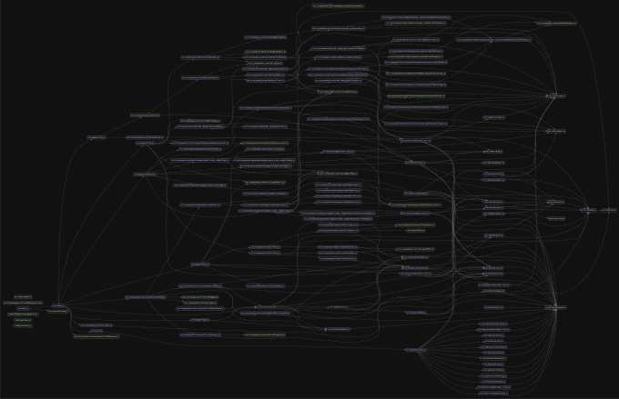

# 设计大型 React 应用程序的工具和技术

> 原文：<https://betterprogramming.pub/tools-and-techniques-for-architecting-large-react-apps-155ffd9635aa>

## 一个规则来统治他们


图片由[玛拉基·威特](https://pixabay.com/users/mwitt1337-889520/?utm_source=link-attribution&utm_medium=referral&utm_campaign=image&utm_content=2284501)从[皮克斯拜](https://pixabay.com/?utm_source=link-attribution&utm_medium=referral&utm_campaign=image&utm_content=2284501)拍摄

React 是一个非常容易使用的前端库。它允许以惊人的速度进行原型开发和迭代。但是，在开发大规模生产应用程序时。仔细设计架构并保持设计清晰简单是很重要的。在本文中，我将介绍一些可以用来构建 React 项目的工具和原则。

# 为什么建筑如此重要？

从头开始时，很容易忽略许多架构决策和原则。在 sprint 结束时，您已经有了有效的认证，主页和利益相关者都很高兴。您的 CI/CD 脚本为您发布所有内容，发布是即时的，没有崩溃报告。

然而，在几次冲刺之后，你注意到团队的生产力下降了。您的 CI/CD 脚本由于`Undefined not an object: youHaveNoIdeaWhatThisFileDoes.js:442`而失败，并且部署过程现在是手动的，因为没有人想用十英尺长的棍子去碰它。新员工正在努力理解代码库，而老员工已经筋疲力尽。

这些，还有许多其他的，都是糟糕的架构的症状。它是否不能正确地扩展，或者只是一个不可读的混乱，这并不重要:糟糕的架构是软件项目的最大杀手。在本文中，我将向您展示一些工具和设计模式，您可以使用它们来防止这种情况发生。

# 抽象层

任何架构的基础都是抽象层和封装原则。抽象层用于逐步增加软件实体的功能，同时保持它们之间的接口清晰。抽象层可以在两个方向上跨越和扩展:


图片由作者提供。


图片由作者提供。

我希望这些插图能说明问题。抽象层非常主观，会无限向左延续(操作系统、固件、晶体管、电子等。)和右边(经济、政治、火星天气等。)并且一个抽象层可以包含无限数量的抽象层。根据需求和涉众，由架构师来决定项目需要什么层次。

请注意，抽象只指向上方(图中的左侧)。我们不希望 HTML/CSS 层中的任何东西知道业务逻辑。这将让我们改变业务逻辑(您经常会这样做),而不会破坏或改变底层的任何东西。

# 依赖性规则

现在，一旦你理解了抽象层，我们就可以进入依赖规则了。

> "源代码依赖项必须只指向内部，指向更高级别的依赖项."罗伯特·c·马丁，又名鲍勃叔叔

这是抽象级别的方向，只是直接应用于源代码。您永远不会希望您的上层策略依赖于下层的实现细节。有一种情况你会立即注意到它的缺点，那就是重新编写一个 React 应用程序来实现 React Native。在一个健全的架构中，这仅仅是重写一些愚蠢的组件来呈现`View`而不是`div`的问题。但是，最常见的情况是，这导致一个新的应用程序从零开始编写，因为架构不允许这样的变化。

对于我来说，坐着写关于你应该如何关注你的架构的文章是很容易的，但是你真的可以做一些事情吗，尤其是当系统已经在开发中的时候？当然有。

`madge`是一个命令行工具，可以让你绘制项目的依赖关系，这样你就可以从一个高层次的概览中看到一切。立即安装:

```
npm i -g madge
```

打开你正在工作的一个 JS 项目并运行`madge ./`。它所做的是遍历目录中的每个 JS 文件，并枚举其依赖项。以下是我的 [RE:Cards](https://github.com/r3dm1ke/re-cards) 项目的部分输出:

使用这个工具，我可以很容易地看到我的`App`模块依赖于一堆组件、Redux 存储和`auth`动作。您还可以看到`auth`动作依赖于`firebase`低级功能，这是我们所希望的。

这是有用的，但仍然不是我们要找的。要让这个工具真正有用，还需要安装 Graphviz。使用这个工具，`madge`将会为您的依赖关系生成一个 SVG 图，这比控制台输出可读性更好。对于 Linux 用户:

```
$ sudo apt-get install graphviz 
or your package manager of choice
```

Mac 用户:

```
$ brew install graphviz
```

对于 windows 用户，没有可用的软件包。您需要做的是从[这里](https://www2.graphviz.org/Packages/stable/windows/10/msbuild/Release/Win32/)下载 Graphviz 的安装，并将其添加到您的`PATH`环境变量中。

安装后，您可以在项目中运行此命令:

```
$ madge --image graph.svg ./
```

这将枚举所有依赖项，并生成一个可以用任何图像查看器或浏览器查看的`graph.svg`文件。现在，我有一个相当大的文件:



图片由作者提供。

请记住，我在一个小项目上运行它:你的树可能会更大。使用这个树，您可以很容易地跟踪您的依赖关系，查看如果您对另一个模块进行更改，哪些模块将需要更改，以及当前需要哪些重构工作。

让我解释一下这棵树的颜色。标有蓝色的节点是模块，它们既依赖于某些东西，又有一些依赖的东西。这将是大多数情况。绿色的是叶子。这些模块是某人的依赖项，但没有自己的依赖项。最后，红色表示*依赖循环*。当一个模块通过一系列其他模块依赖于它自己时，依赖循环就发生了。这是我回购的一个例子:


图片由作者提供。

可以看到`auth.js`档靠`listeners.js`，`listeners.js`靠`auth.js`。这是**绝不应该发生的事情**。调试这种循环是通往地狱的高速公路，如果你的代码库中也有这样的循环，祝你好运。这通常是你需要优先解决的问题。幸运的是，通过使用`madge`工具，您可以将它集成到您的 CI/CD 管道中，并确保没有提交(有意或无意地)将循环引入代码库。您感兴趣的命令是`madge --circular ./`:


图片由作者提供。

通过将它设置为在每个 PR 上运行，可以确保项目中没有循环依赖。又一次公关检查，让你的生活更轻松！

工具的使用并没有就此结束:您可以自动检查新模块的依赖性，并根据编写依赖模块的人来分配代码审查。可能性是无穷无尽的，但超出了本文的范围。

# 稳定和不稳定的依赖关系

为什么我(也许还有你)经历了设置`madge`和查看依赖树的所有麻烦？这和我要讲的下一个原则有关:模块的稳定性水平。

所讨论的稳定性与错误或崩溃无关:这是变化的度量。


图片由 [Einfach-Eve](https://pixabay.com/users/einfach-eve-4481870/?utm_source=link-attribution&utm_medium=referral&utm_campaign=image&utm_content=2045469) 来自 [Pixabay](https://pixabay.com/?utm_source=link-attribution&utm_medium=referral&utm_campaign=image&utm_content=2045469)

看看这些石头。你觉得它们看起来稳定吗？肯定不是。然而，除非有什么东西移动它们(空气、人类、外星人)，否则它们会静止不动。因此，稳定性与移动或位置完全无关:这是一个衡量*改变(移动)某物有多难的标准。在这个定义下，石头确实很不稳定。你可以说没有什么事情*取决于他们。


来自 [Pixabay](https://pixabay.com/?utm_source=link-attribution&utm_medium=referral&utm_campaign=image&utm_content=4952346) 的 [mmcclain90](https://pixabay.com/users/mmcclain90-4570384/?utm_source=link-attribution&utm_medium=referral&utm_campaign=image&utm_content=4952346) 图像

另一方面，这些石头非常稳定。要移动它们，你不仅需要专门的设备，而且你还必须与那些不知所措的激进分子战斗，他们不想看到他们的纪念碑移动到任何地方。你可以说英格兰依赖于这些石头。

这和软件模块有什么关系呢？我说，一切。就像石头一样，一个软件系统会有稳定的模块和不稳定的模块。依赖于其他模块但没有依赖模块的模块被认为是不稳定的:如果需要，很容易改变它。另一方面，依赖于其他模块的模块是*稳定的*，因此很难改变。要对其进行更改，您必须查找所有相关模块并根据需要进行调整。

一个好的系统设计将两者结合起来:系统的一些部分需要经常改变(业务级策略),而其他部分(底层实现细节)不会经常改变。我们说需要频繁改变的模块是易变的，因此应该是不稳定的。这些模块将依赖于系统的稳定部分，它们不是易变的。

作为一名架构师，您的任务是找出系统的哪些部分会经常更改(以及由哪些涉众更改)，哪些部分不会。当然，在一个理想的世界里，系统的每个部分都应该很容易改变，但是，谢天谢地，我们并没有生活在这样的世界里。你必须小心地平衡稳定和不稳定的模块，因为一个不能离开另一个而存在。

如何衡量一个模块的稳定程度？使用一个简单的公式:


图片由作者提供。

**I** 是不稳定性度量。它是从 0 到 1 来衡量的，其中 0 是绝对稳定的分量，1 是不稳定的分量。

# 依靠稳定的方向

现在，使用`madge`工具和稳定性度量，我们可以设计另一个版本的依赖规则:*依赖于稳定性方向*。

就像这样简单:如果你导入一个稳定性比你正在处理的模块低的模块，后退一步。我们希望模块依赖于更稳定的模块。如果一个稳定的组件依赖于一个不稳定的组件，那么它就变得稳定，也很难改变。这是您可以用`madge`工具轻松捕捉到的东西。考虑我的代码库中的这个例子:


图片由作者提供。

这里我们有左边的`Thumbnail`组件。它有一个依赖模块和三个依赖项，这使它的不稳定性度量为 3/4，这使它成为一个高度不稳定的组件。`Skeleton`和`FlipCard`组件只有依赖项，没有自己的依赖项，这使得它们非常稳定。并且依赖性方向指向稳定的方向，这是所期望的。另一方面，`FrontSide`组件是不稳定的，因为它有许多依赖项(无法在屏幕上显示)并且只有一个依赖项。这是我在重构时必须解决的问题。

# 反应外卖

我希望这篇文章能让你明白一件事:只要遵循依赖规则，你选择如何构建你的应用程序并不重要。无论您是使用智能/非智能组件、业务逻辑组件、原子/分子还是其他任何东西，都没有关系。事情就是这么简单:遵循依赖规则的代码将是易于理解和使用的，而不遵循依赖规则的代码将是令人厌恶的，即使您应用了您能找到的所有模式。

在设计系统时，React 是开发人员的天堂。通过不提供约定和限制，它允许您以任何方式、形状或形式设置您的模块，并按照您认为合适的方式设置依赖关系。这就是为什么依赖规则在 React 应用中如此重要:通过去掉安全轮，它让你做各种各样的把戏，但当你摔倒时(不是如果，当)会痛得要命。只要记住你学到的东西，反思你的错误，然后重构。

我不是在谈论其他几个原则，比如 DIP(依赖倒置原则),因为我认为就抽象和互操作性而言，前端仍然是一个比后端简单得多的系统，因此它不需要一个系统的所有范例。但是，如果您有兴趣了解更多关于系统设计的知识，我强烈建议您阅读底部的参考资料部分。

# 资源

这篇文章的灵感来自罗伯特·c·马丁的书 *Clean Architecture* ，是 *Clean —(代码、编码员、架构、敏捷)*系列的一部分。我强烈建议，对于那些认为自己不是初级开发人员的人来说，这些是必读的。以下是非附属链接:

*   [罗伯特·c·马丁，清洁建筑](https://www.amazon.com/gp/product/0134494164)