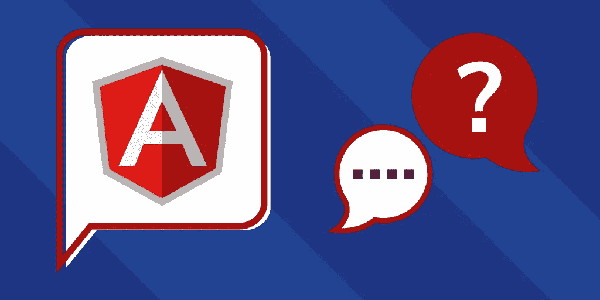

# 45 个常见面试问题及一些答案

> 原文：<https://betterprogramming.pub/top-45-angularjs-interview-questions-with-some-answers-90489817677c>

## 这个基本的 45 个 AngularJS 面试问题的详细指南将帮助你解决下一次编码面试



图片来源:作者

AngularJS 的受欢迎程度持续上升，越来越多的公司正在寻找有才华的 AngularJS 开发人员。超过 6，700 家公司报告称，他们在技术堆栈中使用 AngularJS，包括谷歌、亚马逊、Lyft、Snapchat 等。

破解你的 AngularJS 面试是至关重要的降落这些梦寐以求的角色之一。为了帮助你做好准备，我们整理了 45 个重要的 AngularJS 编码面试问题。这份详细的指南和答案将帮助你破解 AngularJS 编码面试。

# 前 30 个问题，带答案

## 1.什么是 AngularJS，它的主要特征是什么？

AngularJS 是一个 JavaScript 框架，用于构建大规模的单页面 web 应用程序。有了 AngularJS，你可以用 HTML 作为模板语言，扩展 HTML 的语法来表达应用组件。

AngularJS 以使用 JavaScript 和 MVC 模型编写客户端应用程序、创建跨浏览器兼容的应用程序以及易于维护而闻名。

AngularJS 的主要特点是:

*   可试验的
*   指令
*   服务
*   范围
*   控制器

## 2.AngularJS 中的范围是什么？

范围就像控制器和视图之间的粘合剂。范围是引用应用程序模型的对象。它们被安排在一个层次结构中，并模仿 DOM 结构。

`$scope`是内置对象，有应用数据和方法。您可以在控制器函数中创建一个`$scope`对象的属性。

## 3.AngularJS 中的服务是什么？

在 AngularJS 中，*服务*是执行任务的单例对象或函数。它们通过依赖注入(DI)连接在一起，可用于在应用程序中组织或共享代码。

AngularJS 附带了许多内置服务，比如制作`XMLHttpRequest`的`$https: service`，大多数 AngularJS 开发者都制作自己的服务。

## 4.解释 AngularJS 表达式和 JavaScript 表达式的主要区别。

就像在 JavaScript 中一样，AngularJS 表达式是放置在绑定中的代码片段，就像`{{ expression }}`。它们最显著的区别是:

*   在 AngularJS 中，表达式是根据 scope 对象计算的(参见 2。，以上)。
*   在 JavaScript 中，表达式是根据全局窗口计算的。
*   在 AngularJS 中，表达式求值对`null`和`undefined`是宽容的。
*   在 JavaScript 中，任何未定义的属性都将返回错误。
*   在 AngularJS 中，循环和条件不能添加到表达式中。

## 5.AngularJS 中的指令是什么？

*指令*是 DOM 元素上的标记，它将新的行为附加到这些元素上。我们可以使用它们来创建像定制小部件一样工作的定制 HTML 标签。指令可以说是 AngularJS 应用程序中最重要的组件。

最常见的内置指令有:

*   `ng-model`
*   `ng-repeat`
*   `ng-App`
*   `ng-show`
*   `ng-bind`

## 6.AngularJS 中的数据绑定是什么？

在 AngularJS 中，*数据绑定*是模型和视图组件之间的自动数据同步。`ng-model`指令用于数据绑定。

这允许您将模型视为真实的单一来源，因为视图在任何给定时间都充当模型的投影。这样，控制器和视图是完全分离的，这改进了测试，因为您可以单独测试您的控制器。

## 7.什么是插值？为什么用在 AngularJS？

*插值*嵌入表达式的标记提供了到文本节点和属性值的数据绑定。在编译过程中，编译器将匹配文本和属性。

AngularJS 使用一个`$interpolate`服务来检查它们是否包含任何内嵌表达式的插值标记，然后更新并注册为观察器。

## 8.安古拉吉斯的工厂是什么？

工厂是一个简单的函数，它允许我们向一个对象添加逻辑并返回该对象。该工厂还可以用来创建一个可重用的功能。工厂将总是为该对象返回一个新的实例，该实例可以与其他组件集成，如过滤器或指令。

## 9.范围的特点是什么？

*范围*有五个主要特点:

*   范围提供了计算表达式所依据的上下文。
*   Scope 用于使用`$watch`观察模型突变范围。
*   作用域提供了使用`$apply`的 API，这些 API 将通过系统将模型变化从控制器、服务或 AngularJS 事件处理程序领域之外传播到视图中。
*   范围从其父级继承属性，并提供对共享模型属性的访问。
*   范围可以嵌套以隔离组件。

## 10.什么是依赖注入？

*依赖注入* (DI)是一种软件设计模式，解决了组件如何处理它们的依赖关系。这减轻了组件寻找依赖的负担，使它们更具可配置性、可重用性和可测试性。

DI 在 AngularJS 中无处不在，它既可以在提供`run` / `config`块时使用，也可以在定义单个组件时使用。

AngularJS 使用以下组件提供了出色的依赖注入功能:

*   供应者
*   价值
*   工厂
*   常数
*   服务

## 11.如何将 AngularJS 与 HTML 整合？

在 HTML 页面中包含 AngularJS JavaScript。

```
<head>
   <script src = "https://ajax.googleapis.com/ajax/libs/angularjs/1.3.14/angular.min.js"></script>
</head>
```

或者，将`ng-app`属性添加到 HTML body 标签中。

```
// example 
<body ng-app = "testapp">
</body>
```

## 12.为什么我们在 AngularJS 中使用双击？

`ngDblclick`指令使得在任何`dblclick`事件上指定定制行为成为可能。这个指令在双击 HTML 元素时给 AngularJS 一个动作。`ngDblclick`指令不会覆盖元素的`ondblclick`事件。

```
// example
<button ng-dblclick="count = count + 1" ng-init="count=0">
  Increment (on double click)
</button>
count: {{count}}
```

## 13.如何复位一个`$timeout`并禁用一个`$watch()`？

您必须将函数的结果赋给一个变量。要表示`$timeout`或`$interval()`，我们用`.cancel()`。

```
var customTimeout = $timeout(function () {

}, 55);

$timeout.cancel(customTimeout);
```

要禁用`$watch`，我们称之为。

## 14.什么是消化阶段？

摘要周期对于数据绑定至关重要。它本质上比较了同一范围模型的新旧版本。消化循环可自动触发，或使用`$apply()`手动触发。

在每个摘要周期中，每个范围模型都与它们以前的值进行比较。当发现一个变化时，该模型的手表被触发，另一个摘要周期被启动，直到它稳定下来。

如果我们只使用核心指令，这是不需要的。如果代码有任何外部更改，需要手动调用摘要循环。

## 15.什么是`$rootScope`，它与`$scope`有什么关系？

`$rootScope`是在包含`ng-app`指令的 DOM 元素上创建的作用域。它在整个应用程序中都可用。一个 AngularJS 应用程序只能有一个`$rootScope`。其他范围是*子范围*。

## 16.AngularJS 中的作用域层次是什么？

每个 AngularJS 应用程序都有一个根作用域和许多子作用域。当创建一个新范围时，它被添加为其父范围的子范围。这将实现一个类似 DOM 的层次结构。

`$rootScope`

*   `$scope`为`myController 1`
*   `$scope`为`myController 2`

## 17.如何使用 AngularJS 进行 Ajax 调用？

AngularJS 使用`$https:`进行 Ajax 调用。服务器将调用数据库来获取记录。AngularJS 使用 JSON 格式的数据。

```
function employeeController($scope,$https:) {
   var url = "tasks.txt";
   $https.get(url).success( function(response) {
      $scope.employee = response; 
   });
}
```

## 18.有哪些常见的角度全局 API 函数？

AgularJS 中通常使用以下四个全局 API 函数:

*   `Angular.isNumber`:如果引用是数值，则返回`true`
*   `Angular.isString`:如果引用是字符串类型，返回`true`
*   `Angular.lowercase`:将字符串转换成小写字母
*   `Angular.uppercase`:将字符串转换成大写字母

## 19.你如何隐藏一个 HTML 标签？

您可以使用`ngHide`指令来显示或隐藏提供给属性的 HTML 元素。通过在元素中移除或添加`.ng-hide` CSS 类，HTML 元素被隐藏或显示。CSS 类是预定义的。

默认情况下，`.ng-hide`类将使用`display: none !important`来设计元素的样式。这可以用`.ng-hide` CSS 类覆盖。

## 20.命名并描述 AngularJS 范围生命周期的不同阶段。

AngularJS 范围生命周期的阶段如下:

*   **创建:**根作用域是在应用过程中创建的。
*   **模型变异:**指令在将模型值传播到 DOM 的作用域上注册观察器。
*   **观察者注册:**突变只能在`scope.$apply()`内进行。这是由 AngularJS 隐式完成的。
*   **突变观察:**在`$apply`之后，`$digest`循环在根作用域上开始，在此期间`$watched`表达式被检查是否有模型突变。
*   **作用域销毁:**作用域创建者将使用`scope.$destroy()` API 销毁不必要的子作用域。子作用域使用的内存随后被垃圾收集器回收。

## 21.如何在 AngularJS 中创建嵌套控制器？

在 AngularJS 中，可以创建嵌套控制器。嵌套控制器将链接`$scope`，它也会改变父控制器中的同一个`$scope`变量。

```
<div ng-controller="MainCtrl">
 <p>{{msg}} {{name}}!</p>
<div ng-controller="SubCtrl1">
<p>Hi {{name}}!</p>
   <div ng-controller="SubCtrl2">
     <p>{{msg}} {{name}}! Your name is {{name}}.</p>
   </div>
</div>
</div>
```

## 22.解释 Angular 和 jQuery 的区别。你在某些情况下用哪个？

jQuery 是一个用于 DOM 操作的库。jQuery 函数最适合以下用途:

*   HTML 和 DOM 操作
*   事件处理
*   CSS 操作
*   动画控制
*   Ajax/JSON 支持

AngularJS 是一个 JavaScript 框架。它最适合以下使用情形:

*   指令作为 HTML 的扩展
*   Web 应用程序开发
*   依赖注入
*   单元测试
*   MVC 框架支持
*   双向数据绑定
*   RESTful API 支持

AngularJS 被认为更难理解，而 jQuery 被认为比 AngularJS 更容易理解。

AngularJS 支持双向绑定过程，而 jQuery 不支持。AngularJS 还提供了对深度链接路由的支持，而 jQuery 没有。

## 23.AngularJS 有哪些挂钩？他们的用例是什么？

AngularJS 组件可以实现生命周期挂钩，这是在组件生命周期中调用的方法。AngularJS 中可以实现以下钩子方法:

*   `$onInit()`
*   `$onChanges(changesObj)`
*   `$doCheck()`
*   `$onDestroy()`
*   `$postLink()`

## 24.AngularJS 中的管道是什么？

管道提供了一种简单的数据转换方法。它们是模板表达式中可用的简单函数。它们接受一个输入值并返回一个转换后的值。管道通过将数据转换成指定的格式来工作。AngularJS 提供内置管道，也可以由开发人员创建。

为了制作管道，我们在模板表达式中使用管道字符(`|`)后跟一个过滤器。

```
<p>Their full name is {{ lastName | uppercase }}</p>
```

## 25.什么是独立单元测试？

在 AngularJS 中，独立的单元测试包括检查一个类的实例，而不使用注入值。*单元测试*意味着我们正在测试单个的代码单元。为了正确地进行软件测试，我们必须隔离我们想要测试的单元。这避免了其他的复杂情况，比如通过 XHR 调用来获取数据。

## 26.什么是 Angular CLI？它的用途是什么？

Angular CLI 也称为 AngularJS 的*命令行界面*工具。它可用于构建、初始化或维护 Angular 应用程序。它提供了类似命令外壳的交互式用户界面。Angular CLI 大大加快了开发时间。

它非常适合快速构建 ng2 应用程序。不建议想要了解底层情况的 AngularJS 新开发者使用。

## 27`angular.Module`是如何工作的？

`angular.Module`是一个创建和注册模块的全局位置。AngularJS 应用程序可用的任何模块必须向`angular.Module`注册。

传递一个参数将检索一个`angular.Module`。传递多个参数会创建一个新的`angular.Module`。

## 28.AngularJS 应用程序中有哪些提高性能的方法？

官方推荐两种方法用于生产:启用严格 DI 模式和禁用调试数据。

启用严格 DI 模式可以通过设置为指令来实现，如下所示:

```
<html ng-app=“myApp” ng-strict-di>
```

使用`$compileProvider`可以禁用调试数据，如下所示:

```
myApp.config(function ($compileProvider) {
  $compileProvider.debugInfoEnabled(false);
});
```

其他一些流行的性能增强包括:

*   使用一次性绑定(如果可能)
*   制作`$httpProvider`使用`applyAsync`

## 29.角度分量和方向有什么区别？

AngularJS *组件*是一个指令，它使得在整个应用程序中使用 web 组件功能成为可能。使用组件，您可以将应用程序分成更小的组件。组件的作用是:

*   通过`templateUrl`或`template`声明新的 HTML
*   创建组件作为组件架构的一部分
*   将视图逻辑绑定到 HTML
*   定义管道

AngularJS *指令*是一种我们用来给元素附加行为的技术。这有助于组件的可重用性。指令的作用是:

*   添加行为或扩展现有的 DOM
*   将现有行为添加到元素中

## 30.当一个作用域终止时，触发两个`destroy`事件。它们是用来做什么的？

第一个事件是名为`$destroy`的 AngularJS 事件。这可由 AngularJS 示波器使用。

第二个事件是一个`jqLite/jQuery`事件。移除节点时会调用此事件。

# 还有 15 个问题需要探索

1.什么是提前编译？

2.AngularJS 中的模板是什么？

3.什么是 traceur-编译器？

4.什么是 NgZone？

5.npm 是什么意思？

6.定义角度材料。

7.AngularJS 中的认证是什么？

8.解释 AngularJS 的 webpack 概念。

9.如何实现小写过滤器？

10.如何实现大写过滤器？

11.什么是 MVC？描述零件。

12.解释`ng-show`指令。

13.解释`ng-disabled`指令。

14.我们如何在 AngularJS 中验证数据？

15.什么是提供商？

# 如何准备你的面试

恭喜你。你已经坚持到最后了。准备 AngularJS 面试需要时间，所以对这个过程要有耐心。继续学习的最佳方式是:

*   阅读并理解官方的 [AngularJS 开发者指南](https://docs.angularjs.org/guide)。
*   调查绩效问题并学习如何阐明解决方案。
*   带着问题动手练习。
*   重温你的前端面试技巧，包括 HTML 和 JavaScript。

快乐学习！