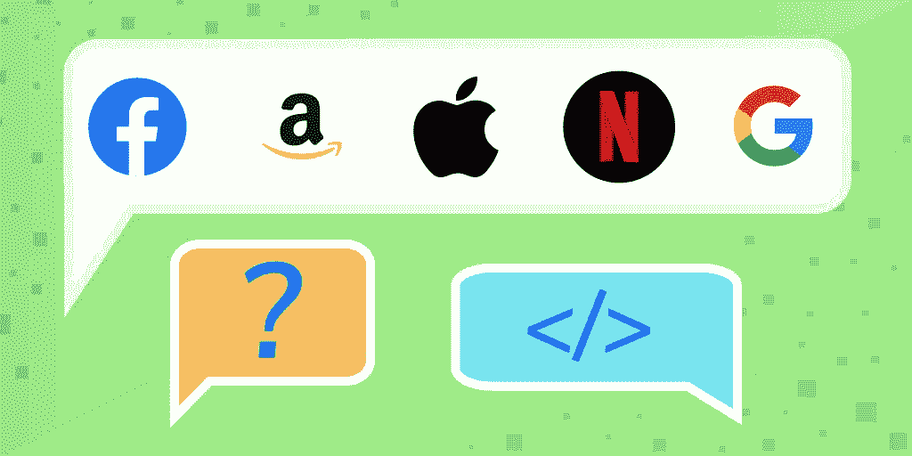

# 最近 FAANG 访谈中最难的 5 个编码问题

> 原文：<https://betterprogramming.pub/top-5-hardest-coding-questions-from-recent-faang-interviews-d46bcb4dd8dc>

## 你知道哲学家进餐问题吗？

作者照片。

看起来编码面试变得越来越难，准备面试并不是一件容易的事情。面试中向你提出的问题种类没有限制，其中许多都不容易。“最难”的问题因人而异。对你来说轻而易举的事情对其他人来说可能极其困难，反之亦然。

不管你“最难”的问题是什么，为你的编码面试做好准备是至关重要的。我们与初级和高级开发人员讨论了他们对最难的编码面试问题的看法，并将前五名编辑成一个列表。今天，我们将更详细地探讨这个列表，并给你一些如何准备的建议。

我们将涵盖:

*   如何设计垃圾收集器
*   硬币兑换问题
*   哲学家进餐问题(多线程)
*   为什么要使用这些编程最佳实践？
*   如何实现 LRU 缓存
*   准备面试的后续步骤

# 1.如何设计垃圾收集器

如果你从未听说过，垃圾收集器问题是众所周知的非常困难。垃圾收集是一个大多数人在学校里不了解的话题，相关素材极其密集。学习垃圾收集涉及到很多理论，可能会让人不知所措。无论你使用哪种语言，了解你首选语言的来龙去脉对于有效解决这个问题都是至关重要的。

当你解决这个问题时，不要害怕向面试官提问。记住，你的面试官是来帮助你的，希望看到你做得好。面试官通常会给你一些信息，帮助你朝着正确的方向前进。

*注意:垃圾收集问题在核心和高级 Java 面试中尤其常见，但对于其他编程语言来说，了解这些问题也很重要。*

# 2.硬币兑换问题

硬币找零的问题在脸书和亚马逊的采访中很常见。你会得到不同面值的硬币和总金额。由此，你需要写一个函数来计算出你需要的最少的硬币数，以达到这个数目。如果你不能用任何硬币组合达到给定的钱数，你返回`-1`。

这里有三种方法可以解决这个问题:

*   强力
*   记忆自顶向下动态规划
*   具有表格化的自底向上动态规划

让我们看看在 C++中使用自底向上的动态编程和表格化的解决方案:

对于内循环的每次迭代，我们用`denoms[j]`得到解，并存储在`x`中。我们也得到了没有`denoms[j]`的解，并存储在`y`中。通过这样做，我们能够引用早期的解决方案来避免重复计算。

对于面额中的每一枚硬币，只能有两种可能:包含它或排除它。我们知道，如果硬币`denom[j]`大于`amount`，那么`x`被设置为`0`，因为不可能将它考虑在内。

时间复杂度为** O(amount * denomsLength)*，即`for`循环迭代次数。

*注意:这三种方法中的每一种都包括时间复杂度，这意味着要成功解决硬币兑换问题，时间复杂度是一个重要的概念。*

# 3.哲学家进餐问题(多线程)

哲学家进餐问题通常用于并发算法设计，以演示同步问题以及解决这些问题的技术。问题陈述了有五个哲学家围坐在一张圆形桌子旁。哲学家必须交替思考和进食。

每个哲学家面前都有一碗食物，他们要求每只手拿一把叉子来吃东西。然而，只有五个叉子可用。你需要设计一个解决方案，每个哲学家都可以吃他们的食物，而不会导致死锁。

对于这个问题，开发人员通常会忽略这样一个想法，即它不是真正询问真实世界的场景，而是说明您在线程程序执行和/或疏忽处理锁时可能遇到的问题。这个想法是让你思考限制和正确的顺序，以最有效的方式完成这个任务。

为了准备这个问题，您应该深入了解同步、并发控制和信号量。

这里有两种可能的方法来解决这个问题:

*   限制即将吃饭的哲学家。
*   重新订购叉车。

让我们看一下用 Java 重新订购叉式提货的解决方案:

在这个解决方案中，你让任何一个哲学家先拿起左边的叉子，而不是右边的。你选择哪个哲学家是左撇子并被要求先拿起他们的左叉并不重要。在我们的解决方案中，我们选择带有`id=3`的哲学家作为我们的左手哲学家。

# 4.为什么要使用这些编程最佳实践？

在学习编程时，您通常会学到一些“最佳实践”最高效的开发人员在他们的编码过程中实施某些实践，这有助于他们确保他们的代码在功能和形式上都是最好的。

经过多年的编程经验，您会知道应该避免哪些实践，应该采用哪些实践。您可能对为什么一些实践比其他的更好有一个大概的想法，但是当需要解释原因的时候却犹豫了。

一些最佳实践的例子包括:

*   经常注释你的代码。
*   识别并删除重复代码。
*   React 中的按功能分组。
*   避免 Ruby 中的隐藏结构。

为这些问题做好准备的最好方法是刷新你对有用和可避免的实践及其背后的推理的记忆。记住，你可以和面试官一起讨论这些问题。

# 5.如何实现 LRU 缓存

最近最少使用的(LRU)缓存实现问题在一些 Google、Microsoft 和 Amazon 访谈中被问到，但这不是一个很常见的问题。这个问题需要你深入思考，将两种或两种以上现有的数据结构结合起来。

重要的是要慢慢地阅读问题，并确保你明白你在问什么。这些问题通常要求您做一些事情。一旦你彻底阅读了问题，你可以要求你的面试官确认你的方向是正确的。

在解决这些问题之前，请确保您了解什么是*缓存*。LRU 是一种常见的缓存策略，它定义了当缓存已满时从缓存中删除元素以便为新元素腾出空间的策略。这意味着它首先丢弃最近最少使用的项目。

# 准备面试的后续步骤

我们今天讨论的问题只是许多困难的编码面试问题中的几个。这些问题应该很难，甚至会难倒最有经验的开发人员。尽早开始面试准备很重要，这样你就有机会尽可能多的准备。

一些更困难的问题包括:

*   从数据流中找出中间值。
*   在旋转排序的数组中搜索。
*   最少骑士移动。
*   还有很多。

快乐学习！