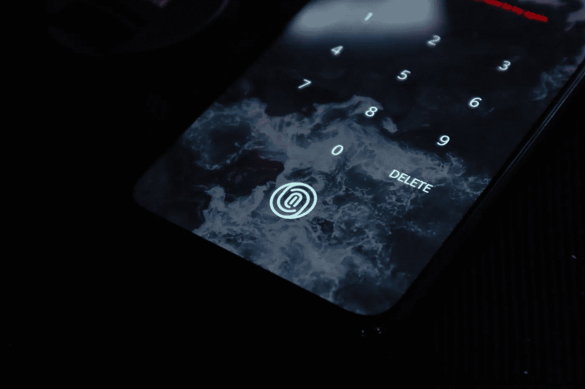

# 在 React 本地应用中实现触控 ID 和 Face ID 认证

> 原文：<https://betterprogramming.pub/touch-id-and-face-id-authentication-in-your-react-native-app-1e455c1fe080>

## 这比你想象的要容易



照片由[卢肯·萨贝拉诺](https://unsplash.com/@luferlex?utm_source=unsplash&utm_medium=referral&utm_content=creditCopyText)在 [Unsplash](https://unsplash.com/?utm_source=unsplash&utm_medium=referral&utm_content=creditCopyText) 上拍摄

触控 ID，也称为指纹认证，在移动应用程序中非常流行。touch ID 功能可保护应用程序，并使其成为用户顺畅、轻松的身份验证流程。

许多银行应用程序，如美国银行，使用 touch ID 身份验证来实现安全而简单的身份验证。

客户喜欢使用 touch ID 或 face ID，而不是每次都键入密码或 pin。

最新的 iPhone 设备支持 face ID，Android 设备支持 face ID 和 touch ID。这些功能增强了用户与移动应用程序的交互，使它们更加安全。

我们将使用流行的`[React-Native-fingerprint-scanner](https://github.com/hieuvp/react-native-fingerprint-scanner#readme)`库在 React 原生应用中集成 touch ID 和 face ID 认证。

# 装置

要安装`react-native-fingerprint-scanner`,你只需要在项目终端运行这个命令。

```
npm i react-native-fingerprint-scanner
```

或者

```
yarn add react-native-fingerprint-scanner
```

从 React Native 0.60 及更高版本开始，[链接是自动的](https://github.com/react-native-community/cli/blob/master/docs/autolinking.md)。所以你**不需要跑** `react-native link`。

如果你在 Mac 上开发 iOS，你需要安装 pods(通过 [Cocoapods](https://cocoapods.org/) )来完成链接。

```
npx pod-install ios
```

## 许可

安装完成后，我们应该需要将应用权限添加到 **Android** 和 **iOS** 中。

在`*AndroidManifest.xml*`、中添加此权限:

```
<uses-permission android:name="android.permission.USE_BIOMETRIC" />
```

在`Info.plist`中添加这个键和字符串:

```
<key>NSFaceIDUsageDescription</key>
<string>$(App_Name) requires FaceID access to allows you quick and secure access.</string>
```

一旦以上步骤完成，您就可以开始在 react 本地应用程序中使用`react-native-fingerprint-scanner`库了。

# 使用

在下面的简单例子中，我们将使用`react-native-fingerprint-scanner`进行认证。

用于认证用户的触摸 ID 或面部 ID 的函数是来自`react-native-fingerprint-scanner`库中的`authenticate(reason, config)` 函数。

## fingerprintscanner . authenticate*(原因，配置)*

这个函数验证用户的 touch ID 或 face ID，并返回一个 promise 对象。`reason` 是显示给用户的可选字符串。它可以提供为什么需要身份验证的信息。`config` 是一个可选对象，可以在认证对话框中显示更多细节。

在示例代码中，authenticate 函数处理用户的 touch ID 或 face ID 身份验证。如果身份验证由于某种原因失败，将返回一个错误代码；否则，它将返回一个承诺，您可以在 FingerprintScanner *中编写进一步的逻辑。认证(原因)。*然后(()= > {

//这里

})

## 指纹扫描仪`.isSensorAvailable()`

此功能检查指纹扫描仪是否可以使用。

`react-native-fingerprint-scanner`库支持 iPhone X 设备使用 face ID。`isSensorAvailable*()*` 函数返回设备支持并启用的`biometryType` 。如果设备不支持 touch ID 或 face ID，那么我们将不得不使用密码或 pin 码。

*注意:在我们调用* `*authenticate()*` *函数之前，需要先调用* `*isSensorAvailable()*` *函数。这确保了当生物认证不可用时，我们不会使用该库进行认证。*

# 把所有的放在一起

下面的代码展示了使用`react-native-fingerprint-scanner`的完整认证流程。注意这里我们将`biometryType`保存到组件的状态。我们需要确保向用户发出正确的信息，告诉他们是使用 touch ID 还是 face ID 进行身份验证。

您已经成功地将生物识别和面部锁定认证集成到 React 本机应用程序中。