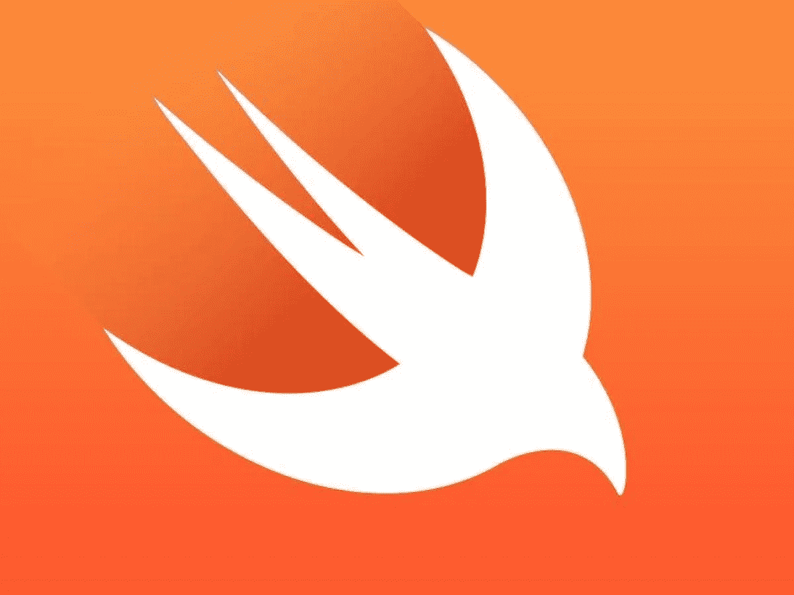

# Enum 在 Swift 中的两个实际应用

> 原文：<https://betterprogramming.pub/two-very-practical-uses-of-enum-in-swift-36b9967d1925>

## 具有关联类型和通用枚举模式的 Swift 枚举



我最近的任务是编写优化的 Swift SDK。随着 Swift 5 的推出和 Swift 对嵌入式框架的支持，时机似乎是正确的。

简单介绍一下背景， [Optimizely](https://www.optimizely.com/) Swift SDK 用于在您的 iOS 或 tvOS 设备上运行 A/B 测试以及功能管理。

在完成 [Swift SDK](https://cocoapods.org/pods/OptimizelySwiftSDK) (我们现在正式发布)之后，我回顾了一些出现的模式。有些很早就出现了，比如 enum 的使用，而有些则是在开发过程中出现的需求。这已经变成了一个由四部分组成的系列，其中我将讨论最有用的设计模式。特别是，我们将讨论 Swift enums 和相关类型以及在 Swift 5 中采用的`result`通用 enum 模式。然后，我们将讨论被证明非常有用的通用类`AtomicProperty`。接下来，我们讨论依赖注入。最后，我们将介绍如何在 Swift 代码中公开 Objective-C API，而不影响 Swift 的设计、实施和代码。

让我们直接开始吧！

开发这个 SDK 的第一个挑战是使用一个配置 JSON 文件。为了做到这一点，我使用了一个在线 JSON 到 Swift 数据对象转换器来创建我的初始数据对象。这处理得很好，但是当 JSON 字段可能是多种类型时，需要做很多额外的工作。我的结局是这样的:

```
**struct** UserAttribute: Codable, Equatable { *// MARK: — JSON parse* **var** name: String? **var** type: String? **var** match: String? **var** value: Any?}
```

这很好，也是可行的。这只是意味着您需要添加自定义的编码和解码方法。这也意味着每次你想使用它的时候，你必须弄清楚它的类型和类型。更干净、更可重用的解决方案是使用带有关联值的 Swift enum。这看起来更像这样:

```
**struct** UserAttribute: Codable, Equatable { *// MARK: — JSON parse* **var** name: String? **var** type: String? **var** match: String? **var** value: AttributeValue?}
```

现在您可以使用`CodingKey`来定义您的 json 名称，并让`AttributeValue`来完成繁重的工作。将 [Swift enum](https://docs.swift.org/swift-book/LanguageGuide/Enumerations.html) 关联值想象成一个 c 联合，在这里它可以被转换成任意数量的类型。我们使用 case 语句来关联每个值的名称和类型。我们还实现了 [Codable](https://developer.apple.com/documentation/swift/codable) ，它是 json 编码/解码的可编码和可解码协议的类型别名。下面是一个代码示例—一个支持多种类型的属性值的非常简单的声明(这可能是另一个数据结构的通用属性):

```
**enum** AttributeValue: Codable { case string(String) case int(Int64) // supported value range [-2⁵³, 2⁵³] case double(Double) case bool(Bool) case others // here we get the container and try and decode the value as       different types and setting // self to the type we decoded. init(from decoder: Decoder) **throws** { let container = **try** decoder.singleValueContainer() **if** let value = **try**? container.decode(String.self) { self = .string(value) **return** } **if** let value = **try**? container.decode(Double.self) { **self** = .double(value) **return** } **if** let value = **try**? container.decode(Int64.self) { **self** = .int(value) **return** } **if** let value = **try**? container.decode(Bool.self) { **self** = .bool(value) **return** } // accept all other types (null, {}, []) for forward compatibility support **self** = .others}// here we are encoding the values by switching on self.**func** encode(to encoder: Encoder) **throws** { **var** container = encoder.singleValueContainer() **switch** **self** { **case** .string(let value): **try** container.encode(value) **case** .double(let value): **try** container.encode(value) **case** .int(let value): **try** container.encode(value) **case** .bool(let value): **try** container.encode(value) **case** .others: **return** } }}
```

下面是一个用法示例:

```
**func** testEncodeDecodeString() { **let** attributeValue = AttributeValue.string(“json”) **let** jsonData = **try**! JSONSerialization.data(withJSONObject: [“json”], options: []) **let** attributes = **try**! JSONDecoder().decode([AttributeValue].**self**, from: jsonData) **switch** attributes[0] { **case** .string(let str): XCTAssert(str == “json”) XCTAssert(attributes[0] == attributeValue) **default**: XCTAssert(**false**) }}
```

正如您所看到的，在 Swift 中使用 enums 绝对是 json 编码和解码正确值的强大工具。通过从容器对象中提取代码，可以在任何需要支持多个属性的地方重用枚举。我们甚至可以为特定的验证添加一些额外的验证方法或挂钩。我发现这种封装方法比在我的容器对象上支持`Any?`并不断地强制转换它要干净得多。它还帮助我的容器编码和解码变得干净。

Swift 5 中采用的另一个伟大模式是`result` enum。`result`枚举保存错误的返回类型，并使用泛型来确定错误和返回值可能是什么。它使得切换和处理结果变得容易。

```
**enum** Result<T, Error> { **case** success(T) **case** failure(error)}
```

这可用于定义函数签名，如下所示:

```
**public** **enum** OptimizelyError: Error { **case** generic}**public** **typealias** DatafileDownloadCompletionHandler = (Result<Data?, OptimizelyError>) -> Void**func** downloadDatafile(sdkKey: String,completionHandler:**@escaping** DatafileDownloadCompletionHandler) { **let** task = session.downloadTask(with: request) { (url, response, error) **in** **var** result = Result<Data?,OptimizelyError>.failure(.generic(“Failed to parse”)) **if** error != **nil** { **self**.logger.e(error.debugDescription) result = .failure(.generic(error.debugDescription)) } **else** **if** **let** response = response **as**? HTTPURLResponse { **if** response.statusCode == 200 { **let** data = **self**.getResponseData(sdkKey: sdkKey, response: response,   url: url) result = .success(data) } **else** **if** response.statusCode == 304 { **self**.logger.d(“The datafile was not modified and won’t be downloaded again”) result = .success(**nil**) } completionHandler(result) }task.resume}
```

这可以按如下方式消耗:

```
downloadDatafile(sdkKey: sdkKey) { (result) **in** **switch** result { **case** .success(**let** data):
    datafile = data **case** .failure(**let** error):
   **self**.logger.e(error.reason) }
}
```

在 Swift 5 之前，我们编写自己的结果，大多数 Swift 开发人员也是如此。事实上，我们仍然使用我们的`OptimizelyResult`。Result enum 是一个受欢迎的附加功能，是已经被广泛采用的酷模式的一个补充。产生的模式和用于编码和解码的 enum 关联值只是 Swift 中枚举功能的几个例子。按照这里描述的方式使用它们是轻松集成 json 对象和处理结果的好方法。

我希望这是有用的。下次我们将讨论 Swift 中的原子性质。