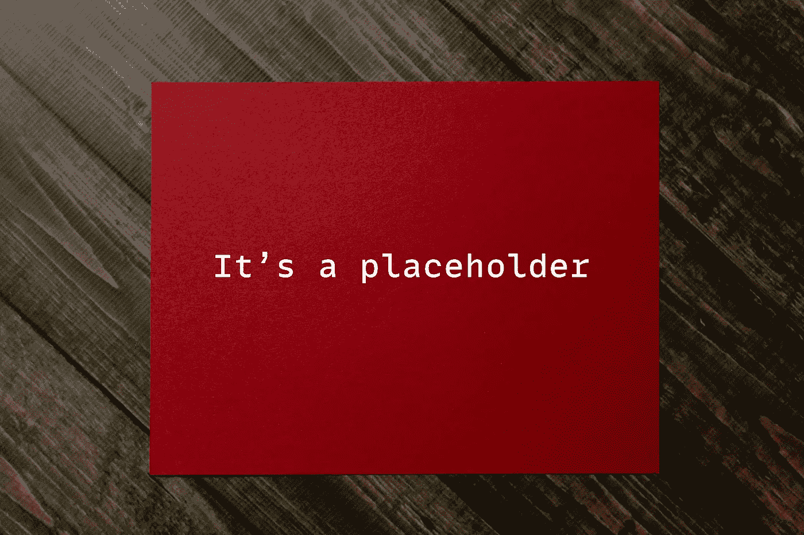

# 类型占位符:Swift 5.6 新功能一览

> 原文：<https://betterprogramming.pub/type-placeholders-new-swift-5-6-feature-12738e93054>

## Swift 5.6 最近引入了类型占位符。了解一项新的有用的 Swift 功能。



Swift 5.6 最近引入了类型占位符。是的，它们是强大的 Swift 型推理系统的一个很好的附件。如果你熟悉 C++，你一定知道一个`auto`关键字。类型占位符*几乎*一样。

# 泛型和类型占位符

```
let number: _ = 42 // Type placeholder
let anotherNumber = 42
```

是的，Swift 可以推断变量的类型，但是类型占位符意味着用于包含多种类型的类型。仿制药。那才是他们真正发光的地方。

考虑常规的`Result`枚举

```
enum Result<Success, Failure> where Failure : Error {
    case success(Success)
    case failure(Failure)
}
```

如果我们有某种复杂的物体呢

```
var ohMy = [1: [3: (1, 2, 3, "That's a long tuple")]]
```

如果你试图从`ohMy`创建一个`Result`，你会看到编译错误。

```
let result = Result.success(ohMy)
```

> 注意:无法推断通用参数`Failure`

兄弟。所以我需要写…

```
let result = Result<[Int : [Int : (Int, Int, Int, String)]], Error>.success(ohMy)
```

> 💡使用类型占位符来省略 Swift 可以推断的类型

多亏了类型占位符，Swift 可以自己推断对象的类型。所以，我们只需要提供`Failure`类型。

```
let result = Result<_, Error>.success(ohMy) // Nice
```

# 集合和类型占位符

这个特性对于集合也很有用。如果我们需要一个带有枚举键的字典呢？

```
enum Foo {
	case bizz
	case bonk
}

let results = [
	.bizz: ohMy,
	.bonk: ohMy
]
```

> 没有上下文类型，无法解析对成员`bizz`的引用

所以，让我们提供这个*上下文类型，*但是你还记得`ohMy`的类型有多难看吗？让我们使用一个类型占位符。

```
// 🚫
let results:[Foo: [Int : [Int : (Int, Int, Int, String)]]] = [
	.bizz: ohMy,
	.bonk: ohMy
]

// ✅
let results:[Foo: _] = [
	.bizz: ohMy,
	.bonk: ohMy
]
```

## 更多示例

包含占位符的类型示例有:

```
Array<_>    // array with placeholder element type
[Int: _]    // dictionary with placeholder value type
(_) -> Int  // function type accepting a single type placeholder argument and returning 'Int'
(_, Double) // tuple type of placeholder and 'Double'
_?          // optional wrapping a type placeholder
```

这是一个很棒的特性，扩展了 Swift 的类型推断能力。就目前而言，它的知名度相对较低，但我认为它在未来会被更多地使用。

您可以在我之前的帖子中查看其他不太为人所知的 Swift 功能:

[](http://alexdremov.me/top-7-subtle-swift-features/) [## 7 大微妙的 Swift 特性| Alex Dremov

### Alex Dremov iniOS & Swift-在这里，我收集了一些不太为人所知的 Swift 功能，在您准备…

alexdremov.me](http://alexdremov.me/top-7-subtle-swift-features/) 

## 参考

*   [swift-evolution/0315-placeholder-types . MD at main apple/swift-evolution](https://github.com/apple/swift-evolution/blob/main/proposals/0315-placeholder-types.md)